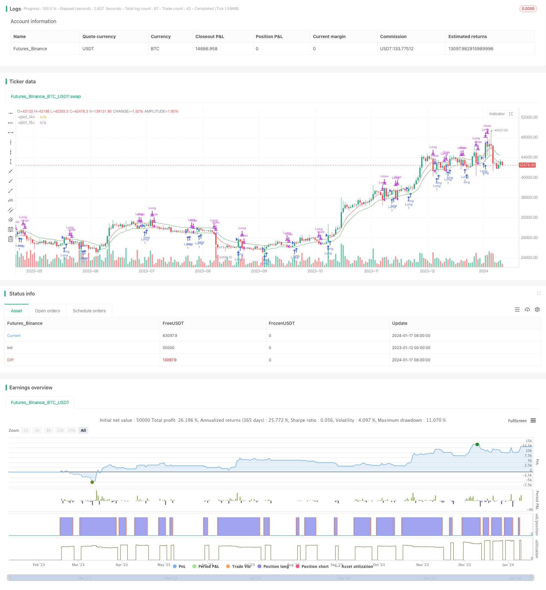

> Name

Simple-Trailing-Stop-Buy-Strategy-Based-on-Percentage
> Author

ChaoZhang

> Strategy Description


 [trans]
## Overview
This strategy implements a simple percentage-based trailing stop and trailing buy combination. Optimization of the strategy parameters can be achieved by experimenting with different percentage combinations on different time frames and on different charts.
## Strategy Principle
This strategy mainly implements trailing stop loss and trailing buy through two indicators:
1. Trailing Stop Line (TSL): Calculated based on the stop loss offset percentage set by the user and based on the moving average of the closing prices of the most recent N K lines. When the price is below this line, close the position and stop the loss.
2. Trailing Buy Line (TBL): calculated based on the buying offset percentage set by the user and based on the moving average of the highest price of the recent N K lines. When the price is above this line, a long position is opened.
By comparing the relationship between price and these two indicators, the rules of stop loss and follow-up buying are implemented.
## Strategic Advantages
This strategy has the following advantages:
1. Simple and intuitive, easy to understand and implement;
2. The flexibility of stop loss and purchase pursuit can be achieved by adjusting parameters;
3. Can be applied to different markets and different time periods;
4. Ability to follow trends and stop losses in a timely manner.
## Strategy Risk
This strategy also has the following risks:
1. Improper parameter settings may lead to overly aggressive stop loss or follow-up buying;
2. In volatile markets, it may lead to frequent transactions and slippage losses;
3. Parameters need to be appropriately optimized to adapt to the characteristics of different markets.
## Strategy optimization direction
This strategy can be optimized from the following aspects:
1. Use adaptive algorithms to automatically optimize stop loss positions and buy parameters;
2. Increase the number of positions and risk management modules;
3. Combine with other indicators to determine the general trend and avoid being trapped in volatile market conditions.
## Summarize
This strategy overall is a very simple and intuitive trend following strategy. Parameter adjustment can be applied to different markets, and combining adaptive algorithms and other indicators can further enhance the stability and practicality of the strategy. Overall, this strategy provides a simple but effective basic strategy framework for quantitative trading.
||

## Overview

This strategy implements a simple percentage-based trailing stop and trailing buy. By experimenting with different percentage combinations across timeframes and charts, the strategy parameters can be optimized.  

## Strategy Logic

The strategy mainly uses two metrics to achieve trailing stop loss and trailing buy:

1. Trailing Stop Line (TSL): Calculated based on recent N bars of closing prices and stop loss offset percentage set by user. Triggers stop loss when price falls below this line.

2. Trailing Buy Line (TBL): Calculated based on recent N bars of highest prices and buy offset percentage set by user. Triggers buy when price rises above this line.


By comparing price with these two metrics, the stop loss and trailing buy rules are implemented.

## Advantages

The advantages of this strategy are:

1. Simple and intuitive, easy to understand and implement.

2. Flexible stop loss and trailing buy through parameter adjustment.

3. Applicable across markets and timeframes. 

4. Allows trend following and timely stop loss.

## Risks

The risks of this strategy include:

1. Improper parameter setting may cause over-aggressive stop loss or buys.

2. Frequent trading and slippage in ranging markets.

3. Requires parameter optimization for different market characteristics.

## Enhancement Opportunities 

The strategy can be enhanced through:

1. Adaptive algorithms to auto optimize stop and buy parameters.

2. Addition of position sizing and risk management modules. 

3. Incorporation of other indicators to gauge overall trend to avoid whipsaws.


## Conclusion

In summary, this is a very simple and intuitive trend following strategy. With parameter tuning it can be adapted across markets. Further incorporation of adaptive algorithms and additional filters can improve robustness. Overall it provides a basic yet effective framework for quantitative trading.

[/trans]

> Strategy Arguments


|Argument|Default|Description|
|----|----|----|
|v_input_1|1.5|Stop Offset %|
|v_input_2|1.9|Trailing Buy Offset %|
|v_input_3|6|Use last x bars for calculation|
|v_input_4_close|0|Source Trailing Stop calculation: close|high|low|open|hl2|hlc3|hlcc4|ohlc4|
|v_input_5_close|0|Source Trailing Buy calculation: close|high|low|open|hl2|hlc3|hlcc4|ohlc4|
|v_input_6_low|0|Source Stop Trigger: low|high|close|open|hl2|hlc3|hlcc4|ohlc4|
|v_input_7_high|0|Source Buy Trigger: high|close|low|open|hl2|hlc3|hlcc4|ohlc4|


> Source (PineScript)

``` pinescript
/*backtest
start: 2023-01-12 00:00:00
end: 2024-01-18 00:00:00
period: 1d
basePeriod: 1h
exchanges: [{"eid":"Futures_Binance","currency":"BTC_USDT"}]
*/

//@version=2
//Developed from ©Finnbo code
strategy("Simple Trailing Buy & Stop Strategy", overlay=true)
offset = input(defval=1.5, title="Stop Offset %", type=float, minval=0.1, maxval=100, step=0.1)
buyoffset = input(defval=1.9, title="Trailing Buy Offset %", type=float, minval=0.1, maxval=100, step=0.1)

sumbars = input(defval=6, title="Use last x bars for calculation",  minval=1)
srcts = input(title="Source Trailing Stop calculation",  defval=close)
srctb = input(title="Source Trailing Buy calculation",  defval=close)
srctrigger = input(title="Source Stop Trigger",  defval=low)
srctriggerbuy = input(title="Source Buy Trigger",  defval=high)
tsl = rma(srcts, sumbars)*(1-(offset/100))// = (sum(srcts,sumbars)/sumbars)*(1-(offset/100))
tbuy = rma(srctb, sumbars)*(1+(buyoffset/100))
plot(tsl, color=(srctrigger<tsl)?red:green)
plot(tbuy, color=(srctriggerbuy>tbuy)?red:green)
//plotshape(crossunder(srctrigger,tsl), text="Long Stop", style=shape.circle, color=red)
alertcondition(crossunder(srctrigger,tsl), "Long Stop alert", "SELL")
//plotshape(crossover(srctriggerbuy,tbuy), text="Long", style=shape.circle, color=green)
alertcondition(crossover(srctriggerbuy,tbuy), "Long alert", "BUY")

longCondition =  crossover(srctriggerbuy,tbuy)
if (longCondition)
    strategy.entry("Long", strategy.long)
closeCondition = crossunder(srctrigger,tsl)
if (closeCondition)
    strategy.close("Long")

```

> Detail

https://www.fmz.com/strategy/439349

> Last Modified

2024-01-19 14:30:59
