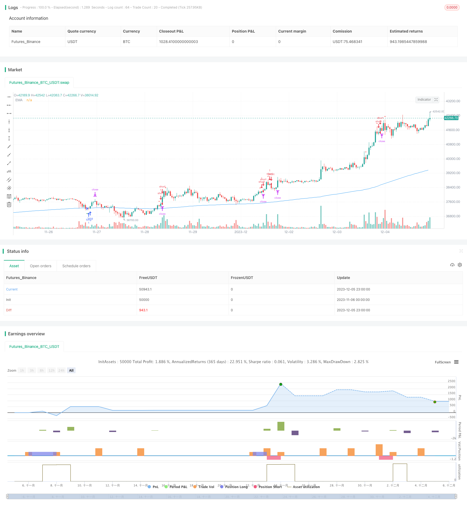

> Name

Slow-Moving-Average-Strategy
> Author

ChaoZhang

> Strategy Description


[trans]

## Overview
This strategy uses the 24-period Donchian Channel combined with the 200-period moving average as the main trading signals. The entry point is short when the red and green fluctuations are downward, and long when the fluctuation is upward.
## Strategy Principle
The strategic principles are mainly based on the following points:
1. Use the 24-period highest and lowest values ​​to construct the Tangchian Channel. When the price breaks through the channel, it indicates that a larger rise or fall may occur.
2. The 200-period moving average serves as a long-short filtering condition. If it breaks through the Tang Qian Channel and the price is on the other side of the moving average, it is believed that the market may reverse.
3. The entry signal is:
  - Short selling: If the closing price of the previous K-line is greater than the upper track of Tang Qian Channel and lower than the 200-period moving average, and the opening price of the day is lower than the closing price and the lowest price is lower than the 200-period moving average, a short selling signal will be generated.
  - Go long: If the closing price of the previous K-line is less than the lower track of Tang Qian Channel and higher than the 200-period moving average, and the opening price of the day is higher than the closing price and the highest price is higher than the 200-period moving average, a long signal will be generated.
4. The stop-loss price for short selling is the highest price of the last three K-lines, and the take-profit price is the short-selling price minus 3 times the difference between the stop-loss and short-selling prices. The stop loss and take profit prices for long positions are calculated in the opposite way to those for short positions.
5. The advantage of this strategy is that through the mixed use of Tang Qian channel + moving average filtering, it avoids the misleading of a single technical indicator and significantly improves the winning rate of the strategy.
## Advantage Analysis
This strategy has the following advantages:
1. High winning rate: Mixing the Donchian channel and moving average indicators can effectively avoid unnecessary losses caused by misleading single technical indicators.
2. Risk controllable: Use the recent highest price/lowest price as the stop loss level to effectively control single losses. Take profit is 3 times of stop loss, and the return to risk ratio is high.
3. Simple and easy to operate: The indicators and logic are very simple and clear, easy to understand and implement.
4. Strong applicability: The strategy has fewer parameters and has better stability in different varieties and cycles.
## Risk Analysis
This strategy mainly faces the following risks:
1. Risk of extreme market conditions: If you encounter an extremely large unilateral market, it is easy to trigger stop loss or cause losses to increase. It can be dealt with by appropriately relaxing the stop loss position and reducing the position.
2. Risk of misjudgment of exit signals: If you use a new negative signal as an exit signal, you may frequently enter and exit the market in a volatile market, causing unnecessary slippage losses. It can be solved by optimizing the exit logic.
3. Parameter optimization risk: Improper setting of Tang Qian channel cycle and moving average parameters may lead to frequent or delayed signals. This risk can be reduced through parameter optimization and combination testing.
## Optimization direction
This strategy can be optimized from the following directions:
1. The Donchian channel period and moving average period can be optimized to find the best parameter combination.
2. You can test different stop-loss and take-profit ratios to balance the winning rate and profit-loss ratio.
3. You can try to modify the entry signal in combination with other indicators, such as MACD, KD, etc., to improve the stability of the strategy.
4. Exit signals can be optimized to avoid unnecessary exits in volatile market conditions. Exit signals can also consider trend indicators, etc.
5. New strategy combinations can be developed based on this strategy framework, such as being used in combination with other channel indicators and list indicators.
## Summarize
The overall idea of ​​the slow moving average strategy is clear and easy to understand. By mixing the Donchian channel and the moving average as a strategy signal, the stability and winning rate of the strategy can be effectively improved. The setting of stop profit greater than stop loss makes the profit and loss ratio good, and the parameter setting is simple and easy to implement. There are certain risks of extreme market conditions and misjudgment, but the strategy can be optimized and improved in a variety of ways, which has strong scalability and development potential.
||

## Overview

This strategy uses a 24-period Donchian Channel combined with a 200-period moving average as the main trading signals. Short positions are opened when price fluctuates downward and long positions when it fluctuates upward.  

## Strategy Logic

The strategy logic is mainly based on the following points:

1. A Donchian Channel is constructed using the highest high and lowest low over the past 24 periods. When price breaks out of this channel, it indicates a potential for larger moves up or down.

2. The 200-period moving average acts as a filter for long/short bias. If price breaks the Donchian Channel and is on the other side of the moving average, a reversal may be likely.   

3. Entry signals are:
  - Short: The close of the previous bar is above the upper band of the Donchian Channel and below the 200-period MA. The open of the current bar is below the previous close and the low is below the 200-MA. 
  - Long: The close of the previous bar is below the lower band of the Donchian Channel and above the 200-period MA. The open of the current bar is above the previous close and the high is above the 200-MA.

4. The stop loss for short positions is set to the highest high over the past 3 bars. Take profit is set to the entry price minus 3 times the difference between the stop loss and entry price. The long position stop loss and take profit logic is the opposite.

5. The advantage of this strategy is that by combining the Donchian Channel and moving average filter, it avoids false signals from relying on a single indicator, significantly improving win rate.

## Advantage Analysis 

The strategy has the following advantages:

1. High win rate: By combining the Donchian Channel and moving average filter, unnecessary losses due to false signals from a single indicator are avoided.  

2. Controllable risk: Using the recent highest high/lowest low as stop loss levels effectively manages downside on losing trades. The 3:1 profit to loss ratio is attractive.

3. Simple and easy to implement: The logic uses simple, intuitive indicators that are easy to understand and execute.  

4. Robustness across markets and timeframes: With relatively few parameters, the strategy is stable across different products and timeframes.

## Risk Analysis

The main risks faced by this strategy are:

1. Extreme market moves: Very strong one-way trends can trigger stop losses causing amplified losses. This can be mitigated by widening stops or reducing position size.

2. Premature exit signal risk: Exiting on new opposite signals can cause over-trading in choppy markets due to repeated entry and exit. Optimizing exit logic can help address this.   

3. Parameter optimization risk: Poor parameter tuning of the Donchian Channel lookback period or moving average can lead to delayed or frequent signals. This can be minimized through rigorous optimization and combinatorial testing.

## Enhancement Opportunities

The strategy can be enhanced in the following ways:

1. Optimize Donchian Channel and moving average lookback periods to find best combination of parameters.  

2. Test different stop loss to take profit ratios to balance win rate versus reward/risk.

3. Incorporate additional filters on entry signals using indicators like MACD, RSI etc. to improve robustness. 

4. Optimize exit logic to avoid unnecessary exits in choppy markets. Trend metrics can also be considered for exits.

5. Develop new combinations using this strategy framework, for e.g. with other channels, band indicators etc.

## Conclusion

The Slow Moving Average strategy has clear, easy to understand logic using a combination of Donchian Channel and moving average for signal generation. This hybrid approach significantly improves stability and win rate. The 3:1 profit to loss ratio also provides good reward potential. While risks exist in terms of extreme moves and signal errors, numerous optimization opportunities can improve performance and expand on the core strategy.

[/trans]

> Strategy Arguments


|Argument|Default|Description|
|----|----|----|
|v_input_1|24|Channel's periods|
|v_input_2|200|EMA's periods ?|
|v_input_3|3|Ratio TP|
|v_input_4|20|Risk Loss ($)|
|v_input_5|5|Leverage *...|
|v_input_6|false|Plot channel ?|
|v_input_7|false|Plot Bull positions ?|
|v_input_8|false|Plot Bear positions ?|
|v_input_9|true|Plot labels of bets ?|
|v_input_10|true|Delete last labels ?|


> Source (PineScript)

``` pinescript
/*backtest
start: 2023-11-06 00:00:00
end: 2023-12-06 00:00:00
period: 1h
basePeriod: 15m
exchanges: [{"eid":"Futures_Binance","currency":"BTC_USDT"}]
*/

// This source code is subject to the terms of the Mozilla Public License 2.0 at https://mozilla.org/MPL/2.0/
// © Mysteriown

//@version=4

strategy("Lagged Donchian Channel + EMA", overlay = true)

//tradePeriod = time(timeframe.period,"0000-0000:1234567")?true:false


// ------------------------------------------ //
// ----------------- Inputs ----------------- //
// ------------------------------------------ //

period = input(24, title="Channel's periods")
Pema = input(200, title="EMA's periods ?")
ratio = input(3, title="Ratio TP", type=input.float)
loss = input(20, title="Risk Loss ($)")
lev = input(5, title="Leverage *...")
chan = input(title="Plot channel ?", type=input.bool, defval=false)
Bpos = input(title="Plot Bull positions ?", type=input.bool, defval=false)
bpos = input(title="Plot Bear positions ?", type=input.bool, defval=false)
labels = input(title="Plot labels of bets ?", type=input.bool, defval=true)
supp = input(title="Delete last labels ?", type=input.bool, defval=true)


// ------------------------------------------ //
// ---------- Canal, EMA and arrow ---------- //
// ------------------------------------------ //

pema = ema(close,Pema)
plot(pema, title="EMA", color=color.blue)

canalhaut = highest(period)[1]
canalbas = lowest(period)[1]

bear = close[1] > canalhaut[1] and close < open and high > pema
bull = close[1] < canalbas[1] and open < close and low < pema

canalhautplot = plot(chan? canalhaut:na, color=color.yellow)
canalbasplot = plot(chan? canalbas:na, color=color.yellow)

plotshape(bear, title='Bear', style=shape.triangledown, location=location.abovebar, color=color.red, offset=0)
plotshape(bull, title='Bull', style=shape.triangleup, location=location.belowbar, color=color.green, offset=0)


// ------------------------------------------ //
// ------------- Position Short ------------- //
// ------------------------------------------ //

SlShort = highest(3)
BidShort = close[1]

TpShort = BidShort-((SlShort-BidShort)*ratio)
deltaShort = (SlShort-BidShort)/BidShort
betShort = round(loss/(lev*deltaShort)*100)/100
cryptShort = round(betShort*lev/BidShort*1000)/1000

// if bear[1] and labels //and low < low[1]
//     Lbear = label.new(bar_index, na, text="SHORT\n\nSL: " + tostring(SlShort) + "\n\nBid: " + tostring(BidShort) + "\n\nTP: " + tostring(TpShort) + "\n\nMise: " + tostring(betShort) + "\n\nCryptos: " + tostring(cryptShort), color=color.red, textcolor=color.white, style=label.style_labeldown, yloc=yloc.abovebar)
//     label.delete(supp ? Lbear[1] : na)

var bentry=0.0
var bsl=0.0
var btp=0.0

if bear[1] and low < low[1]
    bentry:=BidShort
    bsl:=SlShort
    btp:=TpShort
    
pbentry = plot(bpos? bentry:na, color=color.orange)
plot(bpos? (bentry+btp)/2:na, color=color.gray)
pbsl = plot(bpos? bsl:na, color=color.red)
pbtp = plot(bpos? btp:na, color=color.green)

fill(pbentry,pbsl, color.red, transp=70)
fill(pbentry,pbtp, color.green, transp=70)


// ------------------------------------------ //
// ------------- Position Long -------------- //
// ------------------------------------------ //

SlLong = lowest(3)
BidLong = close[1]

TpLong = BidLong + ((BidLong - SlLong) * ratio)
deltaBull = (BidLong - SlLong)/BidLong
betLong = round(loss/(lev*deltaBull)*100)/100
cryptLong = round(betLong*lev/BidLong*1000)/1000

// if bull[1] and labels //and high > high[1]
//     Lbull = label.new(bar_index, na, text="LONG\n\nSL: " + tostring(SlLong) + "\n\nBid: " + tostring(BidLong) + "\n\nTP: " + tostring(TpLong) + "\n\nMise: " + tostring(betLong) + "\n\nCryptos: " + tostring(cryptLong), color=color.green, textcolor=color.white, style=label.style_labelup, yloc=yloc.belowbar)
//     label.delete(supp ? Lbull[1] : na)

var Bentry=0.0
var Bsl=0.0
var Btp=0.0

if bull[1] and high > high[1]
    Bentry:=BidLong
    Bsl:=SlLong
    Btp:=TpLong
    
pBentry = plot(Bpos?Bentry:na, color=color.orange)
plot(Bpos?(Bentry+Btp)/2:na, color=color.gray)
pBsl = plot(Bpos?Bsl:na, color=color.red)
pBtp = plot(Bpos?Btp:na, color=color.green)

fill(pBentry,pBsl, color.red, transp=70)
fill(pBentry,pBtp, color.green, transp=70)


// ------------------------------------------ //
// --------------- Strategie ---------------- //
// ------------------------------------------ //

Bear = bear[1] and low < low[1]
Bull = bull[1] and high > high[1]

if (Bear and strategy.opentrades==0)
    strategy.order("short", false, 1, limit=BidShort)
    strategy.exit("exit", "short", limit = TpShort, stop = SlShort)

strategy.cancel("short", when = high > SlShort or low < (BidShort+TpShort)/2)
strategy.close("short", when=bull)

if (Bull and strategy.opentrades==0)
    strategy.order("long", true, 1, limit=BidLong)
    strategy.exit("exit", "long", limit = TpLong, stop = SlLong)
    
strategy.cancel("long", when = low < SlLong or high > (BidLong+TpLong)/2)
strategy.close("long", when=bear)

```

> Detail

https://www.fmz.com/strategy/434554

> Last Modified

2023-12-07 15:21:45
