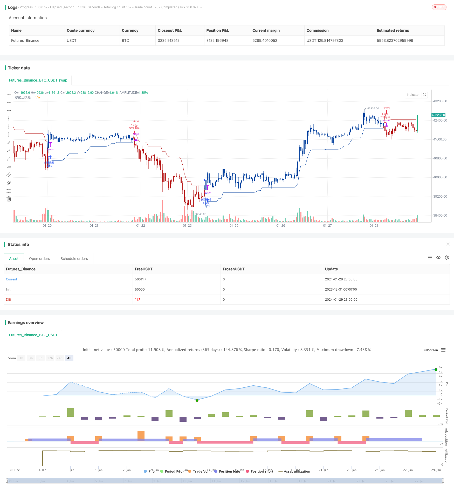

> Name

Smooth-Moving-Average-Stop-Loss-Strategy
> Author

ChaoZhang

> Strategy Description


 [trans]

### Overview
This strategy uses the smoothed moving average and the average true price range to calculate two stop-loss prices, and opens a reverse position when the stop-loss price is exceeded to achieve trend-following stop-loss. The strategy is suitable for high-volatility digital currency transactions and can effectively lock in profits and avoid losses from expanding.
### Strategy Principles
1. Calculate the average true price fluctuation range atr of the last n periods and smooth it using the RMA method
2. The stop-loss price for long positions is the highest price minus ATR, and the stop-loss price for short positions is the lowest price plus ATR.
3. Go short when the price breaks through the upward stop-loss line, and go long when it breaks through the downward stop-loss line.
4. The stop loss line will be continuously updated as the price moves to achieve dynamic tracking.
This strategy determines a reasonable stop loss range by calculating ATR, and then combines the RMA method to smooth the stop loss line to avoid stop loss being triggered by small price fluctuations. When the trend turns, you can quickly identify the signal and establish a position based on the reverse price breaking through the stop loss line.
### Advantage Analysis
1. Smoothly move the stop loss line, effectively filter noise and avoid false signals
2. Dynamically track stop loss points to lock in profits from most trends
3. The parameters are stable and suitable for medium and long-term positions.
4. Achieve fully automated transactions without manual intervention
### Risk Analysis
1. The stop loss range may be too large, and the ATR period and multiple should be adjusted appropriately.
2. When the trend is not obvious, there may be more closing times.
3. Attention should be paid to setting entry conditions reasonably to avoid chasing the rise and killing the fall.
You can reduce the stop loss range by appropriately shortening the ATR period or reducing the ATR multiple, or add other filtering conditions to reduce unnecessary openings. Pay attention to controlling actual leverage and position size to respond to drastic market changes.
### Optimization direction
1. Based on the ATR parameters, other indicators can be added to determine the trend.
2. Optimize the position opening logic and set more stringent breakthrough filter conditions
3. Add moving take-profit function
4. Combined with machine learning algorithms to achieve stop loss line optimization
Combine other oscillator indicators to determine the trend direction and avoid invalid opening of positions during shock periods. Optimize the entry logic to ensure that the price can continue to move to a certain extent after the stop loss line is broken. Add a moving take profit line to lock in more profits. Use machine learning to train better stop loss functions.
### Summary
By calculating the smooth moving average stop loss line, this strategy can achieve dynamic tracking stop loss in the highly volatile digital currency market, and can effectively control risks. The strategy parameters are relatively stable and suitable for automated trading. Multi-dimensional optimization can be carried out on this basis, and more indicators and algorithms can be combined to improve the effect.
||

### Overview

This strategy uses smooth moving average lines and average true range to calculate two stop loss price levels. It opens reverse positions when prices break through the stop loss levels to achieve stop loss trailing of trends. The strategy is suitable for highly volatile cryptocurrency trading and can effectively lock in profits and avoid losses.

### Strategy Logic

1. Calculate the average true price range atr of the recent n periods and smooth it using the RMA method
2. The long stop loss price level is the highest price minus atr, and the short stop loss price level is the lowest price plus atr  
3. When the price breaks through the upper stop loss line, go short; when it breaks through the lower stop loss line, go long
4. The stop loss lines are constantly updated as the price moves to achieve dynamic trailing

This strategy determines a reasonable stop loss range through ATR calculation and then uses the RMA method to smooth the stop loss lines to avoid triggering stops by small price fluctuations. When a trend reversal occurs, it can quickly identify signals and establish positions by breaking the stop loss lines in the reverse direction.  

### Advantage Analysis

1. Smooth moving stop loss lines effectively filter noise and avoid false signals
2. Dynamically trailing stop loss points can lock in most trend profits  
3. Stable parameters, suitable for medium and long-term holdings
4. Achieves fully automated trading without manual intervention

### Risk Analysis  

1. The stop loss range may be too large and the ATR period and multiplier should be adjusted accordingly
2. There may be more frequent closing of positions when the trend is unclear
3. Appropriate entry conditions should be set to avoid chasing rises and falls

The stop loss range can be reduced by appropriately shortening the ATR period or reducing the ATR multiplier, or additional filters can be added to reduce unnecessary opening of positions. Pay attention to controlling actual leverage and position sizing to cope with drastic market changes.

### Optimization Directions

1. Other indicators can be added on the basis of ATR parameters to determine the trend
2. Optimize the opening logic and set stricter breakout filters  
3. Add moving profit taking functions 
4. Optimize stop loss lines with machine learning algorithms

Judging the trend direction with other oscillator indicators can avoid ineffective opening during consolidation. Optimize entry logic to ensure price can continue running for a certain range after breaking through the stop loss line. Add moving profit taking lines to lock in more profits. Use machine learning to train better stop loss functions.

### Summary
This strategy dynamically trails highly volatile cryptocurrency markets with smooth moving average stop loss lines to effectively control risks. The strategy parameters are relatively stable, making it suitable for automated trading. It can be optimized across multiple dimensions by combining more indicators and algorithms to improve performance.

[/trans]

> Strategy Arguments


|Argument|Default|Description|
|----|----|----|
|v_input_1_close|0|Data source: close|high|low|open|hl2|hlc3|hlcc4|ohlc4|
|v_input_2|true|ATR period|
|v_input_3|2.618|ATR multiplier|
|v_input_4|2017|Setting range: year|
|v_input_5|11|＿＿＿＿＿month|
|v_input_6|true|＿＿＿＿＿Day|

> Source (PineScript)

``` pinescript
/*backtest
start: 2023-12-31 00:00:00
end: 2024-01-30 00:00:00
period: 1h
basePeriod: 15m
exchanges: [{"eid":"Futures_Binance","currency":"BTC_USDT"}]
*/

//@version=4
//
//  作品: [LunaOwl] 超級趨勢2
//
////////////////////////////////
//     ~~!!*(๑╹◡╹๑) **       //
//  製作: @LunaOwl 彭彭       //
//  第1版: 2019年05月29日     //
//  第2版: 2019年06月12日     //
//  微調:  2019年10月26日     //
//  第3版: 2020年02月12日     //
////////////////////////////////
//
//
//超級趨勢的缺點：
//--1.止損距離可能相當大, 請自己調整週期
//--2.市場沒有存在明顯趨勢的時候表現不佳
//
//超級趨勢的優點：
//--1.具有可以參考的移動止損線, 適合新手
//--2.市場存在明顯趨勢的時候表現會很不錯
//
//使用須知：
//--1.每筆交易都需要下移動止損單, 絕對要下
//--2.中途被針掃出場時不要急著再進去
//--3.當錯失機會不要追高追低, 等待下次機會
//--4.實質槓桿比率不要太高, 不要輕忽市場變化
//--5.訂單進出場都建議分成五份、十份區間掛單
//--6.不要妄圖賺到市場上的每一分錢
//
//稍做更新：
//--1.平均真實區間利用了遞迴均線減少雜訊
//--2.針對高波動率的小幣市場，中期順勢策略應該以減少雜訊為重點
//--3.研究國外交易策略後，它們常用平滑因子過濾隨機走勢
//--4.績效上和其它平均法比較並沒有突出，但優點是參數變動穩定性
//--5.我選擇四小時線回測小幣市場，並且選擇經歷過牛熊市的以太坊

//==設定研究==//

//study(title = "[LunaOwl] 超級趨勢2", shorttitle = "[LunaOwl] 超級趨勢2", overlay = true)

//==設定策略==//

strategy(
     title               = "[LunaOwl] 超級趨勢2",
     shorttitle          = "[LunaOwl] 超級趨勢2",
     format              = format.inherit,
     overlay             = true,
     calc_on_order_fills = true,
     calc_on_every_tick  = false,
     pyramiding          =  0,      
     currency            = currency.USD,    
     initial_capital     = 10000,
     slippage            = 10,
     default_qty_value   = 100,
     default_qty_type    = strategy.percent_of_equity,
     commission_value    = 0.1
     )

//==設定參數==//

src = input(close, "數據來源")

length = input(
     title  = "ATR 周期", 
     type   = input.integer,
     minval = 1,
     maxval = 4,
     defval = 1
     )

//可以設定的精度為小數點後三位

mult = input(
     title  = "ATR 乘數", 
     type   = input.float,
     minval = 1.000, 
     maxval = 9.000,
     defval = 2.618,
     step   = 0.001
     )
     
atr = mult * atr(length) 
atr_rma = rma(atr, 14)  //平均真實區間添加遞回均線

//==算法邏輯==//

LongStop      = hl2 - atr_rma
LongStopPrev  = nz(LongStop[1], LongStop)
LongStop     := close[1] > LongStopPrev ? max(LongStop, LongStopPrev) : LongStop
 
ShortStop     = hl2 + atr_rma
ShortStopPrev = nz(ShortStop[1], ShortStop)
ShortStop    := close[1] < ShortStopPrev ? min(ShortStop, ShortStopPrev) : ShortStop

dir  = 1
dir := nz(dir[1], dir)
dir := dir == -1 and close > ShortStopPrev ? 1 :
       dir ==  1 and close < LongStopPrev ? -1 : 
       dir

LongStop_data  = dir == 1 ? LongStop : na
ShortStop_data = dir == 1 ? na : ShortStop

LongMark  = dir ==  1 and dir[1] == -1 ? LongStop : na
ShortMark = dir == -1 and dir[1] == 1 ? ShortStop : na

LongColor  = #0D47A1  //普魯士藍
ShortColor = #B71C1C  //酒紅色

//==設置止損線==//

plot(LongStop_data,
     title     = "移動止損線",
     style     = plot.style_linebr,
     color     = LongColor,
     linewidth = 1
     )
     
plot(ShortStop_data,
     title     = "移動止損線",
     style     = plot.style_linebr,
     color     = ShortColor,
     linewidth = 1 
     )

//==設定K線顏色==//

barcolor(dir == 1 ? LongColor : ShortColor, title = "K線顏色")

//==設定快訊通知==//

alertcondition(LongMark,
     title   = "多頭標記", 
     message = "多頭標記: 行情可能出現潛在變化，請注意個人的對沖或空頭部位，留意風險。")
     
alertcondition(ShortMark,
     title   = "空頭標記", 
     message = "空頭標記: 行情可能出現潛在變化，請注意個人的現貨或多單持倉狀況，留意風險。")

// - 設定日期範圍 - //

test_Year   = input(2017, title = "設定範圍：年", minval = 1, maxval = 2140) 
test_Month  = input(  11, title = "＿＿＿＿＿月", minval = 1, maxval =   12)
test_Day    = input(  01, title = "＿＿＿＿＿日", minval = 1, maxval =   31)
test_Period = timestamp( test_Year, test_Month, test_Day, 0, 0)

// - 買賣條件 - //

Long = src > LongStop_data
strategy.entry("多頭進場", strategy.long, when = Long)
strategy.close("多頭出場", when = Long) 

Short = src < ShortStop_data
strategy.entry("空頭進場", strategy.short, when = Short)
strategy.close("空頭回補", when = Short) 
```

> Detail

https://www.fmz.com/strategy/440534

> Last Modified

2024-01-31 14:25:29
