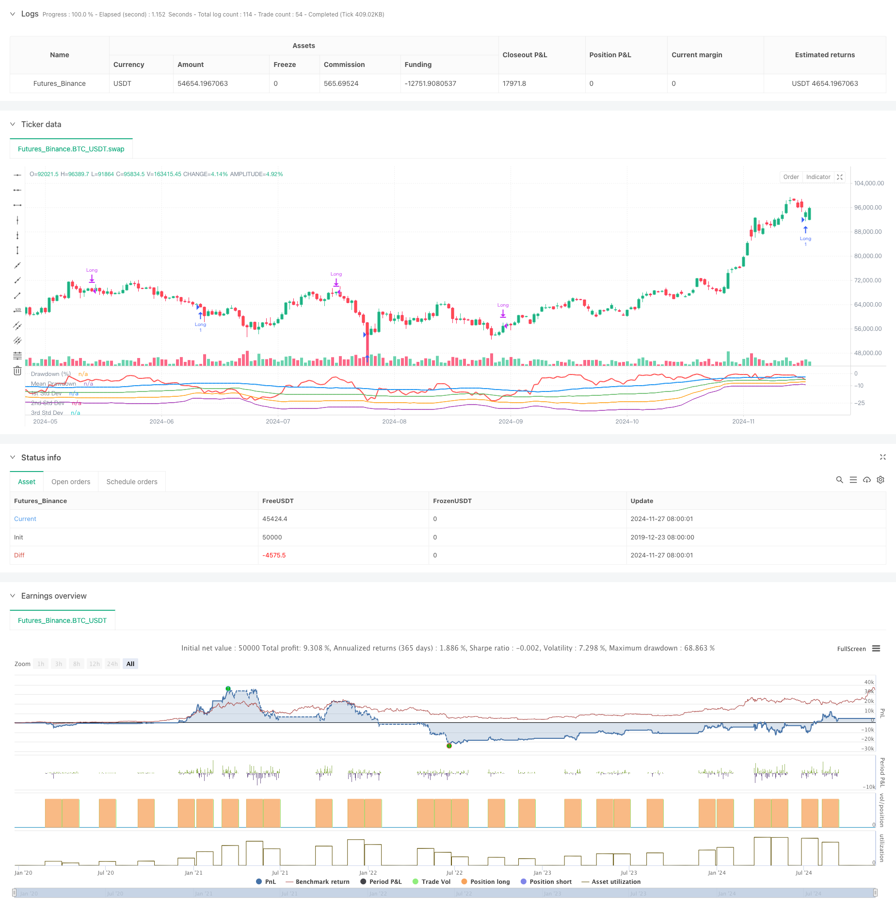

> Name

Statistical-Deviation-Based-Market-Extreme-Drawdown-Strategy
> Author

ChaoZhang

> Strategy Description



[trans]
#### Overview
This strategy trades based on the statistical properties of extreme market declines. Through statistical analysis of retracement, standard deviation is used to measure the extreme degree of market fluctuations, and purchases are made when the market falls beyond the normal range. The core idea of ​​the strategy is to capture oversold opportunities caused by market panic and identify investment opportunities brought about by irrational market behavior through mathematical statistical methods.
#### Strategy Principle
The strategy uses a rolling time window to calculate the maximum retracement of price and the statistical characteristics of the retracement. First calculate the highest price in the past 50 periods, and then calculate the retracement percentage of the current closing price relative to the highest price. Then calculate the mean and standard deviation of the retracement, and set -1 times the standard deviation as the trigger threshold. When the market retracement exceeds the mean minus the standard deviation of the set multiple, it indicates that the market may be oversold, and a long position is entered at this time. The position will be automatically closed after 35 cycles. The strategy also draws retracement curves and horizontal lines of one, two and three standard deviations to visually judge the degree of oversoldness of the market.
#### Strategic Advantages
1. The strategy is based on statistical principles and has a solid theoretical foundation. The extreme degree of market fluctuations is measured through standard deviation, which is an objective and scientific method.
2. The strategy can effectively capture investment opportunities during periods of market panic. Entering the market when there is an irrational decline is in line with the concept of value investing.
3. Adopt a fixed periodic position closing method to avoid the problem that tracking stop loss may miss the rebound.
4. The strategy parameters are highly adjustable and can be flexibly set according to different market environments and characteristics of trading varieties.
5. The retracement and standard deviation indicators are simple to calculate, the strategy logic is clear, and easy to understand and execute.
#### Strategy Risk
1. The market may continue to decline, resulting in strategies that frequently enter the market but suffer losses. It is recommended to set a maximum position limit.
2. Closing positions in a fixed period may miss greater room for growth. You can consider adding trend tracking methods to close positions.
3. The statistical characteristics of retracement may change as the market environment changes. It is recommended to update parameter settings regularly.
4. The strategy does not consider other market information such as trading volume. It is recommended to combine multiple indicators for cross-validation.
5. In a highly volatile market environment, the standard deviation may be distorted. It is recommended to set up risk control measures.
#### Strategy optimization direction
1. Introduce trading volume indicators to confirm the degree of market panic.
2. Add trend indicators to avoid frequent entries in a downward trend.
3. Optimize the position closing mechanism and dynamically adjust the position holding time according to market performance.
4. Add stop loss settings to control single transaction risks.
5. Consider using adaptive parameters to improve the adaptability of the strategy to market changes.
#### Summary
This strategy uses statistical methods to capture oversold market opportunities and has a good theoretical foundation and practical value. The strategy logic is simple and clear, and the parameters are highly adjustable, making it suitable for expansion and optimization as a basic strategy. By adding other technical indicators and risk control measures, the stability and profitability of the strategy can be further improved. In real trading, it is recommended to carefully set parameters and control risks based on the market environment and characteristics of trading varieties. ||
#### Overview
This strategy is based on the statistical characteristics of extreme market downturns. By analyzing drawdowns statistically and using standard deviations to measure market volatility extremes, it initiates buying positions when market declines exceed normal ranges. The core idea is to capture oversold opportunities caused by market panic, identifying investment opportunities through mathematical statistical methods that arise from market irrationality.

#### Strategy Principle
The strategy employs a rolling time window to calculate price maximum drawdowns and their statistical characteristics. It first calculates the highest price over the past 50 periods, then computes the drawdown percentage of current closing price relative to the highest price. It then calculates the mean and standard deviation of drawdowns, setting -1 standard deviation as the trigger threshold. When market drawdown exceeds the mean minus a set multiple of standard deviations, indicating potential oversold conditions, a long position is entered. Positions are automatically closed after 35 periods. The strategy also plots drawdown curves and one, two, and three standard deviation levels for visual assessment of market oversold conditions.

#### Strategy Advantages
1. The strategy is based on statistical principles with solid theoretical foundation. Using standard deviation to measure market volatility extremes is objective and scientific.
2. Effectively captures investment opportunities during market panic periods. Entering positions during irrational market declines aligns with value investing principles.
3. Fixed-period position closure avoids missing rebounds that might occur with trailing stops.
4. Highly adjustable parameters allow flexibility for different market environments and trading instruments.
5. Simple calculation of drawdown and standard deviation indicators makes the strategy logic clear and easy to understand and execute.

#### Strategy Risks
1. Markets may experience continuous decline, leading to frequent losing entries. Consider setting maximum position limits.
2. Fixed-period exits may miss larger upside potential. Consider adding trend-following exit methods.
3. Drawdown statistical characteristics may change with market conditions. Consider regular parameter updates.
4. Strategy doesn't consider volume and other market information. Consider cross-validation with multiple indicators.
5. Standard deviation may become unreliable in highly volatile markets. Consider implementing risk control measures.

#### Optimization Directions
1. Incorporate volume indicators to confirm market panic levels.
2. Add trend indicators to avoid frequent entries in downtrends.
3. Optimize exit mechanism with dynamic holding period adjustments based on market performance.
4. Add stop-loss settings to control single-trade risk.
5. Consider using adaptive parameters to improve strategy adaptation to market changes.

#### Summary
This strategy captures market oversold opportunities through statistical methods, with strong theoretical foundation and practical value. The strategy logic is simple and clear with adjustable parameters, suitable as a base strategy for expansion and optimization. Strategy stability and profitability can be further enhanced by adding technical indicators and risk control measures. In live trading, carefully set parameters considering market conditions and trading instrument characteristics, while maintaining proper risk control.[/trans]


> Source (PineScript)

``` pinescript
/*backtest
start: 2019-12-23 08:00:00
end: 2024-11-28 00:00:00
period: 1d
basePeriod: 1d
exchanges: [{"eid":"Futures_Binance","currency":"BTC_USDT"}]
*/

//@version=5
strategy("Buy When There's Blood in the Streets Strategy", overlay=false, shorttitle="BloodInTheStreets")


//This strategy identifies opportunities to buy during extreme market drawdowns based on standard deviation thresholds. 
//It calculates the maximum drawdown over a user-defined lookback period, identifies extreme deviations from the mean, 
//and triggers long entries when specific conditions are met. The position is exited after a defined number of bars.


// User Inputs
lookbackPeriod = input.int(50, title="Lookback Period", minval=1, tooltip="Period to calculate the highest high for drawdown")
stdDevLength = input.int(50, title="Standard Deviation Length", minval=1, tooltip="Length of the period to calculate standard deviation")
stdDevThreshold = input.float(-1.0, title="Standard Deviation Threshold", tooltip="Trigger level for long entry based on deviations")
exitBars = input.int(35, title="Exit After (Bars)", minval=1, tooltip="Number of bars after which to exit the trade")

// Drawdown Calculation
peakHigh = ta.highest(high, lookbackPeriod)
drawdown = ((close - peakHigh) / peakHigh) * 100

// Standard Deviation Calculation
drawdownStdDev = ta.stdev(drawdown, stdDevLength)
meanDrawdown = ta.sma(drawdown, stdDevLength)

// Define Standard Deviation Levels
stdDev1 = meanDrawdown - drawdownStdDev
stdDev2 = meanDrawdown - 2 * drawdownStdDev
stdDev3 = meanDrawdown - 3 * drawdownStdDev

// Plot Drawdown and Levels
plot(drawdown, color=color.red, linewidth=2, title="Drawdown (%)")
plot(meanDrawdown, color=color.blue, linewidth=2, title="Mean Drawdown")
plot(stdDev1, color=color.green, linewidth=1, title="1st Std Dev")
plot(stdDev2, color=color.orange, linewidth=1, title="2nd Std Dev")
plot(stdDev3, color=color.purple, linewidth=1, title="3rd Std Dev")

// Entry Condition
var float entryBar = na
goLong = drawdown <= meanDrawdown + stdDevThreshold * drawdownStdDev

if (goLong and strategy.position_size == 0)
    strategy.entry("Long", strategy.long)
    entryBar := bar_index

// Exit Condition
if (strategy.position_size > 0 and not na(entryBar) and bar_index - entryBar >= exitBars)
    strategy.close("Long")

```

> Detail

https://www.fmz.com/strategy/473402

> Last Modified

2024-11-29 16:46:33
