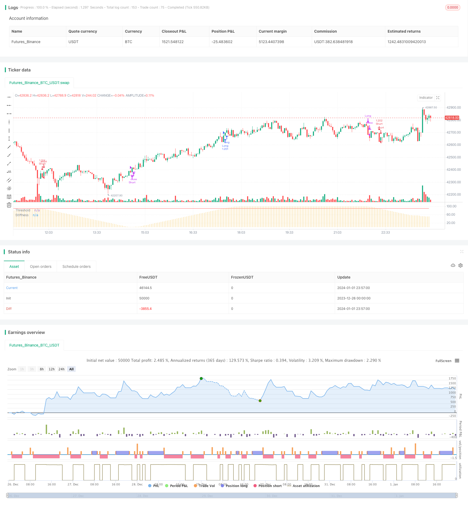

> Name

Stiffness-Breakthrough-Strategy
> Author

ChaoZhang

> Strategy Description


[trans]

### Overview
The rigid breakout strategy is a breakout strategy based on price rigidity indicators. It determines the rigidity of prices by counting the number of times the closing price breaks through the upper rail within a certain period. When the rigidity indicator exceeds the set threshold, it is judged that the market is about to break through, and a buying operation is carried out; when the rigidity indicator is lower than the threshold, it is judged that the market is about to fall back, and a selling operation is carried out.
### Strategy Principles
1. Calculate the moving average and standard deviation: first calculate the n-period simple moving average as the benchmark upper track, and then calculate 0.2 times the price standard deviation as the buffer for the lower track.
2. Calculate the rigidity index: count the number of days when the closing price is higher than the upper track in the m period, divide by m to get a value of 0-100, and then smooth it with n-period EMA to get the final rigidity value, which represents the probability of the price breaking through the upper track.
3. Compare rigidity and threshold: When the rigidity indicator crosses the set threshold, it indicates that the probability of breakthrough increases, generating a buy signal; when the rigidity indicator crosses below the threshold, it indicates that the probability of breakthrough decreases, generating a sell signal.
4. Entry and exit: buy when the closing price breaks through the upper track, and sell when the closing price fails to break through and starts to fall. While going long for breakthroughs, you can also go short for pullbacks.
### Advantage Analysis
1. Capture the opportunity for breakthrough: relativel can more reliably judge whether the trend is about to have a breakthrough or a correction opportunity, so as to enter the market in advance.
2. Taking into account both breakthroughs and pullbacks: This strategy simultaneously uses the breakthroughs and pullbacks of rigid indicators to capture long and short opportunities.
3. Flexible parameters: Users can adjust parameters such as moving average length, rigid cycle, and threshold according to the market to adapt to the characteristics of different cycles and markets.
4. Simple implementation: Only rigid indicators and threshold comparisons are used, there is no complex logic, and the code implementation is relatively simple.
### Risk Analysis
1. Breakthrough failure risk: When the rigidity exceeds the threshold, there is no complete guarantee that the price will break through the upper track, and there is a certain risk of false breakthrough.
2. Risk of callback range: When short selling, it is impossible to predict the specific callback range and position, and there is a risk of excessive losses.
3. Parameter optimization risk: Reference parameters cannot fully adapt to market changes and need to be continuously tested and optimized based on actual conditions.
4. Frequent trading risk: This strategy has a high trading frequency, which will increase transaction costs and slippage losses.
### Optimization direction
1. Optimize parameters: You can test parameter settings in different markets and find the best parameter combination. For example, increasing the length of the moving average to reduce trading frequency, etc.
2. Add stop loss: Set reasonable stop loss logic to control single losses. Stop loss can be set based on atr.
3. Combine with other indicators: Indicators such as MACD and KD can be added to determine the specific entry point and reduce the probability of false breakthroughs.
4. Optimize exit conditions: You can determine the characteristics of trend reversal based on trend indicators, etc., and set more accurate exit conditions.
### Summarize
The rigid breakthrough strategy is generally relatively simple and practical. It can judge possible price breakthrough and fall opportunities in advance and has certain practical value. But we also need to pay attention to the problems of false breakthroughs and callback ranges, and lock in more precise trading opportunities through parameter optimization and adding other technical indicators.
||

### Overview

Stiffness Breakthrough Strategy is a breakout strategy based on the price stiffness indicator. It calculates the number of times the closing price breaks through the upper rail over a certain period to determine the stiffness of the price. When the stiffness indicator exceeds the set threshold, it is judged that the market is about to break out and a buy order is placed. When the stiffness indicator is below the threshold, it is judged that the market is about to fall back and a sell order is placed.  

### Strategy Principle  

1. Calculate Moving Average and Standard Deviation: Calculate the simple moving average of n periods as the benchmark upper rail, and 0.2 times the standard deviation of the price as the buffer lower rail.

2. Calculate Stiffness Indicator: Count the number of days when the closing price is higher than the upper rail in m cycles, divide by m to get a value between 0-100, and then smooth it with a n-period EMA to get the final stiffness value, representing the probability that the closing price will break through the upper rail.

3. Compare Stiffness and Threshold: When the stiffness indicator crosses above the set threshold, it means that the probability of breakthrough increases and a buy signal is generated. When the stiffness indicator crosses below the threshold, it means that the probability of breakthrough decreases and a sell signal is generated.  

4. Entry and Exit: Buy when the closing price breaks through the upper rail, and sell when the breakthrough fails and the decline begins. Going long on breakouts while also going short on pullbacks.

### Advantage Analysis

1. Capture the timing of breakouts: Relatively reliably judge when a trend is about to break out or pull back, so as to enter the market in advance.

2. Take into account breakouts and pullbacks: The strategy captures both long and short opportunities by utilizing stiffness indicator breakouts and declines. 

3. Flexible parameters: Users can adjust parameters such as moving average length, stiffness cycle, threshold, etc. according to the market to adapt to the characteristics of different cycles and markets.

4. Simple to implement: Only use stiffness indicator and threshold comparison without complex logic, code implementation is quite simple.


### Risk Analysis  

1. Failed breakout risk: When stiffness exceeds the threshold, it cannot be fully guaranteed that prices will break through the upper rail, with a certain risk of false breakouts.  

2. Pullback range risk: When going short, the specific range and location of pullbacks cannot be predicted, with the risk of losing too much.

3. Parameter optimization risk: Reference parameters cannot fully adapt to market changes, and need to be continuously tested and optimized according to actual conditions.  

4. Frequent trading risk: The relatively high trading frequency of this strategy increases the loss from trading costs and slippage.


### Optimization Directions

1. Optimize parameters: Test parameter settings under different markets to find the optimal parameter combination. For example, increase the moving average length to reduce trading frequency.

2. Add stop loss: Set reasonable stop loss logic to control single loss. Stop loss can be set based on ATR.  

3. Incorporate other indicators: Indicators such as MACD and KD can be added to determine specific entry points and reduce the probability of false breakouts.  

4. Optimize exit conditions: Trend indicators can be used to determine the characteristics of trend reversals and set more accurate exit conditions.


### Summary  

Overall, the Stiffness Breakthrough Strategy is quite simple and practical. It can predict possible price breakouts and pullbacks in advance, with some practical value. But we also need to pay attention to the issues of false breakouts and pullback range, and capture more accurate trading opportunities through parameter optimization and the addition of other technical indicators.

[/trans]

> Strategy Arguments


|Argument|Default|Description|
|----|----|----|
|v_input_1|100|Moving Average Length|
|v_input_2|60|Stiffness Length|
|v_input_3|3|Stiffness Smoothing Length|
|v_input_4|90|Threshold|
|v_input_5|false|Highlight Threshold Crossovers ?|


> Source (PineScript)

``` pinescript
/*backtest
start: 2023-12-26 00:00:00
end: 2024-01-02 00:00:00
period: 3m
basePeriod: 1m
exchanges: [{"eid":"Futures_Binance","currency":"BTC_USDT"}]
*/

//@version=4
// Copyright (c) 2020-present, JMOZ (1337.ltd)
// Copyright (c) 2018-present, Alex Orekhov (everget)
// Stiffness Indicator script may be freely distributed under the MIT license.
strategy("Stiffness Strategy", overlay=false, initial_capital=10000, default_qty_type=strategy.percent_of_equity, default_qty_value=100, commission_value=0.075)


maLength = input(title="Moving Average Length", minval=1, defval=100)
stiffLength = input(title="Stiffness Length", minval=1, defval=60)
stiffSmooth = input(title="Stiffness Smoothing Length", minval=1, defval=3)
threshold = input(title="Threshold", minval=1, defval=90)
highlightThresholdCrossovers = input(title="Highlight Threshold Crossovers ?", type=input.bool, defval=false)


bound = sma(close, maLength) - 0.2 * stdev(close, maLength)
sumAbove = sum(close > bound ? 1 : 0, stiffLength)
stiffness = ema(sumAbove * 100 / stiffLength, stiffSmooth)


long_cond = crossover(stiffness, threshold)
long_close = stiffness > threshold and falling(stiffness, 1)
short_cond = crossunder(stiffness, threshold) or stiffness < threshold and falling(stiffness, 1)
short_close = stiffness < threshold and rising(stiffness, 1)


strategy.entry("Long", strategy.long, when=long_cond)
strategy.close("Long", when=long_close)
strategy.entry("Short", strategy.short, when=short_cond)
strategy.close("Short", when=short_close)


transparent = color.new(color.white, 100)

bgColor = highlightThresholdCrossovers ? stiffness > threshold ? #0ebb23 : color.red : transparent
bgcolor(bgColor, transp=90)

plot(stiffness, title="Stiffness", style=plot.style_histogram, color=#f5c75e, transp=0)
plot(threshold, title="Threshold", color=color.red, transp=0)

```

> Detail

https://www.fmz.com/strategy/437494

> Last Modified

2024-01-03 11:34:34
