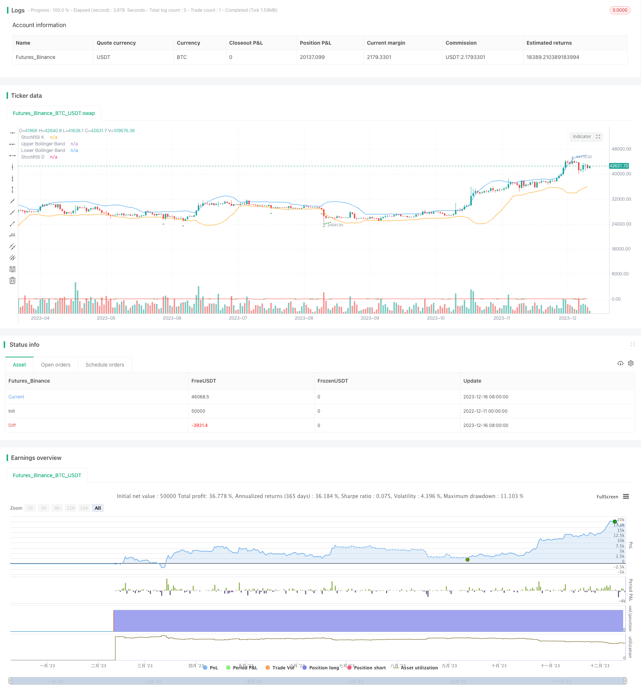

> Name

High-Frequency-Trading-Strategy-Based-on-Bollinger-Bands-and-StochRSI-Indicators
> Author

ChaoZhang

> Strategy Description


 [trans]

## Strategy Overview
The name of this strategy is "Dual Indicator Leading Strategy". It is a long-only high-frequency trading strategy designed to generate frequent trading signals through two indicators: Bollinger Bands and Stochastic RSI. This strategy is suitable for traders who pursue high trading frequency.
## Strategy Principle
### Indicator calculation
First, calculate the upper track, middle track and lower track of Bollinger Bands based on the user-set Bollinger Band length and standard deviation parameters. The middle rail represents the simple moving average of closing prices, and the upper and lower rails represent the standard deviation of price fluctuations.
Then, the StochRSI indicator is calculated based on the Stochastic RSI length, K period and D period parameters. This indicator combines the properties of RSI and Stochastic to measure the momentum of an asset price.
### Buying conditions
When the closing price is below the lower Bollinger Band, the buying condition is triggered. At this time, it means that the price is at the low end of the recent fluctuation range, which is a potential buying opportunity.
### Entry and Exit
When the buying conditions are met, the strategy enters the long position to look for opportunities and sends a buy signal.
There is no exit logic set in the code, and traders need to set profit or stop loss exits according to the variety and time frame.
## Strategic Advantages
- Use Bollinger Bands to determine when prices may reverse
- StochRSI provides additional momentum judgment
- Achieve frequent transactions, suitable for high-frequency strategies
- Just make multiple designs simple
- Freely adjust parameters to achieve optimization
## Strategy Risk
- Risk of overbought and oversold
- High-frequency trading is susceptible to transaction costs
- Need to set profit or stop loss exit logic
- Strict fund management is required
Risks can be reduced by adding two-way trading, optimizing parameters, setting stop losses and take profits, and evaluating cost hedging.
## Strategy optimization direction
- Add selling conditions to achieve two-way trading
- Optimized parameter combinations to reduce false signals
- Add trend judgment indicator filtering
- Set stop loss and take profit to ensure risk management
## Summarize
This strategy provides a high-frequency trading strategy framework based on Bollinger Bands and StochRSI indicators. Traders can optimize the strategy by adjusting parameter settings and adding risk management measures based on their own trading goals and market conditions to meet their frequent trading needs.
||


## Strategy Overview

The strategy is named "Dual Indicator Leading Strategy". It is a long-only high frequency trading strategy that aims to generate frequent trading signals based on the Bollinger Bands and Stochastic RSI indicators. The strategy suits traders who pursue high trading frequency.  

## Strategy Logic

### Indicator Calculation  

Firstly, the Bollinger Bands upper band, middle band and lower band are calculated based on user-defined length and standard deviation parameters. The middle band represents the simple moving average of closing prices, while the upper and lower bands represent the standard deviation of price fluctuations.  

Then, the Stochastic RSI indicator is computed based on chosen length, K period and D period parameters for StochRSI. This indicator combines the characteristics of RSI and Stochastics indicators to measure the momentum of asset prices.

### Buy Condition  

The buy condition triggers when the closing price falls below the Bollinger Bands lower band. This suggests that the price is in the lower range of its recent volatility and presents a potential buying opportunity. 

### Entry and Exit  

When the buy condition is met, the strategy enters a long position for seeking opportunity.

The code does not include exit logic, which should be set by traders themselves based on product and timeframe for taking profits or stopping losses.  

## Advantage Analysis 

- Utilizes Bollinger Bands to identify potential price reversal points  
- StochRSI provides additional momentum judgment  
- Achieves high-frequency trading suitable for scalping strategies   
- Simplicity of only going long
- Flexibility to optimize parameters for better performance  

## Risk Analysis

- Risks of overbought and oversold conditions
- High trading frequency vulnerable to transaction costs  
- Needs exit logic setting for profit taking or stopping losses
- Requires strict capital management 

Risks can be reduced by adding two-way trading, parameter optimization, stop loss and take profit setting, evaluation of cost hedging etc.

## Optimization Directions

- Add sell conditions to enable two-way trading
- Optimize parameter mix to reduce false signals  
- Add trend indicator filters  
- Set stop loss and take profit to ensure risk management  

## Conclusion  

This strategy provides a framework for high frequency trading based on Bollinger Bands and StochRSI indicators. Traders can optimize the strategy by adjusting parameters, adding risk management measures etc. according to their trading goals and market conditions, in order to meet the needs of frequent trading.

[/trans]

> Strategy Arguments


|Argument|Default|Description|
|----|----|----|
|v_input_int_1|20|Bollinger Bands Length|
|v_input_float_1|2|Bollinger Bands Deviation|
|v_input_int_2|14|StochRSI Length|
|v_input_int_3|3|K Period|
|v_input_int_4|3|D Period|


> Source (PineScript)

``` pinescript
//@version=5
strategy("High Frequency Strategy", overlay=true)

// Define your Bollinger Bands parameters
bollinger_length = input.int(20, title="Bollinger Bands Length")
bollinger_dev = input.float(2, title="Bollinger Bands Deviation")

// Calculate Bollinger Bands
sma = ta.sma(close, bollinger_length)
dev = bollinger_dev * ta.stdev(close, bollinger_length)

upper_band = sma + dev
lower_band = sma - dev

// Define your StochRSI parameters
stoch_length = input.int(14, title="StochRSI Length")
k_period = input.int(3, title="K Period")
d_period = input.int(3, title="D Period")

// Calculate StochRSI
rsi = ta.rsi(close, stoch_length)
k = ta.sma(ta.stoch(rsi, rsi, rsi, k_period), k_period)
d = ta.sma(k, d_period)

// Define a buy condition (Long Only)
buy_condition = close < lower_band

// Place orders based on the buy condition
if (buy_condition)
    strategy.entry("Buy", strategy.long)

// Optional: Plot buy signals on the chart
plotshape(buy_condition, color=color.green, style=shape.triangleup, location=location.belowbar, size=size.small)

// Plot Bollinger Bands on the chart
plot(upper_band, title="Upper Bollinger Band", color=color.blue)
plot(lower_band, title="Lower Bollinger Band", color=color.orange)
plot(k, title="StochRSI K", color=color.green)
plot(d, title="StochRSI D", color=color.red)


```

> Detail

https://www.fmz.com/strategy/435698

> Last Modified

2023-12-18 10:16:49
