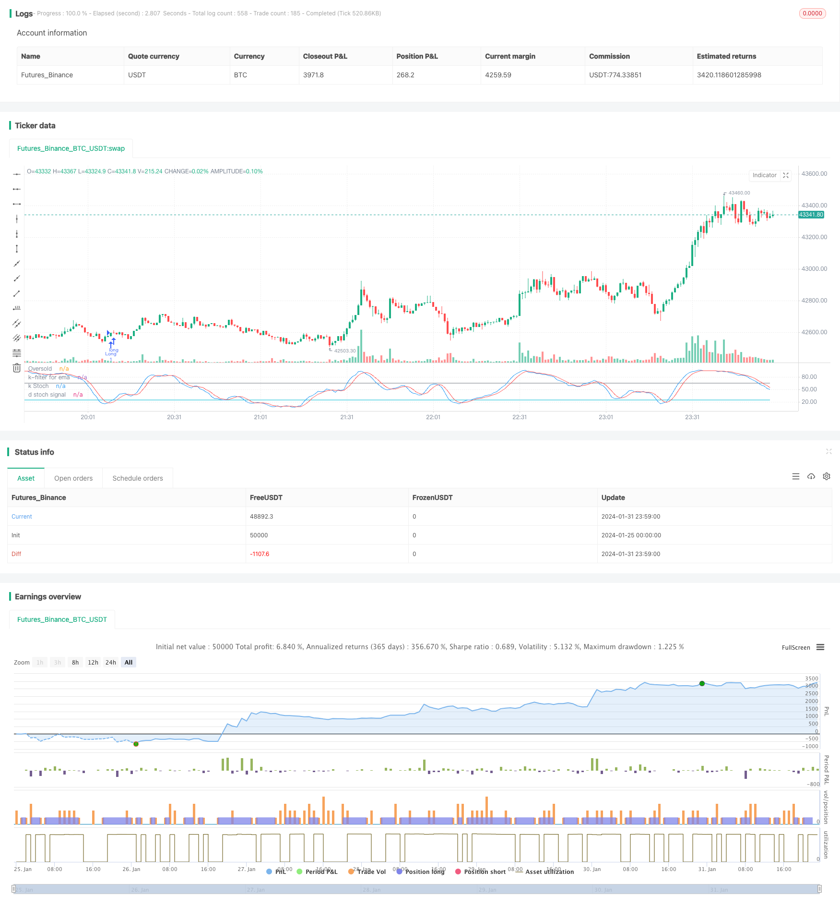

> Name

Stochastic-Moving-Average-Strategy-with-Double-Filters
> Author

ChaoZhang

> Strategy Description


[trans]
### Overview
This strategy is a long-term trading strategy that uses a combination of stochastic indicator K value and exponential moving average to filter. The strategy determines that the buying conditions are met when the K value of the stochastic indicator enters the oversold zone, and it determines whether to close the position with stop loss or take profit when the price falls below the moving average and the filter condition of the stochastic indicator is established.
### Strategy Principles
The dual-indicator filter trading strategy mainly uses the technical indicator characteristics of the stochastic indicator K value to determine the buying opportunity and the exponential moving average to determine the stop-loss and take-profit opportunities. The K value of the stochastic indicator can be used to identify oversold and overbought conditions, while the moving average is a tool for judging price trends. Combining the two, you can buy at the oversold point and use the moving average to determine the timing of stop loss and profit.
The strategy first calculates the K and D values ​​of the stochastic indicators with a length of 21 periods, and the exponential moving average with a length of 38 periods. When the K value crosses the D value and enters the oversold zone (default is 25), a buy signal is generated; when the price falls below the moving average and the stochastic indicator K value is greater than the filter threshold of 65, it is judged that the trend is reversed and a closing signal is generated; at the same time, a 13% stop loss condition is set.
Trading through dual indicators and dual filters can effectively filter out false signals and make profits by tracking the long-term trend after buying in the oversold zone. This strategy is suitable for medium and long-term positions.
### Advantage Analysis
This strategy has several advantages:
1. Use the stochastic indicator Determine to buy points: When the K value of the stochastic indicator crosses the D value and enters the oversold zone, it is regarded as a stock price reversal signal, which is a better buying opportunity.
2. Double filter design: The strategy uses the golden cross of K value/D value and the low price filter to determine the buying opportunity at the same time, which can effectively filter out false signals.
3. Exponential moving average tracking and take profit: The indicator has hysteresis, and using it to take profit can maximize the profit following the trend.
4. The stochastic indicator filters callbacks again: When judging the take-profit and closing position, the stochastic indicator is used again to filter ordinary callbacks and trend reversals to make the strategy more stable.
5. Suitable for medium and long-term positions: Through the dual indicator combination design, the strategy is suitable for medium and long-term positions and can achieve better profits.
### Risk Analysis
There are also some risks with this strategy:
1. Systemic risk: This strategy is sensitive to the market environment and prone to losses in a bear market.
2. Callback risk: During a short-term market correction, the moving average stop loss may be triggered and exit the market prematurely.
3. Parameter optimization risk: Indicator parameters need to be repeatedly tested and optimized, and improper settings may affect strategy performance.
4. Risk of emergencies: In the face of major breaking news, technical indicators fail, so you need to pay attention to avoid such periods.
### Optimization direction
Some possible optimization directions for this strategy include:
1. Optimize indicator parameters: repeatedly test different parameter combinations to find the best parameters.
2. Add stop-loss methods: methods such as volatility stop-loss and trailing stop-loss can be introduced.
3. Combined with other indicators: volume and energy indicators, Bollinger Bands, etc. can be introduced to determine buying and selling points.
4. Optimize the number of moving average periods: test the effect of longer-term or shorter-term moving averages.
5. Analyze the market environment: dynamically adjust strategy parameters according to market conditions.
### Summarize
Overall, the dual-indicator filter trading strategy is a more complete trend following strategy. It uses the stochastic indicator to determine the buying point, then uses the moving average to track the trend to take profit, and designs a double filter to effectively filter out false signals. There is a lot of room for optimization of strategy parameters and it is suitable for medium and long-term positions. It is an effective stock trading strategy.
||

### Overview

This is a long-term trading strategy that combines the stochastic oscillator K values and exponential moving averages with double filters. It identifies buying opportunities when stochastic K crosses over D and enters oversold territory. The strategy generates sell signals when prices cross below the moving average and stochastic K is above a threshold, filtering normal throwbacks from trend reversals. Stop loss rules are also implemented.  

### Strategy Logic

The core idea of this strategy is to use stochastic K for timing entry signals, and exponential moving averages for booking profits. Stochastic oscillator is good at detecting overbought/oversold situations, while moving averages define the trend. By combining the two, entries are made at oversold levels, and profits are trailed along the trend using moving averages.

Specifically, this strategy calculates 21-period stochastic K and D values, as well as 38-period EMA. When K crosses above D into the oversold zone (default 25), a buy signal is generated. When prices cross below EMA and stochastic K is higher than the filter threshold (65), trend reversal is assumed and position is closed. A 13% stop loss rule is also implemented. 

With double indicators and double filters, this strategy effectively filters out fake signals. Buying into oversold levels and trailing the uptrend can capture good profits. It is suitable for medium-to-long term holdings.

### Advantage Analysis 

The main advantages of this strategy are:

1. Stochastic K determines good entry points when crossing into oversold territory.  

2. Double filters of K/D cross and price extreme effectively avoid false signals.

3. Trailing take-profits with EMA makes full use of upside momentum.  

4. Stochastic filters normal throwbacks from reversals when booking profits.

5. Suitable for medium-to-long term holdings with good profitability.

### Risk Analysis

Some risks to consider:

1. Systemic risk - bear markets can cause heavy losses.

2. Throwback risk - temporary price pullbacks may prematurely trigger MA stop loss.  

3. Parameter optimization risk - inappropriate parameter tuning affects performance.

4. Black swan risk - technical indicators fail against market shocks.

### Optimization Directions  

Some ways to optimize the strategy:

1. Optimize indicator parameters through rigorous backtesting.  

2. Add other stop loss methods like volatility or trailing stop loss.

3. Incorporate other indicators like volume, Bollinger Bands etc. 

4. Test shorter/longer moving average periods.  

5. Dynamically adjust parameters based on market regimes.

### Conclusion
This is an overall solid trend-following strategy. It uses stochastic to determine entry, moving average to trail exits, and implements double filters to avoid false signals. With ample parameter tuning flexibility, medium-to-long term holding and effectiveness in catching trends, this is an efficient stock trading strategy.

[/trans]

> Strategy Arguments


|Argument|Default|Description|
|----|----|----|
|v_input_int_1|21|period|
|v_input_int_2|13|stop loss %|
|v_input_int_3|true|leverage|
|v_input_1|2|n days ago|
|v_input_int_4|65|k filter for throwbacks|
|v_input_int_5|25|Oversold value|
|v_input_int_6|6|k|
|v_input_int_7|4|d|
|v_input_int_8|38|periodo Sma|


> Source (PineScript)

``` pinescript
/*backtest
start: 2024-01-25 00:00:00
end: 2024-02-01 00:00:00
period: 1m
basePeriod: 1m
exchanges: [{"eid":"Futures_Binance","currency":"BTC_USDT"}]
*/

//@version=5
// English version
strategy(title='Stochastic & MA',  overlay=false)
// INPUTS : all default value have already been optimized
length = input.int(21, 'period', minval=1)
lossp = input.int(13, 'stop loss %', minval=2, step=1)
leverage = input.int(1, 'leverage', minval=1, step=1)
// leverage has been introduced for modifying stop loss levels for financial instruments with leverage, like ETF 
n = input(2, 'n days ago')
filtro = input.int(65, 'k filter for throwbacks', minval=20, step=1)
OverSold = input.int(25, 'Oversold value', minval=5, step=5)
// Building indicators
smoothK = input.int(6, 'k', minval=1)
smoothD = input.int(4, 'd', minval=1)
k = ta.sma(ta.stoch(close, high, low, length), smoothK)
d = ta.sma(k, smoothD)
//Empowerment: introducing EMA
sma_period = input.int(38, 'periodo Sma', minval=1)
emaf = ta.ema(close, sma_period)
//ENTRY condition and order
// First of all, it's better not trade shares with a quaterly loss or with a bad surprise towards to analysts' expectations or ipevaluated (P/E > 50), but on your choice
// You entry when Stochastic's K is higher than D in Oversold area (you may personalize), applying the condition that today's close should be higher than one of n-days ago (default of the day before yesterday or 2 candles ago)
entry1 = k > d and k <= OverSold and close >= close[n]
strategy.entry('Long', strategy.long, comment='k basso', when=entry1)
//EXIT CONDITIONS
//  1) close crosses under exponential movinig average with filter that k >= fixed level (65), in order to distinguish a violent movement of prices with a possibile beginning of a trend from an almost exhausted "ordinary" throwback
// 2) fixed stop loss on percentage
exit1 = ta.crossunder(close, emaf) and k >= filtro
losspel = strategy.position_avg_price * (1 - lossp / 100 * leverage)
exit2 = close < losspel
strategy.close('Long', when=exit1, comment='sma')
strategy.close('Long', when=exit2, comment='stop loss')
// plotting indicators (add Ema on your choice)
plot(k, color=color.new(color.blue, 0), linewidth=1, title='k Stoch')
plot(d, color=color.new(color.red, 0), linewidth=1, title='d stoch signal')
plot(OverSold, title='Oversold', color=color.new(color.aqua, 0))
plot(filtro, color=color.new(color.gray, 0), title='k-filter for ema')


```

> Detail

https://www.fmz.com/strategy/440806

> Last Modified

2024-02-02 11:28:58
