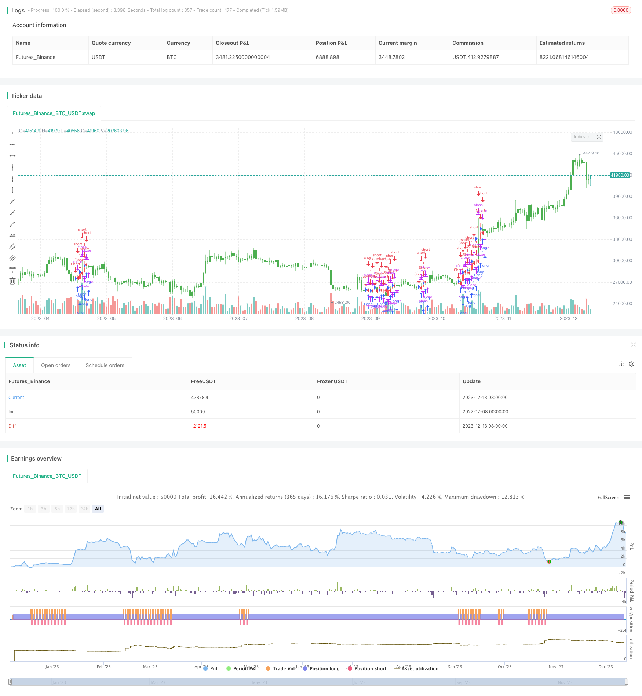

> Name

Stochastic-Crossover-Long-and-Short-Strategy based on Stochastic indicator
> Author

ChaoZhang

> Strategy Description


 [trans]

## Overview
This strategy forms a trading signal based on the golden cross of the %K line and the %D line of the Stochastic indicator. Go short when the %K line crosses the %D line from top to bottom and both are in the overbought area; go long when the %K line crosses the %D line from bottom to top and both are in the oversold area. This strategy captures the characteristics of Stochastic indicator reversals and forms trading signals at trend reversal points.
## Strategy Principle
This strategy uses the two lines of the Stochastic indicator %K and %D. The %K line shows the position of the current closing price relative to the highest and lowest prices within a certain period, and the %D line is the M-day simple moving average of the %K line.
When the %K line crosses the %D line from top to bottom, it means that the price has begun a downward trend, and both lines are in the overbought area, indicating that it is currently at the critical point of price reversal, and it is time to go short.
When the %K line crosses the %D line from bottom to top, it means that the price has begun an upward trend, and both lines are in the oversold area, indicating that it is currently at the critical point of price reversal, so go long.
By capturing the reversal timing of the Stochastic indicator, trading signals can be formed near trend turning points.
## Strategic advantage analysis
This strategy has the following advantages:
1. Capture trend reversal points and implement contrarian trading
2. Use the reversal characteristics of the Stochastic indicator to form trading signals
3. Combine the judgment of overbought and oversold areas to avoid false reversals
4. The rules are simple, clear and easy to implement
## Risk Analysis
This strategy also has the following risks:
1. Stochastic indicators can easily form false reversals, causing the strategy to generate false signals.
2. Unable to effectively filter market noise and may trade too frequently
3. Unable to determine trend direction, need to cooperate with trend filtering
4. Failure to effectively control stop loss may result in larger losses
Corresponding solutions:
1. Combine with other indicators to filter false signals
2. Adjust parameters appropriately to ensure stable and reliable trading signals
3. Use in combination with trend indicators to avoid counter-trend trading
4. Add a stop-loss mechanism to control the maximum loss in a single transaction
## Optimization direction
This strategy can be optimized from the following aspects:
1. Adjust Stochastic parameters and optimize the period parameters of %K and %D
2. Combine with indicators such as moving averages to filter out false signals and improve signal quality.
3. Add trend judgment rules to avoid counter-trend trading
4. Add stop loss and take profit rules to make the strategy more robust
5. Optimize the logic of opening and closing positions to reduce transaction frequency
6. Test the adaptability of different varieties and cycle parameters
7. Strategy combination, used in conjunction with other strategies
## Summarize
This strategy is based on the intersection of the long and short lines of the Stochastic indicator to form a trading signal and capture the reversal point to implement hedging transactions. The strategy logic is simple, clear and easy to implement, but it also has certain flaws. Better strategic effects can be achieved through parameter optimization, indicator combination, risk control and other means. This strategy is a short-term trading strategy and is suitable for high-frequency trading.
||


## Overview

This strategy generates trading signals based on the golden cross and death cross of %K line and %D line of the Stochastic indicator. It goes short when %K line crosses below %D line while both are in the overbought area, and goes long when %K line crosses above %D line while both are in the oversold area. The strategy captures the reversal characteristic of Stochastic indicator and forms trading signals around trend turning points.  

## Strategy Logic

The strategy utilizes two lines, %K and %D, of the Stochastic indicator. %K line shows the current closing price relative to the highest and lowest prices over a certain period, and %D line is the M-day simple moving average of %K line.

When %K line crosses below %D line, it indicates the start of a downward trend, and together with both lines in the overbought area, it signals the critical point for price reversal, so a short position is taken.  

When %K line crosses above %D line, it indicates the start of an upward trend, and together with both lines in the oversold area, it signals the critical point for price reversal, so a long position is taken.

By capturing the reversal moments of Stochastic indicator, trading signals can be generated around trend turning points.

## Advantage Analysis 

The main advantages of this strategy are:

1. Captures trend reversals and enables contrarian trading
2. Utilizes the reversal characteristic of Stochastic indicator for trade signals
3. Combines overbought/oversold areas to avoid false reversals  
4. Simple and clear logic, easy to implement

## Risk Analysis

The main risks of this strategy are:

1. Stochastic indicator prone to false reversals, causing incorrect signals
2. Fails to filter market noise effectively, potentially over-trading
3. Unable to determine trend direction, needs trend filter
4. No effective stop loss control, can lead to large losses

Corresponding solutions:

1. Combine with other indicators to filter false signals
2. Adjust parameters properly to ensure stable reliable signals
3. Use with trend indicators to avoid counter-trend trading
4. Incorporate stop loss mechanism to limit max loss per trade

## Optimization Directions 

The strategy can be optimized from the following aspects:

1. Adjust Stochastic parameters, optimize %K, %D periods  
2. Add moving averages etc to filter signals, improve quality
3. Add trend judgment rules to avoid counter-trend trades
4. Incorporate stop loss and take profit rules for robustness
5. Optimize entry and exit logic to reduce trading frequency
6. Test adaptability across products and timeframes
7. Strategy ensemble, combine with other strategies

## Conclusion

This strategy generates trading signals based on the crossover of the short and long lines of the Stochastic indicator, aiming to capture reversals for contrarian trading. The logic is simple and clear, easy to implement, but also has some flaws. Better results can be achieved through parameter tuning, indicator combinations, risk control etc. It is a short-term trading strategy suitable for high frequency trading.

[/trans]

> Strategy Arguments


|Argument|Default|Description|
|----|----|----|
|v_input_1|7|Length|
|v_input_2|3|DLength|
|v_input_3|20|Oversold|
|v_input_4|70|Overbought|
|v_input_5|false|Trade reverse|


> Source (PineScript)

``` pinescript
/*backtest
start: 2022-12-08 00:00:00
end: 2023-12-14 00:00:00
period: 1d
basePeriod: 1h
exchanges: [{"eid":"Futures_Binance","currency":"BTC_USDT"}]
*/

//@version=2
////////////////////////////////////////////////////////////
//  Copyright by HPotter v1.0 11/01/2017
// This back testing strategy generates a long trade at the Open of the following 
// bar when the %K line crosses below the %D line and both are above the Overbought level.
// It generates a short trade at the Open of the following bar when the %K line 
// crosses above the %D line and both values are below the Oversold level.
//
// You can change long to short in the Input Settings
// Please, use it only for learning or paper trading. Do not for real trading.
////////////////////////////////////////////////////////////
strategy(title="Strategy Stochastic Crossover", shorttitle="Strategy Stochastic Crossover1", overlay = true )
Length = input(7, minval=1)
DLength = input(3, minval=1)
Oversold = input(20, minval=1)
Overbought = input(70, minval=1)
reverse = input(false, title="Trade reverse")
vFast = stoch(close, high, low, Length)
vSlow = sma(vFast, DLength)
pos = iff(vFast < vSlow and vFast > Overbought and vSlow > Overbought, 1,
	   iff(vFast >= vSlow and vFast < Oversold and vSlow < Oversold, -1, nz(pos[1], 0))) 
possig = iff(reverse and pos == 1, -1,
          iff(reverse and pos == -1, 1, pos))	   
if (possig == 1) 
    strategy.entry("Long", strategy.long)
if (possig == -1)
    strategy.entry("Short", strategy.short)	   	    
barcolor(possig == -1 ? red: possig == 1 ? green : blue )
```

> Detail

https://www.fmz.com/strategy/435468

> Last Modified

2023-12-15 10:29:29
