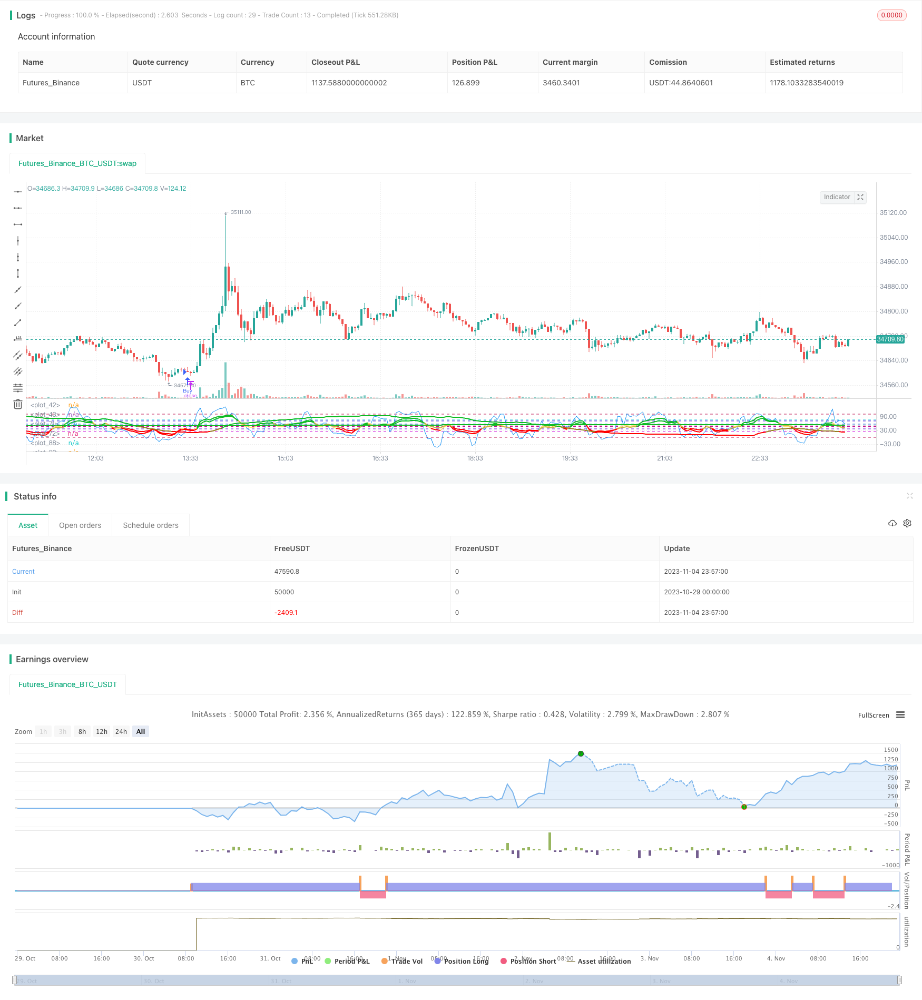

> Name

Super-Momentum-Strategy
> Author

ChaoZhang

> Strategy Description

 
 [trans]

## Overview
The super momentum strategy uses a variety of momentum indicators to perform buy or sell operations when multiple momentum indicators are bullish or bearish at the same time. By combining multiple momentum indicators, this strategy can more accurately capture price trends and avoid false signals caused by a single indicator.
## Strategy Principle
This strategy uses both 4 Everget RMI indicators and 1 Chande Momentum Oscillator. The RMI indicator is calculated based on price momentum and can determine the strength of price increases and decreases. Chande MO determines whether the market is overbought or oversold by calculating price changes.
When RMI5 crosses above its buy line, RMI4 crosses below its buy line, RMI3 crosses below its buy line, RMI2 crosses below its buy line, RMI1 crosses below its buy line, and Chande MO crosses above its buy line, a buying operation is performed.
When RMI5 crosses below its sell line, RMI4 crosses above its sell line, RMI3 crosses above its sell line, RMI2 crosses above its sell line, RMI1 crosses above its sell line, and Chande MO crosses below its sell line, perform a selling operation.
RMI5 is set in the opposite direction to other RMI indicators, which allows for better identification of trends and pyramid operations.
## Advantage Analysis
- Combining multiple indicators can determine trends more accurately and avoid false signals from a single indicator.
- Contains multi-time period indicators to identify larger-level trends
- The reverse RMI indicator can assist in trend identification and pyramid operations
- Chande MO helps avoid wrong trades in overbought and oversold conditions
## Risk Analysis
- Too many indicator combinations and complex parameter settings, requiring careful testing and optimization
- When multiple indicators change at the same time, erroneous signals may be generated
- Combining multiple indicators, the trading frequency may be relatively low
- It is necessary to pay attention to whether the indicator parameters are suitable for different varieties and market environments
## Optimization direction
- Test indicator parameter settings and optimize parameters to improve strategy stability
- Try to increase or decrease some indicators to evaluate the impact on signal quality
- Some filters can be introduced to avoid false signals in specific market situations
- Adjust the indicator's buying and selling line position to find the optimal parameter combination
- Consider adding a stop-loss mechanism to control risk
## Summarize
This strategy improves the ability to judge market trends by comprehensively using a variety of momentum indicators. However, parameter settings are complex and require careful testing and optimization, and continuous improvement and adjustment. If used properly, it is expected to obtain better trading signals and have certain advantages in tracking market trends. However, traders still need to pay attention to risks, find the best parameter combination, and add risk control mechanisms to conduct stable transactions.
|| 

## Overview

The Super Momentum strategy combines multiple momentum indicators. It buys when multiple momentum indicators are bullish concurrently, and sells when they are bearish concurrently. By integrating multiple momentum indicators, it aims to capture price trends more accurately and avoid false signals from individual indicators.

## Strategy Logic

The strategy uses 4 RMI indicators by Everget and 1 Chande Momentum Oscillator. RMI measures price momentum to gauge bullish and bearish strength. Chande MO calculates price change to identify overbought and oversold conditions. 

It goes long when RMI5 crosses above its buy line, RMI4 crosses below its buy line, RMI3 crosses below its buy line, RMI2 crosses below its buy line, RMI1 crosses below its buy line, and Chande MO crosses above its buy line.

It goes short when RMI5 crosses below its sell line, RMI4 crosses above its sell line, RMI3 crosses above its sell line, RMI2 crosses above its sell line, RMI1 crosses above its sell line, and Chande MO crosses below its sell line.

RMI5 is set opposite to other RMI to better identify trends for pyramid trading.

## Advantage Analysis

- Combining multiple indicators improves trend accuracy and avoids false signals 

- Indicators across timeframes catch larger trends

- Reverse RMI aids in trend identification and pyramiding

- Chande MO prevents bad trades in overbought/oversold conditions

## Risk Analysis

- Complex parameters with multiple indicators need thorough optimization

- Concurrent indicator moves may generate false signals 

- Lower trade frequency with multiple filters

- Parameters may not suit different products and market regimes

## Optimization Directions

- Test and optimize parameters for strategy robustness

- Add/remove indicators to evaluate signal quality impact

- Introduce filters to avoid false signals in certain markets

- Adjust indicator buy/sell lines to find optimal combinations

- Consider adding stop loss for risk control

## Conclusion

This strategy improves trend judgment by integrating momentum indicators. But parameter optimization is crucial due to complexity. If well-tuned, it can generate quality signals and has an edge in trend following. But traders should watch for risks, find optimal parameters, and incorporate risk controls for steady trading.

[/trans]

> Strategy Arguments


|Argument|Default|Description|
|----|----|----|
|v_input_1|2021|Backtest Start Year|
|v_input_2|true|Backtest Start Month|
|v_input_3|true|Backtest Start Day|
|v_input_4|999999|Backtest Stop Year|
|v_input_5|9|Backtest Stop Month|
|v_input_6|26|Backtest Stop Day|
|v_input_7_close|0|Price: close|high|low|open|hl2|hlc3|hlcc4|ohlc4|
|v_input_8|true|Highlight Overbought/Oversold Breakouts ?|
|v_input_9|9|Alpha Chande Momentum Length|
|v_input_10|75|Chande Sellline|
|v_input_11|25|Chande Buyline|
|v_input_12|8|RMI1 Length|
|v_input_13|3|RMI1 Momentum |
|v_input_14|57|RMI1 Sellline|
|v_input_15|37|RMI1 Buyline|
|v_input_16|12|RMI2 Length|
|v_input_17|3|RMI2 Momentum |
|v_input_18|72|RMI2 Sellline|
|v_input_19|37|RMI2 Buyline|
|v_input_20|30|RMI3 Length|
|v_input_21|53|RMI3 Momentum |
|v_input_22|46|RMI3 Sellline|
|v_input_23|24|RMI3 Buyline|
|v_input_24|520|RMI4 Length|
|v_input_25|137|RMI4 Momentum |
|v_input_26|false|RMI4 Sellline|
|v_input_27|100|RMI4 Buyline|
|v_input_28|520|RMI5 Length|
|v_input_29|137|RMI5 Momentum |
|v_input_30|false|RMI5 Buy Above|
|v_input_31|47|RMI5 Sell Below|


> Source (PineScript)

``` pinescript
/*backtest
start: 2023-10-29 00:00:00
end: 2023-11-05 00:00:00
period: 3m
basePeriod: 1m
exchanges: [{"eid":"Futures_Binance","currency":"BTC_USDT"}]
*/

//@version=4
strategy(title="Super Momentum Strat", shorttitle="SMS", format=format.price, precision=2)

//* Backtesting Period Selector | Component *//
//* https://www.tradingview.com/script/eCC1cvxQ-Backtesting-Period-Selector-Component *//
//* https://www.tradingview.com/u/pbergden/ *//
//* Modifications made *//
testStartYear = input(2021, "Backtest Start Year") 
testStartMonth = input(1, "Backtest Start Month")
testStartDay = input(1, "Backtest Start Day")
testPeriodStart = timestamp(testStartYear,testStartMonth,testStartDay,0,0)

testStopYear = input(999999, "Backtest Stop Year")
testStopMonth = input(9, "Backtest Stop Month")
testStopDay = input(26, "Backtest Stop Day")
testPeriodStop = timestamp(testStopYear,testStopMonth,testStopDay,0,0)

testPeriod() => true
/////////////// END - Backtesting Period Selector | Component ///////////////


src = input(close, "Price", type = input.source)
highlightBreakouts = input(title="Highlight Overbought/Oversold Breakouts ?", type=input.bool, defval=true)

CMOlength = input(9, minval=1, title="Alpha Chande Momentum Length")


//CMO
momm = change(src)
f1(m) => m >= 0.0 ? m : 0.0
f2(m) => m >= 0.0 ? 0.0 : -m
m1 = f1(momm)
m2 = f2(momm)
sm1 = sum(m1, CMOlength)
sm2 = sum(m2, CMOlength)
percent(nom, div) => 100 * nom / div
chandeMO = percent(sm1-sm2, sm1+sm2)+50
plot(chandeMO, "Chande MO", color=color.blue)

obLevel = input(75, title="Chande Sellline")
osLevel = input(25, title="Chande Buyline")
hline(obLevel, color=#0bc4d9)
hline(osLevel, color=#0bc4d9)


///
///RMIS 
//
// Copyright (c) 2018-present, Alex Orekhov (everget)
// Relative Momentum Index script may be freely distributed under the MIT license.
//
///
///


//RMI1
length1 = input(title="RMI1 Length", type=input.integer, minval=1, defval=8)
momentumLength1 = input(title="RMI1 Momentum ", type=input.integer, minval=1, defval=3)
up1 = rma(max(change(src, momentumLength1), 0), length1)
down1 = rma(-min(change(src, momentumLength1), 0), length1)

rmi1 = down1 == 0 ? 100 : up1 == 0 ? 0 : 100 - (100 / (1 + up1 / down1))

obLevel1 = input(57, title="RMI1 Sellline")
osLevel1 = input(37, title="RMI1 Buyline")

rmiColor1 = rmi1 > obLevel1 ? #0ebb23 : rmi1 < osLevel1 ? #ff0000 : #ffe173
plot(rmi1, title="RMI 1", linewidth=2, color=rmiColor1, transp=0)
hline(obLevel1, color=#0b57d9)
hline(osLevel1, color=#0b57d9)


//RMI2
length2 = input(title="RMI2 Length", type=input.integer, minval=1, defval=12)
momentumLength2 = input(title="RMI2 Momentum ", type=input.integer, minval=1, defval=3)
up2 = rma(max(change(src, momentumLength1), 0), length2)
down2 = rma(-min(change(src, momentumLength1), 0), length2)

rmi2 = down2 == 0 ? 100 : up1 == 0 ? 0 : 100 - (100 / (1 + up2 / down2))

obLevel2 = input(72, title="RMI2 Sellline")
osLevel2 = input(37, title="RMI2 Buyline")

rmiColor2 = rmi1 > obLevel1 ? #0ebb23 : rmi2 < osLevel2 ? #ff0000 : #c9ad47
plot(rmi2, title="RMI 2", linewidth=2, color=rmiColor2, transp=0)
hline(obLevel2, color=#5a0bd9)
hline(osLevel2, color=#5a0bd9)

//RMI3
length3 = input(title="RMI3 Length", type=input.integer, minval=1, defval=30)
momentumLength3 = input(title="RMI3 Momentum ", type=input.integer, minval=1, defval=53)
up3 = rma(max(change(src, momentumLength3), 0), length3)
down3 = rma(-min(change(src, momentumLength3), 0), length3)

rmi3 = down3 == 0 ? 100 : up3 == 0 ? 0 : 100 - (100 / (1 + up3 / down3))

obLevel3 = input(46, title="RMI3 Sellline")
osLevel3 = input(24, title="RMI3 Buyline")

rmiColor3 = rmi3 > obLevel3 ? #0ebb23 : rmi3 < osLevel3 ? #ff0000 : #967d20
plot(rmi3, title="RMI 3", linewidth=2, color=rmiColor3, transp=0)
hline(obLevel3, color=#cf0bd9)
hline(osLevel3, color=#cf0bd9)
//RMI4
length4 = input(title="RMI4 Length", type=input.integer, minval=1, defval=520)
momentumLength4 = input(title="RMI4 Momentum ", type=input.integer, minval=1, defval=137)
up4 = rma(max(change(src, momentumLength4), 0), length4)
down4 = rma(-min(change(src, momentumLength4), 0), length4)

rmi4 = down4 == 0 ? 100 : up4 == 0 ? 0 : 100 - (100 / (1 + up4 / down4))

obLevel4 = input(0, title="RMI4 Sellline")
osLevel4 = input(100, title="RMI4 Buyline")

rmiColor4 = rmi4 > obLevel4 ? #0ebb23 : rmi4 < osLevel4 ? #ff0000 : #7a630b
plot(rmi4, title="RMI 4", linewidth=2, color=rmiColor4, transp=0)
hline(obLevel4, color=#bd1150)
hline(osLevel4, color=#bd1150)


//RMI5
length5 = input(title="RMI5 Length", type=input.integer, minval=1, defval=520)
momentumLength5 = input(title="RMI5 Momentum ", type=input.integer, minval=1, defval=137)
up5 = rma(max(change(src, momentumLength5), 0), length5)
down5 = rma(-min(change(src, momentumLength5), 0), length5)

rmi5 = down5 == 0 ? 100 : up4 == 0 ? 0 : 100 - (100 / (1 + up5 / down5))

buy5 = input(0, title="RMI5 Buy Above")
sell5 = input(47, title="RMI5 Sell Below")

rmiColor5 = rmi5 > buy5 ? #0ebb23 : rmi5 < sell5 ? #ff0000 : #7a630b
plot(rmi5, title="RMI 5", linewidth=2, color=rmiColor5, transp=0)
hline(buy5, color=#bd1150)
hline(sell5, color=#bd1150)
///
///END RMIS 
//
// 
// Relative Momentum Index script may be freely distributed under the MIT license.
//
///
///

hline(50, color=#C0C0C0, linestyle=hline.style_dashed, title="Zero Line")

//alerts


longcondition1 = crossover(chandeMO, osLevel)
shortcondition1 = crossunder(chandeMO, obLevel)
longcondition2 = rmi5>buy5 and rmi4<osLevel4 and rmi3<osLevel3 and rmi2<osLevel2 and rmi1<osLevel1 and longcondition1
shortcondition2 =  rmi5<sell5 and rmi4>obLevel4 and rmi3>obLevel3 and rmi2>obLevel2 and rmi1>obLevel1 and shortcondition1

if testPeriod()
    if longcondition2
        strategy.entry("Buy", strategy.long)
    if shortcondition2
        strategy.entry("Sell", strategy.short)
```

> Detail

https://www.fmz.com/strategy/431210

> Last Modified

2023-11-06 09:24:02
