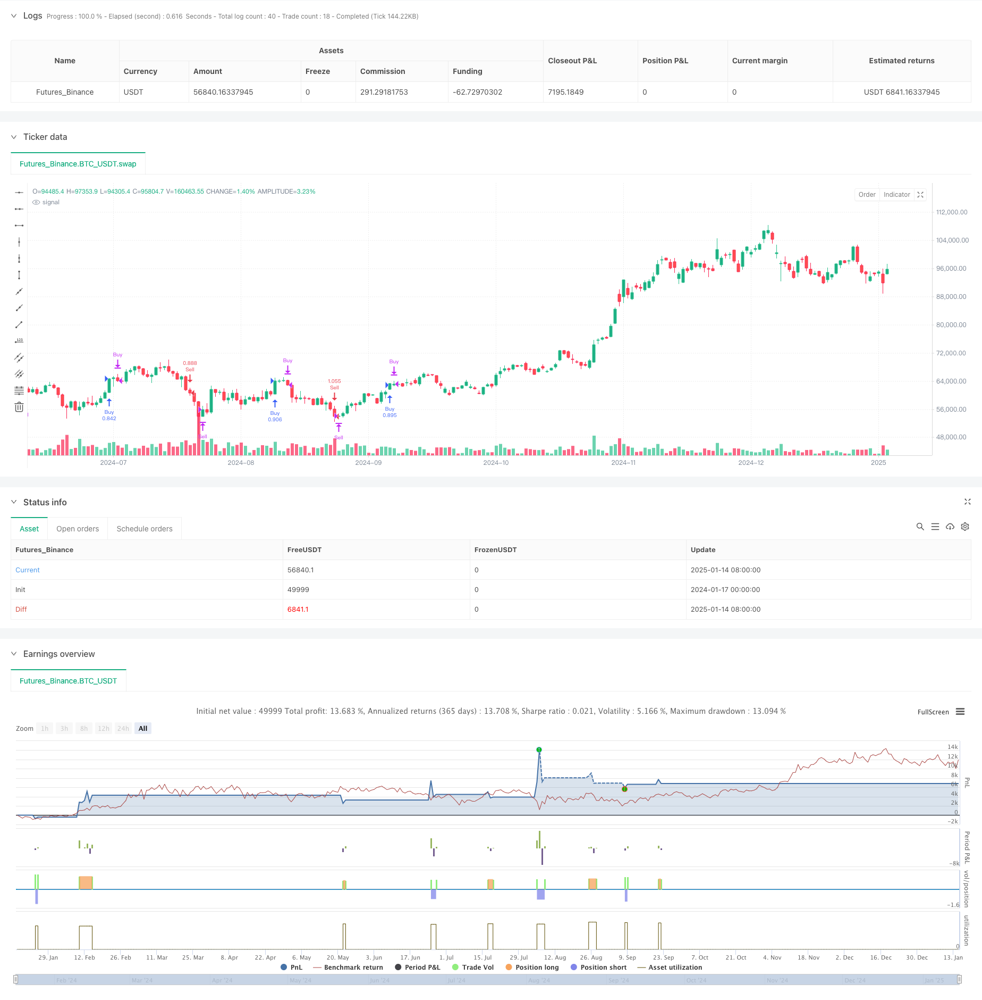

> Name

Dynamic trend tracking and moving average-assisted SuperTrend triple optimization strategy-Dynamic-Trend-Following-SuperTrend-Triple-Enhancement-Strategy
> Author

ChaoZhang

> Strategy Description



[trans]
#### Overview
This is a trend following strategy based on the SuperTrend indicator, Exponential Moving Average (EMA) and Average True Range (ATR). This strategy achieves dynamic tracking and risk control of market trends through the use of multiple technical indicators, combined with initial stop loss and trailing stop loss. The core of the strategy is to capture changes in trend direction through the SuperTrend indicator, use EMA to confirm the trend, and set up a double stop-loss mechanism to protect profits.
#### Strategy Principle
Strategy operations are based on the following core components:
1. The SuperTrend indicator is used to identify changes in trend direction. The indicator is calculated based on an ATR period of 16 and a factor of 3.02.
2. The 49-period EMA is used as a trend filter to confirm the trend direction.
3. The initial stop loss is set to 50 points to provide basic protection for each transaction.
4. The trailing stop is activated after the profit reaches 70 points and dynamically tracks price changes.
When the direction of SuperTrend changes downward and the closing price is above the EMA, the system issues a long signal without opening a position. On the contrary, when the SuperTrend direction changes upward and the closing price is below the EMA, the system issues a short signal.
#### Strategic Advantages
1. Multiple confirmation mechanism: Through the combined use of SuperTrend and EMA, the impact of false signals is reduced
2. Perfect risk control: adopt a dual stop-loss mechanism, with both fixed stop-loss protection and dynamic trailing stop-loss
3. Flexible position management: The strategy defaults to 15% of the account's net value as the position ratio, which can be adjusted according to needs.
4. Strong trend adaptability: capable of adaptive adjustment in different market environments, especially suitable for volatile markets
5. Parameter optimizability: the main parameters can be optimized and adjusted according to different market characteristics
#### Strategy Risk
1. Volatile market risk: Frequent trading may occur in a sideways volatile market, resulting in continuous stop losses.
2. Slippage risk: In fast market conditions, the stop-loss execution price may deviate greatly from expectations.
3. Parameter sensitivity: The strategy effect is more sensitive to parameter settings. Different market environments may require adjusting parameters.
4. Trend turning risk: Stop loss is triggered only after a large retracement may occur at the turning point of the trend.
5. Fund management risk: Fixed-proportion position management may bring greater risks during violent fluctuations
#### Strategy optimization direction
1. Dynamic parameter adjustment: The parameters of SuperTrend and EMA can be automatically adjusted according to market volatility
2. Market environment filtering: increase the market environment judgment mechanism and stop trading in unsuitable market environments.
3. Stop loss optimization: dynamic stop loss settings based on ATR can be introduced to make the stop loss more adaptable to market fluctuations
4. Position management optimization: Develop a dynamic position management system based on volatility
5. Increase profit targets: Set dynamic profit targets based on market fluctuations
#### Summary
This is a complete trading strategy that combines multiple technical indicators and risk control mechanisms. Capture the trend through the SuperTrend indicator, confirm the direction with EMA, and cooperate with the double stop-loss mechanism to achieve a better risk-return ratio. The optimization space of the strategy mainly lies in the dynamic adjustment of parameters, judgment of the market environment and the improvement of the risk management system. In practical applications, it is recommended to conduct sufficient historical data backtesting and adjust parameters according to the characteristics of specific trading varieties. ||
#### Overview
This is a trend following strategy based on SuperTrend indicator, Exponential Moving Average (EMA) and Average True Range (ATR). The strategy achieves dynamic trend tracking and risk control through the combination of multiple technical indicators, initial stop loss and trailing stop loss. The core of the strategy lies in capturing trend direction changes using the SuperTrend indicator, while using EMA for trend confirmation and setting up dual stop loss mechanisms to protect profits.

#### Strategy Principles
The strategy operates based on the following core components:
1. SuperTrend indicator for identifying trend direction changes, calculated with ATR period of 16 and factor of 3.02
2. 49-period EMA as trend filter for confirming trend direction
3. Initial stop loss set at 50 points providing basic protection for each trade
4. Trailing stop loss activates after 70 points profit, dynamically tracking price changes

The system generates long signals when SuperTrend direction turns downward and closing price is above EMA, provided there's no existing position. Conversely, short signals are generated when SuperTrend direction turns upward and closing price is below EMA.

#### Strategy Advantages
1. Multiple confirmation mechanism: Reduces false signals through combined use of SuperTrend and EMA
2. Comprehensive risk control: Employs dual stop loss mechanism with both fixed and dynamic trailing stops
3. Flexible position management: Strategy defaults to 15% of equity as position size, adjustable as needed
4. Strong trend adaptability: Can self-adjust in different market environments, especially suitable for volatile markets
5. Parameter optimization potential: All major parameters can be optimized for different market characteristics

#### Strategy Risks
1. Choppy market risk: May result in frequent trades and consecutive stops in sideways markets
2. Slippage risk: Stop loss execution prices may significantly deviate from expected in fast markets
3. Parameter sensitivity: Strategy effectiveness is sensitive to parameter settings, may need adjustment in different market environments
4. Trend reversal risk: May experience significant drawdowns before stops are triggered at trend reversal points
5. Money management risk: Fixed proportion position sizing may bring substantial risks during extreme volatility

#### Strategy Optimization Directions
1. Dynamic parameter adjustment: Automatically adjust SuperTrend and EMA parameters based on market volatility
2. Market environment filtering: Add market environment assessment mechanism to stop trading in unsuitable conditions
3. Stop loss optimization: Introduce ATR-based dynamic stop loss settings to better adapt to market volatility
4. Position management optimization: Develop volatility-based dynamic position sizing system
5. Add profit targets: Set dynamic profit targets based on market volatility

#### Summary
This is a complete trading strategy combining multiple technical indicators and risk control mechanisms. It achieves a favorable risk-reward ratio through trend capture with SuperTrend indicator, direction confirmation with EMA, coupled with dual stop loss mechanisms. The strategy's optimization potential mainly lies in dynamic parameter adjustment, market environment assessment, and risk management system enhancement. In practical application, it is recommended to conduct thorough historical data backtesting and adjust parameters according to specific trading instrument characteristics.[/trans]


> Source (PineScript)

``` pinescript
/*backtest
start: 2024-01-17 00:00:00
end: 2025-01-15 08:00:00
period: 1d
basePeriod: 1d
exchanges: [{"eid":"Futures_Binance","currency":"BTC_USDT","balance":49999}]
*/

//@version=5
strategy(" nifty supertrend triton", overlay=true, default_qty_type=strategy.percent_of_equity, default_qty_value=100)

// Input parameters
atrPeriod = input.int(16, "ATR Length", step=1)
factor = input.float(3.02, "Factor", step=0.01)
maPeriod = input.int(49, "Moving Average Period", step=1)
trailPoints = input.int(70, "Trailing Points", step=1)  // Points after which trailing stop activates
initialStopLossPoints = input.int(50, "Initial Stop Loss Points", step=1)  // Initial stop loss of 50 points

// Calculate Supertrend
[_, direction] = ta.supertrend(factor, atrPeriod)

// Calculate EMA
ema = ta.ema(close, maPeriod)

// Variables to track stop loss levels
var float trailStop = na
var float entryPrice = na
var float initialStopLoss = na  // To track the initial stop loss

// Generate buy and sell signals
if ta.change(direction) < 0 and close > ema
    if strategy.position_size == 0  // Only open a new long position if no current position
        strategy.entry("Buy", strategy.long)
        entryPrice := close  // Record the entry price for the long position
        initialStopLoss := entryPrice - initialStopLossPoints  // Set initial stop loss for long position
        trailStop := na  // Reset trailing stop for long

if ta.change(direction) > 0 and close < ema
    if strategy.position_size == 0  // Only open a new short position if no current position
        strategy.entry("Sell", strategy.short)
        entryPrice := close  // Record the entry price for the short position
        initialStopLoss := entryPrice + initialStopLossPoints  // Set initial stop loss for short position
        trailStop := na  // Reset trailing stop for short

// Apply initial stop loss for long positions
if (strategy.position_size > 0)  // Check if in a long position
    if close <= initialStopLoss  // If the price drops to or below the initial stop loss
        strategy.close("Buy", "Initial Stop Loss Hit")  // Exit the long position

// Apply trailing stop logic for long positions
if (strategy.position_size > 0)  // Check if in a long position
    if (close - entryPrice >= trailPoints)  // If the price has moved up by the threshold
        trailStop := na(trailStop) ? close - trailPoints : math.max(trailStop, close - trailPoints)  // Adjust trailing stop upwards
    if not na(trailStop) and close < trailStop  // If the price drops below the trailing stop
        strategy.close("Buy", "Trailing Stop Hit")  // Exit the long position

// Apply initial stop loss for short positions
if (strategy.position_size < 0)  // Check if in a short position
    if close >= initialStopLoss  // If the price rises to or above the initial stop loss
        strategy.close("Sell", "Initial Stop Loss Hit")  // Exit the short position

// Apply trailing stop logic for short positions
if (strategy.position_size < 0)  // Check if in a short position
    if (entryPrice - close >= trailPoints)  // If the price has moved down by the threshold
        trailStop := na(trailStop) ? close + trailPoints : math.min(trailStop, close + trailPoints)  // Adjust trailing stop downwards
    if not na(trailStop) and close > trailStop  // If the price rises above the trailing stop
        strategy.close("Sell", "Trailing Stop Hit")  // Exit the short position

```

> Detail

https://www.fmz.com/strategy/478694

> Last Modified

2025-01-17 14:37:39
