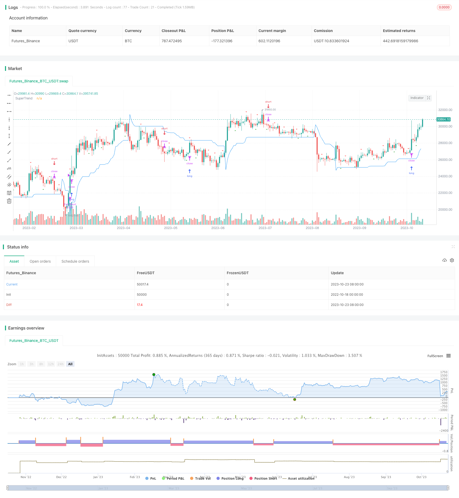

> Name

SuperTrend-Enhanced-Pivot-Reversal-Strategy
> Author

ChaoZhang

> Strategy Description



[trans]


## Overview
The Supertrend Enhanced Pivot Reversal Strategy is a unique trading style that combines the accuracy of pivot reversal points with the trend following capabilities of a Supertrend indicator. This strategy is designed to provide traders with clear entry and exit signals while using supertrend indicators to filter out possible false signals.
Unlike the traditional pivot reversal strategy, this strategy uses the supertrend indicator as a filter. This means that it only takes trading signals that are consistent with the overall trend, while the overtrend indicator determines the direction of the overall trend. This can help reduce the number of false signals and improve the overall profitability of the strategy.
The Enhanced Pivot Reversal strategy is particularly suitable for cryptocurrency markets, which are characterized by high volatility. This means that prices can change dramatically in a very short period of time, so profits can be made quickly. This strategy uses pivot points to capture these rapid price changes and identify potential reversal points.
## Strategy Principle
This strategy works by identifying pivot reversal points, which are points on the price chart where price may reverse. These points are identified using a combination of the ta.pivothigh and ta.pivotlow functions, which find the highest and lowest points in the price chart over a certain period.
Once the pivot reversal point is identified, the strategy checks the direction of the supertrend indicator. This strategy will only trade long if the supertrend is positive (indicating an uptrend). If the supertrend is negative (indicating a downtrend), the strategy will only take short trades.
The strategy also includes a stop-loss level, which is set as a percentage of the entry price. This helps limit potential losses if the price moves in the opposite direction to the trade.
The trading direction parameter can be set to "Long", "Short" or "Both". This allows traders to choose whether to only trade long (buy low, sell high), only trade short (sell high, buy low), or both. This is useful for both a trader's market view and risk tolerance.
When using this strategy, simply enter the required parameters into the script and apply it to the price chart of the asset you want to trade. The strategy will then identify potential entry and exit points and display them on the price chart.
The default settings for this policy are as follows:
- ATR length: 5
- Factor:2.618
- Transaction direction: two-way
- Stop loss level: 20%
- Handling fee: 0.1%
- Slippage: 1
- Currency: USD
- Per transaction: 10% of account equity
- Initial capital: USD 10,000
These settings can be adjusted based on the trader's preferences and risk tolerance. Always test any setting changes using historical data before applying them to live trading.
## Advantage Analysis
The biggest advantage of this strategy is that it combines the accuracy of the pivot reversal strategy with the trend filtering capabilities of the supertrend indicator.
The pivot reversal strategy can identify key areas of support and resistance and capture quick breakouts. The super trend indicator can filter out most false breakthroughs and only enter the market when the real trend reverses. This combination filters out a lot of noise and can significantly improve the winning rate and profitability of the strategy.
Another advantage is that the strategy is highly adaptable and can be adapted to different market environments by adjusting parameter configurations. For example, you can adjust the ATR cycle parameters to adapt to markets with different volatility, adjust the stop loss level to control risks, and adjust the trading direction to limit only long or short positions.
Adding super-trend as a filtering indicator also makes the strategy perform better in trending markets. Super-trend indicators can accurately determine the trend direction and avoid being trapped in volatile market conditions.
## Risk Analysis
The biggest risk of this strategy is that a false breakthrough may occur at the pivot reversal point, that is, the price breaks through the key point and then pulls back soon. At this time, if the strategy enters the market immediately, it may be trapped. Therefore, it is particularly important to set a reasonable stop loss level.
Another risk is a failed trend reversal. Sometimes prices continue to trend after breaking through the pivot point, rather than reversing the trend. At this time, the super trend indicator can play a filtering role to avoid wrong entries. But in a strong trend market, this risk still exists.
There are pros and cons to adding supertrend as a filtering indicator. When the super trend judgment is wrong, real reversal opportunities may also be missed. This requires adjusting parameters to suit different market conditions.
Overall, risks can be effectively controlled by appropriately adjusting stop loss points, rationally allocating capital usage ratios, and timely adjusting strategy parameters.
## Optimization direction
This strategy can be optimized from the following aspects:
1. Add multiple time period judgments and perform multi-timeline verification to avoid being trapped.
2. Increase the judgment of volume energy indicators, such as a sudden increase in trading volume, to confirm breakthroughs.
3. Optimize the stop loss mechanism, such as moving the stop loss with the price, increasing the stop loss range after making profits, etc.
4. Add machine learning components so that the strategy can adapt to different market environments. For example, automatically optimize parameters, dynamically adjust stop losses, etc.
5. Add cross-time trading, that is, enter the market in one time period and stop loss or take profit in another time period.
6. Test different filtering indicators to find more suitable indicators to replace the super trend and improve the strategy effect.
7. Combination optimization and combination with other non-correlated strategies can reduce correlation and improve stability.
Through the above optimization points, the performance of the strategy can be significantly improved. Make it more adaptable to complex and changing market environments and obtain better returns.
## Summarize
The Supertrend Enhanced Pivot Reversal Strategy is a highly effective trading strategy. It combines the high accuracy of pivot points with the powerful trend tracking capabilities of super trend indicators to filter out noise and increase the success rate. This strategy can adapt to different market environments by adjusting parameters and has strong adaptability. At the same time, there are certain risks, which need to be controlled by appropriately allocating the capital usage ratio and stop loss level. Through multi-faceted optimization, the stability and rate of return of this strategy can be further enhanced. Overall, this strategy provides traders with a powerful technical analysis tool to gain additional trading advantages.
||


## Overview

The SuperTrend Enhanced Pivot Reversal is a unique trading approach that combines the precision of pivot reversal points and the trend-following power of the SuperTrend indicator. This strategy aims to provide clear entry and exit signals for traders while using the SuperTrend indicator to filter out potentially false signals.

Unlike traditional pivot reversal strategies, this approach utilizes the SuperTrend indicator as a filter. This means it only takes trades that align with the overall trend, as determined by the SuperTrend indicator. This can help reduce false signals and improve the overall profitability of the strategy.

The Enhanced Pivot Reversal Strategy is particularly well-suited for the cryptocurrency market due to the high volatility. This allows for rapid price changes in short periods, making it possible to profit quickly. The strategy's use of pivot points enables capturing these swift price movements by identifying potential reversal points.

## Strategy Logic

The strategy works by identifying pivot reversal points, which are points on the price chart where the price is likely to reverse. These points are identified using a combination of the ta.pivothigh and ta.pivotlow functions to locate the highest and lowest price points over a given period.

Once a pivot reversal point is identified, the strategy checks the direction of the SuperTrend indicator. If the SuperTrend is positive (indicating an uptrend), the strategy will only take long trades. If the SuperTrend is negative (indicating a downtrend), it will only take short trades. 

The strategy also incorporates a stop loss level, set as a percentage of the entry price, to limit potential losses if the price moves against the trade.

The trade direction can be set to "Long", "Short" or "Both", allowing the trader to take only long, short or both long and short trades depending on their market view and risk appetite.

## Advantages 

The main advantage of this strategy is combining the precision of pivot reversal strategies with the trend filtering capacity of the SuperTrend indicator.

The pivot reversal approach identifies key support and resistance levels and captures quick breakouts. The SuperTrend filters out many false breakouts and only enters on genuine trend reversals. This combination eliminates noise and can significantly improve win rate and profitability.

Another advantage is the adaptability of the strategy. The parameters can be adjusted to suit different market conditions. For example, the ATR period can be tuned for varying volatility, stop loss tweaked to control risk, and trade direction limited to long or short only.

Adding the SuperTrend filter also improves performance in trending markets. It accurately determines trend direction, avoiding whipsaws in ranging markets.

## Risks

The main risk is that pivot reversal points may have false breakouts, where the price quickly reverts after breaking key levels. Entering trades immediately may lead to being stopped out. Appropriate stop loss levels are crucial.

Another risk is trend reversal failure. Sometimes prices continue the trend after breaking pivot points, rather than reversing. The SuperTrend filter mitigates this but the risk remains in strong trending markets.

Using SuperTrend as a filter has pros and cons. Incorrect SuperTrend signals could lead to missing valid reversals. Parameters may need adjustment for different market conditions.  

Overall, appropriate stop loss levels, position sizing, and dynamic parameter tuning can effectively control risks.

## Enhancement Opportunities 

The strategy can be improved by:

1. Adding multi-timeframe analysis to avoid whipsaws.

2. Incorporating volume indicators to confirm breakouts.

3. Optimizing stop loss mechanisms like trailing stops and increased post-profit stops.

4. Adding machine learning for adaptive capability, like auto-parameter tuning and dynamic stops.

5. Implementing inter-timeframe trading with separate entry and stop/target timeframes.

6. Testing alternate filter indicators to potentially improve performance over SuperTrend.

7. Portfolio optimization via combining with low-correlation strategies to improve stability.

These enhancements can significantly improve performance, making the strategy more robust across diverse market environments and producing superior returns.

## Conclusion

The SuperTrend Enhanced Pivot Reversal Strategy is a highly effective approach. It combines the precision of pivot points and the strong trend-following of SuperTrend to filter noise and boost probability of success. The adaptable parameters suit various market conditions. Risks exist but can be controlled via appropriate position sizing and stops. Further optimizations can enhance stability and returns. Overall, it provides traders with a powerful technical analysis tool for added trading edge.

[/trans]

> Strategy Arguments


|Argument|Default|Description|
|----|----|----|
|v_input_1|6|leftBars|
|v_input_2|3|rightBars|
|v_input_3|5|ATR Length|
|v_input_float_1|2.618|Factor|
|v_input_string_1|0|Trade Direction: Both|Short|Long|
|v_input_4|20|Stop Loss Level (%)|


> Source (PineScript)

``` pinescript
/*backtest
start: 2022-10-18 00:00:00
end: 2023-10-24 00:00:00
period: 1d
basePeriod: 1h
exchanges: [{"eid":"Futures_Binance","currency":"BTC_USDT"}]
*/

// This source code is subject to the terms of the Mozilla Public License 2.0 at https://mozilla.org/MPL/2.0/
// © PresentTrading

//@version=5
strategy("SuperTrend Enhanced Pivot Reversal - Strategy [PresentTrading]", overlay=true, precision=3, default_qty_type=strategy.cash, 
 commission_value= 0.1, commission_type=strategy.commission.percent, slippage= 1, 
  currency=currency.USD, default_qty_type = strategy.percent_of_equity, default_qty_value = 10, initial_capital= 10000)

// Pivot Reversal parameters
leftBars = input(6)
rightBars = input(3)
swh = ta.pivothigh(leftBars, rightBars)
swl = ta.pivotlow(leftBars, rightBars)

// SuperTrend parameters
atrPeriod = input(5, "ATR Length")
factor = input.float(2.618, "Factor", step = 0.01)

[superTrend, direction] = ta.supertrend(factor, atrPeriod)

// Plot the SuperTrend
plot(superTrend, title="SuperTrend", color=color.blue)


// Trade Direction parameter
tradeDirection = input.string(title="Trade Direction", defval="Both", options=["Long", "Short", "Both"])

// Stop Loss Level (in %)
stopLossLevel = input(20, title="Stop Loss Level (%)")

// Convert the stop loss level to a price difference
stopLossPrice = stopLossLevel / 100


// Long entry
swh_cond = not na(swh)
hprice = 0.0
hprice := swh_cond ? swh : hprice[1]
le = false
le := swh_cond ? true : (le[1] and high > hprice ? false : le[1])
if (le and direction > 0 and (tradeDirection == "Long" or tradeDirection == "Both"))
    strategy.entry("PivRevLE", strategy.long, comment="PivRevLE", stop=hprice + syminfo.mintick)
    strategy.exit("Exit Long", "PivRevLE", stop = hprice * (1 - stopLossPrice))

// Short entry
swl_cond = not na(swl)
lprice = 0.0
lprice := swl_cond ? swl : lprice[1]
se = false
se := swl_cond ? true : (se[1] and low < lprice ? false : se[1])
if (se and direction < 0 and (tradeDirection == "Short" or tradeDirection == "Both"))
    strategy.entry("PivRevSE", strategy.short, comment="PivRevSE", stop=lprice - syminfo.mintick)
    strategy.exit("Exit Short", "PivRevSE", stop = lprice * (1 + stopLossPrice))


// Closing positions when the tradeDirection is one-sided or when SuperTrend direction changes
if ((tradeDirection == "Long" and se and direction < 0) or (tradeDirection == "Long" and direction < 0))
    strategy.close("PivRevLE")
if ((tradeDirection == "Short" and le and direction > 0) or (tradeDirection == "Short" and direction > 0))
    strategy.close("PivRevSE")

// Plot pivot highs and lows
plotshape(swh_cond, title="Pivot Highs", location=location.belowbar, color=color.green, style=shape.triangleup)
plotshape(swl_cond, title="Pivot Lows", location=location.abovebar, color=color.red, style=shape.triangledown)

// Closing positions when the tradeDirection is one-sided
if (tradeDirection == "Long" and se and direction < 0)
    strategy.close("PivRevLE")
if (tradeDirection == "Short" and le and direction > 0)
    strategy.close("PivRevSE")


```

> Detail

https://www.fmz.com/strategy/430119

> Last Modified

2023-10-25 11:15:40
