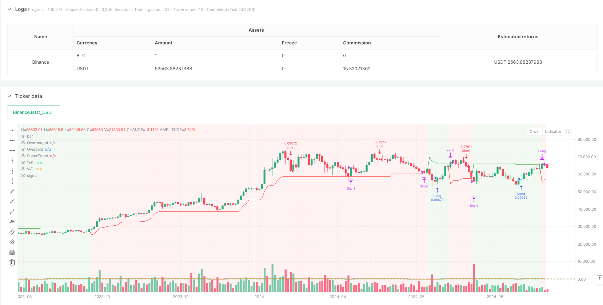
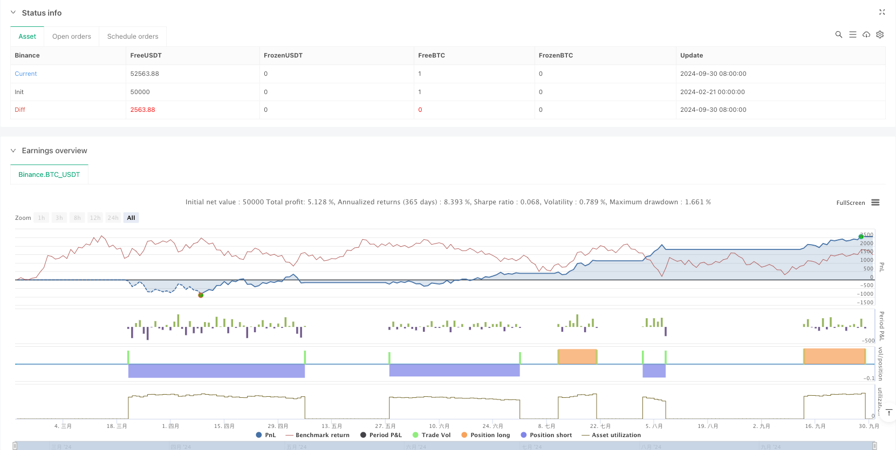

> Name

Momentum-Trend-Following-SuperTrend-and-Stochastic-Crossover-Strategy
> Author

ianzeng123

> Strategy Description





[trans]
#### Overview
This strategy is a trend following trading system that combines the SuperTrend indicator and the Stochastic Oscillator. This strategy identifies the market trend direction through the SuperTrend indicator, while using the overbought and oversold signals of the stochastic indicator as confirmation signals for trades. The strategy uses the momentum crossover method to find the best entry and exit opportunities in the direction of the trend, achieving the perfect combination of trend tracking and momentum analysis.
#### Strategy Principle
The core logic of the strategy is based on the cooperation of two main indicators:
1. SuperTrend indicator: calculated based on ATR (average true volatility) and used to determine market trends. When the indicator line changes from red to green, it indicates an upward trend, and when it changes from green to red, it indicates a downward trend. The indicator parameters adopt an ATR period of 10 and a multiplier factor of 3.0.
2. Stochastic indicator: used to identify overbought and oversold conditions in the market. Using the parameter settings of %K period of 14 and %D period of 3, the overbought level is 80 and the oversold level is 20.
The trading rules are as follows:
- Long conditions: SuperTrend shows an upward trend (green), and the stochastic %K line crosses the oversold level (20) from bottom to top
- Short selling conditions: SuperTrend shows a downward trend (red), and the stochastic %K line crosses the overbought level (80) from top to bottom
- Conditions for closing the long position: SuperTrend turns to a downtrend, or the stochastic %K line crosses the overbought level downwards
- Short closing conditions: SuperTrend turns to an upward trend, or the stochastic indicator %K line crosses the oversold level upwards
#### Strategic Advantages
1. Trend confirmation: Use the SuperTrend indicator to effectively identify the main market trend and reduce the risk of false breakthroughs
2. Momentum verification: Combined with the momentum signal of the stochastic indicator, it improves the accuracy and timeliness of transactions.
3. Risk control: Use overbought and oversold levels as a reference for stop loss and profit, providing a clear risk management framework
4. Visualization effect: The strategy provides an intuitive graphical interface, including changes in trend background color and indicator lines, making it easier for traders to understand the market status.
5. Flexible parameters: all key parameters can be optimized and adjusted according to different market characteristics
#### Strategy Risk
1. Risk of volatile market: During the sideways trading phase, frequent false signals may be generated, leading to over-trading.
2. Lagging risk: Both SuperTrend and stochastic indicators have a certain lag, and may miss the best entry opportunity.
3. Parameter sensitivity: Different parameter settings may lead to significantly different trading results and need to be fully tested.
4. Market environment dependence: The strategy performs better in strong trending markets, but may perform poorly in violently volatile markets.
5. Signal conflict: Two indicators may produce conflicting signals, and clear priority rules need to be established.
#### Strategy optimization direction
1. Introducing a volatility filter: ATR threshold judgment can be added to suspend trading when the volatility is too high.
2. Optimize the signal confirmation mechanism: consider adding auxiliary indicators such as moving averages to improve signal reliability
3. Improve the stop loss mechanism: It is recommended to add a trailing stop loss function to better protect the profits earned.
4. Add time filtering: you can adjust strategy parameters or suspend trading according to market characteristics in different time periods
5. Develop adaptive parameters: Design an adaptive parameter mechanism to dynamically adjust strategy parameters according to market conditions.
#### Summary
This strategy builds a relatively complete trading system by combining trend tracking and momentum analysis. It not only provides clear entry and exit signals, but also includes a framework for risk management and parameter optimization. Although there are some inherent risks, the stability and adaptability of the strategy can be further improved through the optimization suggestions provided. Suitable for traders who want to take advantage of trending markets. ||
#### Overview
This strategy is a trend-following trading system that combines the SuperTrend indicator with the Stochastic Oscillator. It identifies market trend direction using the SuperTrend indicator while utilizing the Stochastic Oscillator's overbought and oversold signals as confirmation. The strategy employs momentum crossover methods to find optimal entry and exit points in the trend direction, achieving a perfect blend of trend following and momentum analysis.

#### Strategy Principles
The core logic is based on the coordination of two main indicators:
1. SuperTrend Indicator: Calculated based on ATR (Average True Range), used to determine market trends. A change from red to green indicates an uptrend, while green to red indicates a downtrend. The indicator parameters use an ATR period of 10 and a multiplier factor of 3.0.
2. Stochastic Oscillator: Used to identify market overbought and oversold conditions. Uses %K period of 14, %D period of 3, with overbought level at 80 and oversold level at 20.

Trading rules are as follows:
- Long Entry: SuperTrend shows uptrend (green), and Stochastic %K line crosses above the oversold level (20)
- Short Entry: SuperTrend shows downtrend (red), and Stochastic %K line crosses below the overbought level (80)
- Long Exit: SuperTrend turns to downtrend, or Stochastic %K line crosses below overbought level
- Short Exit: SuperTrend turns to uptrend, or Stochastic %K line crosses above oversold level

#### Strategy Advantages
1. Trend Confirmation: Effectively identifies market main trends through SuperTrend indicator, reducing false breakout risks
2. Momentum Verification: Combines momentum signals from Stochastic indicator, improving trade accuracy and timeliness
3. Risk Control: Uses overbought and oversold levels as reference for stop-loss and take-profit, providing a clear risk management framework
4. Visualization: Strategy provides intuitive graphical interface, including trend background colors and indicator line changes, facilitating market state understanding
5. Parameter Flexibility: All key parameters can be optimized and adjusted according to different market characteristics

#### Strategy Risks
1. Consolidation Market Risk: May generate frequent false signals during sideways consolidation, leading to overtrading
2. Lag Risk: Both SuperTrend and Stochastic indicators have inherent lag, potentially missing optimal entry points
3. Parameter Sensitivity: Different parameter settings may lead to significantly different trading results, requiring thorough testing
4. Market Environment Dependency: Strategy performs well in strong trend markets but may underperform in highly volatile markets
5. Signal Conflict: The two indicators may produce contradictory signals, requiring clear priority rules

#### Strategy Optimization Directions
1. Introduce Volatility Filter: Can add ATR threshold judgment to pause trading during high volatility
2. Optimize Signal Confirmation: Consider adding moving averages or other auxiliary indicators to improve signal reliability
3. Improve Stop-Loss Mechanism: Recommend adding trailing stop-loss functionality to better protect profits
4. Add Time Filtering: Adjust strategy parameters or pause trading based on different time period market characteristics
5. Develop Adaptive Parameters: Design adaptive parameter mechanisms to dynamically adjust strategy parameters based on market conditions

#### Summary
This strategy builds a relatively complete trading system by combining trend following and momentum analysis. It not only provides clear entry and exit signals but also includes frameworks for risk management and parameter optimization. While there are some inherent risks, the stability and adaptability of the strategy can be further enhanced through the provided optimization suggestions. It is suitable for traders who wish to capture opportunities in trending markets.[/trans]


> Source (PineScript)

``` pinescript
/*backtest
start: 2024-02-21 00:00:00
end: 2024-10-01 00:00:00
period: 2d
basePeriod: 2d
exchanges: [{"eid":"Binance","currency":"BTC_USDT"}]
*/

//@version=5
strategy("SuperTrend + Stochastic Strategy", overlay=true, default_qty_type=strategy.percent_of_equity, default_qty_value=10)

// SuperTrend Settings
superTrendFactor = input.float(3.0, title="SuperTrend Factor", step=0.1)
superTrendATRLength = input.int(10, title="SuperTrend ATR Length")

// Calculate SuperTrend
[superTrend, direction] = ta.supertrend(superTrendFactor, superTrendATRLength)

// Plot SuperTrend
plot(superTrend, color=direction == 1 ? color.green : color.red, title="SuperTrend")
bgcolor(direction == 1 ? color.new(color.green, 90) : color.new(color.red, 90), transp=90)

// Stochastic Settings
stochKLength = input.int(14, title="Stochastic %K Length")
stochDLength = input.int(3, title="Stochastic %D Length")
stochSmoothK = input.int(3, title="Stochastic %K Smoothing")
stochOverbought = input.int(80, title="Stochastic Overbought Level")
stochOversold = input.int(20, title="Stochastic Oversold Level")

// Calculate Stochastic
k = ta.sma(ta.stoch(close, high, low, stochKLength), stochSmoothK)
d = ta.sma(k, stochDLength)

// Plot Stochastic in separate pane
hline(stochOverbought, "Overbought", color=color.red)
hline(stochOversold, "Oversold", color=color.green)
plot(k, color=color.blue, title="%K", linewidth=2)
plot(d, color=color.orange, title="%D", linewidth=2)

// Long Condition: SuperTrend is up and Stochastic %K crosses above oversold
longCondition = direction == 1 and ta.crossover(k, stochOversold)
if (longCondition)
    strategy.entry("Long", strategy.long)

// Short Condition: SuperTrend is down and Stochastic %K crosses below overbought
shortCondition = direction == -1 and ta.crossunder(k, stochOverbought)
if (shortCondition)
    strategy.entry("Short", strategy.short)

// Exit Long: SuperTrend turns down or Stochastic %K crosses below overbought
exitLong = direction == -1 or ta.crossunder(k, stochOverbought)
if (exitLong)
    strategy.close("Long")

// Exit Short: SuperTrend turns up or Stochastic %K crosses above oversold
exitShort = direction == 1 or ta.crossover(k, stochOversold)
if (exitShort)
    strategy.close("Short")

```

> Detail

https://www.fmz.com/strategy/482805

> Last Modified

2025-02-20 14:55:49
