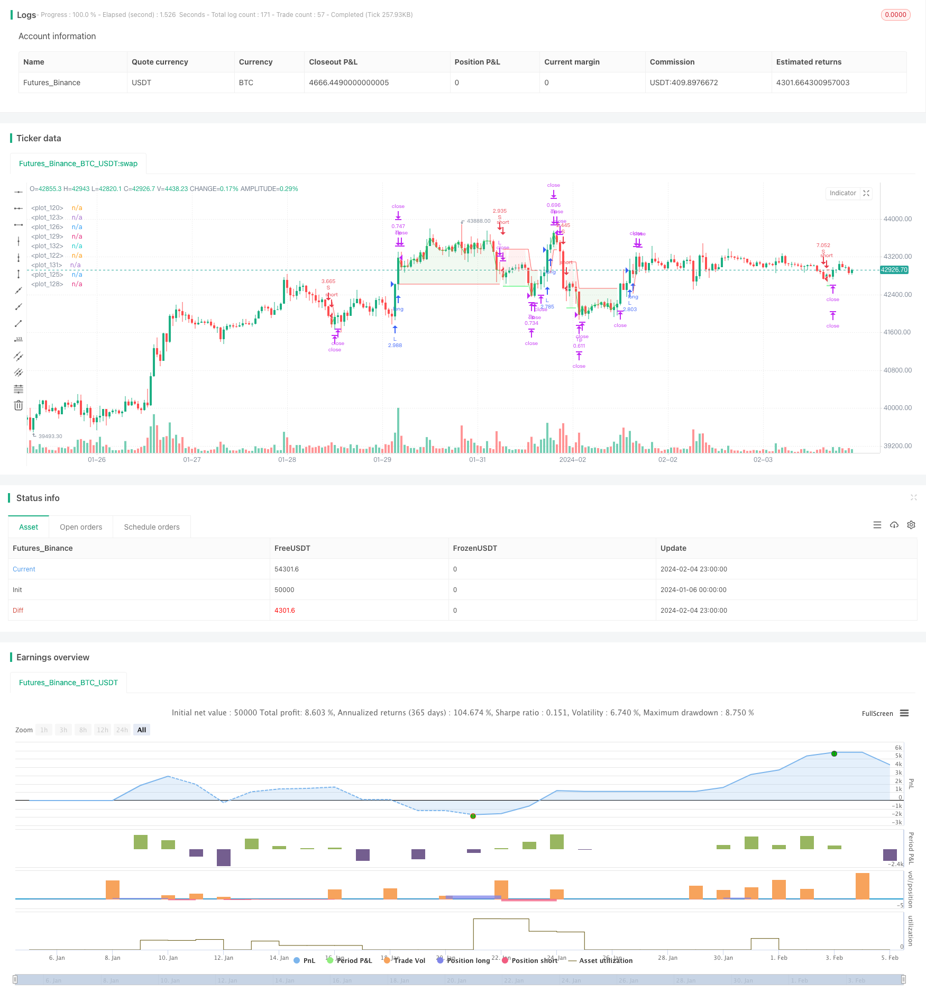

> Name

SuperTrend-Quantitative-Trading-Strategy-for-Bitcoin based on super trend
> Author

ChaoZhang

> Strategy Description


[trans]

## Overview
This strategy is an automatic quantitative trading strategy for Bitcoin based on super trend indicators. It uses super trend indicators to judge market trends, combines the ATR stop loss principle to control risks, and realize long and short two-way trading. The biggest advantage of this strategy is that the risk and return ratio is good, the stop loss strategy is reliable, and it is suitable for medium and long-term holdings. This strategy can be used on the 4-hour level of mainstream exchanges such as Coinbase Pro.
## Strategy Principle
This strategy uses the Super Trend indicator to determine the direction of the market trend. When the supertrend indicator changes from a downward trend to an upward trend, enter the market with a long position; when the supertrend indicator changes from an upward trend to a downward trend, enter the market with a short position.
Specifically, this strategy first calculates the length of the ATR indicator as 14 periods, and determines the stop loss distance of each order by multiplying it by an ATR stop loss multiple (such as 1.5 times). Then the super trend indicator is calculated, and the indicator parameters adopt the default values ​​(ATR period 9, super trend coefficient 2.5). A trading signal is issued when the Super Trend indicator changes direction.
After entering the market, the stop loss position is fixed above or below the ATR stop loss. The first take-profit level is calculated based on the risk-reward ratio, and the default is 0.75, that is, the take-profit distance is 0.75 times the stop-loss distance. When the price reaches the first take-profit level, close 50% of the position and move the stop-loss to the opening price (add the position after making a profit), so that the position can be profit-locked. The second take-profit distance continues to be calculated based on the risk-reward ratio of 0.75. If the price triggers stop loss, all remaining positions will be stopped and exited.
In this way, this strategy can ensure profits through partial take-profit on the premise of ensuring that the stop-loss risk is controllable, and is suitable for medium and long-term holding investment strategies.
## Advantage Analysis
The biggest advantage of this strategy is that it has a good risk-return ratio and can be held in the medium to long term. Specific advantages include:
1. Use super trends to determine market trends, filter market noise, and avoid missing major trends.
2. ATR dynamically tracks stop loss and reliably controls single losses.
3. Some stop-profit methods lock in profits and have a high risk-return ratio.
4. When the price reaches Take Profit 1, adjust the stop loss to the opening price to ensure profitability and enhance the stability of the strategy.
5. Super simple transaction logic, easy to understand and implement, and large space for parameter tuning.
6. It can be applied to intraday or high-frequency data of mainstream exchanges and has strong flexibility.
## Risk Analysis
This strategy also has certain risks, mainly concentrated in the following aspects:
1. Market emergencies cause gaps or shortfalls, making it impossible to stop losses and facing large losses. Risks can be reduced by reasonably adjusting the ATR stop loss multiple.
2. The super trend indicator fails to judge, resulting in incorrect trading signals. The combination of ATR and super trend parameters can be appropriately adjusted for optimization.
3. The partial closing ratio is set too high, and sufficient trend profits cannot be obtained. The partial liquidation ratio should be adjusted according to different markets.
4. Transaction frequency may be too high or too low. Supertrend parameters should be adjusted to find the best balance.
## Optimization direction
There is still a lot of room for optimization of this strategy, which mainly focuses on the following aspects:
1. Try different ATR stop loss methods, such as standard ATR, momentum stop loss, Bollinger Band stop loss, etc. to optimize the stop loss strategy.
2. Test the super trend indicator with different parameters and find the optimal parameter combination. Multidimensional parameter optimization can be performed using stepwise optimization or genetic algorithms.
3. Try to superimpose a second layer of stop loss indicators, such as Donchian channel, on the stop loss to make the stop loss more reliable.
4. Test different partial closing ratios to find the optimal profit realization and risk balance. The partial liquidation ratio can also be adjusted dynamically.
5. Explore strategies such as dynamic stop loss and dynamic position adjustment based on machine learning.
## Summarize
This strategy is a quantitative strategy based on super trend judgment, ATR dynamic stop loss, and partial profit stop. It has a good risk-return balance and is suitable for automated trading. This strategy can significantly optimize super parameters, stop loss methods, profit methods, etc. It is a quantitative strategy worthy of long-term tuning and application.
||

## Overview

This is an automated quantitative trading strategy for Bitcoin based on the SuperTrend indicator. It uses the SuperTrend indicator to determine market trends and combines the ATR stop loss principle to control risks, enabling long and short trading. The biggest advantage of this strategy is good risk-reward ratio and reliable stop loss strategy, suitable for mid-to-long term holding. This strategy can be applied on mainstream exchanges like Coinbase Pro using 4-hour timeframe.

## Strategy Principle  

This strategy uses the SuperTrend indicator to determine the direction of market trends. It goes long when the SuperTrend indicator changes from a downtrend to an uptrend, and goes short when the SuperTrend indicator changes from an uptrend to a downtrend. 

Specifically, this strategy first calculates the ATR period as 14 bars, and determines the stop loss distance for each trade by multiplying it by a ATR stop loss multiplier (such as 1.5x). It then calculates the SuperTrend indicator using default parameters (ATR period = 9, SuperTrend multiplier = 2.5). Trading signals are generated when the SuperTrend indicator changes direction.

After entering a trade, the stop loss is fixed above or below the ATR stop loss. The first take profit level is calculated based on a risk-reward ratio, default to 0.75, meaning the take profit distance is 0.75x of the stop loss distance. When price reaches the first take profit level, 50% of the position will be closed, and stop loss is moved to the entry price (break even) to lock in profits. The second take profit level continues to use a 0.75 risk-reward ratio. If price hits stop loss, the remaining position will be closed by stop loss.

By doing so, this strategy ensures controllable stop loss risk while locking in profits through partial take profits, suitable for mid-to-long term investment strategies.

## Advantage Analysis

The biggest advantage of this strategy is good risk-reward ratio, allowing mid-to-long term holding. Specific advantages include:

1. Using SuperTrend to determine market trends, filtering market noise and catching major trends.

2. Dynamic ATR tracking of stop loss, reliably controlling single trade loss. 

3. Partial take profit locks in profit, resulting in high risk-reward ratio.

4. Moving stop loss to entry price after hitting TP1 locks in profit and enhances strategy stability.

5. Extremely simple logic, easy to understand and implement, with large parameter tuning space.

6. Applicable on mainstream exchanges using intraday or high frequency data, high flexibility.

## Risk Analysis

This strategy also carries some risks, mainly in the following areas:

1. Gap risk failing to trigger stop loss, facing large loss. Can tweak ATR stop loss multiplier to reduce risk.

2. SuperTrend fails to determine right trend, resulting in wrong trade signals. Can optimize parameters.  

3. Take profit ratio too high, unable to ride the trend. Should adjust based on different markets.

4. Trade frequency may be too high or too low. Should find optimal balance by adjusting SuperTrend parameters.

## Optimization Directions

There is still large room for optimizing this strategy, mainly in below areas:

1. Test different ATR stop loss methods like fixed ATR, momentum stop, Bollinger stop loss etc.

2. Optimize SuperTrend parameters using walk forward or genetic algorithms for best parameters.  

3. Adding a second layer of stop loss like Donchian Channels to make stop more reliable.

4. Test different take profit ratios for optimal profit taking vs. risk balancing. Make it dynamic.

5. Explore machine learning techniques for dynamic stop loss, position adjustment etc.

## Conclusion

This is a quantitative strategy based on SuperTrend for trend, ATR dynamic stop and partial take profit. It has balanced risk-reward ratio, suitable for algo trading. There is ample room to optimize parameters, stop loss, profit taking etc. It's worth long term tuning and application.

[/trans]

> Strategy Arguments


|Argument|Default|Description|
|----|----|----|
|v_input_bool_1|false|Date background|
|v_input_3|9|ATR Length SuperTrend|
|v_input_float_1|2.5|Factor SuperTrend|
|v_input_1|timestamp(10 Feb 2014 13:30 +0000)|(?Time filter)Initial date|
|v_input_2|timestamp(01 Jan 2030 19:30 +0000)|Final date|
|v_input_bool_2|false|(?Appearance)Show supertrend ?|
|v_input_bool_3|false|Show Atr stop loss ?|
|v_input_bool_4|true|Draw position on chart ?|
|v_input_4_close|0|(?Atr stop loss)Source: close|high|low|open|hl2|hlc3|hlcc4|ohlc4|
|v_input_int_1|14|Period|
|v_input_float_2|1.5|Atr multiplier|
|v_input_float_3|2.5|(?Risk management for trades)% Account risk per trade|
|v_input_float_4|0.75|Risk/reward for breakeven long|
|v_input_float_5|0.75|Risk/reward for take profit long|
|v_input_float_6|0.75|Risk/reward for break even short|
|v_input_float_7|0.75|Risk/reward for take profit short|
|v_input_float_8|50|% of trade for first take profit|


> Source (PineScript)

``` pinescript
/*backtest
start: 2024-01-06 00:00:00
end: 2024-02-05 00:00:00
period: 1h
basePeriod: 15m
exchanges: [{"eid":"Futures_Binance","currency":"BTC_USDT"}]
*/

// This source code is subject to the terms of the Mozilla Public License 2.0 at https://mozilla.org/MPL/2.0/
// Developed by © StrategiesForEveryone
//@version=5

strategy("SuperTrend Strategy for BTCUSD 4H", overlay=true, process_orders_on_close = true, initial_capital = 100, default_qty_type = strategy.cash, precision = 2, slippage = 50, commission_value = 0.03, backtest_fill_limits_assumption = 50)

// ------ Date filter (obtained from ZenAndTheArtOfTrading) ---------

initial_date = input(title="Initial date", defval=timestamp("10 Feb 2014 13:30 +0000"), group="Time filter", tooltip="Enter the start date and time of the strategy")
final_date   = input(title="Final date", defval=timestamp("01 Jan 2030 19:30 +0000"), group="Time filter", tooltip="Enter the end date and time of the strategy")
dateFilter(int st, int et) => time >= st and time <= et
colorDate = input.bool(defval=false, title="Date background", tooltip = "Add color to the period of time of the strategy tester")
bgcolor(colorDate and dateFilter(initial_date, final_date) ? color.new(color.blue, transp=90) : na)

// ------------ Super Trend ----------

atrPeriod = input(9, "ATR Length SuperTrend")
factor = input.float(2.5, "Factor SuperTrend", step = 0.05)
[supertrend, direction] = ta.supertrend(factor, atrPeriod)
show_supertrend = input.bool(defval = false, title="Show supertrend ?", group = "Appearance")
bodyMiddle = plot(show_supertrend ? ((open + close) / 2) : na, display=display.none)
upTrend = plot(show_supertrend and direction < 0 ? supertrend : na, "Up Trend", color = color.green, style=plot.style_linebr)
downTrend = plot(show_supertrend and direction > 0 ? supertrend : na, "Down Trend", color = color.red, style=plot.style_linebr)
fill(bodyMiddle, upTrend, color.new(color.green, 90), fillgaps=false)
fill(bodyMiddle, downTrend, color.new(color.red, 90), fillgaps=false)

// ---------- Atr stop loss (obtained from garethyeo)

source_atr = input(close, title='Source', group = "Atr stop loss", inline = "A")
length_atr = input.int(14, minval=1, title='Period', group = "Atr stop loss" , inline = "A")
multiplier = input.float(1.5, minval=0.1, step=0.1, title='Atr multiplier', group = "Atr stop loss", inline = "A", tooltip = "Defines the stop loss distance based on the Atr stop loss indicator")
shortStopLoss = source_atr + ta.atr(length_atr) * multiplier
longStopLoss = source_atr - ta.atr(length_atr) * multiplier
show_atr_stoploss = input.bool(defval=false, title="Show Atr stop loss ?", group = "Appearance")
plot(show_atr_stoploss ? longStopLoss : na, color=color.white, style = plot.style_circles)
plot(show_atr_stoploss ? shortStopLoss : na, color=color.white, style = plot.style_circles)

// ------------- Money management --------------

strategy_contracts = strategy.equity / close
distance_sl_atr_long = -1 * (longStopLoss - close) / close
distance_sl_atr_short = (shortStopLoss - close) / close
risk = input.float(2.5, '% Account risk per trade', step=1, group = "Risk management for trades", tooltip = "Percentage of total account to risk per trade")
long_amount = strategy_contracts * (risk / 100) / distance_sl_atr_long
short_amount = strategy_contracts * (risk / 100) / distance_sl_atr_short

// ---------- Risk management ---------------

risk_reward_breakeven_long= input.float(title="Risk/reward for breakeven long", defval=0.75, step=0.05, group = "Risk management for trades")
risk_reward_take_profit_long= input.float(title="Risk/reward for take profit long", defval=0.75, step=0.05, group = "Risk management for trades")
risk_reward_breakeven_short= input.float(title="Risk/reward for break even short", defval=0.75, step=0.05, group = "Risk management for trades")
risk_reward_take_profit_short= input.float(title="Risk/reward for take profit short", defval=0.75, step=0.05, group = "Risk management for trades")
tp_percent=input.float(title="% of trade for first take profit", defval=50, step=5, group = "Risk management for trades", tooltip = "Closing percentage of the current position when the first take profit is reached.")

// ------------ Trade conditions ---------------

bought = strategy.position_size > 0
sold = strategy.position_size < 0
long_supertrend=ta.crossover(close, supertrend)
short_supertrend=ta.crossunder(close, supertrend)
var float sl_long = na
var float sl_short = na 
var float be_long = na
var float be_short = na
var float tp_long = na
var float tp_short = na
if not bought
    sl_long:=na
if not sold
    sl_short:=na

// ---------- Strategy -----------

// Long position 

if not bought and long_supertrend
    sl_long:=longStopLoss           
    long_stoploss_distance = close - longStopLoss
    be_long := close + long_stoploss_distance * risk_reward_breakeven_long
    tp_long:=close+(long_stoploss_distance*risk_reward_take_profit_long)
    strategy.entry('L', strategy.long, long_amount, alert_message = "Long")
    strategy.exit("Tp", "L", stop=sl_long, limit=tp_long, qty_percent=tp_percent)
    strategy.exit('Exit', 'L', stop=sl_long)
if high > be_long
    sl_long := strategy.position_avg_price
    strategy.exit("Tp", "L", stop=sl_long, limit=tp_long, qty_percent=tp_percent)
    strategy.exit('Exit', 'L', stop=sl_long)
if bought and short_supertrend
    strategy.close("L", comment="CL")

// Short position

if not sold and short_supertrend
    sl_short:=shortStopLoss
    short_stoploss_distance=shortStopLoss - close  
    be_short:=((short_stoploss_distance*risk_reward_breakeven_short)-close)*-1
    tp_short:=((short_stoploss_distance*risk_reward_take_profit_short)-close)*-1
    strategy.entry("S", strategy.short, short_amount, alert_message = "Short")
    strategy.exit("Tp", "S", stop=sl_short, limit=tp_short, qty_percent=tp_percent)
    strategy.exit("Exit", "S", stop=sl_short)
if low < be_short
    sl_short:=strategy.position_avg_price
    strategy.exit("Tp", "S", stop=sl_short, limit=tp_short, qty_percent=tp_percent)
    strategy.exit("Exit", "S", stop=sl_short)    
if sold and long_supertrend
    strategy.close("S", comment="CS") 

// ---------- Draw position on chart -------------

if high>tp_long
    tp_long:=na
if low<tp_short
    tp_short:=na
if high>be_long
    be_long:=na
if low<be_short
    be_short:=na

show_position_on_chart = input.bool(defval=true, title="Draw position on chart ?", group = "Appearance", tooltip = "Activate to graphically display profit, stop loss and break even")
position_price = plot(show_position_on_chart? strategy.position_avg_price : na, style=plot.style_linebr, color = color.new(#ffffff, 10), linewidth = 1)

sl_long_price = plot(show_position_on_chart and bought ? sl_long : na, style = plot.style_linebr, color = color.new(color.red, 10), linewidth = 1)
sl_short_price = plot(show_position_on_chart and sold ? sl_short : na, style = plot.style_linebr, color = color.new(color.red, 10), linewidth = 1)

tp_long_price = plot(strategy.position_size>0 and show_position_on_chart? tp_long : na, style = plot.style_linebr, color = color.new(#11eb47, 10), linewidth = 1)
tp_short_price = plot(strategy.position_size<0 and show_position_on_chart? tp_short : na, style = plot.style_linebr, color = color.new(#11eb47, 10), linewidth = 1)

breakeven_long = plot(strategy.position_size>0 and high<be_long and show_position_on_chart ? be_long : na , style = plot.style_linebr, color = color.new(#00ff40, 60), linewidth = 1)
breakeven_short = plot(strategy.position_size<0 and low>be_short and show_position_on_chart ? be_short : na , style = plot.style_linebr, color = color.new(#00ff40, 60), linewidth = 1)

position_profit_long = plot(bought and show_position_on_chart and strategy.openprofit>0 ? close : na, style = plot.style_linebr, color = color.new(#4cd350, 10), linewidth = 1)
position_profit_short = plot(sold and show_position_on_chart and strategy.openprofit>0 ? close : na, style = plot.style_linebr, color = color.new(#4cd350, 10), linewidth = 1)

fill(plot1 = position_price, plot2 = position_profit_long, color = color.new(color.green,90))
fill(plot1 = position_price, plot2 = position_profit_short, color = color.new(color.green,90))

fill(plot1 = position_price, plot2 = sl_long_price, color = color.new(color.red,90))
fill(plot1 = position_price, plot2 = sl_short_price, color = color.new(color.red,90))

fill(plot1 = position_price, plot2 = tp_long_price, color = color.new(color.green,90))
fill(plot1 = position_price, plot2 = tp_short_price, color = color.new(color.green,90))

```

> Detail

https://www.fmz.com/strategy/441162

> Last Modified

2024-02-06 12:09:09
