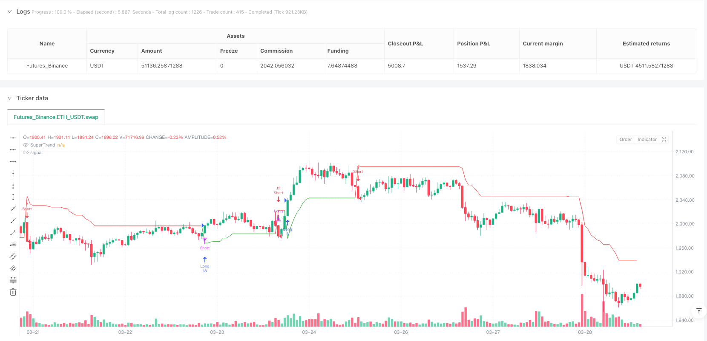
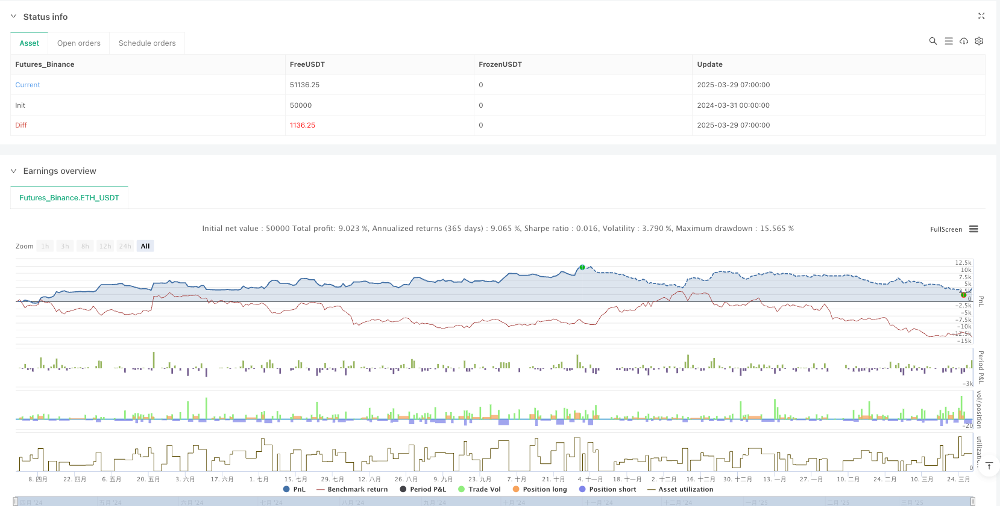

> Name

Dynamic-Position-Sizing-SuperTrend-Trend-Following-Strategy-with-51-Reward-Risk-Ratio
> Author

ianzeng123

> Strategy Description





[trans]

## Overview
The dynamic money management SuperTrend trend tracking 5x risk-reward strategy is an advanced trend tracking system based on SuperTrend indicators. This strategy combines trend judgment with precise money management technology to control risk by dynamically calculating the position size of each transaction. The core feature of this strategy is to use ATR (average true range) to determine market volatility, manage trading signals in the same direction into groups, and set a fixed 5:1 risk-reward ratio for each group of transactions. The system supports multiple positions for signals in the same direction, while maintaining strict risk management. Each position increase only bears the risk of 1% of the total account value. This design allows the strategy to take full advantage of strong trend opportunities while maintaining low risk levels.
## Strategy Principle
This strategy is based on the trend judgment mechanism of the SuperTrend indicator and combines advanced technologies of group trading and dynamic position management. The main working principle is as follows:
1. **SuperTrend indicator calculation**: First calculate the ATR value, and then add and subtract the ATR multiplier based on the midpoint price (HL2) to obtain the basic upper and lower rails. The key innovation lies in the use of recursive smoothing techniques to calculate the final orbital band, which improves the stability and reliability of the indicator.
2. **Trend judgment logic**: Determine the trend by comparing the relationship between the closing price and the final track band of the previous period. When the closing price breaks through the upper rail, the trend turns to upward; when it breaks through the lower rail, the trend turns to downward; in other cases, the original trend is maintained.
3. **Signal generation mechanism**: A buy signal is generated when the trend changes from downward to upward; a sell signal is generated when the trend changes from upward to downward.
4. **Group transaction management**: The strategy groups transactions in the same direction into a group and records the initial stop loss level (SuperTrend value) for each group of transactions. This enables the system to uniformly manage multiple related transactions and improve financial efficiency.
5. **Dynamic position calculation**: Calculate the position size of each transaction according to the formula `math.floor(strategy.equity * 0.01 / stopDistance)` to ensure that only 1% of the account is risked each time a position is added.
6. **Risk-reward setting**: The system automatically sets a risk-return ratio of 5:1 for each group of transactions, that is, the take-profit target is set to 5 times the stop-loss distance, which significantly improves the expected return of the strategy.
7. **Smart Exit Mechanism**: Contains three exit conditions: stop loss (initial SuperTrend level), take profit (5 times stop loss distance), and conditional exit when the trend reverses (loss, reaching the take profit target, or moving to the guaranteed position).
## Strategic Advantages
This strategy has several significant advantages:
1. **Scientific risk control**: Through dynamic position adjustment, ensure that each transaction only bears the risk of 1% of the total funds, effectively controlling the downside risk of a single transaction.
2. **Enhanced trend tracking capabilities**: The group trading mechanism allows the system to enter multiple entries in the same trend, which can more fully capture the profits of sustained strong trends.
3. **Optimized risk-reward ratio**: The fixed risk-reward setting of 5:1 makes the income from successful transactions far greater than the losses from losing transactions, which can improve the expected income of the system in the long run.
4. **Flexible position management**: Dynamically calculate entry positions based on current market volatility and account size, avoiding the risk imbalance problem caused by fixed positions.
5. **Intelligent reversal management**: When the trend reverses, the system will intelligently choose the exit method based on the current profit and loss status, including accepting losses, making profits, or moving to the breakeven level, and then entering the new direction.
6. **Recursive Smoothing SuperTrend**: By recursively calculating the final track band, false signals are reduced and the reliability of trend judgment is improved.
7. **Fully automated operation**: All parameters and conditions of the strategy are clearly defined, suitable for fully automated trading, reducing human intervention and emotional impact.
## Strategy Risk
Although this strategy is well designed, there are some potential risks:
1. **Excessive risk of adding positions**: Although each time you add a position, you only risk 1% of the capital, setting pyramiding to 500 may lead to the accumulation of excessively large positions in a strong one-way trend. It is recommended to lower the pyramiding parameters based on personal risk tolerance.
2. **Quick reversal risk**: When the market fluctuates violently, the price may jump past the stop loss level, and the actual loss may exceed the expected 1%. It is recommended to reduce the risk ratio or add additional volatility filters in high volatility markets.
3. **Parameter sensitivity**: Strategy performance is more sensitive to the ATR cycle and multiplier parameters, and different parameter combinations perform significantly differently under different market conditions. It is recommended to conduct thorough parameter optimization and backtesting to find the best parameters for a specific market.
4. **Trend Market Dependence**: As a trend following system, this strategy may produce frequent losing trades in range-bound markets. Consider adding a market environment filter to only enable the strategy when the trend is clear.
5. **Fund Management Risk**: Although the single risk is limited to 1%, multiple simultaneously active trading groups may cause the total risk to temporarily exceed the acceptable level. It is recommended to set additional overall risk limits, such as a maximum allowable simultaneous loss of no more than 5% of the account.
## Strategy optimization direction
Depending on the design of the strategy and potential risks, the following optimization directions can be considered:
1. **Add Trend Strength Filter**: Combined with ADX or similar indicators, only trade when the trend is strong enough, reducing false signals in volatile markets. This can be achieved by adding `adxValue = ta.adx(14)` calculations and setting `strongTrend = adxValue > 25` as additional entry conditions.
2. **Dynamic Risk-Return Ratio**: Automatically adjust the risk-return ratio based on market volatility, using a higher return ratio during low volatility periods and a lower return ratio during high volatility periods. It can be dynamically adjusted by calculating the ratio of long-term ATR to current ATR.
3. **Add partial profit acquisition mechanism**: Design a batch profit system for partial positions, for example, 25% profit when the stop loss distance is reached 2 times, 25% profit when 3 times, and 50% of the position is retained to pursue the 5 times target. This can increase the overall probability of profit.
4. **Intelligent position optimization conditions**: In addition to trend signals, add additional conditions for adding positions, such as requiring positions to be added only after a specific trend movement, to avoid excessive position additions when prices consolidate.
5. **Integrated multi-time frame analysis**: Add trend confirmation of higher time frames, only trade when the trends of multiple time frames are consistent, and improve the quality of entry.
6. **Add maximum exposure limit**: Set the upper limit of the total risk exposure of the account. Once the upper limit is reached (such as 5% of the total funds), new entry signals will be suspended until the risk is reduced.
7. **Optimize SuperTrend calculation**: Consider using a combination of SuperTrend indicators with multiple periods or multiple multipliers to improve the accuracy of trend judgment through the voting system.
## Summarize
The dynamic fund management SuperTrend trend tracking 5x risk return strategy is a highly complete trend tracking system that perfectly combines accurate trend identification with scientific fund management. Through dynamic position calculations, grouped trade management and an optimized 5:1 risk-reward setting, this strategy maximizes the ability to capture trends while controlling risk.
The core advantage of this strategy lies in its intelligent fund management system, which ensures that each entry only bears a fixed proportion of risk, while allowing multiple positions to be added during strong trends to enhance returns. The optimized SuperTrend indicator calculation improves the reliability of trend judgment, while the diversified exit mechanism ensures effective profit protection.
Although there are some potential risks, such as possible over-adding and dependence on trending markets, these risks can be effectively managed through recommended optimization measures such as adding trend strength filters, dynamically adjusting the risk-reward ratio, and setting maximum exposure limits.
For traders looking for a scientific, systematic approach to trend following, this strategy provides a solid framework that can be applied directly or as a basis for further personalization. Through careful parameter selection and continuous strategy monitoring, the system has the potential to achieve stable long-term performance in a variety of market environments. ||
## Overview

The Dynamic Position Sizing SuperTrend Trend-Following Strategy with 5:1 Reward-Risk Ratio is an advanced trend-following system based on the SuperTrend indicator that combines trend identification with precise capital management techniques by dynamically calculating position sizes to control risk. The core features of this strategy include utilizing ATR (Average True Range) to determine market volatility, grouping trades in the same direction, and establishing a fixed 5:1 reward-to-risk ratio for each trade group. The system supports multiple pyramiding entries in the same direction while maintaining strict risk management, with each entry risking only 1% of the account equity. This design allows the strategy to fully capitalize on strong trends while maintaining low risk levels.

## Strategy Principles

This strategy is based on the SuperTrend indicator's trend determination mechanism, combined with advanced techniques of grouped trading and dynamic position management. The main working principles are as follows:

1. **SuperTrend Indicator Calculation**: First, the ATR value is calculated, then basic upper and lower bands are obtained by adding and subtracting the ATR multiplier from the midpoint price (HL2). The key innovation lies in using recursive smoothing techniques to calculate the final bands, which improves the indicator's stability and reliability.

2. **Trend Determination Logic**: The trend is determined by comparing the closing price with the previous final bands. When the closing price breaks above the upper band, the trend turns upward; when it breaks below the lower band, the trend turns downward; otherwise, the original trend is maintained.

3. **Signal Generation Mechanism**: Buy signals are generated when the trend changes from downward to upward; sell signals are generated when the trend changes from upward to downward.

4. **Grouped Trade Management**: The strategy groups trades in the same direction and records the initial stop level (SuperTrend value) for each group. This allows the system to uniformly manage multiple related trades, improving capital efficiency.

5. **Dynamic Position Calculation**: The position size for each trade is calculated according to the formula `math.floor(strategy.equity * 0.01 / stopDistance)`, ensuring that each additional entry risks only 1% of the account.

6. **Risk-Reward Setup**: The system automatically sets a 5:1 risk-reward ratio for each trade group, with the profit target set at 5 times the stop distance, significantly improving the strategy's expected return.

7. **Intelligent Exit Mechanism**: Includes three exit conditions: stop loss (initial SuperTrend level), take profit (5 times stop distance), and conditional exits during trend reversals (accepting loss, reaching profit target, or moving to breakeven).

## Strategy Advantages

This strategy has several significant advantages:

1. **Scientific Risk Control**: Through dynamic position adjustment, each trade risks only 1% of total capital, effectively controlling downside risk for individual trades.

2. **Enhanced Trend Tracking Capability**: The grouped trading mechanism allows the system to enter multiple times in the same trend, capturing more profit from strong, sustained trends.

3. **Optimized Risk-Reward Ratio**: The fixed 5:1 risk-reward setting ensures that successful trades yield far greater returns than losses from unsuccessful trades, improving expected returns over the long term.

4. **Flexible Position Management**: Position sizes are dynamically calculated based on current market volatility and account size, avoiding the risk imbalance problems of fixed position sizes.

5. **Intelligent Reversal Management**: During trend reversals, the system intelligently chooses exit methods based on current profit/loss status, including accepting losses, taking profits, or moving to breakeven before entering in the new direction.

6. **Recursively Smoothed SuperTrend**: The recursive calculation of final bands reduces false signals and improves the reliability of trend determination.

7. **Fully Automated Operation**: All parameters and conditions of the strategy are clearly defined, suitable for fully automated trading, reducing human intervention and emotional influence.

## Strategy Risks

Despite its excellent design, the strategy still presents some potential risks:

1. **Excessive Pyramiding Risk**: Although each additional entry risks only 1% of capital, the pyramiding setting of 500 could lead to excessively large positions in strong one-directional trends. It is recommended to lower the pyramiding parameter based on individual risk tolerance.

2. **Rapid Reversal Risk**: During severe market fluctuations, prices may gap beyond stop levels, resulting in actual losses exceeding the expected 1%. Consider reducing the risk percentage or adding additional volatility filters in highly volatile markets.

3. **Parameter Sensitivity**: Strategy performance is sensitive to ATR period and multiplier parameters, with different parameter combinations performing differently under various market conditions. Thorough parameter optimization and backtesting are recommended to find optimal parameters for specific markets.

4. **Trend Market Dependency**: As a trend-following system, this strategy may generate frequent losing trades in range-bound, oscillating markets. Consider adding market environment filters to enable the strategy only when trends are clearly defined.

5. **Capital Management Risk**: Although single-trade risk is limited to 1%, multiple simultaneously active trade groups may temporarily cause total risk to exceed acceptable levels. Consider setting additional overall risk limits, such as maximum allowable simultaneous losses not exceeding 5% of the account.

## Strategy Optimization Directions

Based on the strategy's design and potential risks, the following optimization directions can be considered:

1. **Add Trend Strength Filter**: Combine with ADX or similar indicators and only trade when the trend is strong enough to reduce false signals in oscillating markets. This can be implemented by adding `adxValue = ta.adx(14)` calculation and setting `strongTrend = adxValue > 25` as an additional entry condition.

2. **Dynamic Risk-Reward Ratio**: Automatically adjust the risk-reward ratio based on market volatility, using higher ratios during low volatility periods and lower ratios during high volatility periods. This can be adjusted by calculating the ratio of long-term ATR to current ATR.

3. **Add Partial Profit-Taking Mechanism**: Design a system for taking partial profits, such as taking 25% profit at 2x stop distance, another 25% at 3x, and reserving 50% of the position for the 5x target. This can improve overall profitability.

4. **Intelligent Pyramiding Condition Optimization**: Add additional conditions for pyramiding beyond trend signals, such as requiring specific favorable movements before allowing additional entries, avoiding excessive pyramiding during price consolidation.

5. **Integrate Multi-Timeframe Analysis**: Add higher timeframe trend confirmation and only trade when trends across multiple timeframes align, improving entry quality.

6. **Add Maximum Exposure Limit**: Set an upper limit on total account risk exposure, temporarily suspending new entry signals once the limit (e.g., 5% of total capital) is reached, until risk is reduced.

7. **Optimize SuperTrend Calculation**: Consider using a combination of SuperTrend indicators with various periods or multipliers, improving trend determination accuracy through a voting system.

## Summary

The Dynamic Position Sizing SuperTrend Trend-Following Strategy with 5:1 Reward-Risk Ratio is a highly refined trend-following system that perfectly combines precise trend identification with scientific capital management. Through dynamic position calculation, grouped trade management, and optimized 5:1 risk-reward settings, the strategy maximizes trend-capturing ability while controlling risk.

The core advantage of this strategy lies in its intelligent capital management system, ensuring that each entry risks only a fixed percentage while allowing multiple entries in strong trends to enhance returns. The optimized SuperTrend indicator calculation improves the reliability of trend determination, while diversified exit mechanisms ensure effective protection of profits.

Despite some potential risks, such as possible excessive pyramiding and dependency on trending markets, these risks can be effectively managed through the suggested optimization measures, such as adding trend strength filters, dynamically adjusting risk-reward ratios, and setting maximum exposure limits.

For traders seeking scientific, systematic trend-following methods, this strategy provides a solid framework that can be applied directly or used as a foundation for further customization. With careful parameter selection and continuous strategy monitoring, this system has the potential to achieve stable long-term performance across various market environments.[/trans]


> Source (PineScript)

``` pinescript
/*backtest
start: 2024-03-31 00:00:00
end: 2025-03-29 08:00:00
period: 1h
basePeriod: 1h
exchanges: [{"eid":"Futures_Binance","currency":"ETH_USDT"}]
*/

//@version=6
strategy("Grouped SuperTrend Strategy 5x – All Signals", overlay=true, initial_capital=100000, default_qty_type=strategy.fixed, default_qty_value=0, pyramiding=500, calc_on_order_fills=true)

// INPUTS
atrPeriod     = input.int(10, title="ATR Period")
atrMultiplier = input.float(3.0, title="ATR Multiplier")

// CALCULATE ATR & BASIC BANDS
atrValue    = ta.atr(atrPeriod)
hl2         = (high + low) / 2
upperBasic  = hl2 + atrMultiplier * atrValue
lowerBasic  = hl2 - atrMultiplier * atrValue

// CALCULATE FINAL BANDS (recursive smoothing)
var float finalUpperBand = na
var float finalLowerBand = na
finalUpperBand := na(finalUpperBand[1]) ? upperBasic : (upperBasic < finalUpperBand[1] or close[1] > finalUpperBand[1] ? upperBasic : finalUpperBand[1])
finalLowerBand := na(finalLowerBand[1]) ? lowerBasic : (lowerBasic > finalLowerBand[1] or close[1] < finalLowerBand[1] ? lowerBasic : finalLowerBand[1])

// DETERMINE TREND
var int trend = 1
trend := nz(trend[1], 1)
if close > finalUpperBand[1]
    trend := 1
else if close < finalLowerBand[1]
    trend := -1
else
    trend := nz(trend[1], 1)
    
// SUPER TREND VALUE: For an uptrend use finalLowerBand, for a downtrend use finalUpperBand.
superTrend = trend == 1 ? finalLowerBand : finalUpperBand

// SIGNALS: A change in trend generates a signal.
buySignal  = (trend == 1 and nz(trend[1], 1) == -1)
sellSignal = (trend == -1 and nz(trend[1], 1) == 1)

// Plot SuperTrend
plot(superTrend, color = trend == 1 ? color.green : color.red, title="SuperTrend")

// POSITION SIZING FUNCTION: Risk 1% of equity per signal based on the stop distance.
calc_qty(stopDistance) =>
    stopDistance > 0 ? math.floor(strategy.equity * 0.01 / stopDistance) : 0

// ─── GROUPING VARIABLES ─────────────────────────────
// When a new group trade is initiated (position goes from flat to non‑zero),
// record the SuperTrend value as the group’s initial stop.
var float groupInitialStop = na
if strategy.position_size == 0
    groupInitialStop := na
if strategy.position_size != 0 and strategy.position_size[1] == 0
    groupInitialStop := superTrend

// Declare groupStopDistance and groupProfitTarget with explicit type.
var float groupStopDistance = na
var float groupProfitTarget = na
if strategy.position_size > 0
    groupStopDistance := strategy.position_avg_price - groupInitialStop
    groupProfitTarget := strategy.position_avg_price + 5 * groupStopDistance
else if strategy.position_size < 0
    groupStopDistance := groupInitialStop - strategy.position_avg_price
    groupProfitTarget := strategy.position_avg_price - 5 * groupStopDistance

// ─── ENTRY LOGIC ─────────────────────────────
// Every SuperTrend signal is taken.
// For same‑direction signals (or when flat), add to the group.
// For reversal signals, exit the existing group per our conditions and then enter the new direction.

// LONG ENTRIES
if buySignal
    // Reversal: if currently short, exit short first.
    if strategy.position_size < 0
        // For shorts, a loss is when close > avg entry.
        if close > strategy.position_avg_price
            strategy.close("Short", comment="Short Reversal Loss Exit")
        // For shorts, profit when price is below the profit target.
        else if close <= groupProfitTarget
            strategy.close("Short", comment="Short Reversal Profit Target Exit")
        else
            // Otherwise, update exit to break-even.
            strategy.exit("Short_BE", from_entry="Short", stop=strategy.position_avg_price, comment="Short BE Trailing")
        // Enter new long trade.
        stopDist = close - superTrend
        qty = calc_qty(stopDist)
        if qty > 0
            strategy.entry("Long", strategy.long, qty=qty, comment="Long Entry on Reversal")
        // Reset group initial stop for new group.
        groupInitialStop := superTrend
    else
        // Flat or already long – add to the long group.
        stopDist = close - superTrend
        qty = calc_qty(stopDist)
        if qty > 0
            strategy.entry("Long", strategy.long, qty=qty, comment="Long Add Entry")

// SHORT ENTRIES
if sellSignal
    if strategy.position_size > 0
        // Reversal: if currently long, exit long first.
        if close < strategy.position_avg_price
            strategy.close("Long", comment="Long Reversal Loss Exit")
        else if close >= groupProfitTarget
            strategy.close("Long", comment="Long Reversal Profit Target Exit")
        else
            strategy.exit("Long_BE", from_entry="Long", stop=strategy.position_avg_price, comment="Long BE Trailing")
        // Enter new short trade.
        stopDist = superTrend - close
        qty = calc_qty(stopDist)
        if qty > 0
            strategy.entry("Short", strategy.short, qty=qty, comment="Short Entry on Reversal")
        groupInitialStop := superTrend
    else
        // Flat or already short – add to the short group.
        stopDist = superTrend - close
        qty = calc_qty(stopDist)
        if qty > 0
            strategy.entry("Short", strategy.short, qty=qty, comment="Short Add Entry")

// ─── EXIT ORDERS ─────────────────────────────
// Set default aggregated exit orders based on the group’s initial stop and profit target.
if strategy.position_size > 0
    strategy.exit("LongExit", from_entry="Long", stop=groupInitialStop, limit=groupProfitTarget)
if strategy.position_size < 0
    strategy.exit("ShortExit", from_entry="Short", stop=groupInitialStop, limit=groupProfitTarget)

```

> Detail

https://www.fmz.com/strategy/488851

> Last Modified

2025-03-31 11:53:06
