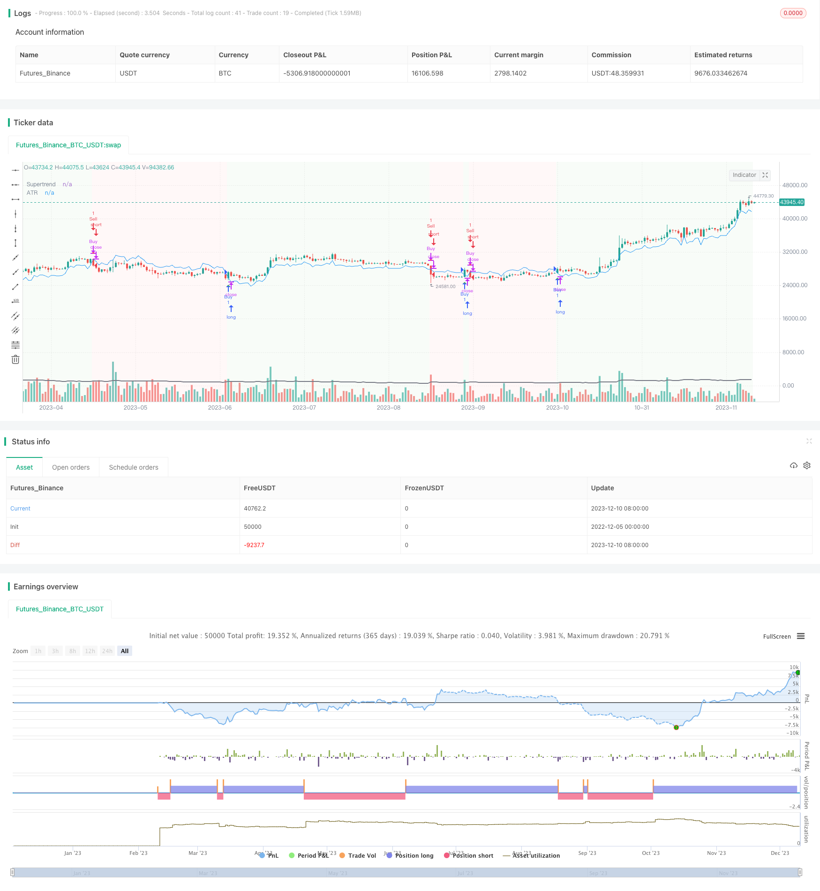

> Name

Advanced-SuperTrend-Tracking-Strategy based on SuperTrend
> Author

ChaoZhang

> Strategy Description


[trans]

Trend following strategy based on the SuperTrend indicator. This strategy uses the SuperTrend indicator to determine the trend direction, and combines the ATR indicator to set stop loss and take profit to achieve low-risk trend tracking.
#### Strategy Principle
The core indicator of this strategy is SuperTrend. The SuperTrend indicator is combined with ATR to determine the trend direction based on price breakthroughs. The specific calculation method is as follows:
Upper rail line: Upper rail line = current price - (ATR times multiplier)
Lower track: Lower track = current price + (ATR times multiplier)
When the price is above the upper band, it is a bullish trend; when the price is below the lower band, it is a bearish trend.
The strategy determines the trend direction based on the SuperTrend indicator, going long when the trend is bullish and short when the trend is bearish. At the same time, the strategy uses the average fluctuation range of the ATR indicator to set stop-loss and take-profit positions to control risks.
#### Strategic Advantages
- Use SuperTrend indicators to determine trends and accurately capture market trends
- ATR stop loss and profit, effectively control single loss
- Combine trend and stop loss to achieve overall high winning rate trading
- Easy to enter the market and stop losses, suitable for short-term tracking
#### Strategy Risk
- The SuperTrend indicator has a repaint problem and cannot completely rely on signals to enter the market.
- The ATR indicator cannot fully adapt to violent market conditions, and it is easy to be stopped if the stop loss is too dense
- The strategy itself cannot judge the quality of the trend and requires manual verification of the trend.
Risk resolution:
1) Manually check the trend quality and avoid reverse operations on false breakthroughs
2) Loose the stop loss point appropriately to prevent small stop losses during normal fluctuations
#### Strategy optimization direction
- Add multi-factor verification to judge trend quality
- Dynamically adjust ATR parameters combined with volatility indicators
- Add machine learning model to assist in judging trading opportunities
- Optimize the stop loss mechanism to prevent normal fluctuations from being stopped.
Summary: This strategy uses the SuperTrend indicator to determine the trend direction, and the ATR indicator to set stop loss and take profit to achieve low-risk trend following transactions. The strategy idea is clear and easy to understand, and parameters can be adjusted according to one's own risk preference. It is a universal trend following strategy. However, the strategy itself cannot judge the quality of the trend. It is recommended to use it in conjunction with other indicators or models to reduce the risk of misoperation.
||

The strategy uses the SuperTrend indicator to determine the trend direction and combines the ATR indicator to set stop loss and take profit to achieve low risk trend following.

#### Strategy Principle 

The core indicator of this strategy is SuperTrend. SuperTrend indicator combines ATR to judge the trend direction based on price breakthroughs. The specific calculation method is as follows:

Upper Band: Upper Band = Current Price - (ATR x Multiplier)
Lower Band: Lower Band = Current Price + (ATR x Multiplier)

When the price is higher than the upper band, it is an uptrend; when the price is lower than the lower band, it is a downtrend.

The strategy determines the trend direction based on the SuperTrend indicator, goes long in an uptrend and goes short in a downtrend. At the same time, the strategy uses the average fluctuation range of the ATR indicator to set stop loss and take profit positions to control risks.

#### Advantages of the Strategy

- Use SuperTrend indicator to determine the trend and accurately capture market trends
- ATR stop loss and take profit effectively controls single loss
- Combining trend and stop loss realizes overall high winning rate trading
- Easy to enter the market and easy to stop loss, suitable for short term tracking

#### Risks of the Strategy

- SuperTrend indicator has repaint problems, cannot completely rely on signals to enter the market
- ATR indicator cannot completely adapt to violent fluctuations, stop loss is too close and tends to be stopped out
- The strategy itself cannot judge the quality of the trend and requires manual verification

Risk Mitigation Methods:
1) Manually verify the quality of the trend to avoid reverse operations during false breakouts 
2) Appropriately loosen the stop loss point to prevent being stopped out by small fluctuations during normal volatility

#### Optimization Directions

- Increase multifactor verification to judge trend quality
- Combine volatility indicators to dynamically adjust ATR parameters
- Add machine learning models to assist in judging entry and exit timing
- Optimize stop loss mechanism to prevent normal fluctuations from being stopped out

In summary, this strategy uses the SuperTrend indicator to determine the trend direction and sets stop loss and take profit with the ATR indicator to achieve low risk trend following trading. The strategy idea is clear and easy to understand. Parameters can be adjusted according to personal risk preferences. It is a versatile trend tracking strategy. However, the strategy itself cannot judge the quality of the trend, so it is recommended to use with other indicators or models to reduce the risk of misoperation.

[/trans]

> Strategy Arguments


|Argument|Default|Description|
|----|----|----|
|v_input_1|14|ATR Length|
|v_input_2|1.5|Multiplier|


> Source (PineScript)

``` pinescript
/*backtest
start: 2022-12-05 00:00:00
end: 2023-12-11 00:00:00
period: 1d
basePeriod: 1h
exchanges: [{"eid":"Futures_Binance","currency":"BTC_USDT"}]
*/

//@version=5
strategy("Advanced Trend Strategy", overlay=true)

// Input parameters
length = input(14, title="ATR Length")
multiplier = input(1.5, title="Multiplier")
src = close

// Calculate ATR
atr_value = ta.atr(length)

// Calculate Supertrend
upst = src - multiplier * atr_value
downst = src + multiplier * atr_value

var float supertrend = na
var float trend_direction = na

if (na(supertrend))
    supertrend := upst

if (src > supertrend)
    supertrend := upst

if (src < supertrend)
    supertrend := downst

// Buy and Sell conditions
buyCondition = ta.crossover(src, supertrend)
sellCondition = ta.crossunder(src, supertrend)

// Execute Buy and Sell orders
if (buyCondition)
    strategy.entry("Buy", strategy.long)

if (sellCondition)
    strategy.close("Buy")  // Close the long position

if (sellCondition)
    strategy.entry("Sell", strategy.short)

if (buyCondition)
    strategy.close("Sell")  // Close the short position

// Plot Supertrend
plot(supertrend, color=color.blue, title="Supertrend")

// Highlight bars based on trend direction
bgcolor(src > supertrend ? color.new(color.green, 95) : src < supertrend ? color.new(color.red, 95) : na)

// Plot ATR for reference
plot(atr_value, color=color.gray, title="ATR", linewidth=2)

// Plot arrows for buy and sell signals
plotshape(buyCondition, color=color.green, style=shape.triangleup, location=location.belowbar, size=size.small, title="Buy Signal")
plotshape(sellCondition, color=color.red, style=shape.triangledown, location=location.abovebar, size=size.small, title="Sell Signal")

```

> Detail

https://www.fmz.com/strategy/435103

> Last Modified

2023-12-12 12:27:36
