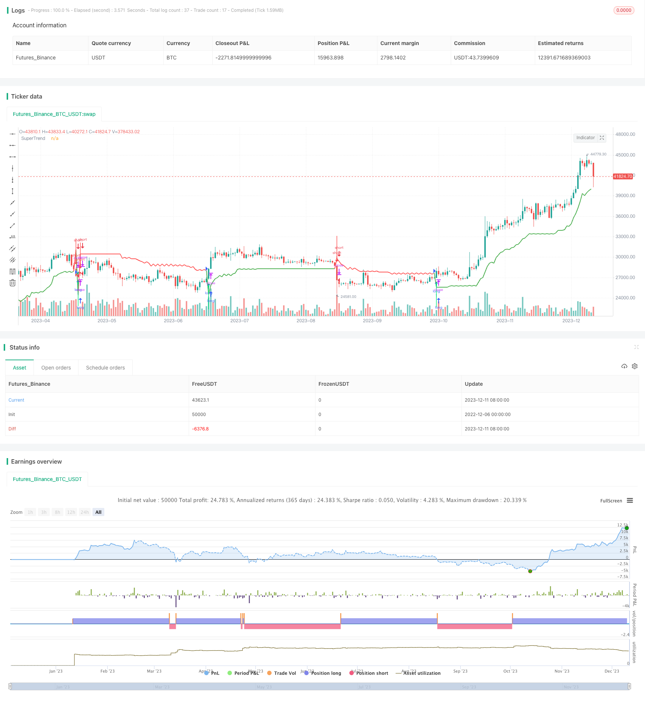

> Name

Supertrend-Blind-Following-Strategy
> Author

ChaoZhang

> Strategy Description


[trans]

## Overview
This strategy shows what can happen if you blindly follow a supertrend indicator. We know that super trend indicators do not appear immediately, and we need to wait for the next K line to decide whether to enter a position. So, you can see what will happen if you enter the market after the supertrend indicator has finally formed. Without the assistance of other tools, this indicator is very dangerous and may bring about a very large retracement. Please pay attention to money management.
## Strategy Principle
This strategy uses supertrend indicators to determine price trends. Supertrend indicators are constructed based on average true volatility and midpoints of high and low prices.
When the closing price is higher than the upper band, it represents continued bullishness; when the closing price is lower than the lower band, it represents continued bearishness.
This strategy sets two parameters, Factor and Pd. Factor controls the width of the supertrend channel, and Pd controls the period length of the calculated ATR. Based on these two parameters, the upper rail and the lower rail can be constructed.
Upper track formula: hl2 - (Factor * ATR(Pd))
Lower track formula: hl2 + (Factor * ATR(Pd))
Among them, hl2 represents the midpoint of high and low prices.
Then compare the current closing price with the upper and lower rails to determine whether it is continuing to be bullish or bearish, and output a Boolean Trend variable.
Draw the upper and lower tracks of the super trend based on Trend. And when the Trend status changes, place entry and exit signals.
Set the strategy's position opening logic based on signals.
## Advantage Analysis
This strategy has the following advantages:
1. Using the super trend indicator, you can clearly judge the price trend and pivot points.
2. Set clear entry and exit logic.
3. Visualize entry opportunities via arrows.
4. The strategy logic is simple and easy to understand.
## Risk Analysis
This strategy has the following risks:
1. Blindly following super-trend indicators without other auxiliary indicators and effect management may lead to huge retracements.
2. Without setting a stop loss, a single loss cannot be controlled.
3. The signal may lag, making it impossible to enter the market in time near the turning point.
4. Improper parameter settings may cause the supertrend channel to be too wide or too narrow.
Risk management measures:
1. Combine with other indicators such as MACD, KDJ, etc. to verify the effect and avoid blind following.
2. Set a reasonable stop loss level to control single losses to the maximum extent.
3. Adjust parameters to make the super-trend channel reasonable and prevent it from being too broad or narrow.
## Optimization direction
This strategy can be optimized from the following aspects:
1. Add auxiliary indicators to verify the effect and prevent failure. For example, you can consider adding the MACD indicator.
2. Set reasonable stop loss logic. A percentage stop loss can be set based on ATR.
3. Optimize the hyperparameters Factor and Pd to find the best parameter combination. For example, a traversal method can be used to find optimal parameters.
4. Optimize the timing of entry to avoid signal lag. For example, the momentum indicator can be introduced to determine the strength and weakness pattern and adjust the entry timing.
5. Add position management strategies. For example, fixed shares can be used for position management.
## Summarize
This strategy uses supertrend indicators to determine price trends and find turning points. Due to the lack of auxiliary indicators and stop-loss means, blindly following super-trend indicators brings huge risks. We have proposed improvements in risk management, stop loss strategies, parameter optimization, entry timing and other aspects, which can significantly enhance the stability and profitability of the strategy.
||

## Overview

This strategy shows what would happen if you blindly follow the Supertrend indicator. As we know, Supertrend does not appear immediately and we need to wait for the next bar to decide whether to enter a position. So you can see what will happen if you take a position after Supertrend finally formed. This indicator is extremely dangerous without other tools and can give very serious drawdowns. Take care of yourself...

## Strategy Logic

This strategy uses the Supertrend indicator to determine price trend. Supertrend is built based on the Average True Range and midpoints of high and low prices. 

When the close price is above the upper rail, it represents a sustained uptrend; when the close price is below the lower rail, it represents a sustained downtrend.

This strategy sets two parameters: Factor and Pd. Factor controls the width of the Supertrend channel, and Pd controls the period length to calculate ATR. Based on these two parameters, the upper and lower rails can be constructed.

Upper Rail Formula: hl2 - (Factor * ATR(Pd))
Lower Rail Formula: hl2 + (Factor * ATR(Pd))

Where hl2 represents the midpoint of high and low prices. 

Then compare the current close price with the upper and lower rails to determine if it's an uptrend or a downtrend, and output a boolean Trend variable.

Plot the upper and lower rails of Supertrend based on Trend. And place entry and exit signals when Trend status changes. 

Set strategy's entry logic based on the signals.

## Advantage Analysis 

This strategy has the following advantages:

1. Uses Supertrend indicator, which can clearly determine price trend and pivot points.

2. Sets clear entry and exit logic.  

3. Visualizes entry timing with arrows.

4. Simple and easy to understand strategy logic.

## Risk Analysis

This strategy has the following risks:

1. Blindly following Supertrend without other auxiliary indicators and money management may lead to huge drawdowns.

2. No stop loss set, unable to control single loss.

3. Signals may lag, unable to enter in time around turning points. 

4. Improper parameter settings may cause Supertrend channel to be too wide or too narrow.

Risk Management Measures:

1. Combine with other indicators like MACD, KDJ for effectiveness validation, avoid blind following.

2. Set reasonable stop loss to maximize control over single loss.

3. Adjust parameters to make Supertrend channel reasonable, prevent too wide or too narrow.

## Optimization Directions

This strategy can be optimized in the following aspects:

1. Add auxiliary indicators for effectiveness validation to prevent failure. For example, MACD indicator can be considered.

2. Set reasonable stop loss logic. Can set percentage stop loss based on ATR.

3. Optimize hyperparameters Factor and Pd to find best parameter combinations. For example, traversal methods can be used to find optimal parameters.  

4. Optimize entry timing to avoid signal lag. For example, momentum indicators can be introduced to adjust entry timing based on strength and weakness.

5. Add position sizing strategies. For example, fixed fractional position sizing can be adopted. 

## Conclusion

This strategy uses Supertrend indicator to determine price trend and find turning points. Blindly following Supertrend without auxiliary indicators and stop loss means brings huge risks. We proposed improvements in aspects like risk management, stop loss strategies, parameter optimization, entry timing, etc, which can significantly enhance the stability and profitability of the strategy.

[/trans]

> Strategy Arguments


|Argument|Default|Description|
|----|----|----|
|v_input_1|3|Factor|
|v_input_2|7|Pd|


> Source (PineScript)

``` pinescript
/*backtest
start: 2022-12-06 00:00:00
end: 2023-12-12 00:00:00
period: 1d
basePeriod: 1h
exchanges: [{"eid":"Futures_Binance","currency":"BTC_USDT"}]
*/

//@version=2
strategy("Supertrend blind follow", overlay=true)

Factor=input(3, minval=1,maxval = 100)
Pd=input(7, minval=1,maxval = 100)


Up=hl2-(Factor*atr(Pd))
Dn=hl2+(Factor*atr(Pd))


TrendUp=close[1]>TrendUp[1]? max(Up,TrendUp[1]) : Up
TrendDown=close[1]<TrendDown[1]? min(Dn,TrendDown[1]) : Dn

Trend = close > TrendDown[1] ? 1: close< TrendUp[1]? -1: nz(Trend[1],1)
Tsl = Trend==1? TrendUp: TrendDown

linecolor = Trend == 1 ? green : red

plot(Tsl, color = linecolor , style = line , linewidth = 2,title = "SuperTrend")

plotshape(cross(close,Tsl) and close>Tsl , "Up Arrow", shape.triangleup,location.belowbar,green,0,0)
plotshape(cross(Tsl,close) and close<Tsl , "Down Arrow", shape.triangledown , location.abovebar, red,0,0)
//plot(Trend==1 and Trend[1]==-1,color = linecolor, style = circles, linewidth = 3,title="Trend")

plotarrow(Trend == 1 and Trend[1] == -1 ? Trend : na, title="Up Entry Arrow", colorup=lime, maxheight=60, minheight=50, transp=0)
plotarrow(Trend == -1 and Trend[1] == 1 ? Trend : na, title="Down Entry Arrow", colordown=red, maxheight=60, minheight=50, transp=0)

longCondition = cross(close,Tsl) and close>Tsl
if (longCondition)
    strategy.entry("long", strategy.long)
shortCondition = cross(Tsl,close) and close<Tsl
if (shortCondition)
    strategy.entry("short", strategy.short)


```

> Detail

https://www.fmz.com/strategy/435269

> Last Modified

2023-12-13 16:49:44
