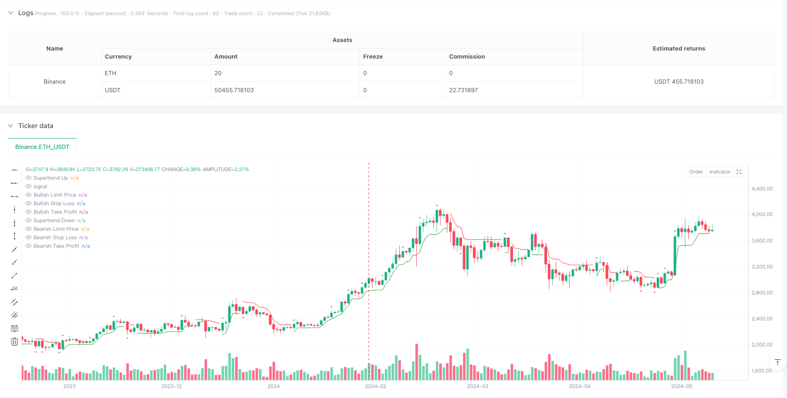
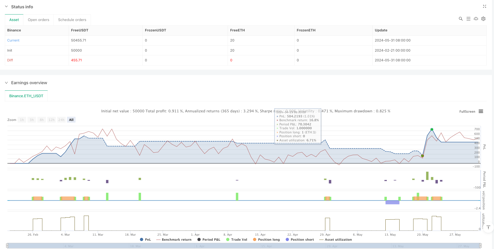

> Name

Supertrend enhanced engulfing pattern dynamic risk control strategy-Dynamic-Risk-Controlled-Supertrend-Engulfing-Pattern-Strategy
> Author

ianzeng123

> Strategy Description





[trans]
#### Overview
This is an advanced trading strategy that combines the Supertrend indicator and the Engulfing Pattern. The strategy achieves accurate trading signal screening by identifying the engulfing candlestick pattern in the market and combining it with the trend direction confirmation of the Supertrend indicator. This strategy also integrates dynamic stop loss and profit settings to effectively control risks while ensuring profit margins.
#### Strategy Principle
The strategy is mainly based on the following core principles:
1. Use ATR (Average True Range) to calculate the Supertrend indicator, which is used to determine the overall market trend.
2. Screen out effective engulfing patterns by setting the Boring Candle Threshold and Engulfing Candle Threshold.
3. Only open a position when the trend direction of Supertrend is consistent with the direction of the engulfing pattern.
4. Adopt dynamic stop loss and profit point settings, calculated in proportion based on the opening price.
5. Use strategic position management to ensure that you only hold one trading direction at the same time.
#### Strategic Advantages
1. Signal quality control is strict, and accuracy is improved through double confirmation (trend + pattern).
2. Introduce the concepts of boring candles and engulfing candle thresholds to effectively filter false signals.
3. Dynamic Supertrend calculation based on ATR makes the strategy have good market adaptability.
4. Complete stop loss and profit management mechanism, which not only controls risks but also locks in profits.
5. The visualization is very complete, and trading signals, stop loss points and profit targets are all clearly visible.
#### Strategy Risk
1. Frequent false breakthrough signals may occur in volatile markets.
2. Fixed stop loss and take profit settings may not be suitable for all market environments.
3. A large retracement may occur when the trend reverses.
4. Sensitive to parameter settings. Improper parameters may lead to poor strategy performance.
5. In less liquid markets, you may face the risk of slippage.
#### Strategy optimization direction
1. Volume indicators can be introduced as signal confirmation.
2. Consider adding a dynamic ATR multiple adjustment mechanism.
3. Dynamically adjust the stop loss and profit ratio based on market volatility.
4. Add a time filter to avoid trading in inappropriate time periods.
5. Consider adding a trend strength filter to improve trading quality.
#### Summary
This is a strategy with rigorous design and clear logic. It achieves better signal quality control by combining technical indicators and morphological analysis. The strategy's risk management mechanism is complete, the visualization effect is excellent, and it is suitable for real-time testing and optimization. It is recommended that traders pay attention to parameter tuning and market environment selection in practical applications. ||
#### Overview
This is an advanced trading strategy that combines the Supertrend indicator with engulfing candlestick patterns. The strategy identifies engulfing patterns in the market and confirms them with the Supertrend indicator's trend direction to achieve precise trade signal filtering. It also incorporates dynamic stop-loss and take-profit settings to effectively control risk while ensuring profit potential.

#### Strategy Principles
The strategy is based on the following core principles:
1. Uses ATR (Average True Range) to calculate the Supertrend indicator for determining overall market trend.
2. Filters effective engulfing patterns through Boring Candle Threshold and Engulfing Candle Threshold settings.
3. Only enters trades when Supertrend trend direction aligns with engulfing pattern direction.
4. Employs dynamic stop-loss and take-profit levels calculated proportionally from entry price.
5. Implements position management ensuring only one trade direction at a time.

#### Strategy Advantages
1. Strict signal quality control through dual confirmation (trend + pattern).
2. Introduction of boring candle and engulfing thresholds effectively filters false signals.
3. ATR-based dynamic Supertrend calculation provides good market adaptability.
4. Comprehensive stop-loss and profit management mechanism.
5. Excellent visualization of trade signals, stop-loss levels, and profit targets.

#### Strategy Risks
1. May generate frequent false breakout signals in ranging markets.
2. Fixed stop-loss and take-profit settings might not suit all market conditions.
3. Potential for significant drawdowns during trend reversals.
4. Sensitivity to parameter settings may lead to poor strategy performance.
5. Slippage risks in markets with lower liquidity.

#### Optimization Directions
1. Consider incorporating volume indicators for signal confirmation.
2. Implement dynamic ATR multiplier adjustment mechanism.
3. Develop dynamic stop-loss and take-profit ratios based on market volatility.
4. Add time filters to avoid trading during unsuitable periods.
5. Consider adding trend strength filters to improve trade quality.

#### Summary
This is a well-designed strategy with clear logic that achieves good signal quality control through combined technical indicators and pattern analysis. The strategy features comprehensive risk management mechanisms and excellent visualization, making it suitable for live testing and optimization. Traders should pay attention to parameter optimization and market environment selection during practical application.[/trans]


> Source (PineScript)

``` pinescript
/*backtest
start: 2024-02-21 00:00:00
end: 2024-06-01 00:00:00
period: 1d
basePeriod: 1d
exchanges: [{"eid":"Binance","currency":"ETH_USDT"}]
*/

//@version=5
strategy('Strategy Engulfing', overlay=true)

// Inputs
Periods = input(title='ATR Period', defval=5)
src = input(hl2, title='Source')
Multiplier = input.float(title='ATR Multiplier', step=0.1, defval=1.0)
highlighting = input(title='Highlighter On/Off?', defval=true)
boringThreshold = input.int(5, title='Boring Candle Threshold (%)', minval=1, maxval=100, step=1)
engulfingThreshold = input.int(50, title='Engulfing Candle Threshold (%)', minval=1, maxval=100, step=1)
OpenPosisi = input.int(2000, title='OpenPosisi (Pips)', minval=-25000)
stoploss = input.int(10000, title='Stop Loss (Pips)', minval=-25000)
takeprofit = input.int(20000, title='Take Profit (Pips)', minval=-25000)

// ATR Calculation
atr = ta.atr(Periods)

// Supertrend Calculation
up = src - Multiplier * atr
up := close[1] > nz(up[1]) ? math.max(up, nz(up[1])) : up
dn = src + Multiplier * atr
dn := close[1] < nz(dn[1]) ? math.min(dn, nz(dn[1])) : dn
trend = 1
trend := nz(trend[1], trend)
trend := trend == -1 and close > dn[1] ? 1 : trend == 1 and close < up[1] ? -1 : trend

// Plotting Supertrend
plot(trend == 1 ? up : na, color=color.new(color.green, 0), linewidth=1, style=plot.style_linebr, title='Supertrend Up')
plot(trend == -1 ? dn : na, color=color.new(color.red, 0), linewidth=1, style=plot.style_linebr, title='Supertrend Down')

// Engulfing Candlestick
isBoringCandle = math.abs(open[1] - close[1]) <= (high[1] - low[1]) * boringThreshold / 100
isEngulfingCandle = math.abs(open - close) * 100 / math.abs(high - low) <= engulfingThreshold

bullEngulfing = strategy.opentrades == 0 and trend == 1 and close[1] < open[1] and close > open[1] and not isBoringCandle and not isEngulfingCandle
bearEngulfing = strategy.opentrades == 0 and trend == -1 and close[1] > open[1] and close < open[1] and not isBoringCandle and not isEngulfingCandle

// Calculate Limit Price
limitbull = bullEngulfing ? close + OpenPosisi * syminfo.mintick : na
limitbear = bearEngulfing ? close - OpenPosisi * syminfo.mintick : na

// Calculate Stop Loss
bullishStopLoss = bullEngulfing ? limitbull - stoploss * syminfo.mintick : na
bearishStopLoss = bearEngulfing ? limitbear + stoploss * syminfo.mintick : na

// Calculate Take Profit
bullishTakeProfit = bullEngulfing ? limitbull + takeprofit * syminfo.mintick : na
bearishTakeProfit = bearEngulfing ? limitbear - takeprofit * syminfo.mintick : na


// Alerts for Engulfing Candles (Trigger Immediately)
if bullEngulfing
    alert('Bullish Engulfing Candle Formed!')

if bearEngulfing
    alert('Bearish Engulfing Candle Formed!')

// Plot shapes
plotshape(bullEngulfing, style=shape.triangleup, location=location.abovebar, color=color.new(color.green, 0))
plotshape(bearEngulfing, style=shape.triangledown, location=location.belowbar, color=color.new(color.red, 0))


plot(limitbull, title='Bullish Limit Price', color=color.new(color.purple, 0), style=plot.style_linebr, linewidth=1)
plot(limitbear, title='Bearish Limit Price', color=color.new(color.purple, 0), style=plot.style_linebr, linewidth=1)
plot(bullishStopLoss, title='Bullish Stop Loss', color=color.new(color.red, 0), style=plot.style_linebr, linewidth=1)
plot(bearishStopLoss, title='Bearish Stop Loss', color=color.new(color.red, 0), style=plot.style_linebr, linewidth=1)
plot(bullishTakeProfit, title='Bullish Take Profit', color=color.new(color.blue, 0), style=plot.style_linebr, linewidth=1)
plot(bearishTakeProfit, title='Bearish Take Profit', color=color.new(color.blue, 0), style=plot.style_linebr, linewidth=1)

// Label Stop Loss and Take Profit
label.new(bullEngulfing ? bar_index : na, bullishStopLoss, text='SL: ' + str.tostring(bullishStopLoss), color=color.red, textcolor=color.white, style=label.style_label_up, size=size.tiny)
label.new(bearEngulfing ? bar_index : na, bearishStopLoss, text='SL: ' + str.tostring(bearishStopLoss), color=color.red, textcolor=color.white, style=label.style_label_down, size=size.tiny)
label.new(bullEngulfing ? bar_index : na, bullishTakeProfit, text='TP: ' + str.tostring(bullishTakeProfit), color=color.green, textcolor=color.white, style=label.style_label_down, size=size.tiny)
label.new(bearEngulfing ? bar_index : na, bearishTakeProfit, text='TP: ' + str.tostring(bearishTakeProfit), color=color.green, textcolor=color.white, style=label.style_label_up, size=size.tiny)


// Strategy execution
if bullEngulfing
    strategy.entry('BUY', strategy.long, stop=limitbull)
    strategy.exit('TP/SL', from_entry='BUY', limit=bullishTakeProfit, stop=bullishStopLoss)

if bearEngulfing
    strategy.entry('SELL', strategy.short, stop=limitbear)
    strategy.exit('TP/SL', from_entry='SELL', limit=bearishTakeProfit, stop=bearishStopLoss)


```

> Detail

https://www.fmz.com/strategy/482855

> Last Modified

2025-02-20 15:32:32
