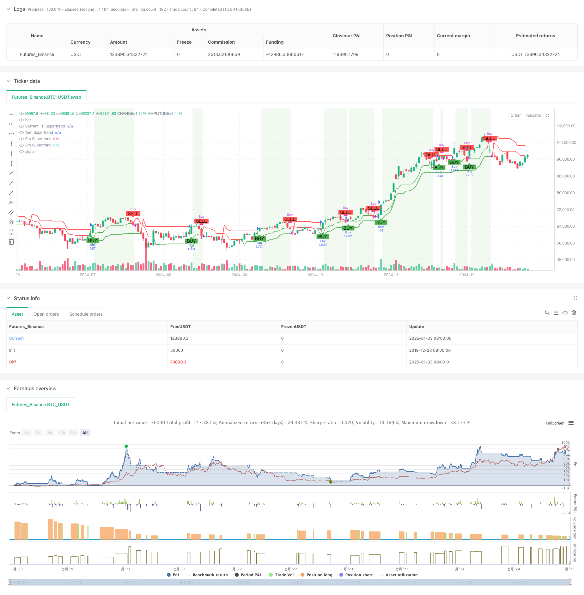

> Name

Dynamic combination algorithm of multi-timeframe Supertrend trend trading strategy-Multi-Timeframe-Supertrend-Dynamic-Trend-Trading-Algorithm
> Author

ChaoZhang

> Strategy Description



[trans]
#### Overview
This strategy is an adaptive trend following system based on the multi-time period Supertrend indicator. It builds a comprehensive trend identification framework by integrating Supertrend signals in three different time periods: 15 minutes, 5 minutes and 2 minutes. The strategy uses time filters to ensure it only runs during the most active trading periods, and positions are automatically closed at the end of the day to avoid overnight risk.
#### Strategy Principle
The core of the strategy is to confirm trading signals through trend consistency across multiple time periods. Specifically:
1. Calculate the Supertrend line for each time period using the ATR period and multiplier factor.
2. Trigger a buy when there is a bullish signal (price is above the Supertrend line) on all three time periods.
3. Selling is triggered when the price falls below the 5-minute period Supertrend line or reaches the end of the trading day.
4. Control trading hours through time zone settings and trading session filters (default 09:30-15:30).
#### Strategic Advantages
1. Multi-dimensional trend confirmation improves signal reliability and effectively reduces the risk of false breakthroughs.
2. Adaptive Supertrend parameter settings enable the strategy to adapt to different market fluctuation environments.
3. Strict time management mechanism avoids interference during inefficient trading periods.
4. A clear visual interface shows the trend status of all time periods.
5. The flexible warehouse management system supports percentage configuration.
#### Strategy Risk
1. In sideways and volatile markets, too many trading signals may be generated, increasing transaction costs.
2. Multiple filtering conditions may result in missing some potential profit opportunities.
3. Relying on parameter optimization, different market environments may require parameter adjustment.
4. The computational complexity is high and there may be problems with program execution efficiency.
#### Strategy optimization direction
1. Introduce a volatility adaptive mechanism to dynamically adjust Supertrend parameters according to market conditions.
2. Add trading volume confirmation indicators to improve the accuracy of trend judgment.
3. Develop an intelligent time filtering algorithm to automatically identify the best trading periods.
4. Optimize the position management algorithm to achieve more sophisticated risk control.
5. Add a market environment classification module and adopt differentiated strategies for different market characteristics.
#### Summary
This strategy builds a robust trading system through multi-time period trend analysis and strict risk control system. Although there is some room for optimization, its core logic is solid and suitable for further development and real-time application. The modular design of the system also provides a good foundation for future expansion. ||
#### Overview
This strategy is an adaptive trend following system based on the Multi-Timeframe Supertrend indicator. It integrates Supertrend signals from 15-minute, 5-minute, and 2-minute timeframes to build a comprehensive trend identification framework. The strategy employs a time filter to ensure operation only during the most active trading sessions and automatically closes positions at the end of the day to avoid overnight risk.

#### Strategy Principles
The core mechanism relies on trend consistency across multiple timeframes to confirm trading signals. Specifically:
1. Calculates Supertrend lines using ATR period and multiplier factor for each timeframe.
2. Triggers buy signals when bullish conditions align across all three timeframes (price above Supertrend lines).
3. Initiates sell signals when price breaks below the 5-minute Supertrend line or reaches end of trading day.
4. Controls trading hours through timezone settings and session filter (default 09:30-15:30).

#### Strategy Advantages
1. Multi-dimensional trend confirmation enhances signal reliability and reduces false breakout risks.
2. Adaptive Supertrend parameters enable strategy adjustment to different market volatility environments.
3. Strict time management mechanism eliminates interference from inefficient trading periods.
4. Clear visualization interface displays trend status across all timeframes.
5. Flexible position management system supports percentage-based configuration.

#### Strategy Risks
1. May generate excessive trading signals in ranging markets, increasing transaction costs.
2. Multiple filtering conditions might cause missed profitable opportunities.
3. Parameter optimization dependency requires adjustments for different market environments.
4. High computational complexity may lead to execution efficiency issues.

#### Optimization Directions
1. Introduce volatility adaptive mechanism to dynamically adjust Supertrend parameters.
2. Add volume confirmation indicators to improve trend judgment accuracy.
3. Develop intelligent time filtering algorithm to automatically identify optimal trading sessions.
4. Optimize position management algorithm for more precise risk control.
5. Add market environment classification module to implement differentiated strategies for various market characteristics.

#### Summary
The strategy constructs a robust trading system through multi-timeframe trend analysis and strict risk control mechanisms. While there is room for optimization, its core logic is solid and suitable for further development and live trading application. The modular design also provides a strong foundation for future extensions.[/trans]


> Source (PineScript)

``` pinescript
/*backtest
start: 2019-12-23 08:00:00
end: 2025-01-04 08:00:00
period: 1d
basePeriod: 1d
exchanges: [{"eid":"Futures_Binance","currency":"BTC_USDT"}]
*/

//@version=5
strategy("Multi-Timeframe Supertrend Strategy", 
         overlay=true, 
         shorttitle="MTF Supertrend TF", 
         default_qty_type=strategy.percent_of_equity, 
         default_qty_value=100, 
         initial_capital=50000, 
         currency=currency.USD)

// === Input Parameters === //
atrPeriod = input.int(title="ATR Period", defval=10, minval=1)
factor = input.float(title="Factor", defval=3.0, step=0.1)

// === Time Filter Parameters === //
// Define the trading session using input.session
// Format: "HHMM-HHMM", e.g., "0930-1530"
sessionInput = input("0930-1530", title="Trading Session")

// Specify the timezone (e.g., "Europe/Istanbul")
// Refer to the list of supported timezones: https://en.wikipedia.org/wiki/List_of_tz_database_time_zones
timezoneInput = input.string("Europe/Istanbul", title="Timezone", tooltip="Specify a valid IANA timezone (e.g., 'Europe/Istanbul', 'America/New_York').")

// === Calculate Supertrend for Different Timeframes === //
symbol = syminfo.tickerid

// 15-Minute Supertrend
[st_15m, dir_15m] = request.security(symbol, "15", ta.supertrend(factor, atrPeriod), lookahead=barmerge.lookahead_off)

// 5-Minute Supertrend
[st_5m, dir_5m] = request.security(symbol, "5", ta.supertrend(factor, atrPeriod), lookahead=barmerge.lookahead_off)

// 2-Minute Supertrend
[st_2m, dir_2m] = request.security(symbol, "2", ta.supertrend(factor, atrPeriod), lookahead=barmerge.lookahead_off)

// === Current Timeframe Supertrend === //
[st_current, dir_current] = ta.supertrend(factor, atrPeriod)

// === Time Filter: Check if Current Bar is Within the Trading Session === //
in_session = true

// === Define Trend Directions Based on Supertrend === //
is_up_15m = close > st_15m
is_up_5m  = close > st_5m
is_up_2m  = close > st_2m
is_up_current = close > st_current

// === Buy Condition === //
buyCondition = is_up_15m and is_up_5m and is_up_2m and is_up_current and in_session and strategy.position_size == 0

// === Sell Conditions === //
// 1. Price falls below the 5-minute Supertrend during trading session
sellCondition1 = close < st_5m

// 2. End of Trading Day: Sell at the close of the trading session
is_new_day = ta.change(time("D"))
sellCondition2 = not in_session and is_new_day

// Combined Sell Condition: Only if in Position
sellSignal = (sellCondition1 and in_session) or sellCondition2
sellCondition = sellSignal and strategy.position_size > 0

// === Execute Trades === //
if (buyCondition)
    strategy.entry("Buy", strategy.long)

if (sellCondition)
    strategy.close("Buy")

// === Plot Supertrend Lines === //
// Plotting current timeframe Supertrend
plot(st_current, title="Current TF Supertrend", color=is_up_current ? color.green : color.red, linewidth=2, style=plot.style_line)

// Plotting higher timeframe Supertrend lines
plot(st_15m, title="15m Supertrend", color=is_up_15m ? color.green : color.red, linewidth=1, style=plot.style_line)
plot(st_5m, title="5m Supertrend", color=is_up_5m ? color.green : color.red, linewidth=1, style=plot.style_line)
plot(st_2m, title="2m Supertrend", color=is_up_2m ? color.green : color.red, linewidth=1, style=plot.style_line)

// === Plot Buy and Sell Signals === //
plotshape(series=buyCondition, title="Buy Signal", location=location.belowbar, 
          color=color.green, style=shape.labelup, text="BUY", size=size.small)

plotshape(series=sellCondition, title="Sell Signal", location=location.abovebar, 
          color=color.red, style=shape.labeldown, text="SELL", size=size.small)

// === Optional: Background Color to Indicate Position === //
bgcolor(strategy.position_size > 0 ? color.new(color.green, 90) : na, title="In Position Background")

// === Alerts === //
// Create alerts for Buy and Sell signals
alertcondition(buyCondition, title="Buy Alert", message="Buy signal generated by MTF Supertrend Strategy with Time Filter.")
alertcondition(sellCondition, title="Sell Alert", message="Sell signal generated by MTF Supertrend Strategy with Time Filter.")

```

> Detail

https://www.fmz.com/strategy/477605

> Last Modified

2025-01-06 16:38:12
