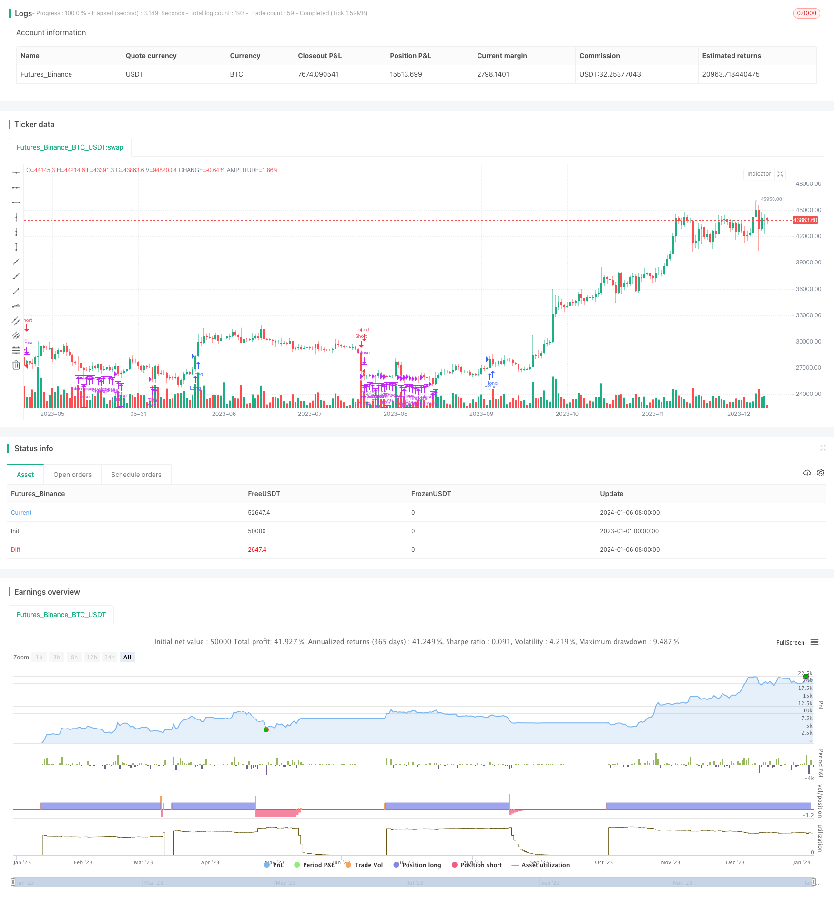

> Name

Supertrend-Take-Profit-Strategy
> Author

ChaoZhang

> Strategy Description


[trans]

## Overview
This strategy is based on supertrend indicators to determine entry points and goes long or short when the indicator reverses. At the same time, 3 take-profit orders with different proportions were set up, with fixed profit limits of 2%, 5% and 10% respectively, to lock in different levels of profits.
## Strategy Principle
This strategy uses supertrend indicators to determine market trends. The overtrend indicator is based on the average true volatility and a multiplier factor. When the price exceeds the upper band, it is an overbought condition, and when the price falls below the lower band, it is an oversold condition. Therefore, this strategy determines when to go long and short by monitoring changes in the direction of super-trend indicators.
Specifically, when the change of the super-trend indicator is less than 0, it means that the indicator reverses from top to bottom, forming a long signal; when the change of the super-trend indicator is greater than 0, it means that the indicator reverses from bottom to top, forming a short signal. After receiving a long or short signal, record the entry price and place an order to enter.
This strategy also sets three take-profit orders with different ratios. Their take-profit prices are 1.02 times, 1.05 times and 1.10 times the entry price respectively, corresponding to fixed profit stop orders of 2%, 5% and 10%. The lot size ratios of these three take-profit orders are set to 25%, 50% and 25% respectively. After receiving the position opening signal, this strategy will place these three take-profit orders at the same time, aiming to lock in different levels of profits.
## Advantage Analysis
This strategy has several advantages:
1. Use super-trend indicators to determine entry, which can effectively capture trend reversal points and make long and short positions accurately.
2. Set multiple take-profit order ratios to lock in different levels of profits and reduce drawdowns.
3. The take-profit setting is relatively conservative, focusing on target profits of 2%, 5% and 10%, to avoid the expansion of losses caused by pursuing excessive profits.
4. The strategy logic is simple and clear, easy to understand and modify, and is suitable for beginners in quantitative trading.
## Risk Analysis
There are also some risks with this strategy:
1. If the super-trend indicator is improperly set, the trend reversal point may be missed, resulting in inaccurate entry.
2. If the take-profit position is set too conservatively, you may miss the opportunity for the market to continue to run and bring greater profits.
3. Unexpected events lead to rapid gaps or breakouts, and the super-trend indicators have no time to react, causing the stop loss to be triggered.
4. There is no stop loss condition in the strategy, and there is a risk of unlimited losses.
## Optimization direction
This strategy can also be optimized from the following aspects:
1. Test different super-trend indicator parameters and optimize the sensitivity of the indicator.
2. Add stop loss conditions, set the maximum loss to be tolerated, and control risks.
3. Adjust the take-profit ratio and take-profit quantity according to different varieties and trading cycles.
4. Add other indicator filters to avoid frequent opening of positions in volatile market conditions.
5. Optimize capital utilization and reduce single risk by adjusting the default transaction amount of the strategy.
## Summarize
This strategy is generally simple and practical. It uses super-trend indicators to determine the entry point, and then uses multiple take-profit orders to lock in profits, which can effectively control risks. However, there are still areas in the strategy that can be further optimized, such as setting stop losses, optimizing parameters, etc., which provide directions for future improvements. Overall, this strategy is suitable for quantitative trading beginners to learn and practice.
||

## Overview

This strategy uses the Supertrend indicator to determine entry points, going long or short when the indicator reverses. It also sets three take profit orders at fixed profits of 2%, 5% and 10% to lock in gains at different levels.  

## Strategy Logic

The strategy utilizes the Supertrend indicator to identify trend direction. Supertrend is based on Average True Range and a multiplier factor. When price goes above the upper band it signals an overbought condition and when price falls below the lower band it signals an oversold condition. Therefore, the strategy detects reversals in Supertrend direction to determine entries.   

Specifically, when change in Supertrend is less than 0, it indicates the indicator has reversed from up to down, generating a long signal. When change in Supertrend is greater than 0, the indicator has reversed from down to up, generating a short signal. Upon receiving long or short signals, entry price is recorded and orders are placed.

The strategy also sets three take profit orders at 2%, 5% and 10% of the entry price, to lock in fixed target profits. The proportions of these orders are set at 25%, 50% and 25% respectively. After entry signals, these take profit orders are placed simultaneously to capture gains at different levels.  

## Advantage Analysis   

The strategy has the following advantages:

1. Using Supertrend for entries effectively captures trend reversal points for accurate long/short. 

2. Multiple take profit proportions allows locking in gains at different levels, reducing drawdowns.  

3. Conservative profit targets of 2%, 5% and 10% avoids overextension of profits leading to larger losses.

4. Simple and clear logic, easy to understand and modify, suitable for beginners.

## Risk Analysis

The strategy also has some risks:

1. Improper Supertrend parameters may cause missing reversal signals, leading to inaccurate entries.

2. Conservative take profit levels may miss opportunities to run profits further. 

3. Gaps and limit moves may trigger stops before Supertrend adjusts.

4. No stop loss condition means unlimited loss potential.

## Improvement Areas

Some ways the strategy can be optimized:

1. Test different Supertrend parameters to improve sensitivity.  

2. Add stop loss to limit maximum loss.

3. Adjust take profit ratios and quantities based on symbol and timeframe.

4. Add filters to avoid excessive trades in range-bound markets.

5. Optimize capital usage by adjusting default trade size to lower risk per trade.

## Summary

The strategy is simple and practical overall. It uses Supertrend for entries and multiple take profit orders to lock in gains, effectively controlling risk. But there is room for improvements like adding stops, optimizing parameters etc. which provides future enhancement directions. In summary, this strategy is suitable for beginners to learn and practice algorithmic trading.

[/trans]

> Strategy Arguments


|Argument|Default|Description|
|----|----|----|
|v_input_1|10|ATR Length|
|v_input_float_1|3|Factor|
|v_input_bool_1|true|TP1|
|v_input_float_2|2|TP Level (%)|
|v_input_int_1|25|Amount (%)|
|v_input_bool_2|true|TP2|
|v_input_float_3|5|TP Level (%)|
|v_input_int_2|50|Amount (%)|
|v_input_bool_3|true|TP3|
|v_input_float_4|10|TP Level (%)|
|v_input_int_3|25|Amount (%)|


> Source (PineScript)

``` pinescript
/*backtest
start: 2023-01-01 00:00:00
end: 2024-01-07 00:00:00
period: 1d
basePeriod: 1h
exchanges: [{"eid":"Futures_Binance","currency":"BTC_USDT"}]
*/

//@version=5
strategy( "Supertrend with TP", overlay=true )

// Supertrend Settings
atrPeriod = input(10, "ATR Length")
factor = input.float(3.0, "Factor", step = 0.01)

// TP's
tp1Open = input.bool(true, "TP1")
tp1 = input.float(2.0, "TP Level (%)", step = 0.1) / 100
tp1Amount = input.int(25, "Amount (%)", step = 1)
tp2Open = input.bool(true, "TP2")
tp2 = input.float(5.0, "TP Level (%)", step = 0.1) / 100
tp2Amount = input.int(50, "Amount (%)", step = 1)
tp3Open = input.bool(true, "TP3")
tp3 = input.float(10.0, "TP Level (%)", step = 0.1) / 100
tp3Amount = input.int(25, "Amount (%)", step = 1)

[_, direction] = ta.supertrend(factor, atrPeriod)

entryPrice = 0.0
entryPrice := entryPrice[1]

if ta.change(direction) < 0
    strategy.entry("Long", strategy.long)
    entryPrice := close

if ta.change(direction) > 0
    strategy.entry("Short", strategy.short)
    entryPrice := close

if (tp1Open)
    strategy.exit ("TP1", from_entry="Long", limit=entryPrice * (1 + tp1), qty_percent=tp1Amount)
    strategy.exit ("TP1", from_entry="Short", limit=entryPrice * (1 - tp1), qty_percent=tp1Amount)

if (tp2Open)
    strategy.exit ("TP2", from_entry="Long", limit=entryPrice * (1 + tp2), qty_percent=tp2Amount)
    strategy.exit ("TP2", from_entry="Short", limit=entryPrice * (1 - tp2), qty_percent=tp2Amount)
    
if (tp3Open)    
    strategy.exit ("TP3", from_entry="Long", limit=entryPrice * (1 + tp3), qty_percent=tp3Amount)
    strategy.exit ("TP3", from_entry="Short", limit=entryPrice * (1 - tp3), qty_percent=tp3Amount)
```

> Detail

https://www.fmz.com/strategy/438016

> Last Modified

2024-01-08 11:08:39
