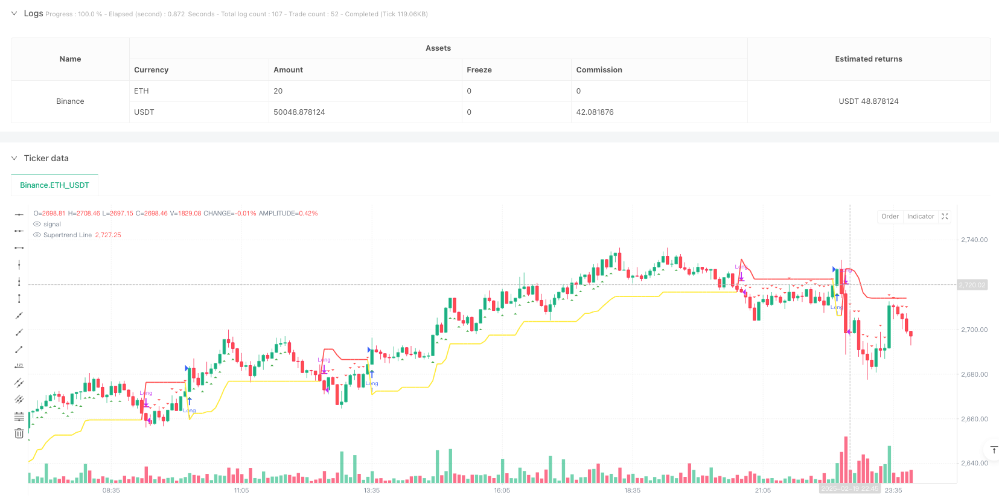
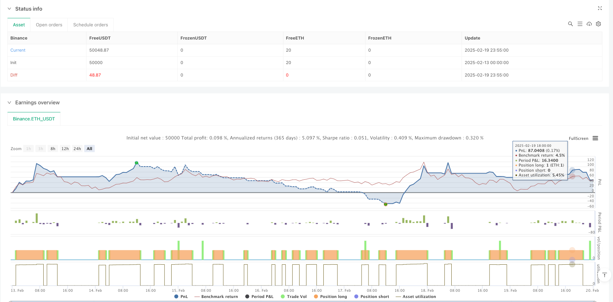

> Name

Multi-Indicator-Momentum-Trend-Following-Strategy-Quantitative-Trading-System-Based-on-Supertrend-and-ADX-Dual-Confirmation
> Author

ianzeng123

> Strategy Description





[trans]
#### Overview
This strategy is a trend tracking system that combines multiple technical indicators. It is mainly based on the trend direction judgment of the Supertrend indicator, and combines the trend strength confirmation of ADX (Average Trend Index) and the fluctuation range judgment of RSI (Relative Strength Index) to optimize the entry timing. The strategy adopts a one-way long mode and uses multiple indicator cross-validation to improve the accuracy and reliability of transactions.
#### Strategy Principle
The core logic of the strategy is based on the following three key components:
1. The Supertrend indicator is used to determine the main trend direction. When the indicator turns downward, it represents the formation of an upward trend;
2. The ADX indicator is used to measure the strength of the trend. When the ADX value exceeds 14, it indicates that the trend is strong enough;
3. The RSI indicator is used to determine the price fluctuation range, and enter the market between 30-60 to avoid excessive chasing of increases.
Admission conditions must be met at the same time:
- Supertrend direction downward (supertrendDirection == -1)
- ADX value is greater than threshold 14 (adx > adxThreshold)
- RSI is within the specified range (rsi < 40 or rsi > 60)
Conditions for closing positions:
When the Supertrend direction turns upward (supertrendDirection == 1), close the position.
#### Strategic Advantages
1. Multi-indicator cross-validation improves the reliability of trading signals and reduces the risk of false breakthroughs.
2. Combined with the double confirmation mechanism of trend direction and intensity, it can better grasp trend trading opportunities.
3. Use the RSI range limit to avoid entering the market in the excessive chasing area and improve the cost-effectiveness of the entry point.
4. The strategy logic is clear and the parameters are highly adjustable, making it easy to optimize according to different market characteristics.
5. It has set up complete visualization and reminder functions to help monitor strategy performance in real time.
#### Strategy Risk
1. The use of too many indicators may cause signal lag and miss trading opportunities in rapidly volatile markets.
2. The one-way long strategy cannot make a profit in a downward trend, and there is a large directional risk.
3. The fixed ADX threshold may perform inconsistently in different market environments.
4. RSI range setting may lead to missing some important trend starting points.
5. The sensitivity of the Supertrend parameter may lead to excessive false signals.
#### Strategy optimization direction
1. Introduce adaptive ADX threshold setting and dynamically adjust the threshold according to market volatility.
2. Increase the time period requirements for trend confirmation to avoid short-term false breakthroughs.
3. Optimize the dynamic adjustment mechanism of RSI range and improve the accuracy of entry timing.
4. Consider adding a short-selling function to improve the market-wide adaptability of the strategy.
5. Introduce a stop-loss mechanism to control the risk of a single transaction.
6. Add trading volume analysis indicators to improve signal credibility.
#### Summary
This strategy builds a relatively complete trend following trading system through the combined application of multiple technical indicators. The core advantage of the strategy is to improve the reliability of trading signals through cross-validation of different indicators, but it also faces the challenges of signal lag and parameter optimization. Through the proposed optimization direction, the strategy is expected to further improve its adaptability and stability while maintaining its existing advantages. Overall, this is a strategy with a good basic framework, and through continuous optimization and improvement, it is expected to develop into a more comprehensive and robust trading system. ||
#### Overview
This strategy is a trend-following system that combines multiple technical indicators, primarily based on Supertrend indicator for trend direction determination, integrated with ADX (Average Directional Index) for trend strength confirmation and RSI (Relative Strength Index) for volatility range assessment to optimize entry timing. The strategy adopts a long-only mode, utilizing multiple indicator cross-validation to enhance trading accuracy and reliability.

#### Strategy Principles
The core logic of the strategy is based on three key components:
1. Supertrend indicator for determining the main trend direction, with a downward shift indicating an uptrend formation;
2. ADX indicator for measuring trend strength, with values above 14 indicating sufficient trend momentum;
3. RSI indicator for assessing price volatility range, entering between 30-60 to avoid excessive chasing.

Entry conditions must simultaneously satisfy:
- Supertrend direction downward (supertrendDirection == -1)
- ADX value above threshold 14 (adx > adxThreshold)
- RSI within specified range (rsi < 40 or rsi > 60)

Exit conditions:
Position closure is executed when Supertrend direction turns upward (supertrendDirection == 1).

#### Strategy Advantages
1. Multiple indicator cross-validation enhances trading signal reliability, reducing false breakout risks.
2. Dual confirmation mechanism combining trend direction and strength better captures trend trading opportunities.
3. RSI range restriction prevents entry in overbought areas, improving entry point value.
4. Clear strategy logic with adjustable parameters facilitates optimization for different market characteristics.
5. Comprehensive visualization and alert functions aid real-time strategy monitoring.

#### Strategy Risks
1. Multiple indicators may lead to signal lag, missing trading opportunities in rapidly volatile markets.
2. Long-only strategy cannot profit in downtrends, presenting significant directional risk.
3. Fixed ADX threshold may perform inconsistently across different market environments.
4. RSI range settings might miss important trend initiation points.
5. Supertrend parameter sensitivity may generate excessive false signals.

#### Strategy Optimization Directions
1. Introduce adaptive ADX threshold settings, dynamically adjusting thresholds based on market volatility.
2. Add trend confirmation time period requirements to avoid short-term false breakouts.
3. Optimize RSI range dynamic adjustment mechanism to improve entry timing accuracy.
4. Consider adding short functionality to enhance full market adaptability.
5. Introduce stop-loss mechanism to control single trade risk.
6. Add volume analysis indicators to increase signal credibility.

#### Summary
This strategy constructs a relatively comprehensive trend-following trading system through the combined application of multiple technical indicators. The core advantage lies in enhancing trading signal reliability through cross-validation of different indicators, while simultaneously facing challenges of signal lag and parameter optimization. Through the proposed optimization directions, the strategy has the potential to further improve its adaptability and stability while maintaining existing advantages. Overall, this is a strategy with a solid basic framework that, through continuous optimization and improvement, has the potential to develop into a more comprehensive and robust trading system.[/trans]


> Source (PineScript)

``` pinescript
/*backtest
start: 2025-02-13 00:00:00
end: 2025-02-20 00:00:00
period: 5m
basePeriod: 5m
exchanges: [{"eid":"Binance","currency":"ETH_USDT"}]
*/

//@version=6
strategy("Supertrend + ADX Strategy", overlay=true)

// Parameter für ADX und Supertrend
diLength = input.int(14, title="DI Length")
adxSmoothing = input.int(14, title="ADX Smoothing")
adxThreshold = input.float(14)
supertrendFactor = input.float(3.0, title="Supertrend Factor")
supertrendPeriod = input.int(14, title="Supertrend Period")

// Berechnung von +DI, -DI und ADX
[diplus, diminus, adx] = ta.dmi(diLength, adxSmoothing)

// RSI-Berechnung
rsiLength = input.int(14, title="RSI Length")
rsi = ta.rsi(close, rsiLength)

// Supertrend-Berechnung
[supertrendValue, supertrendDirection] = ta.supertrend(supertrendFactor, supertrendPeriod)

// Long-Einstiegsbedingung
longCondition = supertrendDirection == -1 and adx > adxThreshold and (rsi < 40 or rsi > 60)

// Long-Ausstiegsbedingung (wenn Supertrend grün wird)
exitCondition = supertrendDirection == 1

// Visualisierung der Einstiegssignale (Pfeile)
plotshape(series=longCondition, location=location.belowbar, color=color.green, style=shape.triangleup, title="Buy Signal")
plotshape(series=exitCondition, location=location.abovebar, color=color.red, style=shape.triangledown, title="Sell Signal")

// Supertrend-Plot im Chart
plot(supertrendValue, color=supertrendDirection == -1 ? color.yellow : color.red, linewidth=2, title="Supertrend Line")

// Alerts für Einstieg/Ausstieg
alertcondition(longCondition, title="Long Signal", message="Supertrend + ADX: Long Entry")
alertcondition(exitCondition, title="Exit Signal", message="Supertrend turned Green: Exit")

// Strategieausführung
if longCondition and supertrendDirection == -1
    strategy.entry("Long", strategy.long)

if exitCondition
    strategy.close("Long")


```

> Detail

https://www.fmz.com/strategy/483055

> Last Modified

2025-02-27 17:07:46
