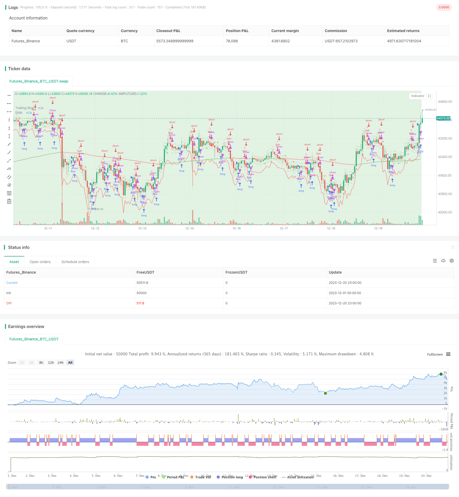

> Name

Momentum indicator assisted moving average reversal trading strategy Supply-Demand-Momentum-Reversal-Trading-Strategy
> Author

ChaoZhang

> Strategy Description


 [trans]
## Overview
This strategy uses a combination of momentum indicators and moving averages to identify market trends and reversal points, and trade when the trend turns. It is a trend following and counter-trend trading strategy. It is mainly composed of supply and demand areas, EMA moving average, various HH, LL, LH, HL long and short area markers, ATR stop loss and other modules.
## Strategy Principle
### 1. Identification of supply and demand areas
The supply and demand relationship is distinguished based on the range of the high and low points of the K line. The red area is the supply area where supply exceeds demand, and the green area is the demand area where demand exceeds supply.
### 2. EMA trend judgment
Calculate and draw the EMA moving average with a length of 200, and judge the long and short trend through the relationship between the price and the EMA. If the price is higher than the EMA, it is considered an upward trend, and if the price is lower than the EMA, it is considered a downward trend.
### 3. Long and short area markers
Determine the reversal area based on the high and low points of the last two K lines:
- HH Zone (Higher High Zone) — 2 consecutive K-line highs hit new highs
- LL area (Lower Low area) - 2 consecutive K-line lows hit new lows
- LH area (Lower High area) - The latest high point of the K line is a new high, and the high point of the second K line is reversed, which is a pullback high point.
- HL area (Higher Low area) - The latest low of the K-line is a new low, and the low of the second K-line is reversed, which is a rebound low.
### 4. ATR Stop Loss Trailing
Calculate the 14-period ATR value and multiply it by a factor of 2 to become the stop loss level of this strategy.
### 5. Entry and Stop Loss Exit
Monitor the relationship between the price and the previous day's Kline high and low points. A long signal is generated when the price is above the previous day's high; a short signal is generated when the price is below the previous day's low. The entry signal is delayed to the third K line for confirmation to avoid false signals caused by shock fluctuations. Using the ATR stop-loss tracking method, if the price retracement exceeds the stop-loss line, the current signal will be actively stopped and exited.
## Advantage Analysis
1. Use a variety of indicators to identify trends and key reversal areas to increase the probability of profit.
2. The ATR stop loss method can effectively control the risk of single loss. 
3. Delay entry to determine effective signals and reduce the probability of wrong transactions.
## Risk Analysis
1. Relying only on technical indicators without combining fundamental information may miss important information and lead to transaction failure.
2. The ATR stop loss method may be breached in a large market, resulting in losses.
3. In a volatile trend, EMA reversal trading signals are frequent, which may lead to over-trading.
Risk resolution:
1. Determine operations based on major economic data and policy judgments.
2. The ATR stop loss coefficient can be appropriately expanded to ensure there is enough space. 
3. Adjust the cycle parameters of ATR stop loss to avoid being too sensitive during shocks.
## Optimization direction
1. Combine with other technical indicators such as MACD, RSI, etc. to determine the timing of entry.
2. Test different combinations of period parameters and coefficient parameters to find the optimal parameters.
3. You can consider adding and then breaking through the filter to avoid signal trapping.
4. Use machine learning and other methods to dynamically optimize parameters.
## Summary
This strategy comprehensively uses supply and demand analysis, trend judgment, reversal identification and stop-loss management modules to effectively identify market turning opportunities in key areas. It is an effective trend tracking and counter-trend trading strategy. At the same time, continuous testing and optimization, supplemented by manual experience and judgment, are required to achieve long-term stable returns.
|| 

## Overview  
This strategy combines momentum indicators and moving averages to identify market trends and reversal points for trading when the trend changes direction. It belongs to trend following and countertrend trading strategies. The main components include supply and demand zones, EMA, various HH, LL, LH, HL long and short zones, ATR trailing stop loss etc.

## Strategy Logic  
### 1. Supply and Demand Identification
Distinguish supply and demand relationship based on high and low range of Kline. Red areas indicate supply exceeds demand supply zones. Green areas indicate demand exceeds supply demand zones.

### 2. EMA Trend Judgement  
Plot 200 period EMA and determine uptrend and downtrend by comparing price with EMA. Price above EMA is considered as uptrend, while price below EMA as downtrend.

### 3. Long and Short Zone Marking 
Determine reversal zones based on recent 2 candle’s high and low points:
- HH Zone (Higher High Zone) - Consecutive 2 candle highs make higher high
- LL Zone (Lower Low Zone) - Consecutive 2 candle lows make lower low
- LH Zone (Lower High Zone) - Recent higher high reversing into lower high
- HL Zone (Higher Low Zone) - Recent lower low reversing into higher low

### 4. ATR Trailing Stop Loss
Calculate 14 period ATR value which will be multiplied by a factor of 2 to derive the stop loss level.

### 5. Entry and Stop Loss Exit  
Monitor price relationship with previous candle’s high/low points. Long signal triggers when price breaks above previous high. Short signal triggers when price breaks below previous low. Delay entry signal confirmation until the 3rd candle to avoid false signals. Exit with stop loss when price pulls back beyond the ATR trailing stop loss level.  

## Advantage Analysis
1. Utilize multiple indicators to identify trend and key reversal areas to improve profitability rate.  
2. ATR stop loss can effectively limit per trade loss risk.
3. Delayed entry signal confirmation minimizes false trading.

## Risk Analysis
1. Rely solely on technical indicators without considering fundamental information may lead to trading failures from missing key data.
2. ATR stop loss may get run-over during huge volatility resulting in losses. 
3. Frequent EMA reversal signals during ranging markets can lead to over-trading.

Risk Solutions:
1. Complement with economic data and policy judgements.  
2. Allow wider buffer for ATR multiplier coefficient.
3. Adjust ATR period parameter to avoid sensitivity during ranges.   

## Enhancement Opportunities
1. Complement with technical indicators like MACD, RSI etc to improve timing.
2. Backtest different period and multiplier parameter combinations for optimization.  
3. Consider adding re-breakout filter to avoid signal whipsaws.
4. Employ machine learning etc to dynamically optimize parameters.  

## Conclusion
This strategy combines supply/demand analysis, trend determination, reversal identification and risk management modules effectively to spot market reversal opportunities at key areas. It is a robust system for trend following and countertrend setups. Continuous testing, optimization and human experience judgements are crucial for long term steady profits.

[/trans]

> Strategy Arguments


|Argument|Default|Description|
|----|----|----|
|v_input_1|true|(?Signals)Show Buy Signals|
|v_input_2|true|Show Sell Signals|
|v_input_3|true|(?Zones)Show HL Zone|
|v_input_4|true|Show LH Zone|
|v_input_5|true|Show HH Zone|
|v_input_6|true|Show LL Zone|
|v_input_7|200|(?EMA Settings)EMA Length|
|v_input_8|14|(?Trailing Stop)ATR Length|
|v_input_9|2|ATR Multiplier|


> Source (PineScript)

``` pinescript
/*backtest
start: 2023-12-01 00:00:00
end: 2023-12-20 23:59:59
period: 1h
basePeriod: 15m
exchanges: [{"eid":"Futures_Binance","currency":"BTC_USDT"}]
*/

//@version=5
strategy("Supply and Demand Zones with EMA and Trailing Stop", shorttitle="SD Zones", overlay=true)

showBuySignals = input(true, title="Show Buy Signals", group="Signals")
showSellSignals = input(true, title="Show Sell Signals", group="Signals")
showHLZone = input(true, title="Show HL Zone", group="Zones")
showLHZone = input(true, title="Show LH Zone", group="Zones")
showHHZone = input(true, title="Show HH Zone", group="Zones")
showLLZone = input(true, title="Show LL Zone", group="Zones")

emaLength = input(200, title="EMA Length", group="EMA Settings")
atrLength = input(14, title="ATR Length", group="Trailing Stop")
atrMultiplier = input(2, title="ATR Multiplier", group="Trailing Stop")

// Function to identify supply and demand zones
getZones(src, len, mult) =>
    base = request.security(syminfo.tickerid, "D", close)
    upper = request.security(syminfo.tickerid, "D", high)
    lower = request.security(syminfo.tickerid, "D", low)
    multiplier = request.security(syminfo.tickerid, "D", mult)
    zonetype = base + multiplier * len
    zone = src >= zonetype
    [zone, upper, lower]

// Identify supply and demand zones
[supplyZone, _, _] = getZones(close, high[1] - low[1], 1)
[demandZone, _, _] = getZones(close, high[1] - low[1], -1)

// Plot supply and demand zones
bgcolor(supplyZone ? color.new(color.red, 80) : na)
bgcolor(demandZone ? color.new(color.green, 80) : na)

// EMA with Linear Weighted method
ema = ta.ema(close, emaLength)

// Color code EMA based on its relation to candles
emaColor = close > ema ? color.new(color.green, 0) : close < ema ? color.new(color.red, 0) : color.new(color.yellow, 0)

// Plot EMA
plot(ema, color=emaColor, title="EMA")

// Entry Signal Conditions after the third candle
longCondition = ta.crossover(close, high[1]) and (bar_index >= 2)
shortCondition = ta.crossunder(close, low[1]) and (bar_index >= 2)

// Trailing Stop using ATR
atrValue = ta.atr(atrLength)
trailStop = close - atrMultiplier * atrValue

// Strategy Entry and Exit
if (longCondition)
    strategy.entry("Buy", strategy.long)
    strategy.exit("TrailStop", from_entry="Buy", loss=trailStop)

if (shortCondition)
    strategy.entry("Sell", strategy.short)
    strategy.exit("TrailStop", from_entry="Sell", loss=trailStop)

// Plot Entry Signals
plotshape(series=showBuySignals ? longCondition : na, title="Buy Signal", color=color.new(color.green, 0), style=shape.triangleup, location=location.belowbar)
plotshape(series=showSellSignals ? shortCondition : na, title="Sell Signal", color=color.new(color.red, 0), style=shape.triangledown, location=location.abovebar)

// Plot Trailing Stop
plot(trailStop, color=color.new(color.red, 0), title="Trailing Stop")

// Plot HH, LL, LH, and HL zones
plotshape(series=showHHZone and ta.highest(high, 2)[1] and ta.highest(high, 2)[2] ? 1 : na, title="HH Zone", color=color.new(color.blue, 80), style=shape.triangleup, location=location.abovebar)
plotshape(series=showLLZone and ta.lowest(low, 2)[1] and ta.lowest(low, 2)[2] ? 1 : na, title="LL Zone", color=color.new(color.blue, 80), style=shape.triangledown, location=location.belowbar)
plotshape(series=showLHZone and ta.highest(high, 2)[1] and ta.lowest(low, 2)[2] ? 1 : na, title="LH Zone", color=color.new(color.orange, 80), style=shape.triangleup, location=location.abovebar)
plotshape(series=showHLZone and ta.lowest(low, 2)[1] and ta.highest(high, 2)[2] ? 1 : na, title="HL Zone", color=color.new(color.orange, 80), style=shape.triangledown, location=location.belowbar)

```

> Detail

https://www.fmz.com/strategy/439652

> Last Modified

2024-01-22 17:34:05
