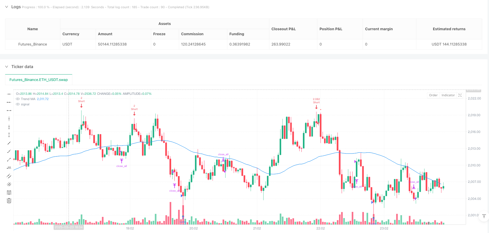
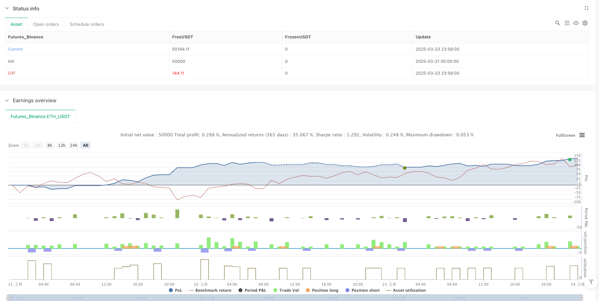

> Name

Support-and-Resistance-Enhanced-Momentum-Reversal-Strategy
> Author

ianzeng123

> Strategy Description




[trans]

#### Overview
The Support and Resistance Enhanced Momentum Reversal Strategy is a trading system based on technical analysis that captures potential trading opportunities by identifying price reversal signals near key support and resistance levels. This strategy combines a variety of technical indicators, including support and resistance levels, candlestick pattern identification, relative strength index (RSI) divergence, volume confirmation, and moving average trend filters, into a comprehensive trading decision-making framework. The core idea is to look for possible reversal signals when price approaches important support or resistance levels and trade them with appropriate risk management.
#### Strategy Principle
The core principle of this strategy is to identify high-probability reversal points through multiple conditional filters:
1. **Support and Resistance Identification**: The strategy uses the highest and lowest prices in the past N periods (default 20) to determine key resistance and support levels.
2. **Price Proximity Judgment**: When the price is within a specific percentage range of the support or resistance level (default 0.5%), the strategy begins to look for potential reversal signals.
3. **Reversal Signal Identification**:
   - Candlestick Patterns: Strategies to identify classic reversal patterns such as hammer, shooting star, bullish engulfing and bearish engulfing
   - RSI Divergence: When price makes a new low but RSI does not make a new low (bullish divergence), or when price makes a new high but RSI does not make a new high (bearish divergence)   
4. **Trend Confirmation**: Use the Simple Moving Average (SMA) to determine the overall trend direction, looking for bullish signals in a downtrend and bearish signals in an uptrend.
5. **Trading volume confirmation**: The current trading volume is required to be higher than 1.5 times the average trading volume in the past 14 periods to increase signal reliability.
6. **Risk Management**:
   - Dynamic position adjustment: Calculate risk factors based on ATR (average true fluctuation range) and adjust the number of transactions
   - Stop loss: based on the percentage set by the user (default 0.5%)
   - Take profit: based on the percentage set by the user (default 0.5%)
   - Maximum position holding time: forced closing after 18 periods
When all conditions are met, the strategy will generate a long or short signal and execute the trade according to preset risk management rules.
#### Strategic Advantages
1. **Multiple Confirmation Mechanism**: This strategy combines price action, technical indicators and trading volume confirmation, which greatly reduces the risk of false signals and improves the accuracy of transactions.
2. **Adapt to market fluctuations**: By dynamically adjusting the position size through ATR, the strategy can adapt to the volatility under different market conditions, reducing positions when volatility is high and increasing positions appropriately when volatility is low.
3. **Improved risk control**: The strategy has built-in multiple risk control measures, including fixed stop loss, take profit, trailing stop loss and maximum position limit, which can effectively control the potential loss of each transaction.
4. **Precise entry points**: By identifying reversal signals near support and resistance levels, the strategy is able to trade at potentially favorable price points, improving the risk-reward ratio.
5. **Flexible parameter settings**: Users can adjust multiple key parameters according to personal risk preferences and trading characteristics, including stop loss ratio, support and resistance proximity, RSI parameters, etc., making the strategy highly adaptable.
#### Strategy Risk
1. **False breakthrough risk**: Near support and resistance levels, the market often experiences false breakthroughs, that is, prices briefly break through and then quickly fall back, which may lead to false signals. The solution is to increase the confirmation period or adjust the proximity parameters.
2. **Extreme market risk**: When the market fluctuates violently or major news events occur, the normal technical model may fail and the strategy may face large losses. It is recommended to pause the strategy or reduce positions during such periods.
3. **Parameter optimization risk**: Over-optimizing parameters may lead to a strategy that performs well on historical data but has poor results in real trading. Overfitting should be avoided and the parameters should be kept reasonable and robust.
4. **Lagging trend changes**: There is a lag in using moving averages to judge trends, which may lead to missed opportunities or false signals in the initial stage of the trend. Consider incorporating more sensitive trend indicators.
5. **Insufficient trading volume risk**: In certain markets or periods, trading volume may be generally low, making it difficult to meet the trading volume confirmation conditions. The transaction volume confirmation multiple can be adjusted according to specific market characteristics.
#### Strategy optimization direction
1. **Support and resistance calculation optimization**: The current strategy uses simple highest/lowest prices to determine support and resistance levels. You can consider using more complex methods, such as Fibonacci retracements, volume and price analysis, or structural peak and valley identification, etc., to obtain more accurate support and resistance levels.
2. **Multi-time frame analysis**: The introduction of multi-time frame analysis can enhance the reliability of the strategy, such as confirming the overall trend direction in a larger time frame, and then finding precise entry points in a smaller time frame.
3. **Machine learning optimization**: Consider introducing machine learning algorithms to dynamically optimize strategy parameters or predict reversal probabilities. Parameters can be automatically adjusted based on market conditions to improve strategy adaptability.
4. **Market status classification**: Add classification of market status (such as distinguishing between oscillating markets and trending markets), and use different trading logic and parameter settings for different market statuses.
5. **Sentiment Indicator Integration**: Consider integrating market sentiment indicators such as VIX or Relative Volume Change to better capture market turning points and avoid trading during adverse conditions.
6. **Stop loss strategy optimization**: You can consider implementing a more intelligent stop loss strategy, such as dynamic stop loss based on volatility or stop loss at important structural levels, instead of just a fixed percentage stop loss.
#### Summary
The Support-Resistance Enhanced Momentum Reversal Strategy is a complete trading system that emphasizes risk management and multiple confirmations. By combining support and resistance levels, candlestick patterns, RSI divergence, volume confirmation, and trend filtering, this strategy effectively identifies potential high-probability reversal points. Its built-in risk management mechanisms, including dynamic position adjustment, multiple stop-loss methods and maximum position time limits, make it a relatively robust trading method.
While this strategy offers several advantages, traders should be aware of potential risks such as false breakouts, extreme markets, and parameter optimization. By continuing to optimize the support and resistance calculation method, introducing multi-time frame analysis, applying machine learning technology, increasing market status classification and integrating sentiment indicators, this strategy still has a lot of room for improvement.
Overall, this is a trading strategy with a clear concept and complete structure, suitable for traders with certain experience to apply and further optimize under appropriate risk management. ||
#### Overview
The Support and Resistance Enhanced Momentum Reversal Strategy is a technical analysis-based trading system designed to capture potential reversal opportunities near key support and resistance levels. This strategy combines multiple technical indicators, including support/resistance levels, candlestick pattern recognition, Relative Strength Index (RSI) divergence, volume confirmation, and moving average trend filters to form a comprehensive trading decision framework. The core concept is to identify potential reversal signals when price approaches significant support or resistance zones and execute trades under appropriate risk management conditions.

#### Strategy Principles
The core principles of this strategy involve filtering for high-probability reversal points through multiple conditions:

1. **Support/Resistance Identification**: The strategy uses the highest and lowest prices over a specified period (default 20 bars) to determine key resistance and support levels.

2. **Proximity Assessment**: When price is within a specific percentage range (default 0.5%) of support or resistance levels, the strategy begins looking for potential reversal signals.

3. **Reversal Signal Identification**:
   - Candlestick patterns: The strategy identifies classic reversal formations such as hammers, shooting stars, bullish engulfing, and bearish engulfing patterns
   - RSI Divergence: When price makes a new low but RSI doesn't (bullish divergence), or price makes a new high but RSI doesn't (bearish divergence)
   
4. **Trend Confirmation**: Using a Simple Moving Average (SMA) to determine the overall trend direction, looking for bullish signals in downtrends and bearish signals in uptrends.

5. **Volume Confirmation**: Requiring current volume to be at least 1.5 times the average volume over the past 14 periods, enhancing signal reliability.

6. **Risk Management**:
   - Dynamic position sizing: Calculating risk factors based on ATR (Average True Range) to adjust trade quantity
   - Stop-loss: Based on user-defined percentage (default 0.5%)
   - Take-profit: Based on user-defined percentage (default 0.5%)
   - Maximum holding period: Forced exit after 18 bars

When all conditions are met, the strategy generates either long or short signals and executes trades according to the preset risk management rules.

#### Strategy Advantages
1. **Multiple Confirmation Mechanisms**: The strategy combines price action, technical indicators, and volume confirmation, significantly reducing the risk of false signals and improving trading accuracy.

2. **Adaptability to Market Volatility**: Through ATR-based dynamic position sizing, the strategy can adapt to varying market conditions, reducing position size during high volatility and appropriately increasing it during low volatility.

3. **Comprehensive Risk Control**: The strategy incorporates multiple risk control measures, including fixed stop-loss, take-profit, trailing stops, and maximum holding period limits, effectively controlling potential losses for each trade.

4. **Precise Entry Points**: By identifying reversal signals near support and resistance levels, the strategy can execute trades at potentially favorable price points, improving the risk-to-reward ratio.

5. **Flexible Parameter Settings**: Users can adjust multiple key parameters according to personal risk preferences and instrument characteristics, including stop-loss percentage, support/resistance proximity, RSI parameters, etc., giving the strategy high adaptability.

#### Strategy Risks
1. **False Breakout Risk**: Near support and resistance levels, markets often exhibit false breakouts where prices temporarily break through before quickly reversing, which may lead to incorrect signals. Solutions include adding confirmation periods or adjusting proximity parameters.

2. **Extreme Market Risk**: During severe market volatility or major news events, normal technical patterns may fail, and the strategy may face significant losses. It's advisable to pause the strategy or reduce position sizes during such periods.

3. **Parameter Optimization Risk**: Excessive optimization of parameters may lead to a strategy that performs excellently on historical data but poorly in live trading. Over-fitting should be avoided, maintaining reasonable and robust parameters.

4. **Trend Change Lag**: Using moving averages to determine trends has inherent lag, which may cause missed opportunities or false signals during the initial stages of trend changes. Consider incorporating more sensitive trend indicators.

5. **Insufficient Volume Risk**: In certain markets or time periods, volume may be generally low, making volume confirmation conditions difficult to meet. Volume confirmation multipliers can be adjusted based on specific market characteristics.

#### Strategy Optimization Directions
1. **Support/Resistance Calculation Enhancement**: The current strategy uses simple high/low prices to determine support/resistance levels. More complex methods could be considered, such as Fibonacci retracements, volume-price analysis, or structural peak-trough identification, to obtain more precise support and resistance levels.

2. **Multi-Timeframe Analysis**: Introducing multi-timeframe analysis can enhance strategy reliability, for example, confirming the overall trend direction in larger timeframes and then seeking precise entry points in smaller timeframes.

3. **Machine Learning Optimization**: Consider introducing machine learning algorithms to dynamically optimize strategy parameters or predict reversal probabilities, automatically adjusting parameters based on market states to improve strategy adaptability.

4. **Market State Classification**: Add classification of market states (e.g., distinguishing between ranging and trending markets) and use different trading logic and parameter settings for different market states.

5. **Sentiment Indicator Integration**: Consider integrating market sentiment indicators, such as VIX or relative volume change rates, to better capture market turning points and avoid trading under unfavorable conditions.

6. **Stop-Loss Strategy Enhancement**: Consider implementing more intelligent stop-loss strategies, such as volatility-based dynamic stops or structure-based stops, rather than just fixed percentage stops.

#### Summary
The Support and Resistance Enhanced Momentum Reversal Strategy is a complete trading system that emphasizes risk management and multiple confirmations. By combining support/resistance levels, candlestick patterns, RSI divergence, volume confirmation, and trend filtering, the strategy can effectively identify potential high-probability reversal points. Its built-in risk management mechanisms, including dynamic position sizing, multiple stop methods, and maximum holding period limits, make it a relatively robust trading approach.

Despite its many advantages, traders should be aware of potential risks such as false breakouts, extreme markets, and parameter optimization pitfalls. The strategy still has significant room for improvement through continuous optimization of support/resistance calculation methods, introduction of multi-timeframe analysis, application of machine learning techniques, addition of market state classification, and integration of sentiment indicators.

Overall, this is a trading strategy with clear concepts and complete structure, suitable for experienced traders to apply and further optimize under appropriate risk management.[/trans]


> Source (PineScript)

``` pinescript
/*backtest
start: 2025-03-21 00:00:00
end: 2025-03-24 00:00:00
period: 2m
basePeriod: 2m
exchanges: [{"eid":"Futures_Binance","currency":"ETH_USDT"}]
*/

//@version=6
// TradingView Strategy: Gold Reversal with S/R (Enhanced)
// Targets reversals near support/resistance with additional filters

strategy("Gold Reversal with S/R Enhanced", overlay=true, default_qty_type=strategy.percent_of_equity, default_qty_value=10)

// --- Inputs ---
stop_loss_percent = input.float(0.5, "Stop Loss (%)", minval=0.1, maxval=5.0)
take_profit_percent = input.float(0.5, "Take Profit (%)", minval=0.1, maxval=10.0)
rsi_period = input.int(14, "RSI Period", minval=2, maxval=50)
rsi_min = input.float(30, "RSI Minimum Threshold", minval=0, maxval=50)
pivot_lookback = input.int(20, "Pivot Lookback", minval=1, maxval=20)
proximity_percent = input.float(0.5, "S/R Proximity (%)", minval=0.1, maxval=2.0, step=0.1)
ma_period = input.int(50, "Trend MA Period", minval=10, maxval=200)
max_hold_bars = input.int(18, "Max Hold Period (bars)", minval=5, maxval=100)  // Reduced from 20 to 18
volume_lookback = input.int(14, "Volume Lookback", minval=5, maxval=50)

// --- Trend Filter --- (unchanged)
ma = ta.sma(close, ma_period)
in_uptrend = close > ma
in_downtrend = close < ma

// --- Volatility Calculation --- (unchanged)
atr = ta.atr(14)
base_risk = atr / close * 100
risk_factor = stop_loss_percent / base_risk
adjusted_qty = math.min(25, math.max(2, 10 / risk_factor))

// --- Candlestick Patterns --- (unchanged)
hammer = (high - low) > 0 and (close - open) / (high - low) <= 0.3 and (open - low) >= 2 * (high - close) and close[1] < open[1]
shooting_star = (high - low) > 0 and (close - open) / (high - low) <= 0.3 and (high - open) >= 2 * (close - low) and close[1] > open[1]
bullish_engulfing = close[1] < open[1] and close > open and close > open[1] and open < close[1]
bearish_engulfing = close[1] > open[1] and close < open and close < open[1] and open > close[1]

// --- RSI Divergence --- (unchanged)
rsi = ta.rsi(close, rsi_period)
bullish_rsi_div = close < close[1] and rsi > rsi[1] and rsi > rsi_min
bearish_rsi_div = close > close[1] and rsi < rsi[1]

// --- Volume Confirmation --- (unchanged)
avg_volume = ta.sma(volume, volume_lookback)
volume_confirmed = volume > avg_volume * 1.5

// --- Support/Resistance --- (unchanged)
support = ta.lowest(low, pivot_lookback)
resistance = ta.highest(high, pivot_lookback)

// --- Proximity to S/R --- (unchanged)
proximity_factor = proximity_percent / 100
near_support = close >= support * (1 - proximity_factor) and close <= support * (1 + proximity_factor)
near_resistance = close >= resistance * (1 - proximity_factor) and close <= resistance * (1 + proximity_factor)

// --- Combined Conditions --- (unchanged)
long_condition = near_support and in_downtrend and volume_confirmed and (hammer or bullish_engulfing or bullish_rsi_div)
short_condition = near_resistance and in_uptrend and volume_confirmed and (shooting_star or bearish_engulfing or bearish_rsi_div)

// --- Execute Trades --- (unchanged)
if (long_condition)
    strategy.entry("Long", strategy.long, qty=adjusted_qty)
    strategy.exit("Long Exit", "Long", stop=strategy.position_avg_price * (1 - stop_loss_percent / 100), 
                 profit=strategy.position_avg_price * (1 + take_profit_percent / 100), 
                 trail_offset=atr*100)

if (short_condition)
    strategy.entry("Short", strategy.short, qty=adjusted_qty)
    strategy.exit("Short Exit", "Short", stop=strategy.position_avg_price * (1 + stop_loss_percent / 100), 
                 profit=strategy.position_avg_price * (1 - take_profit_percent / 100), 
                 trail_offset=atr*100)

// --- Time-based Exit ---
if (strategy.position_size != 0)
    bars_held = ta.barssince(strategy.position_size[1] == 0)
    if (bars_held >= max_hold_bars)
        strategy.close_all("Time Exit")

// --- Plot Signals --- (unchanged)
plotshape(long_condition, title="Buy", location=location.belowbar, color=color.green, style=shape.triangleup, size=size.small)
plotshape(short_condition, title="Sell", location=location.abovebar, color=color.red, style=shape.triangledown, size=size.small)
plot(ma, "Trend MA", color=color.blue)

// --- Debug Outputs --- (unchanged)
plotchar(rsi, "RSI", "", location.bottom)
plotchar(adjusted_qty, "Position Size", "", location.bottom)
```

> Detail

https://www.fmz.com/strategy/488166

> Last Modified

2025-03-25 17:03:13
