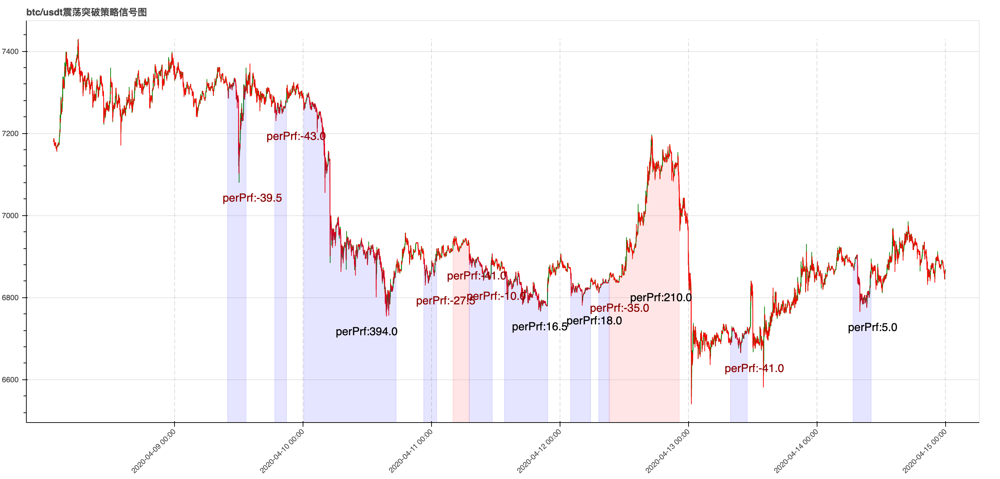

> Name

Swing Breakout Strategy
> Author

Balala little magic fairy
> Strategy Description

## Strategy description
Upper track: the highest price of the past 30 K lines
Lower track: the lowest price of the past 30 K lines
Interval width: (upper rail - lower rail) / (upper rail + lower rail)
If the range is less than the threshold a, the price breaks through the upper rail upwards, a buy position is opened, and the price falls below the lower rail and the position is closed.
If the range is less than the threshold a, the price breaks through the upper track downwards, a sell position is opened, and the position is closed when the price breaks through the upper track.
 
## Contact information
 If you are interested in this strategy, please +V: Irene11229
(Click on my homepage, I will continue to update more strategies, and you can also get market analysis data of several leading exchanges)


> Source (python)

``` python
#!/usr/bin/env python3
# -*- coding: utf-8 -*-


import json
import time

import requests
from kumex.client import Trade


def check_response_data(response_data):
    if response_data.status_code == 200:
        try:
            d = response_data.json()
        except ValueError:
            raise Exception(response_data.content)
        else:
            if d and d.get('s'):
                if d.get('s') == 'ok':
                    return d
                else:
                    raise Exception("{}-{}".format(response_data.status_code, response_data.text))
    else:
        raise Exception("{}-{}".format(response_data.status_code, response_data.text))


def get_kline(s, r, f, t, timeout=5, is_sandbox=False):
    headers = {}
    url = 'https://kitchen.kumex.com/kumex-kline/history'
    if is_sandbox:
        url = 'https://kitchen-sdb.kumex.com/kumex-kline/history'
    uri_path = url
    data_json = ''
    p = []
    if s:
        p.append("{}={}".format('symbol', s))
    if r:
        p.append("{}={}".format('resolution', r))
    if f:
        p.append("{}={}".format('from', f))
    if t:
        p.append("{}={}".format('to', t))
    data_json += '&'.join(p)
    uri_path += '?' + data_json

    response_data = requests.request('GET', uri_path, headers=headers, timeout=timeout)
    return check_response_data(response_data)


class Shock(object):

    def __init__(self):
        # read configuration from json file
        with open('config.json', 'r') as file:
            config = json.load(file)

        self.api_key = config['api_key']
        self.api_secret = config['api_secret']
        self.api_passphrase = config['api_passphrase']
        self.sandbox = config['is_sandbox']
        self.symbol = config['symbol']
        self.resolution = int(config['resolution'])
        self.valve = float(config['valve'])
        self.leverage = float(config['leverage'])
        self.size = int(config['size'])
        self.trade = Trade(self.api_key, self.api_secret, self.api_passphrase, is_sandbox=self.sandbox)


if __name__ == "__main__":
    shock = Shock()

    while 1:
        time_to = int(time.time())
        time_from = time_to - shock.resolution * 60 * 35
        data = get_kline(shock.symbol, shock.resolution, time_from, time_to, is_sandbox=shock.sandbox)
        print('now time =', time_to)
        print('symbol closed time =', data['t'][-1])
        if time_to != data['t'][-1]:
            continue
        now_price = int(data['c'][-1])
        print('closed price =', now_price)
        # high_track
        high = data['h'][-31:-1]
        high.sort(reverse=True)
        high_track = float(high[0])
        print('high_track =', high_track)

        # low_track
        low = data['l'][-31:-1]
        low.sort()
        low_track = float(low[0])
        print('low_track =', low_track)

        # interval_range
        interval_range = (high_track - low_track) / (high_track + low_track)
        print('interval_range =', interval_range)

        order_flag = 0
        # current position qty of the symbol
        position_details = shock.trade.get_position_details(shock.symbol)
        position_qty = int(position_details['currentQty'])
        print('current position qty of the symbol =', position_qty)
        if position_qty > 0:
            order_flag = 1
        elif position_qty < 0:
            order_flag = -1

        if order_flag == 1 and now_price < low_track:
            order = shock.trade.create_limit_order(shock.symbol, 'sell', position_details['realLeverage'],
                                                   position_qty, now_price)
            print('order_flag == 1,order id =', order['orderId'])
            order_flag = 0
        elif order_flag == -1 and now_price > high_track:
            order = shock.trade.create_limit_order(shock.symbol, 'buy', position_details['realLeverage'],
                                                   position_qty, now_price)
            print('order_flag == -1,order id =', order['orderId'])
            order_flag = 0

        if interval_range < shock.valve and order_flag == 0:
            if now_price > high_track:
                order = shock.trade.create_limit_order(shock.symbol, 'buy', shock.leverage, shock.size, now_price)
                print('now price > high track,buy order id =', order['orderId'])
                order_flag = 1
            if now_price < high_track:
                order = shock.trade.create_limit_order(shock.symbol, 'sell', shock.leverage, shock.size, now_price)
                print('now price < high track,sell order id =', order['orderId'])
                order_flag = -1
```

> Detail

https://www.fmz.com/strategy/207155

> Last Modified

2021-03-04 10:13:22
