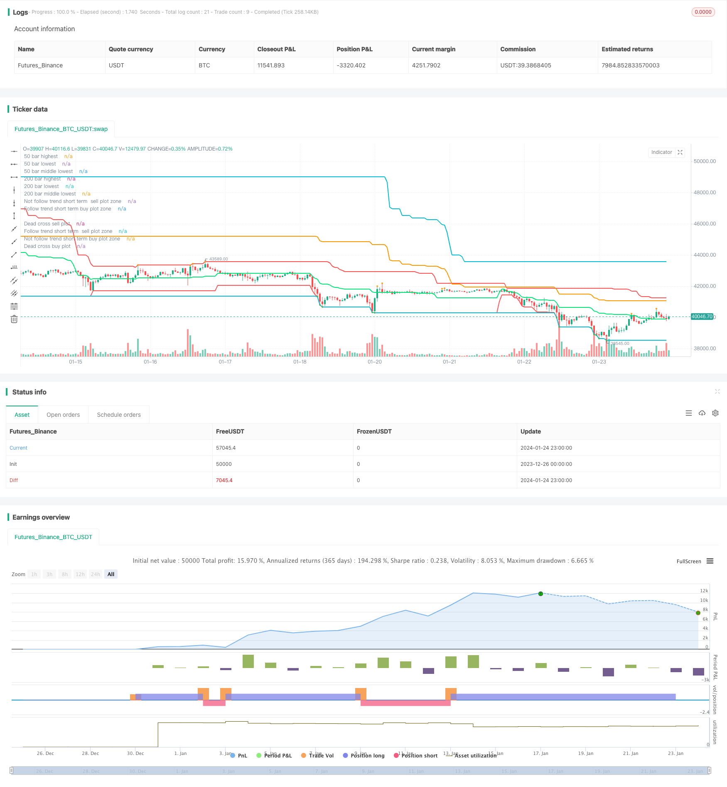

> Name

Multi-Time Frame Trend Following Strategy Swing-High-Low-Price-Channel-Strategy-V1
> Author

ChaoZhang

> Strategy Description


 [trans]

## Overview
This strategy forms the main price channel by calculating the highest and lowest prices in different time periods (50 bars and 200 bars), representing the long-term trend direction. At the same time, combine the fast signal line and the slow signal line to determine the short-term trend direction. The strategy will prompt entry when the long-term and short-term trend directions are consistent.
## Strategy Principle
First, by calculating the highest price and lowest price within the last 50 bars, and the highest price and lowest price within the last 200 bars, two price channels are formed to represent the long-term trend direction.
Secondly, calculate the highest price and lowest price in the last 7 bars to form a fast signal channel to judge the short-term trend; calculate the highest price and lowest price in the last 20 bars to form a slow signal channel to judge the shorter-term trend.
Finally, an entry signal is prompted when the directions of the fast signal channel, slow signal channel, and long-term price channel are consistent. For example, if all channels are in an upward trend, it will prompt to buy; if all channels are in a downward trend, it will prompt to sell.
## Advantage Analysis
The biggest advantage of this strategy is its ability to identify long-term and short-term unified trend directions. By confirming price channels in different time periods, we can effectively avoid being confused by short-term market noise.
In addition, the strategy adopts multi-time frame judgment, so even if the short-term price reverses, the signal will not be easily changed, ensuring signal stability.
## Risk Analysis
The main risk of this strategy is that when the long-term and short-term trends reverse, there will be a certain lag in signal generation due to the need for multiple time period channel confirmations. At this time, if you blindly follow up, your losses may expand.
In addition, it is not friendly to high-frequency trading and cannot respond quickly to short-term price fluctuations. If you encounter a violent market situation, improperly setting stop loss conditions will also cause larger losses.
## Optimization direction
You can consider adding an adaptive dynamic stop-loss strategy. When the price breaks through a certain ratio in an unfavorable direction, the loss will be stopped and exited, which can effectively control risks.
In addition, more price channels of different lengths can be added, and the final signal can be determined through voting, which can improve the accuracy of judgment.
Or use machine learning algorithms to automatically optimize the parameters of each channel to make the parameters more in line with the current market environment.
## Summarize
The overall idea of ​​this strategy is clear and easy to understand, and it can effectively filter out short-term market noise by judging market trends through multi-time frame price channels. However, the handling of market reversals and risk control need to be strengthened. If combined with stop loss strategy and parameter optimization, the stability and practical effect of the strategy can be further enhanced.
||

## Overview 

This strategy calculates the highest and lowest prices within different timeframes (50 bars and 200 bars) to form the main price channel representing the long-term trend. It also uses fast and slow signal lines to determine the short-term trend direction. The strategy will prompt entry signals when the long-term and short-term trend directions are consistent.

## Principle  

Firstly, by calculating the highest and lowest prices of the last 50 bars and the last 200 bars, two price channels are formed to represent the long-term trend direction.

Secondly, the highest and lowest prices of the last 7 bars are calculated to form a fast signal channel to judge the short-term trend; The highest and lowest prices of the last 20 bars are calculated to form a slow signal channel to judge the shorter-term trend.

Finally, entry signals are prompted when the directions of the fast signal channel, slow signal channel and long-term price channel are consistent. For example, when all channels are in an upward trend, it will prompt to buy; when all channels are in a downward trend, it will prompt to sell.

## Advantage Analysis

The biggest advantage of this strategy is that it can identify a unified trend direction in both long and short terms. By confirming the price channels of different time frames, it can effectively avoid being misled by short-term market noise.

In addition, the multi-timeframe judgement ensures signal stability even if short-term price reversal occurs.

## Risk Analysis  

The main risk of this strategy is that when long and short term trend reversal occurs, there will be a certain lag in signal generation due to the need for confirmation of multiple time frame channels. Blindly following at this time may lead to greater losses.

In addition, it is unfriendly to high frequency trading and unable to respond quickly to short-term price fluctuations. In case of violent market conditions, improper stop loss settings can also lead to large losses.

## Optimization

Consider joining an adaptive dynamic stop loss strategy that stops loss when the price breaks through a certain percentage in an unfavorable direction to effectively control risks.

Also, more price channels of different lengths could be added and the final signal could be decided by voting to improve accuracy. 

Alternatively, machine learning algorithms could be used to automatically optimize various channel parameters to better suit the current market environment.

## Summary  

The overall idea of this strategy is clear and easy to understand. By judging market trends through multi-timeframe price channels, it can effectively filter out short-term market noise. However, its handling of reversal trends and risk control need improvement. By combining stop loss strategies and parameter optimization, strategy stability and practical effects can be further enhanced.

[/trans]

> Strategy Arguments


|Argument|Default|Description|
|----|----|----|
|v_input_1|0|Main swing channel source: H/L|
|v_input_2|7|Fast Slow Length|
|v_input_3|20|Slow Slow Length|
|v_input_4|true|Show main channel only|
|v_input_5|2|Main line width|
|v_input_6|true|Signal line width|


> Source (PineScript)

``` pinescript
/*backtest
start: 2023-12-26 00:00:00
end: 2024-01-25 00:00:00
period: 1h
basePeriod: 15m
exchanges: [{"eid":"Futures_Binance","currency":"BTC_USDT"}]
*/

// This source code is subject to the terms of the Mozilla Public License 2.0 at https://mozilla.org/MPL/2.0/
// © ZoomerXeus

//@version=4
strategy("Swing High Low Price Channel V.1", overlay=true)

//========================= variable =================================//
dead_channel_source = input(title="Main swing channel source", defval="H/L", options=["H/L"])
fast_signal_length = input(title="Fast Slow Length", type=input.integer, defval=7, maxval=49, minval=1)
slow_signal_length = input(title="Slow Slow Length", type=input.integer, defval=20, maxval=49, minval=1)
is_show_only_dead_channel = input(title="Show main channel only", defval=true)
main_channel_width = input(title="Main line width", defval=2, minval=1)
signal_channel_width = input(title="Signal line width", defval=1, minval=1)

//========================= indicator function =================================//
dead_cross_high_50 = highest(high, 50) 
dead_cross_high_200 = highest(high, 200) 
//========================================
dead_cross_low_50 = lowest(low, 50) 
dead_cross_low_200 = lowest(low, 200) 
//========================================
medain_dead_cross_50 = ((dead_cross_high_50-dead_cross_low_50)*0.5)+dead_cross_low_50
medain_dead_cross_200 = ((dead_cross_high_200-dead_cross_low_200)*0.5)+dead_cross_low_200


//========================================
fasthighest = highest(high, fast_signal_length)
fastlowest = lowest(low, fast_signal_length)
//========================================
slowhighest = highest(high, slow_signal_length)
slowlowest = lowest(low, slow_signal_length)
//========================================

    
//========================= plot =================================//
plot(dead_channel_source == "H/L" ? dead_cross_high_50 : na,title="50 bar highest", color=color.red, linewidth=main_channel_width)
plot(dead_channel_source == "H/L" ? dead_cross_high_200 : na,title="200 bar highest", color=color.aqua, linewidth=main_channel_width)
plot(dead_channel_source == "H/L" ? dead_cross_low_50 : na,title="50 bar lowest", color=color.red, linewidth=main_channel_width)
plot(dead_channel_source == "H/L" ? dead_cross_low_200 : na,title="200 bar lowest", color=color.aqua, linewidth=main_channel_width)
plot(dead_channel_source == "H/L" ? medain_dead_cross_200 : na,title="200 bar middle lowest", color=color.orange, linewidth=main_channel_width)
plot(dead_channel_source == "H/L" ? medain_dead_cross_50 : na,title="50 bar middle lowest", color=color.lime, linewidth=main_channel_width)
//===========================================
plot(is_show_only_dead_channel == false ? fasthighest : na,title="fast signal highest", color=#ff00f9, linewidth=signal_channel_width)
plot(is_show_only_dead_channel == false ? fastlowest : na,title="fast signal lowest", color=#ff00f9, linewidth=signal_channel_width)
plot(is_show_only_dead_channel == false ? slowhighest : na,title="slow signal highest", color=color.white, linewidth=signal_channel_width)
plot(is_show_only_dead_channel == false ? slowlowest : na,title="slow signal lowest", color=color.white, linewidth=signal_channel_width)
//===========================================
plot(crossover(medain_dead_cross_50, medain_dead_cross_200) ? medain_dead_cross_200 : na, title="Dead cross buy plot", style=plot.style_circles, linewidth=6, color=color.lime)
plot(crossunder(medain_dead_cross_50, medain_dead_cross_200) ? medain_dead_cross_200 : na, title="Dead cross sell plot", style=plot.style_circles, linewidth=6, color=color.red)
plot(is_show_only_dead_channel and (medain_dead_cross_50 < medain_dead_cross_200) and high == slowhighest ? high : na, title="Follow trend short term  sell plot zone", style=plot.style_circles, linewidth=3, color=color.orange)
plot(is_show_only_dead_channel and (medain_dead_cross_50 > medain_dead_cross_200) and low == slowlowest ? low : na, title="Follow trend short term buy plot zone", style=plot.style_circles, linewidth=3, color=color.green)
plot(is_show_only_dead_channel and high == slowhighest and (high == dead_cross_high_200) ? high : na, title="Not follow trend short term  sell plot zone", style=plot.style_circles, linewidth=3, color=color.orange)
plot(is_show_only_dead_channel and low == slowlowest and (low == dead_cross_low_200) ? low : na, title="Not follow trend short term buy plot zone", style=plot.style_circles, linewidth=3, color=color.green)

//===================== open close order condition =========================================================//
strategy.entry("strong buy", true, 1, when=low == dead_cross_low_200)
strategy.exit("close strong buy 50%", "strong buy", qty_percent=50, when=high==slowhighest)
strategy.entry("strong sell", false, 1, when=high == dead_cross_high_200)
strategy.exit("close strong sell 50%", "strong sell", qty_percent=50, when=low==slowlowest)
```

> Detail

https://www.fmz.com/strategy/440098

> Last Modified

2024-01-26 15:54:45
