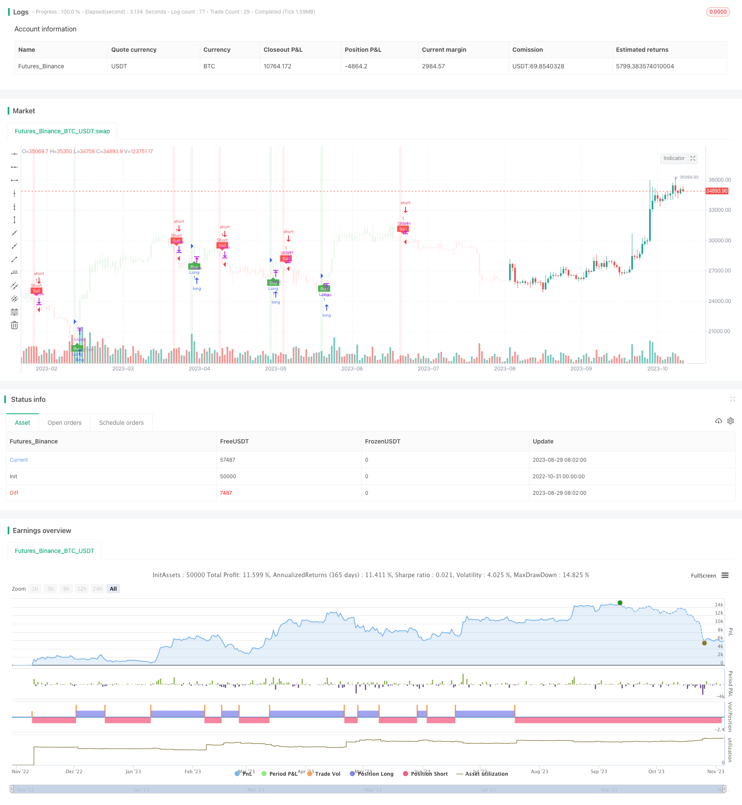

> Name

Trading Strategy Volatility-Adjusted-Moving-Average-Trading-Strategy Based on T3 Moving Average and ATR
> Author

ChaoZhang

> Strategy Description


[trans]

# 

## Overview
This strategy uses a combination of T3 moving average, ATR indicator and Hercules to identify buy and sell signals, and calculates stop loss and take profit positions based on ATR to achieve trend following transactions. The advantage of the strategy is rapid response while controlling transaction risks.
## Principle analysis
### Indicator calculation
- T3 Moving Average: Calculate a T3 moving average with a smoothing parameter of T3 (default 100), used to determine the trend direction.
- ATR: Calculate ATR (average true fluctuation range), which is used to determine the size of stop loss and take profit positions.
- ATR Moving Stop: Calculate a moving stop line based on ATR, which can be adjusted according to price changes and volatility to achieve trend tracking.
### Transaction logic
- Buy signal: A buy signal is generated when the closing price crosses the ATR moving stop loss line and is lower than the T3 moving average.
- Sell signal: A sell signal is generated when the closing price falls below the ATR moving stop loss line and is above the T3 moving average.
- Stop loss and take profit: After entering the market, the stop loss and take profit prices are calculated based on the ATR value and the risk reward ratio set by the user.
### Strategic entry and exit
- After buying, the stop-loss price is the entry price minus the ATR value, and the take-profit price is the entry price plus the ATR value multiplied by the risk-reward ratio.
- After selling, the stop-loss price is the entry price plus the ATR value, and the take-profit price is the entry price minus the ATR value multiplied by the risk-reward ratio.
- When the price triggers the stop loss or take profit price, close the position and exit.
## Advantage Analysis
### Respond quickly
The T3 average parameter defaults to 100, which is more sensitive than the general moving average and can respond to price changes faster.
### Risk Control
The trailing stop loss calculated using ATR can trail the price according to market fluctuations and avoid the risk of the stop loss being breached. The stop-profit and stop-loss positions are based on ATR and can control the risk-reward ratio of each transaction.
### Trend Following
The ATR moving stop loss line can track the trend and will not be triggered to leave the market even when the price pulls back in the short term, thus reducing false signals.
### Parameter optimization space
Both the T3 average period and the ATR period can be optimized to adjust parameters for different markets and improve strategy stability.
## Risk Analysis
### Breakthrough Risk
If there is a violent market situation, the price may directly break through the stop loss line and cause losses. It can be alleviated by appropriately expanding the ATR cycle and stop loss distance.
### Trend reversal risk
During a trend reversal, price crossing the trailing stop line can result in losses. You can combine it with other indicators to determine the trend and avoid trading near the reversal point.
### Parameter optimization risk
Parameter optimization requires rich historical data support, and there is a risk of over-optimization. Multi-market and multi-time period combinations should be used to optimize parameters and cannot rely on a single data set.
## Optimization direction
- Test different T3 average line period parameters to find the best parameter combination that balances sensitivity and stability
- Test ATR cycle parameters to find the best balance between controlling risk and obtaining trends
- Combine RSI, MACD and other indicators to avoid wrong transactions at trend reversal points
- Use machine learning methods to train optimal parameters to reduce the limitations of manual optimization
- Add position management strategies to better control risks
## Summarize
This strategy integrates the advantages of T3 moving average and ATR indicators, which can not only respond to price changes quickly, but also control risks. Strategy stability and trading efficiency can be further enhanced through Parameter optimization and combination with other indicators. However, traders still need to pay attention to the risks of reversals and breakthroughs, and avoid over-reliance on backtest results.
|| 

## Overview

This strategy utilizes a combination of the T3 moving average, ATR indicator and Heikin Ashi to identify buy and sell signals, and uses the ATR to calculate stop loss and take profit levels for trend following trading. The advantage of this strategy is the quick response while controlling trading risk.

## Principle Analysis 

### Indicator Calculations

- T3 Moving Average: Calculates a smoothed T3 moving average (default period 100) to determine trend direction

- ATR: Calculates the Average True Range, used to determine stop loss/take profit size 

- ATR Trailing Stop: Calculates a stop loss based on ATR that adjusts based on price movement and volatility

### Trade Logic

- Buy Signal: Triggered when close crosses above ATR trailing stop and is below T3 moving average

- Sell Signal: Triggered when close crosses below ATR trailing stop and is above T3 moving average 

- Stop Loss/Take Profit: After entry, stop loss and take profit prices calculated based on ATR and user defined risk/reward ratio

### Entry and Exit

- Long Entry: Stop loss is entry price minus ATR, take profit is entry price plus ATR * risk/reward ratio

- Short Entry: Stop loss is entry price plus ATR, take profit is entry price minus ATR * risk/reward ratio

- Exit when price hits stop loss or take profit levels

## Advantage Analysis

### Quick Response 

T3 moving average default period is 100, more sensitive than typical moving averages for faster reaction to price changes

### Risk Control

ATR trailing stop moves with market volatility to avoid being stopped out. Stop loss/take profit based on ATR controls risk/reward per trade

### Trend Following

ATR trailing stop follows the trend, avoids premature exit even during short term pullbacks

### Parameter Optimization

Periods for both T3 and ATR can be optimized for different markets to improve robustness

## Risk Analysis

### Stop Loss Breakeven

Severe price moves could penetrate stop loss causing loss. Can widen ATR period and stop distance.

### Trend Reversal

Losses possible if trend reverses and price crosses trailing stop. Can incorporate other indicators to identify reversals.

### Optimization Overfitting

Parameter optimization risks overfitting limited historical data. Need robust optimization across markets/timeframes. 

## Improvement Opportunities

- Test different T3 moving average periods to find optimal balance of sensitivity and stability

- Optimize ATR period to find best risk control and trend following balance

- Incorporate RSI, MACD to avoid wrong trades at turning points

- Machine learning for optimal automated parameters, reducing manual bias

- Add position sizing rules to better control risk

## Summary

This strategy combines the advantages of the T3 and ATR to enable fast response with risk control. Further enhancements in stability and efficiency possible through parameter optimization and additional filters. But traders should still watch for reversal and breakeven risks, and avoid over-reliance on backtest results.

[/trans]

> Strategy Arguments


|Argument|Default|Description|
|----|----|----|
|v_input_1|100|T3|
|v_input_2|true|Key Value. "This changes the sensitivity"|
|v_input_3|50|ATR Period|
|v_input_4|true|Signals from Heikin Ashi Candles|
|v_input_5|true|Risk Reward Ratio|


> Source (PineScript)

``` pinescript
/*backtest
start: 2022-10-31 00:00:00
end: 2023-11-06 00:00:00
period: 1d
basePeriod: 1h
exchanges: [{"eid":"Futures_Binance","currency":"BTC_USDT"}]
*/

//@version=5
strategy(title='UT Bot Alerts (QuantNomad) Strategy w/ NinjaView', overlay=true)
T3 = input(100)//600
// Input for Long Settings
// Input for Long Settings


xPrice3 = close
xe1 = ta.ema(xPrice3, T3)
xe2 = ta.ema(xe1, T3)
xe3 = ta.ema(xe2, T3)
xe4 = ta.ema(xe3, T3)
xe5 = ta.ema(xe4, T3)
xe6 = ta.ema(xe5, T3)

b3 = 0.7
c1 = -b3*b3*b3
c2 = 3*b3*b3+3*b3*b3*b3
c3 = -6*b3*b3-3*b3-3*b3*b3*b3
c4 = 1+3*b3+b3*b3*b3+3*b3*b3
nT3Average = c1 * xe6 + c2 * xe5 + c3 * xe4 + c4 * xe3

//plot(nT3Average, color=color.white, title="T3")

// Buy Signal - Price is below T3 Average
buySignal3 = xPrice3 < nT3Average
sellSignal3 = xPrice3 > nT3Average
// Inputs
a = input(1, title='Key Value. "This changes the sensitivity"')
c = input(50, title='ATR Period')
h = input(true, title='Signals from Heikin Ashi Candles')
riskRewardRatio = input(1, title='Risk Reward Ratio')

xATR = ta.atr(c)
nLoss = a * xATR

src = h ? request.security(ticker.heikinashi(syminfo.tickerid), timeframe.period, close, lookahead=barmerge.lookahead_off) : close

xATRTrailingStop = 0.0
iff_1 = src > nz(xATRTrailingStop[1], 0) ? src - nLoss : src + nLoss
iff_2 = src < nz(xATRTrailingStop[1], 0) and src[1] < nz(xATRTrailingStop[1], 0) ? math.min(nz(xATRTrailingStop[1]), src + nLoss) : iff_1
xATRTrailingStop := src > nz(xATRTrailingStop[1], 0) and src[1] > nz(xATRTrailingStop[1], 0) ? math.max(nz(xATRTrailingStop[1]), src - nLoss) : iff_2

pos = 0
iff_3 = src[1] > nz(xATRTrailingStop[1], 0) and src < nz(xATRTrailingStop[1], 0) ? -1 : nz(pos[1], 0)
pos := src[1] < nz(xATRTrailingStop[1], 0) and src > nz(xATRTrailingStop[1], 0) ? 1 : iff_3

xcolor = pos == -1 ? color.red : pos == 1 ? color.green : color.blue

ema = ta.ema(src, 1)
above = ta.crossover(ema, xATRTrailingStop)
below = ta.crossunder(ema, xATRTrailingStop)

buy = src > xATRTrailingStop and above
sell = src < xATRTrailingStop and below

barbuy = src > xATRTrailingStop
barsell = src < xATRTrailingStop

plotshape(buy, title='Buy', text='Buy', style=shape.labelup, location=location.belowbar, color=color.new(color.green, 0), textcolor=color.new(color.white, 0), size=size.tiny)
plotshape(sell, title='Sell', text='Sell', style=shape.labeldown, location=location.abovebar, color=color.new(color.red, 0), textcolor=color.new(color.white, 0), size=size.tiny)

barcolor(barbuy ? color.new(color.green, 90) : na)
barcolor(barsell ? color.new(color.red, 90) : na)

var float entryPrice = na
var float takeProfitLong = na
var float stopLossLong = na
var float takeProfitShort = na
var float stopLossShort = na

if buy and buySignal3
    entryPrice := src
    takeProfitLong := entryPrice + nLoss * riskRewardRatio
    stopLossLong := entryPrice - nLoss
    takeProfitShort := na
    stopLossShort := na

if sell and sellSignal3
    entryPrice := src
    takeProfitShort := entryPrice - nLoss * riskRewardRatio
    stopLossShort := entryPrice + nLoss
    takeProfitLong := na
    stopLossLong := na

// Strategy order conditions
acct = "Sim101"
ticker = "ES 12-23"
qty = 1

OCOMarketLong = '{ "alert": "OCO Market Long", "account": "' + str.tostring(acct) + '", "ticker": "' + str.tostring(ticker) + '", "qty": "' + str.tostring(qty) + '", "take_profit_price": "' + str.tostring(takeProfitLong) + '", "stop_price": "' + str.tostring(stopLossLong) + '", "tif": "DAY" }'
OCOMarketShort = '{ "alert": "OCO Market Short", "account": "' + str.tostring(acct) + '", "ticker": "' + str.tostring(ticker) + '", "qty": "' + str.tostring(qty) + '", "take_profit_price": "' + str.tostring(takeProfitShort) + '", "stop_price": "' + str.tostring(stopLossShort) + '", "tif": "DAY" }'
CloseAll = '{ "alert": "Close All", "account": "' + str.tostring(acct) + '", "ticker": "' + str.tostring(ticker) + '" }'

strategy.entry("Long", strategy.long, when=buy ,alert_message=OCOMarketLong)
strategy.entry("Short", strategy.short, when=sell , alert_message=OCOMarketShort)

// Setting the take profit and stop loss for long trades
strategy.exit("Take Profit/Stop Loss", "Long", stop=stopLossLong, limit=takeProfitLong,alert_message=CloseAll)

// Setting the take profit and stop loss for short trades
strategy.exit("Take Profit/Stop Loss", "Short", stop=stopLossShort, limit=takeProfitShort,alert_message=CloseAll)

// Plot trade setup boxes
bgcolor(buy ? color.new(color.green, 90) : na, transp=0, offset=-1)
bgcolor(sell ? color.new(color.red, 90) : na, transp=0, offset=-1)

longCondition = buy and not na(entryPrice)
shortCondition = sell and not na(entryPrice)

var line longTakeProfitLine = na
var line longStopLossLine = na
var line shortTakeProfitLine = na
var line shortStopLossLine = na

if longCondition
    longTakeProfitLine := line.new(bar_index, takeProfitLong, bar_index + 1, takeProfitLong, color=color.green, width=2)
    longStopLossLine := line.new(bar_index, stopLossLong, bar_index + 1, stopLossLong, color=color.red, width=2)
    label.new(bar_index + 1, takeProfitLong, str.tostring(takeProfitLong, "#.#####"), color=color.green, style=label.style_none, textcolor=color.green, size=size.tiny)
    label.new(bar_index + 1, stopLossLong, str.tostring(stopLossLong, "#.#####"), color=color.red, style=label.style_none, textcolor=color.red, size=size.tiny)

if shortCondition
    shortTakeProfitLine := line.new(bar_index, takeProfitShort, bar_index + 1, takeProfitShort, color=color.green, width=2)
    shortStopLossLine := line.new(bar_index, stopLossShort, bar_index + 1, stopLossShort, color=color.red, width=2)
    label.new(bar_index + 1, takeProfitShort, str.tostring(takeProfitShort, "#.#####"), color=color.green, style=label.style_none, textcolor=color.green, size=size.tiny)
    label.new(bar_index + 1, stopLossShort, str.tostring(stopLossShort, "#.#####"), color=color.red, style=label.style_none, textcolor=color.red, size=size.tiny)

alertcondition(buy, 'UT Long', 'UT Long')
alertcondition(sell, 'UT Short', 'UT Short')

```

> Detail

https://www.fmz.com/strategy/431431

> Last Modified

2023-11-07 17:18:05
