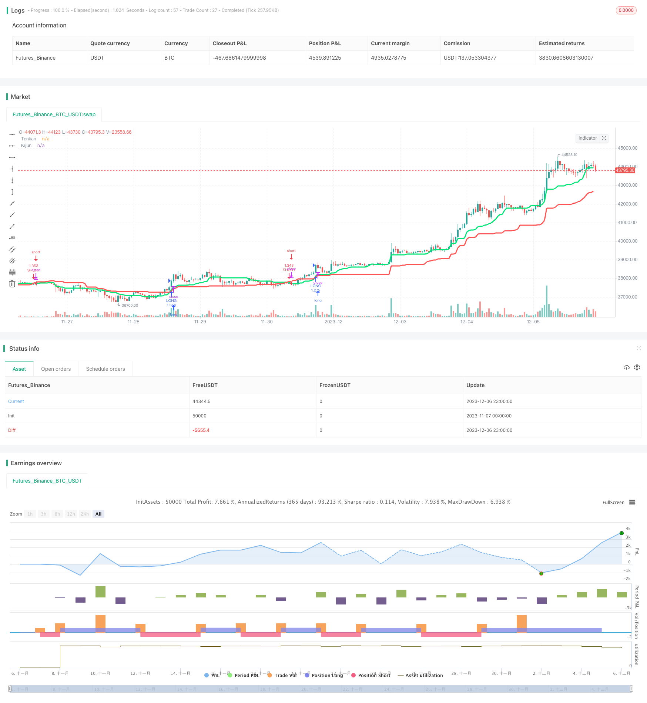

> Name

ADX-Based-One-Hour-TENKAN-KIJUN-Cross-Trend-Tracking-Strategy
> Author

ChaoZhang

> Strategy Description



[trans]

### Overview
This strategy is a simple but profitable trend following strategy. It is based on the intersection of the TENKAN line and the KIJUN line of the ICHIMOKU identification system on the one-hour time frame to determine the trend direction, and combines it with the ADX indicator to filter out markets with weaker trends to issue trading signals. This strategy is mainly suitable for BTC trading pairs with large market capitalization altcoins such as ETH/BTC.
### Strategy Principles
This strategy uses the intersection of the Conversion Line (TENKAN line) and the Base Line (KIJUN line) of the ICHIMOKU cloud chart to determine the market trend direction. Among them, the TENKAN line calculation method is the average of the recent high points and recent low points of the past 18 K lines, which represents the rapid conversion line; the KIJUN line calculation method is the average of the recent high points and recent low points of the past 58 K lines, which represents the standard conversion line.
When the Quick Conversion Line crosses the Standard Conversion Line from below, it is a bullish signal; when the Quick Conversion Line crosses below the Standard Conversion Line from above, it is a bearish signal. This can capture short- and medium-term trend turning points.
At the same time, the strategy also combines the ADX indicator to filter and adjust the strength of the market trend. The ADX indicator can judge the strength of the trend. When the ADX value is greater than 20, it means that the current trend is strong. So the strategy only issues a trade signal when ADX is greater than 20.
In summary, this strategy determines the short- and medium-term trend direction through the intersection of TENKAN line and KIJUN line, and cooperates with the ADX indicator to filter out false breakthroughs to lock in the real trend and achieve the purpose of tracking the medium- and long-term trend.
### Advantage Analysis
This strategy mainly has the following advantages:
1. Use the ICHIMOKU cloud chart to determine the trend direction. This indicator system itself is relatively mature and reliable and can accurately determine the turning point of the trend.
2. Use the ADX indicator to filter markets with weak adjustment strength and avoid frequent trading during consolidation.
3. Adopting a 1-hour development strategy can filter short-term market noise and only capture mid- and long-term trends.
4. The strategy is relatively simple and intuitive, easy to understand and track, and is suitable for trend followers.
5. The strategy backtesting effect is good, especially on large-market currency pairs such as ETH/BTC.
### Risk Analysis
There are also some risks to be aware of with this strategy:
1. The ICHIMOKU cloud chart itself is sensitive to parameters, and the effects of different cycle parameters vary greatly. The best parameters need to be customized for different currency pairs.
2. The ADX indicator will delay giving signals under certain circumstances, which may result in missing the best entry opportunity.
3. Follow the mid- to long-term trend strategy, which performs poorly in volatile market conditions and is easy to stop losses.
4. The effect of this strategy varies greatly on different currency pairs and different time periods, so you need to choose and use it according to the variety you are good at.
5. Long-term holding of positions involves high risks, and stop-loss and take-profit conditions need to be set appropriately.
This strategy can help filter signals by adjusting ADX parameters or adding other indicators such as MACD to reduce virtual signals and improve strategy stability. Better robustness can also be obtained by dynamically adjusting parameters to adapt to different market types.
### Optimization direction
This strategy also has the following main optimization directions:
1. Dynamically optimize the parameters of TENKAN line and KIJUN line to better adapt to real-time market conditions and different currencies.
2. Optimize or replace the ADX indicator and find a more sensitive and efficient means of trend judgment.
3. Add a stop-loss and stop-profit strategy to control the risk-return ratio of a single transaction and avoid huge losses.
4. Carry out combination optimization, find complementary indicators to form an integrated strategy, and improve stability.
5. Modularize the code structure to increase the flexibility of custom parameters and adapt to more varieties.
6. Add quantitative risk control methods, such as maximum drawdown, correlation coefficient, etc., to prevent the risk of extreme market conditions.
### Summarize
To sum up, this strategy is overall a simple and practical trend following strategy. It is mainly based on the TENKAN KIJUN cross combined with the ADX indicator to determine the medium and long-term trend direction and issue trading signals. This strategy has better backtesting results and is especially suitable for large-market currency pairs such as ETH/BTC, where it can obtain relatively stable profits. However, this strategy also has certain parameter dependencies and needs to be optimized for different currencies and market types. At the same time, it is also necessary to control the risk of a single transaction to avoid the expansion of losses. Overall, this strategy provides quantitative traders with a valuable reference for trend following strategies.
||


### Overview

This is a simple yet profitable trend tracking strategy based on one-hour time frame TENKAN and KIJUN cross in the ICHIMOKU system combined with ADX indicator to filter out weak trending markets to generate trading signals. It works best on large market cap altcoin BTC pairs like ETH/BTC.

### Strategy Logic  

The strategy uses Conversion Line (TENKAN) and Base Line (KIJUN) cross in ICHIMOKU system to determine market trend direction. TENKAN line is calculated based on the average of highest high and lowest low of past 18 candles, representing fast conversion line. KIJUN line is based on 58 candle periods, standing for standard conversion line.

When TENKAN cross above KIJUN, it is a bullish signal. When TENKAN cross below KIJUN, it is a bearish signal. This aims to capture medium-term trend reversal. 

In addition, ADX indicator is used to gauge the strength of the trend. Only when ADX is above 20, indicating a strong trend, will the signal be triggered.

In summary, this strategy identifies mid-term trend direction via TENKAN and KIJUN cross, and uses ADX to filter out false breakouts, in order to track long-term trends.

### Advantage Analysis 

The main advantages of this strategy are:

1. Using mature and reliable ICHIMOKU system to determine trend direction and turning points.

2. Filtering out weak trending market using ADX to avoid whipsaws in consolidation. 

3. The one-hour timeframe filters market noise and only captures mid-to-long term trends.

4. The logic is straightforward and easy to follow for trend traders.

5. Solid backtesting results especially on high market cap coins like ETH/BTC.

### Risk Analysis

Some risks to note about this strategy:

1. ICHIMOKU parameters are sensitive, needs customization for different pairs.

2. ADX may lag in some cases, causing missed entry.

3. Underperforms in ranging markets with frequent stop loss hit. 

4. Performance varies greatly across different pairs and timeframes.

5. Long holding of positions can be risky, proper stop loss/take profit needed.

Optimization can be done via ADX parameter tuning, adding filters like MACD to reduce false signals, or dynamical adjustment of parameters for robustness.

### Optimization Directions   

Some major directions to improve the strategy:

1. Dynamic optimization of TENKAN and KIJUN parameters for better adaptation.

2. Searching for better trend indicators to replace or combine with ADX.

3. Adding stop loss/take profit to control risk/reward ratio.

4. Ensemble modeling with complementary indicators to improve stability. 

5. Modularization and flexibility for parameter tuning on more pairs.

6. Quantitative risk management e.g. max drawdown control against extreme moves.

### Conclusion

In conclusion, this is a simple yet practical trend tracking strategy, mainly based on TENKAN/KIJUN cross and ADX to identify mid-to-long term trends and generate signals. It has shown positive backtesting results, especially on high market cap BTC pairs like ETH/BTC, with relatively stable profitability. But it also relies on parameter tuning, requires per-pair optimization. Risk control per trade is also necessary to limit losses when trends reverse. Overall this offers valuable reference of a trend following strategy for algo traders.

[/trans]

> Strategy Arguments


|Argument|Default|Description|
|----|----|----|
|v_input_1_close|0|Source: close|high|low|open|hl2|hlc3|hlcc4|ohlc4|
|v_input_2|18|Conversion Line Periods (Tenkan)|
|v_input_3|58|Base Line Periods (Kijun)|
|v_input_4|14|ADX Smoothing|
|v_input_5|14|DI Length|
|v_input_6|20|threshold|
|v_input_7|3|From Day|
|v_input_8|9|From Month|
|v_input_9|2018|From Year|
|v_input_10|3|To Day|
|v_input_11|9|To Month|
|v_input_12|2019|To Year|


> Source (PineScript)

``` pinescript
/*backtest
start: 2023-11-07 00:00:00
end: 2023-12-07 00:00:00
period: 1h
basePeriod: 15m
exchanges: [{"eid":"Futures_Binance","currency":"BTC_USDT"}]
*/

//@version=2
strategy(title="Odin's Kraken (TK Cross Strategy)", shorttitle="Odin's Kraken", overlay=true, default_qty_type=strategy.percent_of_equity, default_qty_value=100)

src = input(close, title="Source")

// define tk in ichimoku

conversionPeriods = input(18, minval=1, title="Conversion Line Periods (Tenkan)"),
basePeriods = input(58, minval=1, title="Base Line Periods (Kijun)")

donchian(len) => avg(lowest(len), highest(len))

conversionLine = donchian(conversionPeriods)
baseLine = donchian(basePeriods)

TK_Uptrend = crossover(conversionLine,baseLine)
TK_Downtrend = crossunder(conversionLine,baseLine)

plot(conversionLine, color=lime, title="Tenkan", linewidth=3)
plot(baseLine, color=red, title="Kijun", linewidth=3)

// define ADX

adxlen = input(14, title="ADX Smoothing")
dilen = input(14, title="DI Length")
th = input(title="threshold", defval=20)
dirmov(len) =>
	up = change(high)
	down = -change(low)
	plusDM = na(up) ? na : (up > down and up > 0 ? up : 0)
    minusDM = na(down) ? na : (down > up and down > 0 ? down : 0)
	truerange = rma(tr, len)
	
	plus = fixnan(100 * rma(plusDM, len) / truerange)
	minus = fixnan(100 * rma(minusDM, len) / truerange)

	[plus, minus]

adx(dilen, adxlen) =>
	[plus, minus] = dirmov(dilen)
	sum = plus + minus
	adx = 100 * rma(abs(plus - minus) / (sum == 0 ? 1 : sum), adxlen)
	
[plus, minus] = dirmov(dilen)
sig = adx(dilen, adxlen)

// backtesting range

// From Date Inputs
fromDay = input(defval = 3, title = "From Day", minval = 1, maxval = 31)
fromMonth = input(defval = 9, title = "From Month", minval = 1, maxval = 12)
fromYear = input(defval = 2018, title = "From Year", minval = 1970)
 
// To Date Inputs
toDay = input(defval = 3, title = "To Day", minval = 1, maxval = 31)
toMonth = input(defval = 9, title = "To Month", minval = 1, maxval = 12)
toYear = input(defval = 2019, title = "To Year", minval = 1970)
 
// Calculate start/end date and time condition
startDate = timestamp(fromYear, fromMonth, fromDay, 00, 00)
finishDate = timestamp(toYear, toMonth, toDay, 00, 00)
time_cond = true

// open long and short

longCondition = TK_Uptrend
if (longCondition and sig > 12 and time_cond)
    strategy.entry("LONG", strategy.long)

shortCondition = TK_Downtrend
if (shortCondition and sig > 12 and time_cond)
    strategy.entry("SHORT", strategy.short)

// close trade if backtesting criteria not met

if (not time_cond)
    strategy.close_all()


```

> Detail

https://www.fmz.com/strategy/434704

> Last Modified

2023-12-08 15:37:00
