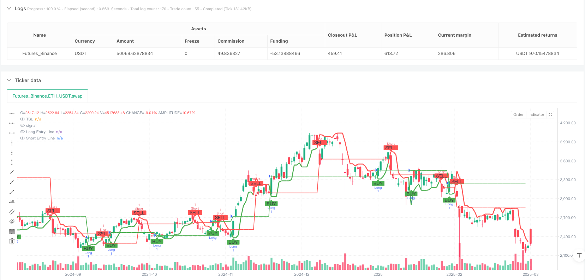
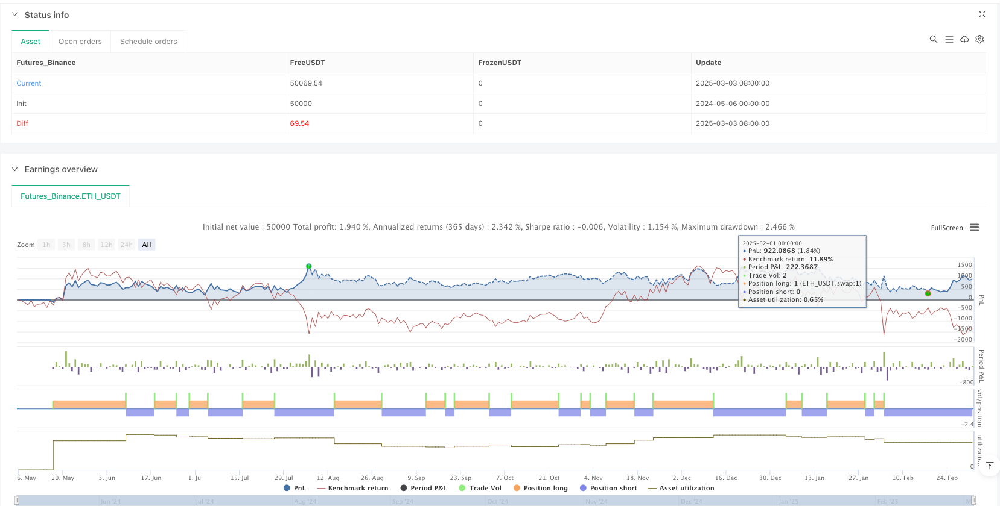

> Name

Multi-Directional-Oscillator-Trading-System-TSL-Based-Automated-Position-Management-Strategy
> Author

ianzeng123

> Strategy Description




[trans]

#### Overview
The multiple oscillator trading system is a quantitative trading strategy based on technical analysis. The core relies on the identification of swing highs and lows to determine market trend changes. This strategy builds a dynamic trailing stop loss level (TSL) by tracking the highest and lowest prices in the past N periods, which serves as the decision boundary for long and short transactions. The system will automatically execute a buy signal when the price breaks through the TSL level, and automatically execute a sell signal when the price falls below the TSL level. At the same time, it will automatically manage positions to ensure that only one direction of the position is held at a time. This strategy is particularly suitable for volatile market environments and can automatically capture short- to medium-term trend changes.
#### Strategy Principle
The core logic of this strategy revolves around the trailing stop loss level (TSL), and the specific implementation is as follows:
1. Calculate key price levels during the period:
   - Calculate the highest price (res) of the past no periods through `ta.highest(high, no)`
   - Calculate the lowest price (sup) of the past no periods through `ta.lowest(low, no)`
2. Determine the price’s position relative to previous highs and lows:
   - When the closing price is higher than the highest price of the previous period, avd is assigned a value of 1 (uptrend)
   - When the closing price is lower than the lowest price of the previous period, avd is assigned a value of -1 (downward trend)
   - In other cases, avd is assigned a value of 0 (no clear trend)
3. Construct Trailing Stop Level (TSL):
   - When the trend is upward, TSL is set as a support level (sup) and serves as a stop loss point
   - When the trend is down, TSL is set as resistance level (res), which serves as a reversal signal point
4. Generate trading signals:
   - Buy signal (Buy): when the closing price crosses TSL
   - Sell signal (Sell): when the closing price falls below TSL
5. Perform trading operations:
   - When the buy signal is triggered, close the short position and open a long position
   - When the sell signal is triggered, close the long position and open a short position
The system also includes visual components, such as K-lines and backgrounds that mark buying and selling points, color changes, and horizontal lines that display opening prices in real time, improving the visual experience of the trading process.
#### Strategic Advantages
1. Strong trend capturing ability: Through dynamic calculation of the highest price and lowest price, it can effectively capture changes in market trends and adapt to fluctuations in different market cycles.
2. High degree of automation: The system automatically identifies and executes trading signals, reducing human intervention and emotional impact.
3. Two-way trading mechanism: supports both long and short transactions, and can obtain profit opportunities in both rising and falling markets.
4. Built-in risk management: The design of the Trailing Stop Loss Level (TSL) essentially includes the stop loss function, limiting the maximum loss of a single trade.
5. Visual trading feedback: Trading signals and opening prices are clearly displayed through the graphical interface, making it easier for traders to monitor and evaluate strategy performance in real time.
6. Parameter flexibility: By adjusting the swing cycle parameter (no), it can adapt to the market characteristics of different time periods and can be applied from short-term to medium- and long-term.
7. Clear signal prompts: The system provides dual text and visual signal prompts to reduce the possibility of incorrect operation.
#### Strategy Risk
1. Poor performance in volatile markets: In sideways volatile markets, this strategy may produce frequent false signals, leading to continuous stop losses.
2. Risk of slippage and execution delay: In real trading, there may be a time difference between signal generation and order execution, causing the actual transaction price to deviate from the ideal price.
3. Fixed position management limitations: The current strategy uses fixed units (qty=1) for trading, and lacks a mechanism to adjust the position size based on market volatility or account size.
4. Parameter sensitivity: Strategy performance is highly dependent on the setting of the swing cycle parameter (no), and different market environments may require different parameter values.
5. Weak ability to respond to emergencies: During rapid price changes caused by major news or black swan events, the stop loss level may not be adjusted in time, resulting in larger losses.
Methods to mitigate these risks include: combining other indicators for signal confirmation, implementing dynamic position management, setting maximum stop loss limits, adjusting parameters based on volatility, and regular backtesting and optimization of strategy parameters.
#### Strategy optimization direction
1. Dynamic position management: dynamically adjust position size based on market volatility or account balance ratio, rather than fixed unit transactions. This can be achieved by adding the following code:   
```
   volatility = ta.atr(14) / close * 100  // 计算波动率百分比
   position_size = strategy.equity * 0.01 / volatility  // 根据波动率调整仓位
   
```

2. Signal filtering optimization: Introduce additional technical indicators such as RSI, MACD or ATR as signal filters to reduce false signals. For example:   
```
   rsi = ta.rsi(close, 14)
   valid_buy = Buy and rsi < 70  // 避免在超买区域买入
   valid_sell = Sell and rsi > 30  // 避免在超卖区域卖出
   
```

3. Adaptive parameters: Dynamically adjust the swing period parameter (no) based on market volatility, using smaller values ​​in low-volatility environments and larger values ​​in high-volatility environments.
4. Add a Profit Target: Set a profit target based on ATR or support/resistance levels to lock in some profits when the market moves far enough in a favorable direction.
5. Time filter: Add trading time window restrictions to avoid market periods with low liquidity or abnormal volatility.
6. Drawback control mechanism: Implement a trading suspension mechanism based on the drawdown percentage of account equity, and suspend trading when continuous losses reach a preset threshold.
7. Multi-period confirmation: Combined with the trend direction of a higher time period, only open positions in the direction consistent with the higher period trend to increase the winning rate.
These optimization directions can significantly improve the robustness and adaptability of the strategy, especially providing better risk-adjusted returns when different market environments change.
#### Summarize
The multiple oscillator trading system is an automated trading strategy based on technical analysis that captures market trend changes and executes long and short two-way trades through dynamic tracking stop loss levels (TSL). This strategy performs well in well-trended markets, effectively tracking price movements and automatically managing positions.
The core advantage of the strategy lies in its simple and effective signal generation mechanism and built-in risk management functions, which is especially suitable for short- and medium-term trend trading. However, this strategy may face the challenge of frequent false signals in volatile markets and requires further optimization to improve its adaptability in various market environments.
By implementing optimization measures such as dynamic position management, multi-indicator signal confirmation, and adaptive parameter adjustment, the strategy can further enhance its risk-adjusted returns and stability. For quantitative traders, this automated system based on clear rules provides a reliable framework that reduces emotional distractions and maintains trading discipline.
Ultimately, the successful application of this strategy depends on the trader's fine adjustment of parameter settings and understanding of market characteristics. It is recommended to conduct sufficient historical backtesting and simulated trading verification before applying it to real trading. ||
#### Overview

The Multi-Directional Oscillator Trading System is a quantitative trading strategy based on technical analysis, primarily relying on the identification of swing highs and lows to determine market trend changes. The strategy tracks the highest high and lowest low over N periods to construct a dynamic Trailing Stop Level (TSL), which serves as a decision boundary for both long and short trades. The system automatically executes buy signals when the price breaks above the TSL and sell signals when the price falls below the TSL, while managing positions to ensure only one directional position is held at any time. This strategy is particularly suitable for volatile market environments, capable of automatically capturing short to medium-term trend changes.

#### Strategy Principles

The core logic of this strategy revolves around the Trailing Stop Level (TSL), implemented as follows:

1. Calculate key price levels within the period:
   - Use `ta.highest(high, no)` to calculate the highest price (res) over the past no periods
   - Use `ta.lowest(low, no)` to calculate the lowest price (sup) over the past no periods

2. Determine price position relative to previous highs and lows:
   - When the closing price is higher than the previous period's highest price, avd is set to 1 (uptrend)
   - When the closing price is lower than the previous period's lowest price, avd is set to -1 (downtrend)
   - In other cases, avd is set to 0 (no clear trend)

3. Construct the Trailing Stop Level (TSL):
   - During an uptrend, TSL is set to the support level (sup) as a stop-loss point
   - During a downtrend, TSL is set to the resistance level (res) as a reversal signal point

4. Generate trading signals:
   - Buy signal (Buy): When the closing price crosses above the TSL
   - Sell signal (Sell): When the closing price crosses below the TSL

5. Execute trading operations:
   - When a buy signal is triggered, close short positions and open long positions
   - When a sell signal is triggered, close long positions and open short positions

The system also includes visualization components, such as markers for buy and sell points, color-changing candlesticks and background, and horizontal lines displaying entry prices in real-time, enhancing the visual experience of the trading process.

#### Strategy Advantages

1. Strong trend capture capability: Through dynamic calculation of the highest and lowest prices, it effectively captures market trend changes and adapts to market fluctuations across different cycles.

2. High degree of automation: The system automatically identifies buy and sell signals and executes trades, reducing human intervention and emotional influence.

3. Bi-directional trading mechanism: Supports both long and short trading, enabling profit opportunities in both rising and falling markets.

4. Built-in risk management: The design of the Trailing Stop Level (TSL) inherently includes a stop-loss function, limiting the maximum loss per trade.

5. Visual trading feedback: The graphical interface clearly displays trading signals and entry prices, allowing traders to monitor and evaluate strategy performance in real-time.

6. Parameter flexibility: By adjusting the swing period parameter (no), the strategy can adapt to market characteristics across different time periods, applicable from short-term to medium-long term trading.

7. Clear signal prompts: The system provides both textual and visual signal prompts, reducing the possibility of operational errors.

#### Strategy Risks

1. Poor performance in ranging markets: In sideways, choppy markets, the strategy may generate frequent false signals, leading to consecutive stop-losses.

2. Slippage and execution delay risks: In live trading, there may be a time gap between signal generation and order execution, causing actual transaction prices to deviate from ideal prices.

3. Fixed position management limitations: The current strategy uses a fixed unit (qty=1) for trading, lacking a mechanism to adjust position size based on market volatility or account size.

4. Parameter sensitivity: Strategy performance highly depends on the swing period parameter (no) setting, with different market environments potentially requiring different parameter values.

5. Weak response to sudden market conditions: During rapid price movements caused by major news or black swan events, the stop level may not adjust quickly enough, resulting in larger losses.

Methods to mitigate these risks include: combining other indicators for signal confirmation, implementing dynamic position management, setting maximum stop-loss limits, adjusting parameters based on volatility, and regularly backtesting and optimizing strategy parameters.

#### Strategy Optimization Directions

1. Dynamic position management: Dynamically adjust position size based on market volatility or account balance ratio, rather than fixed unit trading. This can be implemented by adding code such as:
   
```
   volatility = ta.atr(14) / close * 100  // Calculate volatility percentage
   position_size = strategy.equity * 0.01 / volatility  // Adjust position based on volatility
   
```

2. Signal filtering optimization: Introduce additional technical indicators such as RSI, MACD, or ATR as signal filters to reduce false signals. For example:
   
```
   rsi = ta.rsi(close, 14)
   valid_buy = Buy and rsi < 70  // Avoid buying in overbought areas
   valid_sell = Sell and rsi > 30  // Avoid selling in oversold areas
   
```

3. Adaptive parameters: Dynamically adjust the swing period parameter (no) based on market volatility, using smaller values in low volatility environments and larger values in high volatility environments.

4. Add profit targets: Set profit targets based on ATR or support/resistance levels to lock in partial profits when the market moves a sufficient distance in the favorable direction.

5. Time filters: Add trading time window restrictions to avoid market sessions with lower liquidity or abnormal volatility.

6. Drawdown control mechanism: Implement a trading pause mechanism based on account equity drawdown percentage, temporarily stopping trading when consecutive losses reach a preset threshold.

7. Multi-timeframe confirmation: Combine with the trend direction of higher timeframes, only opening positions in the direction consistent with the higher timeframe trend to improve win rate.

These optimization directions can significantly enhance the strategy's robustness and adaptability, especially in providing better risk-adjusted returns during transitions between different market environments.

#### Summary

The Multi-Directional Oscillator Trading System is an automated trading strategy based on technical analysis, capturing market trend changes and executing bi-directional trades through a dynamic Trailing Stop Level (TSL). The strategy performs excellently in markets with clear trends, effectively tracking price movements and automatically managing positions.

The core advantages of the strategy lie in its simple yet effective signal generation mechanism and built-in risk management functions, particularly suitable for medium to short-term trend trading. However, the strategy may face challenges with frequent false signals in ranging markets, requiring further optimization to improve its adaptability across various market environments.

By implementing dynamic position management, multi-indicator signal confirmation, adaptive parameter adjustment, and other optimization measures, the strategy can further enhance its risk-adjusted returns and stability. For quantitative traders, this rule-based automated system provides a reliable framework that can reduce emotional interference and maintain trading discipline.

Ultimately, the successful application of this strategy depends on the trader's fine-tuning of parameter settings and understanding of market characteristics. It is recommended to conduct thorough historical backtesting and simulated trading verification before applying it to live trading.[/trans]


> Source (PineScript)

``` pinescript
/*backtest
start: 2024-05-06 00:00:00
end: 2025-03-04 08:00:00
period: 1d
basePeriod: 1d
exchanges: [{"eid":"Futures_Binance","currency":"ETH_USDT"}]
*/

//@version=5
strategy("Accurate Swing Trading System with Auto Entry (Long & Short)", overlay=true)

// Parameters
no = input.int(3, title="Swing")
Barcolor = input.bool(true, title="Barcolor")
Bgcolor = input.bool(false, title="Bgcolor")

// Calculate TSL (Trailing Stop Level)
res = ta.highest(high, no)
sup = ta.lowest(low, no)
avd = close > res[1] ? 1 : close < sup[1] ? -1 : 0
avn = ta.valuewhen(avd != 0, avd, 0)
tsl = avn == 1 ? sup : res

// Define Buy and Sell Conditions
Buy = ta.crossover(close, tsl)
Sell = ta.crossunder(close, tsl)

plotshape(Buy, "BUY", shape.labelup, location.belowbar, color.green, text="BUY", textcolor=color.black)
plotshape(Sell, "SELL", shape.labeldown, location.abovebar, color.red, text="SELL", textcolor=color.black)

// Plot TSL
colr = close >= tsl ? color.green : close <= tsl ? color.red : na
plot(tsl, color=colr, linewidth=3, title="TSL")
barcolor(Barcolor ? colr : na)
bgcolor(Bgcolor ? colr : na)

// Alerts
alertcondition(Buy, title="Buy Signal", message="Buy")
alertcondition(Sell, title="Sell Signal", message="Sell")

// Automatic Entry & Exit with 1 Unit
if (Buy)
    strategy.entry("Long", strategy.long, qty=1)  // Enter long with 1 unit
    strategy.close("Short")  // Close any open short positions
    alert("Buy Signal - Entry Long", alert.freq_once_per_bar_close)
    alert("Buy Entry Sound", alert.freq_once_per_bar_close)

if (Sell)
    strategy.entry("Short", strategy.short, qty=1)  // Enter short with 1 unit
    strategy.close("Long")  // Close any open long positions
    alert("Sell Signal - Entry Short", alert.freq_once_per_bar_close)
    alert("Sell Entry Sound", alert.freq_once_per_bar_close)

// Plotting lines for open trades
var float long_price = na
var float short_price = na

// For Long Position: Plot the entry line at the price of the open position
if (strategy.opentrades > 0)
    if (strategy.opentrades.entry_id(0) == "Long" and not na(strategy.opentrades.entry_price(0)))
        long_price := strategy.opentrades.entry_price(0)
    if (strategy.opentrades.entry_id(0) == "Short" and not na(strategy.opentrades.entry_price(0)))
        short_price := strategy.opentrades.entry_price(0)

plot(long_price, color=color.green, style=plot.style_line, linewidth=2, title="Long Entry Line", offset=-1)
plot(short_price, color=color.red, style=plot.style_line, linewidth=2, title="Short Entry Line", offset=-1)

```

> Detail

https://www.fmz.com/strategy/485123

> Last Modified

2025-03-06 10:57:03
