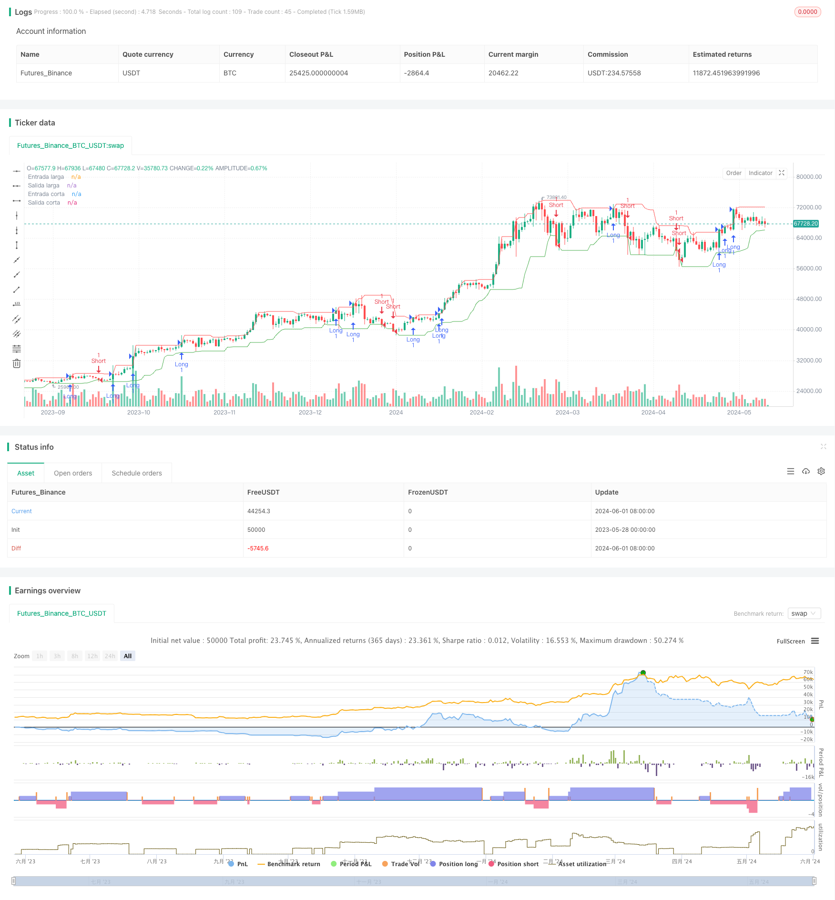

> Name

TURTLE-ATR Bollinger Band Breakout Strategy-TURTLE-ATR-Bollinger-Bands-Breakout-Strategy
> Author

ChaoZhang

> Strategy Description



[trans]
#### Overview
This is a trend following strategy based on the Turtle Trading Rules. This strategy uses ATR (Average True Range) to determine trend direction and trading position size. When the price breaks through the highest or lowest price in the past period, the strategy will open a long or short position. The open position will be held until the price breaks through the lowest or highest price in the past period, and the strategy will not close the position. The purpose of this strategy is to capture strong trend markets while strictly controlling risks.
#### Strategy Principle
The core of this strategy is the use of the ATR indicator to determine trend direction and trading position size. The ATR indicator can measure market volatility, thereby helping us determine appropriate stop loss levels and position sizes. The main steps of the strategy are as follows:
1. Calculate the ATR indicator value.
2. Determine breakout price levels for bulls and bears. The long breakthrough price is the highest price in the past period, and the short breakthrough price is the lowest price in the past period.
3. If the price breaks through the bull price, open a long position; if the price breaks through the short price, open a short position.
4. Calculate the position size of each transaction based on the ATR indicator value and account balance.
5. Hold the position until the price breaks through the lowest price (long position) or the highest price (short position) in the past period, then close the position.
In this way, the strategy is able to capture strong trending markets while strictly controlling risks. The use of the ATR indicator can help us dynamically adjust the position size to better adapt to market fluctuations.
#### Strategic Advantages
1. Trend following: The goal of this strategy is to capture strong trend markets and thereby obtain considerable profits.
2. Risk control: By using the ATR indicator to determine the position size and stop loss level, this strategy can effectively control risks.
3. Strong adaptability: The ATR indicator can be dynamically adjusted, allowing the strategy to adapt to different market environments.
4. Simple and easy to use: The logic of this strategy is clear and easy to understand and implement.
#### Strategy Risk
1. Trend reversal: When the market trend suddenly reverses, this strategy may suffer large losses.
2. Volatile markets: In volatile markets, this strategy may frequently open and close positions, resulting in high transaction costs.
3. Parameter sensitivity: The performance of this strategy may be more sensitive to parameter settings, and inappropriate parameters may lead to poor performance of the strategy.
To combat these risks, consider the following solutions:
1. Introduce a trend confirmation mechanism to avoid premature opening of positions when the trend reverses.
2. Reduce position size or suspend trading in volatile markets.
3. Optimize parameters and find the best parameter combination.
#### Strategy optimization direction
1. Introduce more indicators: In addition to the ATR indicator, you can consider introducing other trend confirmation indicators, such as moving averages, to improve the accuracy of trend judgment.
2. Dynamically adjust parameters: According to different market environments, dynamically adjust strategy parameters, such as ATR cycle, breakthrough price cycle, etc., to adapt to market changes.
3. Add a profit-taking mechanism: After obtaining a certain profit, you can consider partially closing the position to lock in profits and reduce risks.
4. Management of long and short positions: You can consider managing long and short positions separately, such as using different stop-loss and take-profit standards to improve the flexibility of the strategy.
Through the above optimization, the stability and profitability of the strategy can be further improved.
#### Summary
The TURTLE-ATR Bollinger Band Breakout Strategy is a trend following strategy based on the Turtle Trading Rules. This strategy uses the ATR indicator to determine trend direction and trading position size, opening a position by breaking out of the highest or lowest price of the past period, and holding the position until the trend reverses. The advantage of this strategy is that it can capture strong trend conditions while strictly controlling risks. However, this strategy also faces risks such as trend reversal, volatile markets and parameter sensitivity. In order to further improve the performance of the strategy, you can consider introducing more indicators, dynamically adjusting parameters, adding a profit-taking mechanism and optimizing position management for optimization. In general, the TURTLE-ATR Bollinger Bands Breakout Strategy is a simple, easy-to-use, and highly adaptable trend following strategy that is worthy of further research and application.
|| 

#### Overview
This is a trend-following strategy based on the Turtle Trading rules. The strategy uses ATR (Average True Range) to determine the trend direction and trading position size. When the price breaks out of the highest or lowest price over a certain period, the strategy will open a long or short position. The position will be held until the price breaks out of the lowest or highest price over a certain period, at which point the strategy will close the position. The goal of this strategy is to capture strong trending markets while strictly controlling risk.

#### Strategy Principle
The core of this strategy is to use the ATR indicator to determine the trend direction and trading position size. The ATR indicator can measure market volatility, helping us determine appropriate stop-loss levels and position sizes. The main steps of the strategy are as follows:
1. Calculate the ATR indicator value.
2. Determine the breakout price levels for long and short positions. The long breakout price is the highest price over a certain period, and the short breakout price is the lowest price over a certain period.
3. If the price breaks out above the long breakout price, open a long position; if the price breaks out below the short breakout price, open a short position.
4. Calculate the position size for each trade based on the ATR indicator value and account balance.
5. Hold the position until the price breaks out of the lowest price (for long positions) or highest price (for short positions) over a certain period, then close the position.

By following this approach, the strategy can capture strong trending markets while strictly controlling risk. The use of the ATR indicator helps us dynamically adjust position sizes to better adapt to market volatility.

#### Strategy Advantages
1. Trend Following: The strategy aims to capture strong trending markets, thus generating substantial profits.
2. Risk Control: By using the ATR indicator to determine position sizes and stop-loss levels, the strategy can effectively control risk.
3. Adaptability: The ATR indicator can be dynamically adjusted, allowing the strategy to adapt to different market environments.
4. Simplicity: The strategy's logic is clear and easy to understand and implement.

#### Strategy Risks
1. Trend Reversal: When market trends suddenly reverse, the strategy may suffer significant losses.
2. Choppy Markets: In choppy markets, the strategy may frequently open and close positions, leading to high trading costs.
3. Parameter Sensitivity: The performance of the strategy may be sensitive to parameter settings, and inappropriate parameters may lead to poor performance.

To address these risks, the following solutions can be considered:
1. Introduce a trend confirmation mechanism to avoid opening positions prematurely when trends reverse.
2. Reduce position sizes or suspend trading in choppy markets.
3. Optimize parameters to find the best combination.

#### Strategy Optimization Directions
1. Introduce More Indicators: In addition to the ATR indicator, consider introducing other trend confirmation indicators, such as moving averages, to improve the accuracy of trend identification.
2. Dynamic Parameter Adjustment: Dynamically adjust strategy parameters based on different market environments, such as ATR period and breakout price period, to adapt to market changes.
3. Incorporate a Take Profit Mechanism: After achieving a certain profit, consider partially closing positions to lock in profits and reduce risk.
4. Long/Short Position Management: Consider managing long and short positions separately, such as using different stop-loss and take-profit standards, to improve the strategy's flexibility.

Through the above optimizations, the stability and profitability of the strategy can be further improved.

#### Summary
The TURTLE-ATR Bollinger Bands Breakout Strategy is a trend-following strategy based on the Turtle Trading rules. The strategy utilizes the ATR indicator to determine trend direction and trading position size, opening positions when the price breaks out of the highest or lowest price over a certain period and holding positions until the trend reverses. The strategy's advantages lie in its ability to capture strong trending markets while strictly controlling risk. However, the strategy also faces risks such as trend reversals, choppy markets, and parameter sensitivity. To further improve the strategy's performance, optimizations can be considered in areas such as introducing more indicators, dynamically adjusting parameters, incorporating take-profit mechanisms, and optimizing position management. Overall, the TURTLE-ATR Bollinger Bands Breakout Strategy is a simple, adaptable trend-following strategy that is worth further research and application.
[/trans]


> Source (PineScript)

``` pinescript
/*backtest
start: 2023-05-28 00:00:00
end: 2024-06-02 00:00:00
period: 1d
basePeriod: 1h
exchanges: [{"eid":"Futures_Binance","currency":"BTC_USDT"}]
*/

// This Pine Script™ code is subject to the terms of the Mozilla Public License 2.0 at https://mozilla.org/MPL/2.0/
// © luisfeijoo22

//@version=5
strategy("Estrategia de las tortugas_ES", overlay=true, pyramiding=3)

// Parámetros 
atrLength = input.int(20, "Longitud del ATR")
atrFactor = input.float(2, "Factor del ATR")
entryBreakout = input.int(20, "Breakout de entrada")
exitBreakout = input.int(10, "Breakout de salida")
longOnly = input.bool(false, "Solo largos")
shortOnly = input.bool(false, "Solo cortos")


// Cálculo del ATR
atr = ta.atr(atrLength)

// Cálculo de los niveles de breakout
longEntry = ta.highest(high, exitBreakout)[1]
longExit = ta.lowest(low, exitBreakout)[1]
shortEntry = ta.lowest(low, exitBreakout)[1]
shortExit = ta.highest(high, exitBreakout)[1]

// Cálculo del tamaño de la posición
nContracts = math.floor((strategy.equity * 0.01) / (atrFactor * atr))

// Filtra las fechas según el rango deseado
// in_range = time >= timestamp(year(start_date), month(start_date), dayofmonth(start_date)) 

// Condiciones de entrada y salida
longCondition = not longOnly and close > longEntry and time >= timestamp("2023-03-15")
if longCondition
    strategy.entry("Long", strategy.long, qty = nContracts)

shortCondition = not shortOnly and close < shortEntry and time >=  timestamp("2023-03-15")
if shortCondition
    strategy.entry("Short", strategy.short, qty = nContracts)
    
strategy.exit("Exit Long", "Long", stop = longExit)
strategy.exit("Exit Short", "Short", stop = shortExit)

// Visualización de los niveles de breakout
plot(longEntry, "Entrada larga", color.green, style = plot.style_line)
plot(longExit, "Salida larga", color.red, style = plot.style_line)
plot(shortEntry, "Entrada corta", color.green, style = plot.style_line)
plot(shortExit, "Salida corta", color.red, style = plot.style_line)


```

> Detail

https://www.fmz.com/strategy/453228

> Last Modified

2024-06-03 10:48:09
