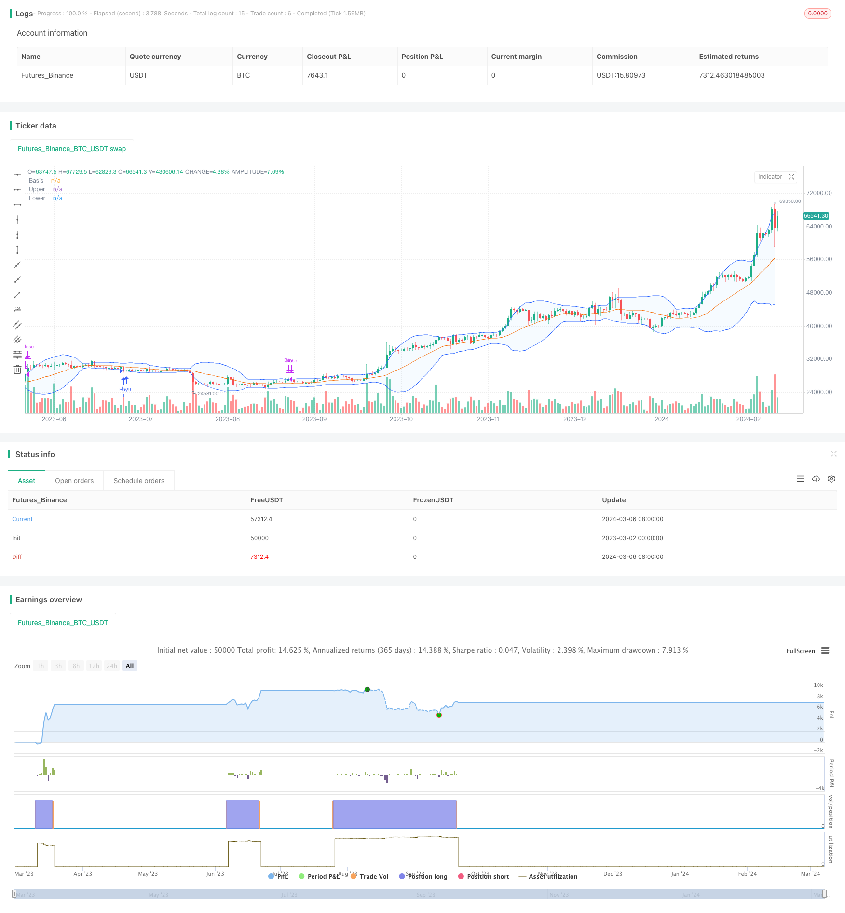

> Name

Based on Bollinger Bands Mean Reversion StrategyThe-Bollinger-Bands-Mean-Reversion-Strategy
> Author

ChaoZhang

> Strategy Description


[trans]

## Overview
The Bollinger Bands mean reversion strategy is a quantitative trading strategy based on the Bollinger Bands indicator. This strategy takes advantage of the statistical law of price fluctuations around the moving average, and performs reverse operations when the price deviates from the upper and lower Bollinger Bands, in order to obtain profits when the price returns to the mean.
## Strategy Principle
Bollinger Bands are composed of three lines: the middle rail is the moving average, and the upper and lower rails are the standard deviation plus or minus a certain multiple of the middle rail. According to statistical principles, in the case of a normal distribution, about 95% of values ​​will be distributed within plus or minus two standard deviations from the mean.
The Bollinger Bands mean reversion strategy takes advantage of this principle. When the price crosses the upper Bollinger Band, it indicates that the price may be too high and there is a risk of a pullback; when the price crosses the lower Bollinger Band, it indicates that the price may be too low and there is an opportunity for a rebound. Therefore, this strategy goes short when the price hits the upper band of the Bollinger Bands and goes long when it hits the lower band, in order to capture the profit margin of price reversion to the mean.
The main logic of this strategy code is as follows:
1. Calculate the moving average of the specified period as the middle track of the Bollinger Bands. You can choose different types of moving averages such as SMA, EMA, SMMA, WMA, and VWMA.
2. Calculate the standard deviation of the price within the period, and combine it with the multiple parameter set by the user to obtain the upper and lower rails of the Bollinger Bands.
3. When the closing price crosses the upper Bollinger Band, a sell signal is triggered; when the closing price crosses the lower Bollinger Band, a buy signal is triggered.
4. Strategy execution transaction: open a long position when the buy signal is triggered, and close the position when the sell signal appears.
Through the above process, the strategy is able to establish a reverse position when the price deviates significantly from the moving average and take profits when the price returns to the mean.
## Advantage Analysis
The Bollinger Bands mean reversion strategy has the following advantages:
1. Simple logic, easy to understand and implement. This strategy is based on the basic principles of statistics and depicts the price fluctuation range through Bollinger Bands, with clear entry and exit conditions.
2. Strong adaptability and can be applied to multiple markets and varieties. Bollinger Bands is a highly versatile technical indicator that has certain adaptability to trending and volatile markets. Users can flexibly adjust parameters to adapt to different market characteristics.
3. Capture opportunities from price fluctuations. The expansion and contraction of Bollinger Bands reflects price fluctuations. This strategy attempts to obtain returns from price return to the mean by opening positions when prices reach relatively high or low levels.
4. Take profit and stop loss are relatively clear. Since Bollinger Bands correspond to a certain confidence interval, the take-profit and stop-loss positions of this strategy are relatively easy to determine, which helps control risks.
## Risk Analysis
Although the Bollinger Bands mean reversion strategy has its advantages, it also has certain risks:
1. Poor performance in trending markets. If the market experiences a continuous unilateral trend and the price continues to move near the upper or lower Bollinger Bands, this strategy may result in frequent losing trades.
2. Parameter settings are sensitive. The period and multiple parameters of Bollinger Bands have a significant impact on strategy performance, and different parameter combinations may lead to completely different results. If parameters are set improperly, the effectiveness of the strategy will be greatly reduced.
3. Face the risk of frequent shocks. When market volatility is high and prices frequently oscillate between the upper and lower Bollinger Bands, this strategy may suffer continuous small losses, leading to a decline in overall returns.
4. Transaction costs are not considered. This sample code does not consider transaction cost factors such as spreads and handling fees. In actual application, these factors will affect the net income of the strategy to a certain extent.
In response to the above risks, you can consider taking the following measures to optimize your strategy:
1. Filter based on trend indicators. When judging signals, you can use trend indicators such as moving averages to avoid frequent trading in unilateral trends.
2. Optimize parameter selection. By backtesting historical data, we analyze the performance of strategies under different parameter combinations and select the optimal parameters suitable for the current market. Parameter evaluation and adjustments are performed regularly.
3. Introduce other filter conditions. For example, consider volatility indicators such as ATR to suspend trading when volatility is too high; or refer to other indicators such as trading volume to further confirm the reliability of the signal.
4. Incorporate transaction cost factors. In backtesting and live trading, transaction costs such as spreads and handling fees should be taken into account to more accurately evaluate the actual performance of the strategy.
## Optimization direction
In addition to the risk response measures mentioned above, the Bollinger Bands mean reversion strategy can also be optimized from the following aspects:
1. Dynamically adjust parameters. Dynamically adjust the cycle and multiple parameters of Bollinger Bands according to market changes. You can consider using adaptive moving averages (such as KAMA) as the middle track, or dynamically adjust multiple parameters based on indicators such as ATR to adapt to the current market rhythm.
2. Introduce long and short position management. When opening a position, the position size can be dynamically adjusted based on the distance between the price and the middle track of the Bollinger Bands. The farther away from the middle track, the proportion of opening positions can be appropriately reduced to control risks; the closer it is to the middle track, the proportion of open positions can be appropriately increased to seize more opportunities.
3. Combined with other technical indicators. Combine Bollinger Bands with other technical indicators (such as RSI, MACD, etc.) to form a more robust signal confirmation mechanism. Only trade when multiple indicators resonate, improving signal reliability.
4. Consider long position management. Under appropriate conditions, multiple positions can be held at the same time to spread risks. For example, you can apply this strategy on different time periods, or open positions on different trading instruments at the same time to obtain more stable returns.
The purpose of these optimization measures is to improve the adaptability, robustness and profitability of the strategy. Through dynamic adjustment, multi-indicator combination, position management and other means, we can better respond to market changes, control risks, and capture more trading opportunities.
## Summarize
The Bollinger Bands mean reversion strategy is a quantitative trading strategy based on statistical principles. The Bollinger Bands are used to characterize the price fluctuation range, and reverse operations are performed when the price deviates from the upper and lower rails, in order to obtain mean reversion returns. This strategy has simple logic and strong adaptability, and can capture opportunities for price fluctuations, but it also faces risks such as poor performance in trending markets, sensitive parameter settings, and frequent shocks.
For these risks, optimization can be carried out by combining trend indicators, optimizing parameter selection, introducing other filtering conditions, including transaction costs and other measures. In addition, the adaptability and robustness of the strategy can be further improved by dynamically adjusting parameters, managing long and short positions, combining other technical indicators, and managing long positions.
In general, the Bollinger Bands mean reversion strategy provides a simple and effective idea for quantitative trading. In practical applications, the strategy needs to be appropriately optimized and improved based on specific market characteristics and trading needs. Only by constantly testing and adjusting to find the trading method that suits you best can you achieve long-term success on the road to quantitative trading.
|| 

## Overview

The Bollinger Bands Mean Reversion Strategy is a quantitative trading strategy based on the Bollinger Bands indicator. The strategy utilizes the statistical regularity of prices fluctuating around the moving average, aiming to profit from price reversals towards the mean by taking opposite positions when prices deviate from the upper or lower bands.

## Strategy Principle

Bollinger Bands consist of three lines: the middle band is the moving average, while the upper and lower bands are a certain number of standard deviations above and below the middle band. According to statistical principles, in a normal distribution, approximately 95% of values will fall within two standard deviations of the mean.

The Bollinger Bands Mean Reversion Strategy leverages this principle. When the price crosses above the upper band, it suggests that the price may be overbought and at risk of a pullback; when the price crosses below the lower band, it indicates that the price may be oversold and has a potential for a rebound. Therefore, this strategy goes short when the price hits the upper band and goes long when it hits the lower band, aiming to capture the profit potential as the price reverts to the mean.

The main logic of the strategy code is as follows:

1. Calculate the moving average of the specified period as the middle band of the Bollinger Bands. Various types of moving averages can be selected, such as SMA, EMA, SMMA, WMA, VWMA, etc.

2. Calculate the standard deviation of the price over the same period, and combine it with the user-defined multiple parameter to obtain the upper and lower bands.

3. When the closing price crosses above the upper band, a sell signal is triggered; when the closing price crosses below the lower band, a buy signal is triggered.

4. The strategy executes trades: open a long position when a buy signal is triggered, and close the position when a sell signal appears.

Through this process, the strategy establishes opposite positions when prices significantly deviate from the moving average, and profits when prices revert to the mean.

## Advantages

The Bollinger Bands Mean Reversion Strategy has the following advantages:

1. Simple logic and easy to understand and implement. The strategy is based on basic statistical principles, using Bollinger Bands to characterize the range of price fluctuations, with clear entry and exit conditions.

2. High adaptability and applicability to multiple markets and instruments. Bollinger Bands are a versatile technical indicator with a certain level of adaptability to both trending and oscillating markets. Users can flexibly adjust parameters to adapt to different market characteristics.

3. Captures opportunities from price volatility. The expansion and contraction of Bollinger Bands reflect the volatility of prices. By establishing positions when prices reach relative highs or lows, the strategy seeks to profit from the reversion of prices to the mean.

4. Relatively clear take-profit and stop-loss levels. Since Bollinger Bands correspond to a certain confidence interval, the take-profit and stop-loss levels of this strategy are relatively easy to determine, which helps control risk.

## Risk Analysis

Although the Bollinger Bands Mean Reversion Strategy has its advantages, it also carries certain risks:

1. Underperformance in trending markets. If the market exhibits a continuous unilateral trend, with prices persistently running near the upper or lower bands, the strategy may frequently incur losing trades.

2. Sensitivity to parameter settings. The period and multiple parameters of the Bollinger Bands have a significant impact on the strategy's performance. Different parameter combinations may lead to drastically different results. If the parameters are not set properly, the effectiveness of the strategy will be greatly diminished.

3. Risk of frequent oscillations. When market volatility is high and prices frequently oscillate between the upper and lower bands, the strategy may experience consecutive small losses, leading to a decline in overall profitability.

4. Lack of consideration for trading costs. The example code does not take into account factors such as spreads and commissions. In practical applications, these factors will impact the strategy's net profitability to a certain extent.

To address these risks, the following measures can be considered to optimize the strategy:

1. Incorporate trend indicators for filtering. When judging signals, auxiliary trend indicators such as moving averages can be used to avoid frequent trading in unilateral trends.

2. Optimize parameter selection. By backtesting historical data and analyzing the strategy's performance under different parameter combinations, select the optimal parameters suitable for the current market. Regularly evaluate and adjust parameters.

3. Introduce other filtering conditions. For example, consider volatility indicators like ATR and suspend trading when volatility is too high; or reference other indicators like trading volume to further confirm the reliability of signals.

4. Incorporate trading cost factors. In backtesting and live trading, spreads, commissions, and other trading costs should be included in calculations to more accurately assess the strategy's actual performance.

## Optimization Directions

In addition to the risk mitigation measures mentioned above, the Bollinger Bands Mean Reversion Strategy can be optimized in the following aspects:

1. Dynamic parameter adjustment. Dynamically adjust the period and multiple parameters of the Bollinger Bands based on changes in the market. Consider using adaptive moving averages (such as KAMA) as the middle band or dynamically adjust the multiple parameter based on indicators like ATR to adapt to the current market rhythm.

2. Introduce long-short position management. When opening positions, dynamically adjust the position size based on the distance between the price and the middle band. The further away from the middle band, the smaller the position size to control risk; the closer to the middle band, the larger the position size to capture more opportunities.

3. Combine with other technical indicators. Use Bollinger Bands in conjunction with other technical indicators (such as RSI, MACD, etc.) to form a more robust signal confirmation mechanism. Only trade when multiple indicators resonate, improving the reliability of signals.

4. Consider multi-position management. Under appropriate conditions, multiple positions can be held simultaneously to diversify risk. For example, apply the strategy on different time frames or simultaneously open positions on different trading instruments to obtain more stable returns.

The purpose of these optimization measures is to improve the adaptability, robustness, and profitability of the strategy. Through dynamic adjustments, multi-indicator combinations, position management, and other means, the strategy can better cope with market changes, control risks, and capture more trading opportunities.

## Summary

The Bollinger Bands Mean Reversion Strategy is a quantitative trading strategy based on statistical principles. It characterizes the range of price fluctuations using Bollinger Bands and takes opposite positions when prices deviate from the upper or lower bands, aiming to profit from mean reversion. The strategy has simple logic, strong adaptability, and the ability to capture opportunities from price volatility. However, it also faces risks such as underperformance in trending markets, sensitivity to parameter settings, and frequent oscillations.

To address these risks, optimization measures can be taken, such as incorporating trend indicators, optimizing parameter selection, introducing other filtering conditions, and considering trading costs. Furthermore, the strategy's adaptability and robustness can be enhanced through dynamic parameter adjustments, long-short position management, combining with other technical indicators, and multi-position management.

Overall, the Bollinger Bands Mean Reversion Strategy provides a simple yet effective approach to quantitative trading. In practical applications, the strategy needs to be appropriately optimized and refined based on specific market characteristics and trading requirements. Through continuous testing and adjustment, finding the most suitable trading method for oneself is the key to long-term success in quantitative trading.

[/trans]

> Strategy Arguments


|Argument|Default|Description|
|----|----|----|
|v_input_int_1|20|length|
|v_input_string_1|0|Basis MA Type: SMA|EMA|SMMA (RMA)|WMA|VWMA|
|v_input_1_close|0|Source: close|high|low|open|hl2|hlc3|hlcc4|ohlc4|
|v_input_float_1|2|StdDev|


> Source (PineScript)

``` pinescript
/*backtest
start: 2023-03-02 00:00:00
end: 2024-03-07 00:00:00
period: 1d
basePeriod: 1h
exchanges: [{"eid":"Futures_Binance","currency":"BTC_USDT"}]
*/

//@version=5
strategy("BB Strategy", shorttitle="BB", overlay=true)

length = input.int(20, minval=1)
maType = input.string("SMA", "Basis MA Type", options = ["SMA", "EMA", "SMMA (RMA)", "WMA", "VWMA"])
src = input(close, title="Source")
mult = input.float(2.0, minval=0.001, maxval=50, title="StdDev")

// Calculate moving average based on selected type
ma(source, length, _type) =>
    switch _type
        "SMA" => ta.sma(source, length)
        "EMA" => ta.ema(source, length)
        "SMMA (RMA)" => ta.rma(source, length)
        "WMA" => ta.wma(source, length)
        "VWMA" => ta.vwma(source, length)

// Calculate Bollinger Bands
basis = ma(src, length, maType)
dev = mult * ta.stdev(src, length)
upper = basis + dev
lower = basis - dev

// Plot Bollinger Bands
plot(basis, "Basis", color=#FF6D00)
p1 = plot(upper, "Upper", color=#2962FF)
p2 = plot(lower, "Lower", color=#2962FF)
fill(p1, p2, title = "Background", color=color.rgb(33, 150, 243, 95))

// Buy condition: Price below lower Bollinger Band
buy_condition = close < lower
// Sell condition: Price above upper Bollinger Band
sell_condition = close > upper

// Execute trades
strategy.entry("Buy", strategy.long, when=buy_condition)
strategy.close("Buy", when=sell_condition)
```

> Detail

https://www.fmz.com/strategy/443997

> Last Modified

2024-03-08 14:46:15
