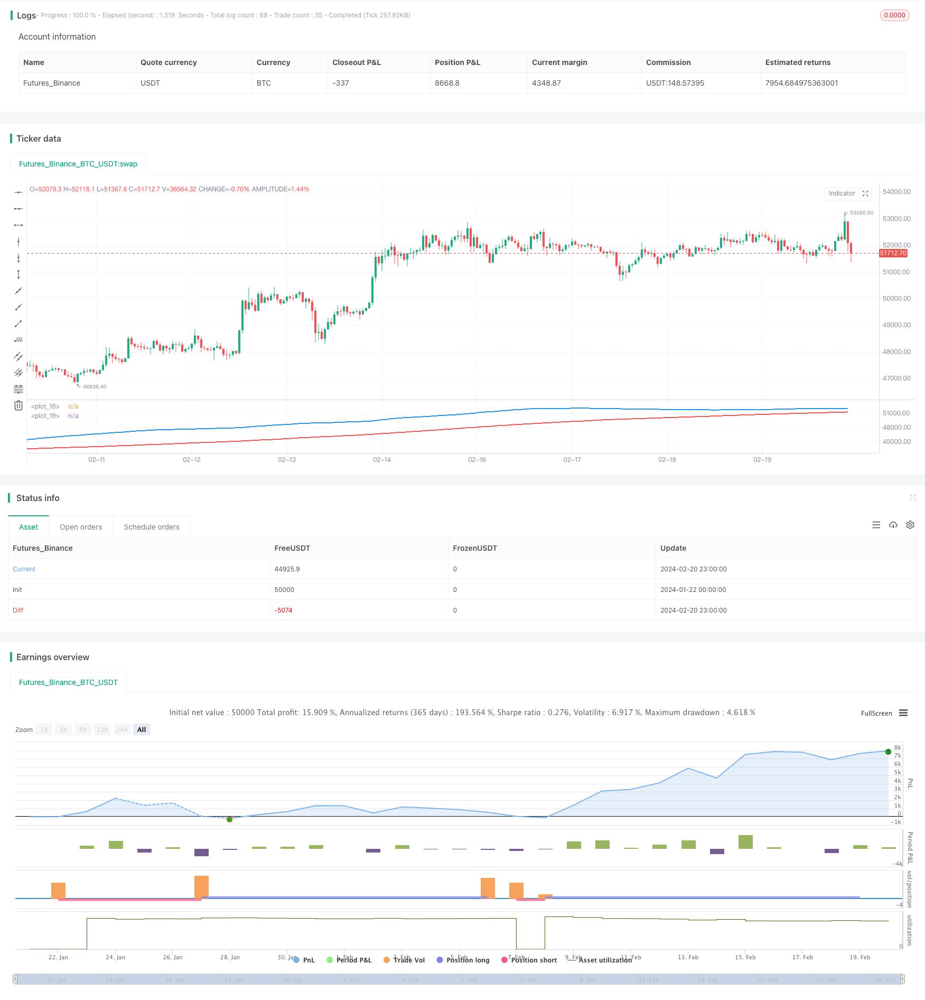

> Name

The-Moving-Average-Crossover-Trading-Strategy Based on Moving Average Trading Trend Strategy
> Author

ChaoZhang

> Strategy Description


[trans]
## Overview
The moving average trading strategy identifies rising and falling trends in stock prices by calculating the fast moving average (50-day line) and slow moving average (200-day line) to capture potential trading opportunities. When the fast moving average crosses the slow moving average, it means that an upward trend in stock prices has formed, and the strategy will establish a long position; when the fast moving average crosses below the slow moving average, it means that a downward trend in stock prices has formed, and the strategy will establish a short position.
## Strategy Principle
The core logic of this strategy is based on the golden cross and death cross of the moving average to determine the price trend. Specifically, if the 50-day moving average crosses the 200-day moving average, it is called a "golden cross", indicating that an uptrend is coming; if the 50-day moving average crosses below the 200-day moving average, it is called a "death cross", indicating that a downtrend is coming. The strategy will go long when the golden cross occurs and short when the death cross occurs, and make profits by capturing the price turning point in time.
In the code, first calculate the fast moving average (50-day line) and the slow moving average (200-day line), and then determine the relationship between the two averages. If the fast moving average is greater than the slow moving average (golden cross), it means that the stock price is in an upward trend, and the strategy will establish a long position; conversely, if the fast moving average is less than the slow moving average (death cross), it means that a downward trend in the stock price has formed, and the strategy will establish a short position.
## Strategic advantage analysis
This strategy has the following advantages:
1. The rules are simple and clear, easy to understand and implement
2. The moving average indicator is mature, reliable and widely used.
3. Can effectively filter market noise and identify price trends
4. Have a higher winning rate
5. Customizable moving average parameters to adapt to different market environments
In general, this strategy takes advantage of the moving average indicator, sets reasonable parameters, and forms a stable trend following strategy. It can track the upward trend to make profits in the bull market, and capture the falling short profit in the bear market. It is a relatively simple and practical quantitative strategy.
## Risk and solution analysis
This strategy also has some risks, mainly focusing on the following aspects:
1. whipsaw effect. When the price fluctuates around the moving average, multiple false signals may occur. Whipsaw can be reduced by optimizing the moving average parameters.
2. Miss the turning point. Moving averages have hysteresis and may miss key turning points for rapid price reversals. It can be combined with other indicators such as MACD to assist in judgment.
3. Not suitable for violent market conditions. Moving average crossover signals may not be effective in markets with severe price fluctuations. At this time, you can consider suspending the strategy or combining volatility indicators to avoid such extreme market conditions.
4. The space for parameter optimization is limited. The optimization space of moving average parameters is relatively small and requires manual experience combined with optimization.
## Optimization direction
This strategy can be further optimized from the following aspects:
1. Combine with other indicator judgments to form an indicator combination to improve the strategy effect. For example, add MACD, volatility indicators, etc.
2. Optimize moving average parameters and reduce errors. Moving averages with different period parameters can be tested.
3. Add stop loss logic to control risks. For example, set a percentage stop loss or a dynamic trailing stop loss.
4. Combined with machine learning model to dynamically optimize parameters. Models can be established to automatically optimize parameters to adapt to market changes.
5. Stratified entry, average opening cost. You can open a position in batches instead of entering the whole position at once.
## Summarize
Overall, this strategy is a stable, practical, and easy-to-implement quantitative strategy. It uses mature moving average indicators to determine price trends and open positions to capture profits when the trend turns. The advantage of the strategy is that it is simple, stable, and has a high winning rate, and is suitable as a basic strategy for quantitative trading. Of course, there is also some room for improvement. Investors can appropriately optimize the strategy according to their own needs to make the strategy more effective.
|| 

## Overview  

The moving average crossover trading strategy identifies bullish and bearish trends in stock prices by calculating fast moving average (50-day line) and slow moving average (200-day line) to capture potential trading opportunities. When the fast moving average crosses above the slow moving average, it indicates that an upward trend in stock prices is forming and the strategy will establish a long position. When the fast moving average crosses below the slow moving average, it indicates a downward trend in stock prices is forming and the strategy will establish a short position.

## Strategy Principle   

The core logic of this strategy is based on the golden cross and death cross of moving averages to determine price trends. Specifically, if the 50-day moving average crosses above the 200-day moving average, it is called a "golden cross" indicating an uptrend coming. If the 50-day moving average drops below the 200-day moving average, it is called a "death cross" indicating a downtrend coming. The strategy will go long on golden crosses and go short on death crosses to capture price turning points for profits. 

In the code, the fast moving average (50-day line) and slow moving average (200-day line) are calculated first, then the relationship between the two average lines is judged. If the fast moving average is greater than the slow moving average (golden cross), it means that stock prices are in an upward trend. At this point, the strategy will establish a long position. On the contrary, if the fast moving average is less than the slow moving average (death cross), it means a downward trend is forming in stock prices. The strategy will establish a short position.  

## Advantage Analysis  

The advantages of this strategy include:

1. Simple and clear rules that are easy to understand and implement  
2. Mature and reliable moving average indicators with wide application  
3. Can effectively filter market noise and identify price trends   
4. Relatively high win rate
5. Customizable moving average parameters to adapt to different market environments   

In summary, by leveraging the advantages of moving average indicators and setting reasonable parameters, this strategy forms a stable trend tracking system, profiting from upward trends in bull markets and catching shorting opportunities in downward trends in bear markets. It is a relatively simple and practical quantitative strategy.

## Risks and Solutions

The strategy also has some risks, mainly in the following aspects:

1. Whipsaw effect. There may be multiple false signals when prices oscillate around the moving averages. This can be reduced by optimizing the moving average parameters.

2. Missing turning points. Moving averages have lagging effects and may miss key reversal points when prices reverse rapidly. Other indicators like MACD can be combined to assist judgment.   

3. Not suitable for volatile markets. The crossovers of moving averages may not work well in extremely volatile markets. Consider temporarily pausing the strategy or incorporate volatility metrics to avoid such extreme market conditions.  

4. Limited parameter optimization space. There is relatively small room for optimizing moving average parameters which relies more on human experience combined with optimization.

## Optimization Directions 

The strategy can be further optimized from the following aspects:

1. Combine with other indicators to form indicator combos to improve strategy performance, e.g. adding MACD, volatility metrics, etc.  

2. Optimize moving average parameters to reduce errors. Different period parameters for moving averages can be tested.  

3. Add stop loss logic to control risks, e.g. set percentage stop loss or dynamic trailing stop loss.

4. Leverage machine learning models to dynamically optimize parameters adapting to market changes.  

5. Scale in positions to average entry costs instead of one-off full position entries.

## Conclusion   

Overall, this strategy is a stable, practical and easy-to-implement quantitative strategy. It uses mature moving average indicators to determine price trends and open positions when trend reversals occur to capture profits. The advantages lie in its simplicity, stability and relatively high win rate, making it suitable as a fundamental quantitative trading strategy. Of course there are still rooms for improvement. Investors can optimize this strategy accordingly based on their own needs for better performance.

[/trans]


> Source (PineScript)

``` pinescript
/*backtest
start: 2024-01-22 00:00:00
end: 2024-02-21 00:00:00
period: 1h
basePeriod: 15m
exchanges: [{"eid":"Futures_Binance","currency":"BTC_USDT"}]
*/

// This Pine Script™ code is subject to the terms of the Mozilla Public License 2.0 at https://mozilla.org/MPL/2.0/
// © pablobm0933

//@version=5
strategy("Estrategia de Trading")

// Definir medias móviles para identificar tendencias
fast_ma = ta.sma(close, 50) // Media móvil rápida
slow_ma = ta.sma(close, 200) // Media móvil lenta

// Condiciones para identificar tendencia alcista
tendencia_alcista = fast_ma > slow_ma

// Condiciones para identificar tendencia bajista
tendencia_bajista = fast_ma < slow_ma

// Dibujar las medias móviles en el gráfico
plot(fast_ma, color=color.blue, linewidth=2)
plot(slow_ma, color=color.red, linewidth=2)

// Detectar señales de entrada y salida
if (tendencia_alcista)
    strategy.entry("Compra", strategy.long)
    strategy.exit("Venta", "Compra", loss=close*0.02) // Salida de la posición con una pérdida del 2%
    
if (tendencia_bajista)
    strategy.entry("Venta", strategy.short)
    strategy.exit("Compra", "Venta", loss=close*0.02) // Salida de la posición con una pérdida del 2%


```

> Detail

https://www.fmz.com/strategy/442542

> Last Modified

2024-02-22 16:36:26
