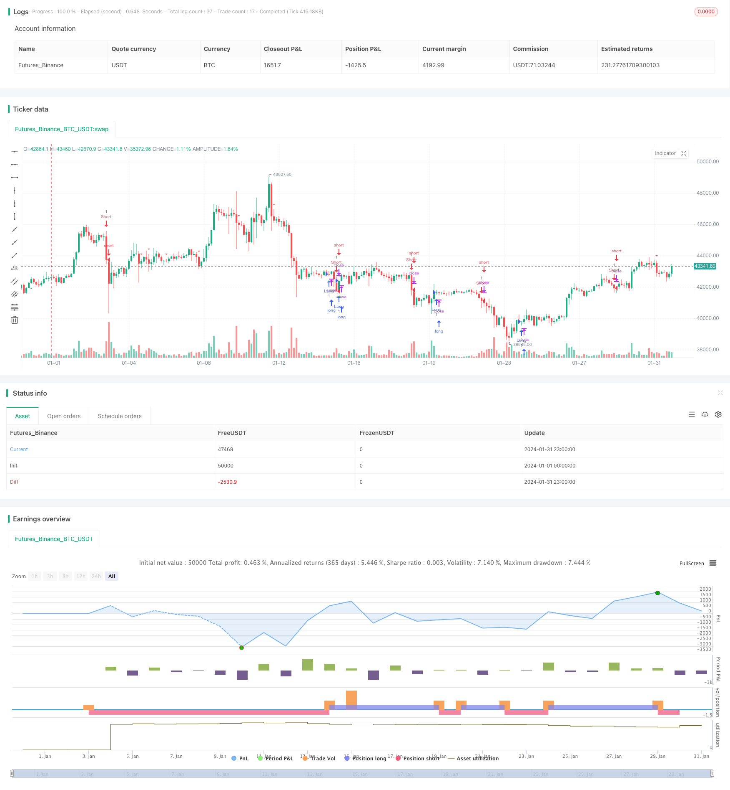

> Name

The-Moving-Average-Crossover-Trend-Strategy based on moving average crossover trend strategy
> Author

ChaoZhang

> Strategy Description


[trans]
## Overview
The moving average crossover trend strategy is a trend following strategy based on moving average crossover signals. This strategy uses the golden cross of the fast moving average and the slow moving average to determine the market trend, establish a position at the beginning of the trend, and close the position when the trend end signal appears.
## Strategy Principle
This strategy uses the difference line of the MACD indicator and the golden cross of the signal line to determine the beginning and end of the trend. Specifically, it uses a 12-period fast EMA and a 26-period slow EMA to construct the MACD difference line. When the difference line crosses the signal line, a buy signal is generated, indicating the beginning of a bull market trend; when the difference line crosses below the signal line, a sell signal is generated, indicating the beginning of a bear market trend.
When entering the market, this strategy only opens a long position when the K-line generates a buy signal within 15 minutes, and takes advantage of the opportunity at the beginning of the trend to enter the market. In terms of stop-loss closing, when the difference line of the 4-hour K-line MACD crosses below the signal line, it indicates a trend reversal, and all positions are closed with stop-loss.
## Advantage Analysis
The biggest advantage of this strategy is that it can promptly seize the opportunity when the trend starts, and at the same time, it can stop losses in time through the dead cross signal, thereby obtaining a good risk-return ratio. The specific advantages are as follows:
1. Using MACD indicator to judge the trend is more reliable and has a higher winning rate.
2. The combination of 15 minutes and 4 hours multiple time frames not only ensures the frequency of operations, but also controls risks
3. Stop losses in time and effectively control the maximum drawdown of the account
## Risk Analysis
This strategy also has some risks, mainly focusing on the following aspects:
1. The MACD indicator may generate false signals, leading to unnecessary entry or stop loss.
2. The stop loss point setting may be too general and cannot fully consider the special circumstances of market fluctuations.
3. Improper selection of Parameters may affect the effectiveness of the strategy
In order to reduce these risks, optimization can be done from the following aspects:
1. Combine with other indicators to filter false signals
2. Dynamically adjust stop loss points
3. Optimize parameter settings
## Optimization direction
This strategy can be further optimized mainly from the following aspects:
1. Consider combining other indicators such as RSI, Bollinger Bands, etc. to filter out false signals and improve strategy accuracy.
2. Test more combinations of fast and slow cycle parameters to find optimal parameters
3. Use machine learning methods to train optimal parameters
4. Optimize the stop loss setting and consider dynamic trailing stop loss or partial stop loss
5. Expand to more time periods and perform multi-time frame combinations
## Summarize
Overall, the moving average crossover trend strategy is a simple and practical trend following strategy. It determines the beginning and end of the trend through the intersection of MACD's fast and slow moving averages, and uses the trend to make profits with a combination of short-term and long-term. The advantage of this strategy is timely entry, effective stop loss, and relatively balanced risk and return. In the next step, the stability and profitability of the strategy can be further improved through parameter optimization, signal filtering and other methods.
||

## Overview

The Moving Average Crossover Trend strategy is a trend-following strategy based on moving average crossover signals. It uses the golden cross and death cross of fast and slow moving averages to determine market trends, establishes positions at the beginning of trends, and closes positions when trend reversal signals appear.

## Principles

The strategy uses the crossovers of MACD histogram and signal line to identify the start and end of trends. Specifically, it constructs the MACD histogram based on 12-period fast EMA and 26-period slow EMA. When the histogram crosses above the signal line, a buy signal is generated, indicating the start of an uptrend. When the histogram crosses below the signal line, a sell signal is triggered, marking the start of a downtrend.

For entries, the strategy only goes long when a buy signal is generated on the 15-min chart to capitalize on the early stage of trend starts. For exits, it closes all positions when the MACD histogram crosses below the signal line on the 4-hour chart, signaling a trend reversal.  

## Advantage Analysis

The biggest advantage of this strategy is its ability to timely catch trend starts and exit on reversal signals, achieving good risk-reward ratios. The main advantages are:

1. Using MACD for trend identification is reliable with high winning rate
2. Combining 15-min and 4-hour timeframes balances frequency and risk control
3. Timely stop loss effectively limits maximum drawdown

## Risk Analysis  

There are also some risks mainly in the following aspects:

1. MACD may generate false signals, causing unnecessary entries or stops
2. The stop loss point may be too crude to accommodate market fluctuations
3. Improper parameter selection may undermine strategy efficacy

To mitigate the risks, optimizations can be made in:

1. Adding filter with other indicators to avoid false signals
2. Adaptive adjustments of stop loss points  
3. Parameter tuning

## Optimization Directions

The main aspects to further optimize the strategy include:  

1. Incorporate other indicators like RSI, Bollinger Bands to filter signals
2. Test more fast and slow period combinations for optimal parameters
3. Utilize machine learning to train optimum parameters
4. Optimize stop loss rules with trailing or partial stops 
5. Expand to more timeframes for multi-timeframe combinations

## Conclusion

Overall, the Moving Average Crossover Trend Strategy is a simple and practical trend following system. It capitalizes on trends by identifying starts and ends using MACD crossovers, and combining short-term and long-term positions. The advantages lie in its timely entries, effective stops, and balanced risk-reward. Next steps would be improving robustness and profitability via parameterized optimization, signal filtering etc.

[/trans]

> Strategy Arguments


|Argument|Default|Description|
|----|----|----|
|v_input_1|12|Fast Length|
|v_input_2|26|Slow Length|
|v_input_3_close|0|Source: close|high|low|open|hl2|hlc3|hlcc4|ohlc4|
|v_input_int_1|9|Signal Smoothing|
|v_input_string_1|0|Oscillator MA Type: EMA|SMA|
|v_input_string_2|0|Signal Line MA Type: EMA|SMA|


> Source (PineScript)

``` pinescript
/*backtest
start: 2024-01-01 00:00:00
end: 2024-01-31 23:59:59
period: 3h
basePeriod: 15m
exchanges: [{"eid":"Futures_Binance","currency":"BTC_USDT"}]
*/

//@version=5
strategy(title="Moving Average Convergence Divergence", shorttitle="MACD", overlay=true)

// Getting inputs
fast_length = input(title="Fast Length", defval=12)
slow_length = input(title="Slow Length", defval=26)
src = input(title="Source", defval=close)
signal_length = input.int(title="Signal Smoothing", minval=1, maxval=50, defval=9)
sma_source = input.string(title="Oscillator MA Type", defval="EMA", options=["SMA", "EMA"])
sma_signal = input.string(title="Signal Line MA Type", defval="EMA", options=["SMA", "EMA"])

// Calculating MACD
fast_ma = sma_source == "SMA" ? ta.sma(src, fast_length) : ta.ema(src, fast_length)
slow_ma = sma_source == "SMA" ? ta.sma(src, slow_length) : ta.ema(src, slow_length)
macd = fast_ma - slow_ma
signal_line = sma_signal == "SMA" ? ta.sma(macd, signal_length) : ta.ema(macd, signal_length)

// Entry conditions
longCondition = macd < 0 and ta.crossover(macd, signal_line) 
shortCondition = ta.crossover(signal_line, macd) 

// Plot signals
plotshape(series=longCondition, style=shape.triangleup, location=location.belowbar, color=color.green, size=size.small, title="Buy Signal")
plotshape(series=shortCondition, style=shape.triangledown, location=location.abovebar, color=color.red, size=size.small, title="Sell Signal")

// Strategy
if (longCondition)
    strategy.entry("Long", strategy.long)
if (shortCondition)
    strategy.entry("Short", strategy.short)

```

> Detail

https://www.fmz.com/strategy/443041

> Last Modified

2024-02-28 17:55:28
