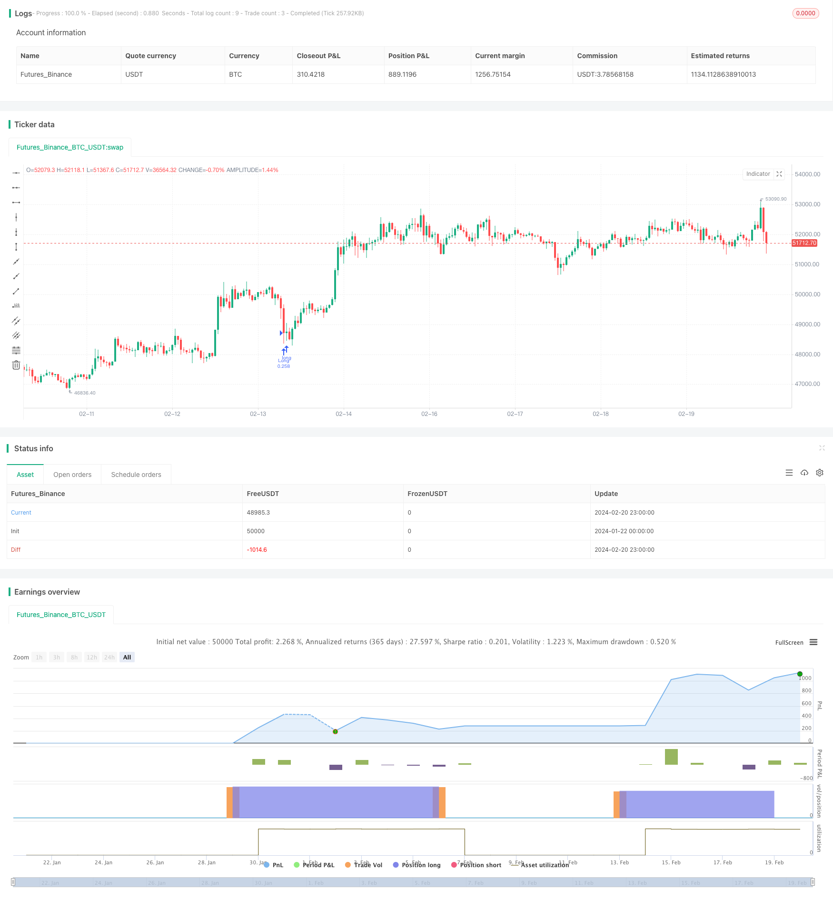

> Name

The-Oscillating-Breakthrough-Strategy based on the Oscillating-Breakthrough-Strategy
> Author

ChaoZhang

> Strategy Description


[trans]
## Overview
The Swing Breakout Strategy is an active trading strategy used on the 15-minute time frame of major cryptocurrencies. It uses technical indicators to identify market trends, discover potential breaking points, and effectively manage risk by setting stop losses.
## Strategy Principle
This strategy uses two simple moving averages (SMA50 and SMA200) to determine the direction of the market trend. When SMA50 crosses SMA200, it is a bullish signal, and vice versa, it is a bearish signal.
The Relative Strength Index (RSI) is used to determine overbought and oversold conditions. When RSI is lower than the set oversold zone (default is 40), it is an oversold zone and is considered a potential buying signal.
The specific transaction logic is:
1. RSI below 40 and closing price above SMA200 constitute buying conditions;
2. Enter a long position;
3. The stop loss is set to 5% of the entry price;
4. If SMA50 crosses below SMA200 and RSI is above 50, close the position to lock in profits.
This strategy is simple and easy to implement, using double confirmation to find potential breaking points. Stop loss is set to prevent losses from expanding, and the crossover of the SMA indicator serves as an exit signal.
## Advantage Analysis
This strategy has the following advantages:
1. The strategy is simple to operate and easy to implement;
2. Use double moving averages to filter out false breakthroughs and ensure VALIDITY breakthroughs;
3. The RSI indicator identifies the oversold zone and forms a buying opportunity;
4. Include stop loss to proactively control risk;
5. SMA crossover as an exit mechanism.
## Risk Analysis
There are also some risks with this strategy:
1. When the market fluctuates violently, the stop loss may be breached;
2. Improper SMA period setting may miss the trend;
3. Long short positions in the long market affect profits.
This can be optimized by:
1. Dynamically adjust the stop loss range;
2. Optimize SMA parameters;
3. Consider adding other factors to determine the timing of holding positions.
## Summarize
In general, the shock breakthrough strategy is a simple and practical short-term strategy. It has the advantages of easy operation and controllable risks, and is suitable for traders who are not familiar with the cryptocurrency market. Through further optimization, the strategy can maintain stable returns in more market environments.
||

## Overview  

The Oscillating Breakthrough Strategy is an active trading strategy for mainstream cryptocurrencies using a 15-minute timeframe. It utilizes technical indicators to identify market trends, discover potential breakthrough points, and effectively manage risks through stop-loss settings.

## Strategy Principles

The strategy employs two Simple Moving Averages (SMA50 and SMA200) to determine the market trend direction. When SMA50 crosses above SMA200, it's a bullish signal, and vice versa for bearish signals.

The Relative Strength Index (RSI) is used to judge overbought/oversold conditions. When the RSI falls below the set oversold region (default 40), it indicates a potential buy signal.  

The specific trading logic is:

1. RSI below 40 and close price above SMA200 constitutes the buy condition;
2. Enter long position;  
3. Set stop loss at 5% below entry price;
4. If SMA50 crosses below SMA200 and RSI goes above 50, close position to lock in profits.

The strategy is simple and straightforward, seeking potential breakthrough points through dual confirmation. The stop loss prevents losing positions from getting out of hands, while SMA crossovers act as exit signals.

## Advantage Analysis   

The strategy has the following advantages:

1. Simple to implement;  
2. False breakouts filtered through dual moving averages, ensuring validity;
3. RSI identifies oversold conditions for opportunities;
4. Embedded stop loss to actively control risks; 
5. SMA crossovers as exit mechanism.  

## Risk Analysis

There are also some risks:

1. Stop loss could be penetrated during violent market swings;
2. Improper SMA periods may cause missing trends;  
3. Excessive time spent out of trades in bull markets impacts profits.

Improvements can be made via:

1. Dynamic stop loss levels;
2. SMA optimization;
3. Considering more factors for holding decisions.  

## Summary  

In summary, the Oscillating Breakthrough Strategy is a simple and practical short-term strategy. With easy operation, controllable risks etc., it suits novice crypto traders. Further optimizations can enable stable profits across more market environments.

[/trans]

> Strategy Arguments


|Argument|Default|Description|
|----|----|----|
|v_input_float_1|5|% Stop Loss|
|v_input_1|90|(?Simple Moving Average) SMA50 Length|
|v_input_2|170| SMA200 Length|
|v_input_3|14|(?Relative Strenght Index) RSI Length|
|v_input_4|40| Oversold Level|


> Source (PineScript)

``` pinescript
/*backtest
start: 2024-01-22 00:00:00
end: 2024-02-21 00:00:00
period: 1h
basePeriod: 15m
exchanges: [{"eid":"Futures_Binance","currency":"BTC_USDT"}]
*/

// This source code is subject to the terms of the Mozilla Public License 2.0 at https://mozilla.org/MPL/2.0/
// © Wielkieef


//@version=5
strategy("Crypto Sniper [15min]", shorttitle="ST Strategy", overlay=true, pyramiding=1, initial_capital=10000, default_qty_type=strategy.percent_of_equity, default_qty_value=25, calc_on_order_fills=false, slippage=0, commission_type=strategy.commission.percent, commission_value=0.03)

sma50Length = input(90, title=" SMA50 Length", group="Simple Moving Average")
sma200Length = input(170, title=" SMA200 Length", group="Simple Moving Average")
rsiLength = input(14, title=" RSI Length", group="Relative Strenght Index")
overSoldLevel = input(40, title=" Oversold Level", group="Relative Strenght Index")
sl = input.float(5.0, '% Stop Loss', step=0.1)

rsi = ta.rsi(close, rsiLength)
sma50 = ta.sma(close, sma50Length)
sma200 = ta.sma(close, sma200Length)

longCondition = rsi < overSoldLevel and close > sma200

if (longCondition)
    strategy.entry("Long", strategy.long)  

stopLossPrice = strategy.position_avg_price * (1 - sl / 100)
strategy.exit("Stop Loss", stop=stopLossPrice)

if (ta.crossunder(sma200, sma50) and rsi >= 50)
    strategy.close("Long")

Bar_color = ta.crossunder(sma200, sma50) and rsi >= 50 ? color.orange : rsi < overSoldLevel ? color.maroon : strategy.position_avg_price != 1 ? color.green : color.gray

barcolor(color=Bar_color)


//by wielkieef

```

> Detail

https://www.fmz.com/strategy/442551

> Last Modified

2024-02-22 17:15:01
