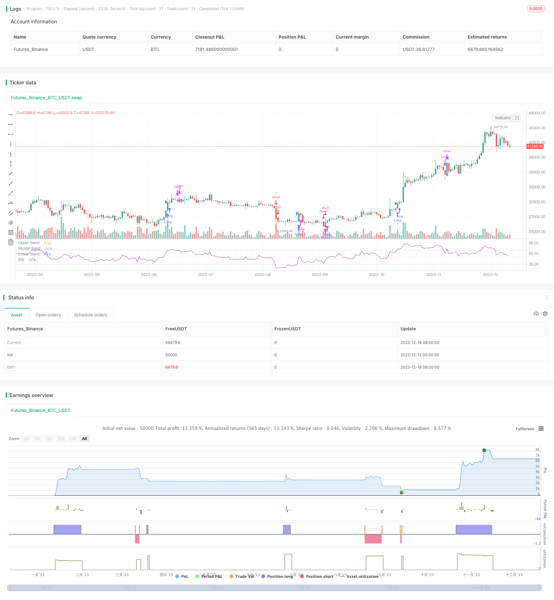

> Name

The-Relative-Volume-Indicator-Strategy
> Author

ChaoZhang

> Strategy Description


 [trans]
### Strategy Overview ###
This is a quantitative trading strategy based on the relative strength indicator (RSI) and the relative volume indicator. This strategy captures excess returns by capturing trading signals at the fastest stage of a strong market.
### Strategy Principle ###
This strategy integrates two indicators: the Relative Strength Index (RSI) and the Relative Volume Index (RVOL). RSI is used to determine whether market trends are overbought or oversold. When the RSI is below 30, it is oversold, and when it is above 70, it is overbought. RVOL is used to judge the explosiveness of trading volume. When the relative average trading volume is greater than the set threshold, it indicates strong buying and selling strength.
The strategy logic is: when RSI is overbought (RSI is above the threshold) and RVOL is oversized, enter the market with a long view; when RSI is oversold (RSI is below the threshold) and RVOL is oversized, enter the market with a short view. The signal to close a position is that the RSI returns to normal levels (long positions are closed: RSI is below 69; short positions are closed: RSI is above 31).
### Advantage Analysis ###
The biggest advantage of this strategy is to use the RSI indicator to determine when the market is overbought and oversold, and then combine it with high relative volume signals to capture the breaking point of a super strong market when the market is at its most aggressive. Using the combined signal of RSI and RVOL can filter out many false breakthrough opportunities, thereby increasing the probability of profit.
Compared with using the RSI indicator alone, this strategy adds a reference to trading volume and avoids intervening in the market when trading volume is insufficient. Compared with using breakout indicators alone, this strategy avoids rebounding into the mainstream in overbought and oversold areas.
### Risk Analysis ###
The biggest risk with this strategy is the probability of the RSI indicator sending a false signal. When the market is on the sideways, the RSI indicator may frequently enter and exit the overbought and oversold areas, generating false signals. In addition, this strategy is more sensitive to changes in trading volume. If it encounters stocks with insufficient volume, the profit margin will be reduced.
In order to reduce risks, you can appropriately adjust the parameters of RSI, increase the average length of RSI, or increase the threshold of RVOL. Other indicators can also be added to the combination to increase the robustness of the strategy.
### Optimization direction ###
This strategy can be optimized from the following aspects:
1. Combine liquidity indicators to avoid targets with poor liquidity;
2. Add a volatility indicator and only intervene when volatility intensifies;
3. Add a mechanism to eliminate false breakthroughs, such as adding trading volume monitoring;
4. Make the stop loss strategy more stringent and reduce the retracement;
5. Carry out parameter optimization and find the optimal parameter combination based on backtest data.
### Summarize ###
This relative volume indicator strategy successfully locates the point when trading volume breaks out in the overbought and oversold area through the combination of relative strength indicator and relative trading volume, and is an effective trend capturing strategy. The psychological scenario of this strategy is clear, and after parameter tuning, it can become an effective part of the quantitative trading system.
||

### Strategy Overview ###
This is a quantitative trading strategy based on the Relative Strength Index (RSI) and the Relative Volume indicator. The strategy aims to capture excess returns by trading the fastest stage of a strong trend.

### Strategy Logic ### 
The strategy incorporates two indicators: Relative Strength Index (RSI) and Relative Volume (RVOL). RSI judges the overbought/oversold levels. RSI below 30 suggests oversold and RSI above 70 suggests overbought. RVOL captures surges in volume compared to recent average. When RVOL is above a threshold, it indicates strong buying/selling pressure.

The strategy logic is: go long when RSI shows overbought (above threshold) AND RVOL shoots up; go short when RSI shows oversold (below threshold) AND RVOL shoots up. Exit signals happen when RSI returns to normal level (long exit: RSI below 69; short exit: RSI above 31).

### Advantage Analysis ###
The biggest edge of this strategy is to locate the most aggressive part of a trend by combining overbought/oversold signal from RSI and the high relative volume signal. Using the combo signal of RSI and RVOL can avoid lots of false breakouts and improve profitability. 

Compared to using RSI alone, this strategy incorporates volume information to avoid entering the market with insufficient liquidity. Compared to using breakout alone, this strategy prevents trading against the major trend in OB/OS regions.

### Risk Analysis ###
The biggest risk of this strategy is the possibility of RSI giving false signals. When market is ranging, RSI may frequently cross in/out of OB/OS zones and generate fake signals. Also, this strategy is sensitive to volume changes. Low liquidity instruments can discount the profitability. 

To mitigate the risks, parameters of RSI can be adjusted, like increasing averaging period, or lifting the threshold for RVOL. Combining other indicators helps improve robustness too.

### Optimization Directions ###
The potential optimizations include:

1. Add liquidity metrics to avoid illiquid instruments;  

2. Add volatility metrics to trade only when volatility expansions;

3. Build mechanisms to avoid false breakouts, e.g. monitoring volume;

4. Make stop loss more strict, to limit drawdowns;

5. Parameter tuning based on backtests to find optimum settings.

### Conclusion ###
The Relative Volume strategy manages to locate points of surging volume within OB/OS zones by incorporating RSI and relative volume, making it an effective trend catching strategy. With clear logic and robust optimizations, it can be a valuable addition to the quantitative trading system.

[/trans]

> Strategy Arguments


|Argument|Default|Description|
|----|----|----|
|v_input_1|14|RSI Period|
|v_input_2|70|RSI buy|
|v_input_3|35|RSI short|
|v_input_4|14|RV Period|
|v_input_5|1.5|RV Threshold|


> Source (PineScript)

``` pinescript
/*backtest
start: 2022-12-13 00:00:00
end: 2023-12-19 00:00:00
period: 1d
basePeriod: 1h
exchanges: [{"eid":"Futures_Binance","currency":"BTC_USDT"}]
*/

// This source code is subject to the terms of the Mozilla Public License 2.0 at https://mozilla.org/MPL/2.0/
// © gary_trades
//This script is a basic concept to catch breakout moves utilising a spike in relative volume when the RSI is high (for longs) or when the RSI is low (for shorts).
//Drawdown is typically low as it exits out of the trade once the RSI returns back to "normal levels".

//@version=4
strategy(title="Relative Volume & RSI Pop", shorttitle="VOL & RSI Pop", overlay=false, precision=2, margin_long=100, margin_short=100)

//RSI
RSIlength = input(14, title="RSI Period")
RSItop = input(70, title="RSI buy", minval= 69, maxval=100)
RSIbottom = input(35, title="RSI short", minval= 0, maxval=35)
price = close
vrsi = rsi(price, RSIlength)
RSIco = crossover(vrsi, RSItop)
RSIcu = crossunder(vrsi, RSIbottom)
plot(vrsi, "RSI", color=color.purple)
band1 = hline(70, "Upper Band", color=#C0C0C0)
bandm = hline(50, "Middle Band", color=color.new(#C0C0C0, 50))
band0 = hline(30, "Lower Band", color=#C0C0C0)
fill(band1, band0, color=color.purple, transp=90, title="Background")

//RELATIVE VOLUME
RVOLlen = input(14, minval=1, title="RV Period")
av = sma(volume, RVOLlen)
RVOL = volume / av
RVOLthreshold = input(1.5,title="RV Threshold", minval=0.5, maxval=10)

//TRADE TRIGGERS
LongCondition = RSIco and RVOL > RVOLthreshold
CloseLong = vrsi < 69

ShortCondition = RSIcu and RVOL > RVOLthreshold
CloseShort = vrsi > 35

if (LongCondition)
    strategy.entry("Long", strategy.long)
    
strategy.close("Long", when = CloseLong)    

if (ShortCondition)
    strategy.entry("Short", strategy.short)
    
strategy.close("Short", when = CloseShort)   

```

> Detail

https://www.fmz.com/strategy/435975

> Last Modified

2023-12-20 15:12:56
