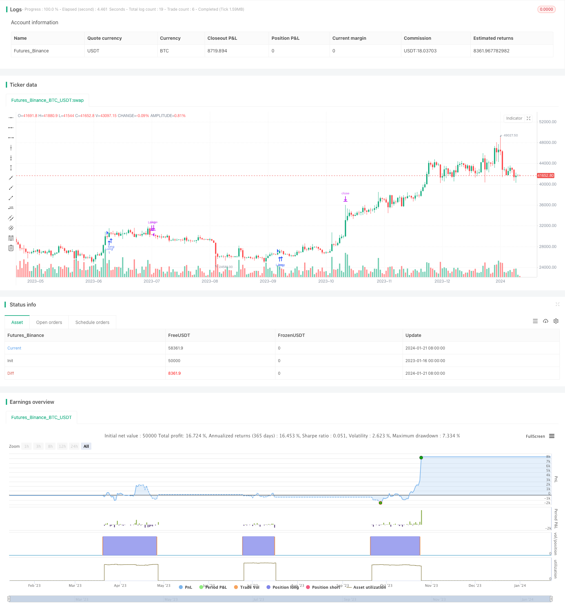

> Name

Momentum Strategy Based on Moving Averages This-strategy-is-a-momentum-strategy-based-on-moving-average-lines
> Author

ChaoZhang

> Strategy Description


 [trans]

## Overview
This strategy is a momentum strategy based on moving averages. It generates trading signals by calculating simple moving averages of different periods and comparing their crossovers. Specifically, when the short-term moving average crosses the long-term moving average, a buy signal is generated; when the short-term moving average crosses below the long-term moving average, a sell signal is generated.
## Strategy Principle
The core logic of this strategy is based on the momentum effect, which is the persistence of stock price trends. The moving average can effectively reflect the trend of stock price changes. When the short-term moving average crosses the long-term moving average, it means that the stock price has begun to enter an upward trend; conversely, when the short-term moving average crosses below the long-term moving average, it means that the stock price has begun to enter a downward trend. This strategy generates trading signals based on this principle.
Specifically, the strategy defines a 13-day simple moving average and a 34-day simple moving average. After calculating these two moving averages at the daily closing prices, compare their values. If the 13-day line crosses the 34-day line, a buy signal is generated, indicating that the stock price has entered an upward trend, and a long position should be established; if the 13-day line crosses below the 34-day line, a sell signal is generated, indicating that the stock price has entered a downward trend, and positions should be cleared and sold.
## Strategic Advantages
The biggest advantage of this strategy is that it is easy to understand and implement. The moving average is one of the most basic and commonly used technical indicators. Its principle is simple and easy to understand and apply. At the same time, the moving average combination signal has also been proven to be effective through long-term practice.
In addition, the parameters of this strategy are flexible and can be adjusted according to different varieties and market environments. For example, you can change the period parameters of the moving average to adjust the sensitivity of the strategy. This provides room for optimization and adjustment of strategies.
## Risk Analysis
The biggest risk of this strategy is the possibility of more false signals and being trapped in a volatile market. When prices fluctuate significantly, moving averages may cross frequently, leading to false signals. At this time, you need to adjust the moving average cycle parameters to filter out some noise.
In addition, when the market reverses significantly, the stop loss point of the strategy may be breached, resulting in large losses. This requires optimizing the stop loss strategy and appropriately relaxing the stop loss range.
## Optimization direction
This strategy can be optimized from the following aspects:
1. Optimize the period parameters of the moving average and find the optimal combination of parameters under different varieties and market environments.
2. Add filtering of other technical indicators, such as MACD, KD, etc., to avoid generating false signals in volatile market conditions.
3. Optimize and dynamically adjust the stop loss strategy, while ensuring the stop loss, avoid the stop loss point being too close, which will increase the probability of being breached.
4. Add position management mechanisms, such as fixed amount investment, position ratio, etc., to control single transaction risks
## Summarize
This strategy is a very classic moving average crossover strategy that generates buy and sell signals by calculating and comparing the relationship between short-term and long-term moving averages. The advantage of this strategy is that it is simple and easy to understand, has flexible parameters, and is suitable for beginners to learn; the disadvantage is that the signal may not be stable enough, and it is easy to be trapped in a volatile market. With proper optimization, it can still become a very practical quantitative strategy.
||

## Overview

This strategy is a momentum strategy based on moving average lines. It generates trading signals by calculating simple moving averages of different periods and comparing their crossover situations. Specifically, when the short-term moving average line crosses above the long-term moving average line, a buy signal is generated; when the short-term moving average line crosses below the long-term moving average line, a sell signal is generated.

## Strategy Principle 

The core logic of this strategy is based on the momentum effect, which is the persistence of stock price trends. Moving average lines can effectively reflect the change trend of stock prices. When the short-term moving average line crosses above the long-term moving average line, it means that the stock price starts to enter an upward trend; on the contrary, when the short-term moving average line crosses below the long-term moving average line, it means that the stock price starts to enter a downward trend. This strategy generates trading signals based on this principle.

Specifically, a 13-day simple moving average and a 34-day simple moving average are defined in the strategy. After calculating these two moving averages based on the daily closing price, their magnitude relationship is compared. If the 13-day line crosses above the 34-day line, a buy signal is generated, indicating that the stock price enters an upward trend and a long position should be established; if the 13-day line crosses below the 34-day line, a sell signal is generated, indicating that the stock price enters a downward trend and the position should be closed out.

## Advantage Analysis

The biggest advantage of this strategy is that it is simple and easy to understand and implement. The moving average line is one of the most basic and commonly used technical indicators. Its principle is simple and easy to understand and apply. At the same time, the moving average line crossover signal has also been proven effective through long-term practice. 

In addition, the parameter setting of this strategy is flexible and can be adjusted according to different varieties and market conditions. For example, the cycle parameters of the moving average line can be changed to adjust the sensitivity of the strategy. This provides room for strategy optimization and adjustment.

## Risk Analysis

The biggest risk of this strategy is that there may be more false signals and getting caught in range-bound markets. When prices fluctuate sharply, moving average lines may produce frequent crossovers, resulting in false signals. At this point, you need to adjust the cycle parameters of the moving average line to filter out some noise.

In addition, when there is a larger market reversal, the stop loss point of the strategy may be broken through, resulting in larger losses. This requires optimizing the stop loss strategy and appropriately relaxing the stop loss range.

## Optimization Directions

The following aspects of this strategy can be optimized:

1. Optimize the cycle parameters of the moving average line to find the optimal combination of parameters for different varieties and market conditions.

2. Add filtration of other technical indicators such as MACD and KD to avoid generating false signals in range-bound markets. 

3. Optimize and dynamically adjust the stop loss strategy to avoid the stop loss point being too close while ensuring the stop loss, with a higher probability of being broken through.

4. Increase position management mechanisms such as fixed investment and position ratio to control single transaction risk.

## Conclusion

This strategy is a very classic moving average crossover strategy. It generates buy and sell signals by calculating and comparing the relationship between short-term and long-term moving averages. The advantages of this strategy are simple, flexible parameters, and suitable for beginners to learn; the disadvantages are that the signals may not be stable enough and it is easy to get caught in range-bound markets. With proper optimization, it can still become a very practical quantitative strategy.

[/trans]

> Strategy Arguments


|Argument|Default|Description|
|----|----|----|
|v_input_1|false|Enable short entries?|
|v_input_2|5|From Month|
|v_input_3|18|From Day|
|v_input_4|2018|From Year|
|v_input_5|9|To Month|
|v_input_6|true|To Day|
|v_input_7|2018|To Year|
|v_input_8|10|Stop Loss %|
|v_input_9|30|Take Profit %|


> Source (PineScript)

``` pinescript
/*backtest
start: 2023-01-16 00:00:00
end: 2024-01-22 00:00:00
period: 1d
basePeriod: 1h
exchanges: [{"eid":"Futures_Binance","currency":"BTC_USDT"}]
*/

//@version=3
// TODO: update strategy name
strategy("{STRATEGY NAME}", overlay=true)

// === TA LOGIC ===

//
//
// TODO: PUT YOUR TA LOGIC HERE
LONG_SIGNAL_BOOLEAN = crossover(sma(close, 13), sma(close, 34))
SHORT_SIGNAL_BOOLEAN = crossunder(sma(close, 12), sma(close, 21))

// === INPUT BACKTEST DATE RANGE ===
enableShorts = input(false, title="Enable short entries?")

FromMonth = input(defval = 5, title = "From Month", minval = 1, maxval = 12)
FromDay   = input(defval = 18, title = "From Day", minval = 1, maxval = 31)
FromYear  = input(defval = 2018, title = "From Year", minval = 2017)
ToMonth   = input(defval = 9, title = "To Month", minval = 1, maxval = 12)
ToDay     = input(defval = 1, title = "To Day", minval = 1, maxval = 31)
ToYear    = input(defval = 2018, title = "To Year", minval = 2017)

start     = timestamp(FromYear, FromMonth, FromDay, 00, 00)  // backtest start window
finish    = timestamp(ToYear, ToMonth, ToDay, 23, 59)        // backtest finish window
window()  => true // create function "within window of time"

// === STRATEGY BUY / SELL ENTRIES ===

// TODO: update the placeholder LONG_SIGNAL_BOOLEAN and SHORT_SIGNAL_BOOLEAN to signal
// long and short entries
buy() => window() and LONG_SIGNAL_BOOLEAN
sell() => window() and SHORT_SIGNAL_BOOLEAN

if buy()
    strategy.entry("Long", strategy.long, comment="Long")

if sell()
    if (enableShorts)
        strategy.entry("Short", strategy.short, comment="Short")
    else
        strategy.close("Long")

// === BACKTESTING: EXIT strategy ===
sl_inp = input(10, title='Stop Loss %', type=float)/100
tp_inp = input(30, title='Take Profit %', type=float)/100

stop_level = strategy.position_avg_price * (1 - sl_inp)
take_level = strategy.position_avg_price * (1 + tp_inp)

strategy.exit("Stop Loss/Profit", "Long", stop=stop_level, limit=take_level)
```

> Detail

https://www.fmz.com/strategy/439693

> Last Modified

2024-01-23 10:38:18
