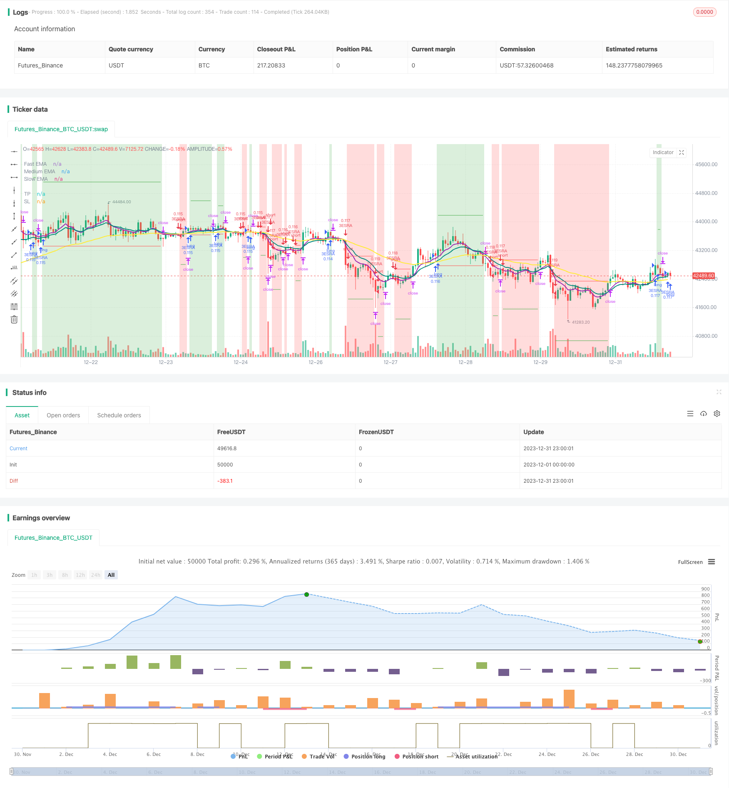

> Name

Three-Exponential-Moving-Averages-and-Stochastic-Relative-Strength-Index-Trading-Strategy
> Author

ChaoZhang

> Strategy Description


 [trans]
## Overview
This strategy is a trend following strategy that combines the Triple Exponential Moving Average indicator and the Stochastic Exponential Moving Average indicator to generate trading signals. When the fast moving average crosses the medium-speed moving average, and the medium-speed moving average crosses the slow moving average, it is bullish; when the fast moving average crosses below the medium-speed moving average, and the medium-speed moving average crosses below the slow moving average, it is bearish. At the same time, this strategy also introduces the stochastic exponential smoothing moving average indicator as an auxiliary judgment indicator.
## Principle
1. Use the 8-day, 14-day and 50-day triple exponential moving average. When the 8-day exponential moving average crosses the 14-day exponential moving average, and the 14-day exponential moving average crosses the 50-day exponential moving average, a bullish signal is generated; otherwise, a bearish signal is generated.
2. Use the Stochastic RSI as an auxiliary judgment indicator. Specifically: first calculate the 14-day RSI, then calculate the Stochastic indicator based on the RSI indicator, and finally calculate the 3-day simple moving average of the Stochastic indicator to get the K line and the 3-day simple moving average to get the D line. When the K line crosses the D line, it serves as a bullish auxiliary signal.
3. When a trading signal is generated, if the price is higher than the 8-day exponential moving average, enter the market to go long; if the price is lower than the 8-day exponential moving average, enter the market to go short.
4. Stop loss is located at 1 times ATR distance below/above the entry price. Take profit is located 4 times the ATR distance above/below the entry price.
## Advantages
1. As a basic indicator, moving averages can effectively track market trends. The Triple Exponential Moving Average ensures sensitivity to both short-term and medium- and long-term trends by using a combination of multiple periods.
2. Add Stochastic RSI as an auxiliary judgment indicator, which can filter out false signals and improve the accuracy of entry.
3. Set stop-loss and take-profit positions based on ATR, which can dynamically track market fluctuations and avoid excessively large or small stop-loss and take-profit positions.
4. The parameters of this strategy are set reasonably and perform well under the general trend. The retracement is small, the income is relatively stable, and it is suitable for long-term operations.
## Risk
1. Multi-indicator combination strategies increase the risk of reversal. Trading signal errors can occur when the Moving Average and Stochastic RSI send opposite signals. At this time, you need to pay attention to the trend of the price itself.
2. The stop-loss and take-profit settings are relatively conservative. They may be broken through when the market fluctuates violently and be stopped, missing the trend opportunity. At this time, you can appropriately adjust the ATR parameters or increase the multiple of stop loss and take profit.
3. Due to the use of triple moving averages, there will be a certain lag when the fast and medium speed lines reverse. At this time, you need to pay attention to whether the price itself reverses to decide whether to enter the market.
4. This strategy is mainly suitable for trending markets and performs poorly in consolidation markets. At this time, you can consider optimizing the period parameters of the moving average or using other judgment indicators.
## Optimization
1. You can consider adding other indicators such as MACD to further optimize the timing of entry. It is also possible to test moving average combinations of different parameters.
2. The parameters of ATR long and short checks can be optimized. For example, adjust the stop loss from 1ATR to 1.5ATR and the take profit from 4ATR to 3ATR to see if you can get better returns.
3. You can test using only moving averages and remove the Stochastic RSI indicator to see if you can filter out more noise and obtain more stable returns.
4. You can consider adding more conditions to determine the trend, such as adding trading volume indicators to ensure operating in large-level trends.
## Summarize
This strategy uses a combination of the Triple Exponential Moving Average and the Stochastic RSI indicator to determine trend direction. The entry signals are relatively strict, which can effectively reduce unnecessary transactions. The stop-profit and stop-loss settings dynamically track ATR, making the strategy parameters adaptive. Judging from the backtest results, this strategy performs well in trending markets, with smaller retracements and relatively stable returns. Through further optimization, it is expected to achieve better results.
||

## Overview  

This is a trend following strategy that combines triple exponential moving average (EMA) and Stochastic Relative Strength Index (Stoch RSI) to generate trading signals. It goes long when the fast EMA crosses above the medium EMA and the medium EMA crosses above the slow EMA. It goes short when the reverse happens. The strategy also uses Stoch RSI as an auxiliary indicator.  

## Principles  

1. Use 8, 14, 50 days EMAs. Going long when 8 day EMA > 14 day EMA > 50 day EMA. Going short when it's the opposite.

2. Use Stochastic RSI as auxiliary indicator. Calculate 14 days RSI first, then calculate Stochastics on RSI, finally calculate 3 days SMA as K line and 3 days SMA on K line as D line. K crossing over D gives long signal.

3. Enter long trades when close > 8 day EMA on long signal. Enter short trades when close < 8 day EMA on short signal.  

4. Stop loss sets at 1 ATR distance below/above entry price. Take profit sets at 4 ATR distance above/below entry price.

## Strengths  

1. EMA as base indicator can track trends effectively. Triple EMA captures both short and long term trends by combing multi periods.  

2. Adding Stoch RSI can filter false signals and increase entry accuracy.

3. ATR based stop loss and take profit can dynamically track market volatility, avoiding improper placement.  

4. This strategy has well tuned parameters and performs great during trending periods. Drawdown is smaller and profit is consistent for long term trades.

## Risks

1. Combination of multiple indicators increases whipsaw risk. Conflicting signals between EMA and Stoch RSI may cause entering at bad levels. Prices trend itself needs monitoring in such cases.

2. Conservative stop loss and take profit settings could be violated by huge market swings, causing premature exits missing further trends. Adjusting ATR parameters or increasing SL/TP multiples may help.  

3. Triple EMA setup has certain lag when fast and medium lines reversing. Prices trend itself needs monitoring to decide entries.

4. This strategy favors trending market. Sideway markets would not perform well. Adjusting MA periods or adding other auxiliary indicators may help.

## Enhancements  

1. Add indicators like MACD for better entries. Testing different periods combination of MAs.  

2. Optimizing long/short testing parameters on ATR. Such as adjusting stop loss from 1 ATR to 1.5 ATR, take profit from 4 ATR to 3 ATR for better results.

3. Removing Stoch RSI and keeping just MAs for filtering noises and more stable profits.  

4. Adding more criteria judging the trend, like trading volumes, to operate under significant levels.

## Conclusion  

This strategy combines triple EMA and Stoch RSI to determine trends. Strict entry signals reduce unnecessary trades. Dynamic SL and TP based on ATR makes parameters adaptive. Backtests show great results during trending periods with smaller drawdowns and consistent profits. Further optimizations could lead to even better results.

[/trans]


> Strategy Arguments


|Argument|Default|Description|
|----|----|----|
|v_input_10_close|0|Source: close|high|low|open|hl2|hlc3|hlcc4|ohlc4|
|v_input_1|true|(?Backtesting range)Start Date|
|v_input_2|true|Start Month|
|v_input_3|1900|Start Year|
|v_input_4|true|End Date|
|v_input_5|true|End Month|
|v_input_6|2040|End Year|
|v_input_7|8|(?EMAs)Fast EMA|
|v_input_8|14|Medium EMA|
|v_input_9|50|Slow EMA|
|v_input_11|3|(?Stoch-RSI)K|
|v_input_12|3|D|
|v_input_13|14|RSI Length|
|v_input_14|14|Stochastic Length|
|v_input_15_close|0|RSI Source: close|high|low|open|hl2|hlc3|hlcc4|ohlc4|
|v_input_16|14|(?ATR)Length|
|v_input_17|0|Smoothing: RMA|SMA|EMA|WMA|


> Source (PineScript)

``` pinescript
/*backtest
start: 2023-12-01 00:00:00
end: 2023-12-31 23:59:59
period: 1h
basePeriod: 15m
exchanges: [{"eid":"Futures_Binance","currency":"BTC_USDT"}]
*/

//              3ESRA
//              v0.2a

// Coded by Vaida Bogdan

// 3ESRA consists of a 3 EMA cross + a close above (for longs) the quickest EMA
// or below (for shorts). Note that I've deactivated the RSI Cross Over/Under
// (you can modify the code and activate it). The strategy also uses a stop loss
// that's at 1 ATR distance from the entry price and a take profit that's at
// 4 times the ATR distance from the entry price.

// Feedback:
// Tested BTCUSDT Daily
// 1. Stoch-RSI makes you miss opportunities.
// 2. Changing RR to 4:1 times ATR works better.

//@version=4
strategy(title="3 EMA + Stochastic RSI + ATR", shorttitle="3ESRA", overlay=true, pyramiding=1,
     process_orders_on_close=true, calc_on_every_tick=true,
     initial_capital=1000, currency = currency.USD, default_qty_value=10, 
     default_qty_type=strategy.percent_of_equity,
     commission_type=strategy.commission.percent, commission_value=0.1, slippage=2)

startDate = input(title="Start Date", type=input.integer,
     defval=1, minval=1, maxval=31, group="Backtesting range")
startMonth = input(title="Start Month", type=input.integer,
     defval=1, minval=1, maxval=12, group="Backtesting range")
startYear = input(title="Start Year", type=input.integer,
     defval=1900, minval=1800, maxval=2100, group="Backtesting range")
endDate = input(title="End Date", type=input.integer,
     defval=1, minval=1, maxval=31, group="Backtesting range")
endMonth = input(title="End Month", type=input.integer,
     defval=1, minval=1, maxval=12, group="Backtesting range")
endYear = input(title="End Year", type=input.integer,
     defval=2040, minval=1800, maxval=2100, group="Backtesting range")

// Date range filtering
inDateRange = (time >= timestamp(syminfo.timezone, startYear, startMonth, startDate, 0, 0)) and
     (time < timestamp(syminfo.timezone, endYear, endMonth, endDate, 23, 59))
     
fast = input(8, minval=8, title="Fast EMA", group="EMAs")
medium = input(14, minval=8, title="Medium EMA", group="EMAs")
slow = input(50, minval=8, title="Slow EMA", group="EMAs")
src = input(close, title="Source")

smoothK = input(3, "K", minval=1, group="Stoch-RSI", inline="K&D")
smoothD = input(3, "D", minval=1, group="Stoch-RSI", inline="K&D")
lengthRSI = input(14, "RSI Length", minval=1, group="Stoch-RSI", inline="length")
lengthStoch = input(14, "Stochastic Length", minval=1, group="Stoch-RSI", inline="length")
rsiSrc = input(close, title="RSI Source", group="Stoch-RSI")

length = input(title="Length", defval=14, minval=1, group="ATR")
smoothing = input(title="Smoothing", defval="RMA", options=["RMA", "SMA", "EMA", "WMA"], group="ATR")

// EMAs
fastema = ema(src, fast)
mediumema = ema(src, medium)
slowema = ema(src, slow)

// S-RSI
rsi1 = rsi(rsiSrc, lengthRSI)
k = sma(stoch(rsi1, rsi1, rsi1, lengthStoch), smoothK)
d = sma(k, smoothD)
sRsiCrossOver = k[1] < d[1] and k > d
sRsiCrossUnder = k[1] > d[1] and k < d

// ATR
ma_function(source, length) =>
	if smoothing == "RMA"
		rma(source, length)
	else
		if smoothing == "SMA"
			sma(source, length)
		else
			if smoothing == "EMA"
				ema(source, length)
			else
				wma(source, length)
atr = ma_function(tr(true), length)

// Trading Logic
longCond1 = (fastema > mediumema) and (mediumema > slowema)
longCond2 = true
// longCond2 = sRsiCrossOver
longCond3 = close > fastema
longCond4 = strategy.position_size <= 0
longCond = longCond1 and longCond2 and longCond3 and longCond4 and inDateRange

shortCond1 = (fastema < mediumema) and (mediumema < slowema)
shortCond2 = true 
// shortCond2 = sRsiCrossUnder
shortCond3 = close < fastema
shortCond4 = strategy.position_size >= 0
shortCond = shortCond1 and shortCond2 and shortCond3 and shortCond4 and inDateRange

var takeProfit = float(na), var stopLoss = float(na)
if longCond and strategy.position_size <= 0
    takeProfit := close + 4*atr
    stopLoss := close - 1*atr
    // takeProfit := close + 2*atr
    // stopLoss := close - 3*atr

else if shortCond and strategy.position_size >= 0
    takeProfit := close - 4*atr
    stopLoss := close + 1*atr
    // takeProfit := close - 2*atr
    // stopLoss := close + 3*atr
    
// Strategy calls
strategy.entry("3ESRA", strategy.long, comment="Long", when=longCond and strategy.position_size <= 0)
strategy.entry("3ESRA", strategy.short, comment="Short", when=shortCond and strategy.position_size >= 0)
strategy.exit(id="TP-SL", from_entry="3ESRA", limit=takeProfit, stop=stopLoss)
if (not inDateRange)
    strategy.close_all()
    
// Plot EMAs
plot(fastema, color=color.purple, linewidth=2, title="Fast EMA")
plot(mediumema, color=color.teal, linewidth=2, title="Medium EMA")
plot(slowema, color=color.yellow, linewidth=2, title="Slow EMA")
// Plot S-RSI
// plotshape((strategy.position_size > 0) ? na : sRsiCrossOver, title="StochRSI Cross Over", style=shape.triangleup, location=location.belowbar, color=color.teal, text="SRSI", size=size.small)
// Plot trade
bgcolor(strategy.position_size > 0 ? color.new(color.green, 75) : strategy.position_size < 0 ? color.new(color.red,75) : color(na))
// Plot Strategy
plot((strategy.position_size != 0) ? takeProfit : na, style=plot.style_linebr, color=color.green, title="TP")
plot((strategy.position_size != 0) ? stopLoss : na, style=plot.style_linebr, color=color.red, title="SL")


```

> Detail

https://www.fmz.com/strategy/440453

> Last Modified

2024-01-30 16:52:48
