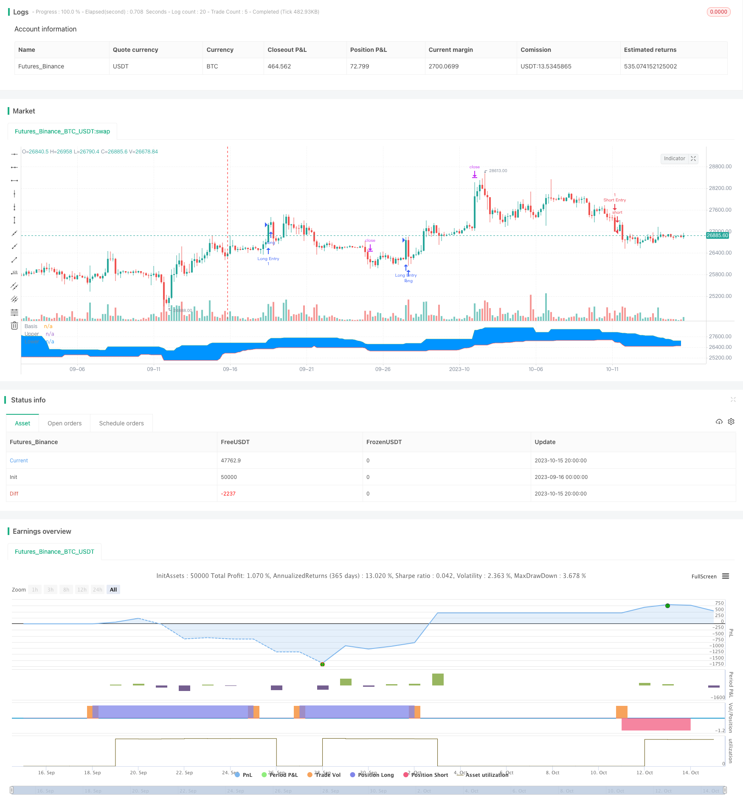

> Name

Tracking-Breakout-Strategy
> Author

ChaoZhang

> Strategy Description



[trans]

## Overview
This strategy mainly uses the "Tang Qian Channel" indicator to implement a tracking breakthrough trading strategy. This strategy combines the two trading ideas of trend and breakthrough. Based on the long-term trend judgment, it looks for the breakthrough point of a shorter period to make entries and realizes trading with the trend in the trend market. In addition, the strategy also sets stop-loss and take-profit levels to control the risk-reward ratio of each trade. Generally speaking, this strategy has the advantage of tracking trends and can follow the trend and seize long-term trend opportunities.
## Strategy Principle
1. Set the parameters of the "Tang Qian Channel" indicator, the default period is 20;
2. Set EMA smooth moving average, the default period is 200;
3. Set the risk-benefit ratio, the default is 1.5;
4. Set the breakout and retracement parameters, respectively long and short;
5. Record whether the last breakthrough was a high or a low;
6. Long signal: If the previous breakthrough is a low point, and the price is higher than Tang Qian’s upper track and higher than the EMA moving average, a long signal is generated;
7. Short signal: If the previous breakthrough is a high point, and the price is lower than the Tangqian lower track and lower than the EMA moving average, a short signal is generated;
8. After entering the long position, set the stop loss to 5 points of Tang Qian’s lower track retracement, and the take profit to the risk-return ratio multiplied by the stop loss distance;
9. After entering the short position, set the stop loss to 5 points of Tang Qian’s upper track retracement, and the take profit to the risk-return ratio multiplied by the stop loss distance.
In this way, the strategy combines trend judgment and breakthrough operations to follow the trend and capture shorter-period opportunities in the long-term trend. At the same time, stop-loss and stop-profit settings can control the risk and return of a single transaction.
## Advantage Analysis
1. Track the long-term trend, follow the trend, and avoid trading against the trend.
2. As a long-term indicator, Tang Qian Channel, combined with EMA moving average filtering, can better judge the trend direction.
3. The stop-loss and stop-profit mechanism controls the risk of each order and can limit possible losses.
4. Optimizing the risk-return ratio can increase the profit-loss ratio and pursue excess returns.
5. The backtest parameter setting is flexible and the best parameter combination can be adjusted for different markets.
## Risk Analysis
1. Donchian channel and EMA moving average are used as filter indicators and may send out wrong signals.
2. Breakthrough trading is easy to get trapped, so you need to identify the trend background clearly.
3. The stop-loss and take-profit distances are fixed and cannot be adjusted according to the degree of market fluctuations.
4. The optimization space of Parameters is limited, and the actual effect is difficult to guarantee.
5. The trading system cannot withstand the test of too many random events, and black swan events may cause large losses.
## Optimization direction
1. You can consider adding more indicators for filtering, such as oscillators, to improve signal quality.
2. You can set up intelligent stop loss and stop profit, and dynamically adjust the profit and loss position according to the degree of market fluctuation and ATR indicator.
3. Machine learning and other methods can be used to test and optimize parameters to make them closer to the real market.
4. You can optimize the entry logic and set VOLUME or volatility indicators as auxiliary conditions to avoid traps.
5. You can consider combining it with trend following strategies or machine learning to form a hybrid strategy to improve stability.
## Summarize
As a tracking breakthrough strategy, the core idea of ​​this strategy is to use the breakthrough as a signal to follow the trend on the premise of judging the long-term trend, and set stop loss and profit to control the risk of a single transaction. This strategy has certain advantages, but there is also some room for optimization. Overall, if issues such as parameter setting and entry timing can be properly handled, and enhanced with other techniques, this strategy can become a practical trend following strategy. However, investors still need to keep in mind that no trading system can completely avoid market risks and need to do a good job in risk management.
||
## Overview

This strategy mainly uses the “Donchian Channel” indicator to implement a tracking breakout trading strategy. The strategy combines trend following and breakout trading ideas, seeking breakout points in shorter cycles based on identification of the major trend, in order to trade along the trend. In addition, the strategy sets stop loss and take profit levels to control the risk/reward of each trade. Overall, the strategy has the advantage of tracking the trend, and trading in the direction of the major trend.

## Strategy Logic

1. Set parameters for “Donchian Channel” indicator, default period is 20;

2. Set EMA moving average, default period is 200;

3. Set risk/reward ratio, default is 1.5;  

4. Set pullback parameters after breakout for long and short;

5. Record if previous breakout was a high or low point;

6. Long signal: if previous breakout was a low, price breaks above Donchian upper band and above EMA line;

7. Short signal: if previous breakout was a high, price breaks below Donchian lower band and below EMA line; 

8. After long entry, set stop loss at Donchian lower band minus 5 points, take profit at risk/reward ratio times stop loss distance;

9. After short entry, set stop loss at Donchian upper band plus 5 points, take profit at risk/reward ratio times stop loss distance.

In this way, the strategy combines trend following and breakout trading, to trade along with major trend. Meanwhile, stop loss and take profit controls the risk/reward of each trade.

## Advantage Analysis  

1. Follow major trend, avoid trading against the trend.

2. Donchian Channel as long term indicator, combining with EMA filter, can effectively identify the trend.

3. Stop loss and take profit controls risk per trade, limits potential losses.

4. Optimizing risk/reward ratio can increase profit factor, pursuing excess returns.

5. Flexible backtest parameters, can optimize parameters for different markets.

## Risk Analysis

1. Donchian Channel and EMA may give wrong signals sometimes.  

2. Breakout trading can easily be trapped, need to identify trend background clearly.

3. Fixed stop loss and take profit cannot adjust based on market volatility. 

4. Limited optimization space for parameters, live performance not guaranteed.

5. Trading systems vulnerable to black swan events, may lead to severe losses.

## Optimization Directions

1. Consider adding more filters like oscillators to improve signal quality.

2. Set adaptive stop loss and take profit based on market volatility and ATR.

3. Use machine learning to test and optimize parameters to fit real markets.

4. Optimize entry logic with volume or volatility as condition to avoid traps.

5. Combine with trend following systems or machine learning to create hybrid models for robustness.

## Conclusion

This strategy is a tracking breakout strategy, with the logic of trading along the major trend identified, and taking breakout as entry signal, while setting stop loss and take profit to control risk per trade. The strategy has some advantages, but also room for improvements. Overall, with proper parameter tuning, entry timing, and enhancements with other techniques, it can become a practical trend following strategy. But investors should always keep in mind that no trading system can eliminate market risk entirely, and risk management is essential.  
[/trans]

> Strategy Arguments


|Argument|Default|Description|
|----|----|----|
|v_input_1|20|(?Indicators)length|
|v_input_2|200|EMA Input|
|v_input_3|1.5|(?Risk/Reward)Risk/Reward Ratio|
|v_input_4|0.995|Distance from Long pullback %|
|v_input_5|1.005|Distance from Short pullback %|
|v_input_6|true|(?Backtest Date Range)From Month|
|v_input_7|true|From Day|
|v_input_8|2000|From Year|
|v_input_9|true|Thru Month|
|v_input_10|true|Thru Day|
|v_input_11|2099|Thru Year|


> Source (PineScript)

``` pinescript
/*backtest
start: 2023-09-16 00:00:00
end: 2023-10-16 00:00:00
period: 4h
basePeriod: 15m
exchanges: [{"eid":"Futures_Binance","currency":"BTC_USDT"}]
*/

//@version=4
// Welcome to my second script on Tradingview with Pinescript
// First of, I'm sorry for the amount of comments on this script, this script was a challenge for me, fun one for sure, but I wanted to thoroughly go through every step before making the script public
// Glad I did so because I fixed some weird things and I ended up forgetting to add the EMA into the equation so our entry signals were a mess
// This one was a lot tougher to complete compared to my MACD crossover trend strategy but I learned a ton from it, which is always good and fun
// Also I'll explain the strategy and how I got there through some creative coding(I'm saying creative because I had to figure this stuff out by myself as I couldn't find any reference codes)
// First things first. This is a Donchian Channel Breakout strategy which follows the following rules
// If the price hits the upperband of the Donchian Channel + price is above EMA and the price previously hit the lowerband of the Donchian Channel it's a buy signal
// If the price hits the lowerband of the Donchian Channel + price is below EMA and the price prevbiously hit the upper band of the Donchian Channel it's a sell signal
// Stop losses are set at the lower or upper band with a 0.5% deviation because we are acting as if those two bands are the resistance in this case
// Last but not least(yes, this gave BY FAR the most trouble to code), the profit target is set with a 1.5 risk to reward ratio
// If you have any suggestions to make my code more efficient, I'll be happy to hear so from you
// So without further ado, let's walk through the code

// The first line is basically standard because it makes backtesting so much more easy, commission value is based on Binance futures fees when you're using BNB to pay those fees in the futures market
// strategy(title="Donchian Channels", shorttitle="DC", overlay=true, default_qty_type = strategy.cash, default_qty_value = 150, initial_capital = 1000, currency = currency.USD, commission_type = "percent", commission_value = 0.036)
// The built-in Donchian Channels + an added EMA input which I grouped with the historical bars from the Donchian Channels
length          = input(20, minval=1, group = "Indicators")
lower           = lowest(length)
upper           = highest(length)
basis           = avg(upper, lower)
emaInput        = input(title = "EMA Input", type = input.integer, defval = 200, minval = 10, maxval = 400, step = 1, group = "Indicators")
// I've made three new inputs, for risk/reward ratio and for the standard pullback deviation. My advise is to not use the pullback inputs as I'm not 100% sure if they work as intended or not
riskreward      = input(title = "Risk/Reward Ratio", type = input.float, defval = 1.50, minval = 0.01, maxval = 100, step = 0.01, group = "Risk/Reward")
pullbackLong    = input(title = "Distance from Long pullback %", type = input.float, defval = 0.995, minval = 0.001, maxval = 2, step = 0.001, group = "Risk/Reward")
pullbackShort   = input(title = "Distance from Short pullback %", type = input.float, defval = 1.005, minval = 0.001, maxval = 2, step = 0.001, group = "Risk/Reward")

// Input backtest range, you can adjust these in the input options, just standard stuff
fromMonth       = input(defval = 1,    title = "From Month",      type = input.integer, minval = 1, maxval = 12, group = "Backtest Date Range")
fromDay         = input(defval = 1,    title = "From Day",        type = input.integer, minval = 1, maxval = 31, group = "Backtest Date Range")
fromYear        = input(defval = 2000, title = "From Year",       type = input.integer, minval = 1970,           group = "Backtest Date Range")
thruMonth       = input(defval = 1,    title = "Thru Month",      type = input.integer, minval = 1, maxval = 12, group = "Backtest Date Range")
thruDay         = input(defval = 1,    title = "Thru Day",        type = input.integer, minval = 1, maxval = 31, group = "Backtest Date Range")
thruYear        = input(defval = 2099, title = "Thru Year",       type = input.integer, minval = 1970,           group = "Backtest Date Range")
// Date variable also standard stuff
inDataRange     = (time >= timestamp(syminfo.timezone, fromYear, fromMonth, fromDay, 0, 0)) and (time < timestamp(syminfo.timezone, thruYear, thruMonth, thruDay, 0, 0))

// I had to makes these variables because the system has to remember whether the previous 'breakout' was a high or a low
// Also, because I based my stoploss on the upper/lower band of the indicator I had to find a way to change this value just once without losing the value, that was added, on the next bar
var previousishigh = false
var previousislow = false
var longprofit = 0.0
var shortprofit = 0.0
var stoplossLong = 0.0
var stoplossShort = 0.0
// These are used as our entry variables
emaCheck = ema(close, emaInput)
longcond = high >= upper and close > emaCheck
shortcond = low <= lower and close < emaCheck

// With these two if statements I'm changing the boolean variable above to true, we need this to decide out entry position
if high >= upper
    previousishigh := true
if low <= lower
    previousislow := true

// Made a last minute change on this part. To clean up our entry signals we don't want our breakouts, while IN a position, to change. This way we do not instantly open a new position, almost always in the opposite direction, upon exiting one
if strategy.position_size > 0 or strategy.position_size < 0 
    previousishigh := false
    previousislow := false

// Strategy inputs
// Long - previous 'breakout' has to be a low, the current price has to be a new high and above the EMA, we're not allowed to be in a position and ofcourse it has to be within our given data for backtesting purposes
if previousislow == true and longcond and strategy.position_size == 0 and inDataRange
    strategy.entry("Long Entry", strategy.long, comment = "Entry Long")
    stoplossLong := lower * pullbackLong
    longprofit := ((((1 - stoplossLong / close) * riskreward) + 1) * close)
    strategy.exit("Long Exit", "Long Entry", limit = longprofit, stop = stoplossLong, comment = "Long Exit")

// Short - Previous 'breakout' has to be a high, current price has to be a new low and lowe than the 200EMA, we're not allowed to trade when we're in a position and it has to be within our given data for backtesting purposes
if previousishigh == true and shortcond and strategy.position_size == 0 and inDataRange
    strategy.entry("Short Entry", strategy.short, comment = "Entry Short")
    stoplossShort := upper * pullbackShort
    shortprofit := (close - ((((1 - close / stoplossShort) * riskreward) * close)))
    strategy.exit("Short Exit", "Short Entry", limit = shortprofit, stop = stoplossShort, comment = "Short Exit")
    
// This plots the Donchian Channels on the chart which is just using the built-in Donchian Channels
plot(basis, "Basis", color=color.blue)
u = plot(upper, "Upper", color=color.green)
l = plot(lower, "Lower", color=color.red)
fill(u, l, color=#0094FF, transp=95, title="Background")

// These plots are to show if the variables are working as intended, it's a mess I know but I didn't have any better ideas, they work well enough for me
// plot(previousislow ? close * 0.95 : na, color=color.red, linewidth=2, style=plot.style_linebr)
// plot(previousishigh ? close * 1.05 : na, color=color.green, style=plot.style_linebr)
// plot(longprofit, color=color.purple)
// plot(shortprofit, color=color.silver)
// plot(stoplossLong)
// plot(stoplossShort)
// plot(strategy.position_size)
```

> Detail

https://www.fmz.com/strategy/429498

> Last Modified

2023-10-17 16:36:49
