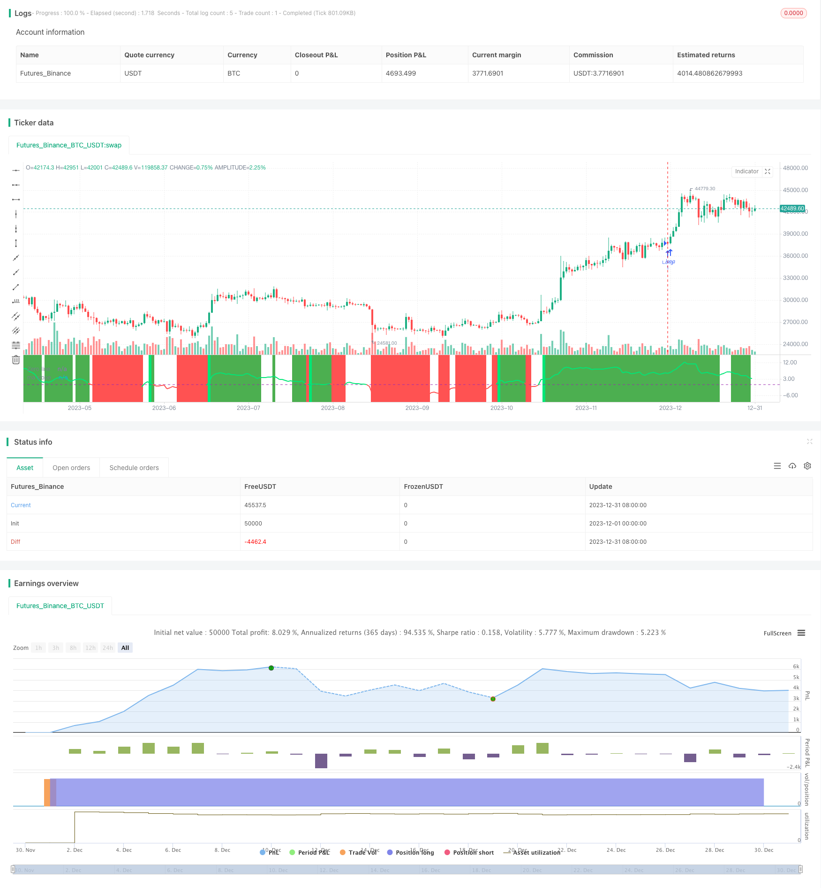

> Name

Trend-Angle-Moving-Average-Crossover-Strategy
> Author

ChaoZhang

> Strategy Description


 [trans]
## Overview
This strategy determines the trend direction by calculating the slope angle of the moving average, and combines the price change rate indicator to conduct long and short two-way trading. Its essence is a trend following strategy that uses the slope angle of the moving average to determine the price trend and the price change rate indicator to filter the consolidation market.
## Strategy Principle
This strategy is mainly judged based on the following indicators:
1. Moving average angle: Determine the price trend direction by calculating the slope angle of the Jurik moving average and the exponential moving average. An angle greater than 0 indicates an upward trend, and an angle less than 0 indicates a downward trend.
2. Price change rate: Calculate the closing price change rate of the last 12 K lines, and filter invalid signals through volatility.
When the moving average angle is upward (greater than 0) and the price change rate meets the conditions, go long; when the moving average angle is downward (less than 0) and the price change rate meets the conditions, go short.
Specifically, the strategy first calculates the slope angle of the Jurik moving average and EMA. Then the price change rate indicator is calculated and used to filter consolidation periods. When the moving average angle indicates the trend and the price change rate meets the conditions, a trading signal is generated.
## Advantage Analysis
This strategy has the following advantages:
1. Using the average slope to judge the trend is very reliable and has a high winning rate.
2. The price change rate indicator can effectively filter consolidation fluctuations and avoid invalid transactions.
3. The Jurik moving average responds quickly to breakthroughs, and the EMA provides stable trend judgment. The two complement each other.
4. Using long and short two-way trading methods, you can capture larger profits in trending markets.
## Risk Analysis
There are also some risks with this strategy:
1. When prices fluctuate violently, the probability of the moving average generating false signals is greater. This risk can be reduced by optimizing parameters.
2. When entering consolidation, the moving average signals may switch frequently, resulting in too many unnecessary transactions. Additional filters can be added to reduce invalid transactions.
3. When unexpected events cause the price to jump short, the stop loss may be broken down, and the stop loss point can be appropriately relaxed.
## Optimization direction
This strategy can be optimized from the following aspects:
1. Optimize the moving average parameters, find the best parameter combination, and improve the stability of the strategy.
2. Add filter conditions such as volatility and transaction volume to further reduce invalid transactions.
3. Combine with other indicators to determine the stop loss point to make the stop loss more intelligent.
4. Develop an adaptive transaction size algorithm to make profits more stable.
## Summarize
This strategy is overall a very practical trend following strategy. It uses the slope of the moving average to judge trends very reliably, and the price change rate indicator can effectively filter out invalid signals. At the same time, you can get better returns by using long and short two-way trading. Through continuous optimization, this strategy can become a very stable and reliable quantitative strategy.
||

## Overview

This strategy determines the trend direction by calculating the slope angle of moving averages, combined with price change rate indicator for long and short trading. Essentially it is a trend following strategy that uses the slope angle of moving averages to determine price trends, and the price change rate indicator to filter out range-bound market.

## Strategy Logic

The strategy is mainly based on the following indicators for judgement:

1. Moving Average Slope Angle: Calculate the slope angles of Jurik Moving Average and Exponential Moving Average to determine price trend direction. Angle greater than 0 indicates uptrend, less than 0 means downtrend.  

2. Price Change Rate: Calculate the rate of change of closing price over last 12 bars to filter signals by volatility.

When moving average slope goes up (greater than 0) and price change rate meets criteria, go long. When slope goes down (less than 0) and price change rate meets criteria, go short.  

Specifically, the strategy first calculates the slope angles of Jurik MA and EMA. Then the price change rate indicator is calculated for filtering range-bound period. When both moving average slope signals trend and price change rate meets criteria, trading signal is generated.


## Advantage Analysis

The advantages of this strategy:

1. Using MA slope to determine trend is very reliable with good win rate.  

2. Price change rate indicator effectively filters ranging fluctuation to avoid invalid trades.

3. Jurik MA gives quick response to breakout while EMA offers stable trend judgement, both complementary.  

4. Going both long and short in trending market could capture greater profit.


## Risk Analysis

Some risks of this strategy:

1. In extreme price whipsaw, MA may generate wrong signals. This can be reduced by parameter optimization.  

2. Signals may switch frequently during ranging causing unnecessary trades. Additional filter can be added.

3. Stop loss could be broken in sudden price gap events. Wider stop loss can be used.


## Optimization Directions 

The strategy can be optimized in following aspects:

1. Optimize MA parameters to find best parameter combination improving stability.  

2. Add volatility, volume filters etc. for further reducing invalid trades.

3. Incorporate other indicators for smarter stop loss positioning.

4. Develop adaptive position sizing algorithms for steadier profitability.


## Conclusion

Overall this is a very practical trend following strategy. It reliably determines trend using MA slope angle, and effectively filters noise signals using price change rate indicator. Taking both long and short positions could gain nice profit. With continuous optimizations, this strategy can become a very stable and reliable quantitative strategy.

[/trans]

> Strategy Arguments


|Argument|Default|Description|
|----|----|----|
|v_input_1|2017|Backtest Start Year|
|v_input_2|true|Backtest Start Month|
|v_input_3|true|Backtest Start Day|
|v_input_4|2019|Backtest Stop Year|
|v_input_5|12|Backtest Stop Month|
|v_input_6|31|Backtest Stop Day|
|v_input_7_ohlc4|0|source: ohlc4|high|low|open|hl2|hlc3|hlcc4|close|
|v_input_8|56|v_input_8|
|v_input_9|12|roclength|
|v_input_10|2|pcntChange|
|v_input_11|2|Stop Loss %|
|v_input_12|900|Take Profit %|


> Source (PineScript)

``` pinescript
/*backtest
start: 2023-12-01 00:00:00
end: 2023-12-31 23:59:59
period: 1d
basePeriod: 1h
exchanges: [{"eid":"Futures_Binance","currency":"BTC_USDT"}]
*/

//@version=4
// Based on ma angles code by Duyck which also uses Everget Jurik MA calulation and angle calculation by KyJ
strategy("Trend Angle BF", overlay=false)

/////////////// Time Frame ///////////////
testStartYear = input(2017, "Backtest Start Year") 
testStartMonth = input(1, "Backtest Start Month")
testStartDay = input(1, "Backtest Start Day")
testPeriodStart = timestamp(testStartYear,testStartMonth,testStartDay, 0, 0)

testStopYear = input(2019, "Backtest Stop Year")
testStopMonth = input(12, "Backtest Stop Month")
testStopDay = input(31, "Backtest Stop Day")
testPeriodStop = timestamp(testStopYear,testStopMonth,testStopDay, 0, 0)

testPeriod() => true
    
src=input(ohlc4,title="source")

// definition of "Jurik Moving Average", by Everget
jma(_src,_length,_phase,_power) =>
    phaseRatio = _phase < -100 ? 0.5 : _phase > 100 ? 2.5 : _phase / 100 + 1.5
    beta = 0.45 * (_length - 1) / (0.45 * (_length - 1) + 2)
    alpha = pow(beta, _power)
    jma = 0.0
    e0 = 0.0
    e0 := (1 - alpha) * _src + alpha * nz(e0[1])
    e1 = 0.0
    e1 := (_src - e0) * (1 - beta) + beta * nz(e1[1])
    e2 = 0.0
    e2 := (e0 + phaseRatio * e1 - nz(jma[1])) * pow(1 - alpha, 2) + pow(alpha, 2) * nz(e2[1])
    jma := e2 + nz(jma[1])

//// //// Determine Angle by KyJ //// //// 
angle(_src) =>
    rad2degree=180/3.14159265359  //pi 
    ang=rad2degree*atan((_src[0] - _src[1])/atr(14)) 

jma_line=jma(src,10,50,1)
ma=ema(src,input(56))
jma_slope=angle(jma_line)
ma_slope=angle(ma)

///////////// Rate Of Change ///////////// 
source = close
roclength = input(12, minval=1)
pcntChange = input(2, minval=1)
roc = 100 * (source - source[roclength]) / source[roclength]
emaroc = ema(roc, roclength / 2)
isMoving() => emaroc > (pcntChange / 2) or emaroc < (0 - (pcntChange / 2))

/////////////// Strategy ///////////////
long = ma_slope>=0 and isMoving()
short = ma_slope<=0 and isMoving()

last_long = 0.0
last_short = 0.0
last_long := long ? time : nz(last_long[1])
last_short := short ? time : nz(last_short[1])

long_signal = crossover(last_long, last_short)
short_signal = crossover(last_short, last_long)

last_open_long_signal = 0.0
last_open_short_signal = 0.0
last_open_long_signal := long_signal ? open : nz(last_open_long_signal[1])
last_open_short_signal := short_signal ? open : nz(last_open_short_signal[1])

last_long_signal = 0.0
last_short_signal = 0.0
last_long_signal := long_signal ? time : nz(last_long_signal[1])
last_short_signal := short_signal ? time : nz(last_short_signal[1])

in_long_signal = last_long_signal > last_short_signal
in_short_signal = last_short_signal > last_long_signal

last_high = 0.0
last_low = 0.0
last_high := not in_long_signal ? na : in_long_signal and (na(last_high[1]) or high > nz(last_high[1])) ? high : nz(last_high[1])
last_low := not in_short_signal ? na : in_short_signal and (na(last_low[1]) or low < nz(last_low[1])) ? low : nz(last_low[1])
sl_inp = input(2.0, title='Stop Loss %') / 100
tp_inp = input(900.0, title='Take Profit %') / 100 
 
take_level_l = strategy.position_avg_price * (1 + tp_inp)
take_level_s = strategy.position_avg_price * (1 - tp_inp) 

since_longEntry = barssince(last_open_long_signal != last_open_long_signal[1]) 
since_shortEntry = barssince(last_open_short_signal != last_open_short_signal[1]) 

slLong = in_long_signal ? strategy.position_avg_price * (1 - sl_inp) : na
slShort = strategy.position_avg_price * (1 + sl_inp)
long_sl = in_long_signal ? slLong : na
short_sl = in_short_signal ? slShort : na

/////////////// Execution /////////////// 
if testPeriod()
    strategy.entry("Long",  strategy.long, when=long)
    strategy.entry("Short", strategy.short, when=short)
    strategy.exit("Long Ex", "Long", stop=long_sl, limit=take_level_l, when=since_longEntry > 0)
    strategy.exit("Short Ex", "Short", stop=short_sl, limit=take_level_s, when=since_shortEntry > 0)
    
///////////// Plotting /////////////
hline(0, title='Zero line', color=color.purple, linewidth=1)
plot(ma_slope,title="ma slope", linewidth=2,color=ma_slope>=0?color.lime:color.red)
bgcolor(isMoving() ? long ? color.green : short ? color.red : na : color.white, transp=80)
bgcolor(long_signal ? color.lime : short_signal ? color.red : na, transp=30) 

```

> Detail

https://www.fmz.com/strategy/439979

> Last Modified

2024-01-25 14:35:13
