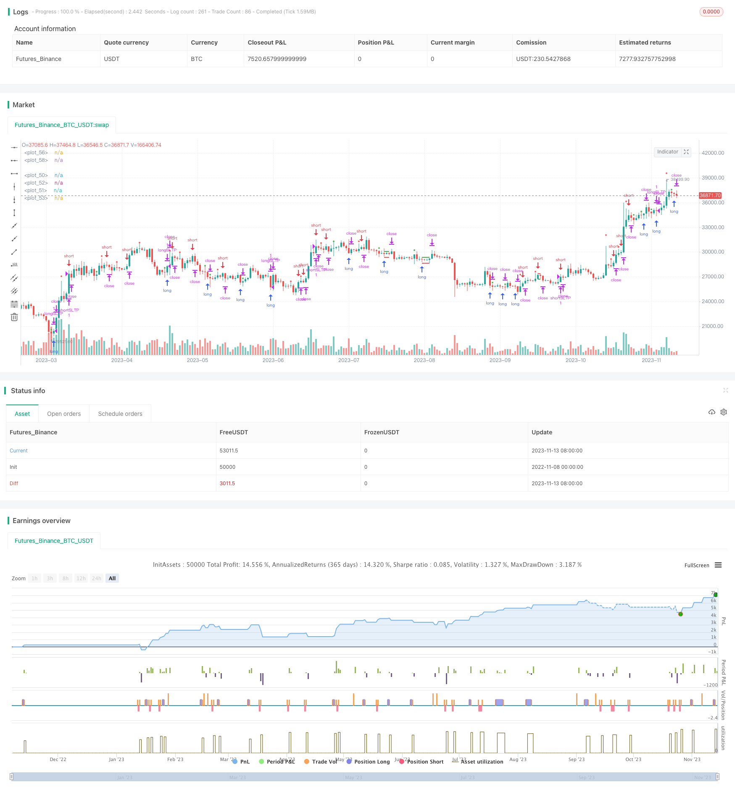

> Name

Trend-Breakout-Long-Shadow-Strategy Trend-Breakout-Long-Shadow-Strategy
> Author

ChaoZhang

> Strategy Description


[trans]


This strategy determines the current trend direction by calculating the positive and shadow length ratio of the K line, and identifies the trend with the average true amplitude ATR. It opens a reverse position at the breakthrough point, sets stop loss and take profit, and captures the short-term trend.
### Strategy Principles
This strategy mainly determines the current trend direction by calculating the ratio of the positive and shadow lengths of the K line. When the length of the negative line is too long, it is judged to be a downward trend, and when the length of the positive line is too long, it is judged to be an upward trend.
The specific logic of the strategy is:
1. Calculate the length of the lower shadow of the K line: close-low (closing price - lowest price)
2. Calculate the upper shadow length of the K line: high-open (highest price - opening price)
3. Take the maximum value of the shadow and upper shadow as the shadow length
4. Calculate the length of the K-line entity: high-low (highest price-lowest price)
5. Calculate the ratio of shadow length to solid length
6. When the ratio is greater than 0.5 and the lower shadow is greater than the upper shadow, it is judged to be a downward trend and a long order is set to enter the market.
7. When the ratio is greater than 0.5 and the upper shadow is greater than the lower shadow, it is judged as an upward trend and a short order is set to enter the market.
8. When entering the market, you must also determine whether the physical length of the K line is greater than 0.75 times the average true amplitude of ATR to avoid invalid breakthroughs.
9. Set stop loss and stop profit after entering the market. The stop loss is the entry price multiplied by the coefficient, and the take profit is the entry price multiplied by a factor of 2 times. The profit and loss ratio is 2:1.
The above is the basic trading logic of the strategy. By identifying the trend breakthrough point, open a reverse position, set a stop loss and take profit, and then optimize the profit.
### Strategic Advantages
1. Use the ratio of sun to shadow to determine the trend direction with high degree of discrimination.
2. Combine ATR indicators to make effective breakthrough judgments to avoid false signals.
3. Set stop loss and stop profit to facilitate risk control
4. Achieve a profit-loss ratio of 2:1 and comply with quantitative trading standards
5. Suitable for short-term trading of highly volatile stocks
6. The strategy logic is simple and clear, easy to understand and implement
### Strategy Risk
1. When the stock price fluctuates violently, the stop loss may be breached, causing the loss to expand.
2. The effect is closely related to parameter settings, and parameters need to be optimized.
3. When the trend turns, losses may occur
4. Simultaneously expanding the stop loss and take profit ranges will increase the probability of loss.
5. If the breakthrough fails, you will lose a lot of money.
Risks can be controlled through reasonable stop losses, optimized parameters, and timely stop losses.
### Strategy optimization
The strategy can be optimized from the following aspects:
1. Optimize the sun-shade ratio parameter and find the best value
2. Optimize ATR parameters and find the best K-line length determination
3. Optimize the stop-loss and take-profit coefficients to achieve the best risk-return ratio
4. Increase position management, such as gradually adding positions
5. Add trailing stop loss to achieve profit protection
6. Combine with other indicators to filter entry signals
7. Optimize the backtest time period and test the effects of different market stages
Through multi-faceted testing and optimization, the strategic effect can be maximized.
Generally speaking, this strategy uses short-term price fluctuations to make profits through trend identification and risk control. It is a short-term breakthrough strategy with stable effects. When optimized, it can become a key part of quantitative trading.
||

This strategy judges the current trend direction by calculating the ratio of bullish/bearish shadow length, and identifies trend with ATR indicator. It opens reverse position on breakout points and sets stop loss and take profit to capture short-term trends.  

### Strategy Logic

The strategy mainly judges the current trend by calculating bullish/bearish shadow ratio. Long bearish indicates downward trend while long bullish indicates upward trend.

The specific logic is:

1. Calculate bearish shadow: close - low
2. Calculate bullish shadow: high - open
3. Take the max of bearish and bullish shadow as shadow length 
4. Calculate candle body length: high - low
5. Calculate ratio between shadow and body length
6. If ratio > 0.5 and bearish > bullish, judge downward trend and long position
7. If ratio > 0.5 and bullish > bearish, judge upward trend and short position  
8. Validate breakout with candle length > 0.75 * ATR
9. Set stop loss and take profit after entry, with 2:1 ratio

The above is the basic trading logic, identifying reverse breakout points with trend detection and optimizing profit with stop loss/take profit.

### Advantages

1. Shadow ratio accurately judges the trend
2. ATR filters out false breakout signals 
3. Stop loss and take profit manages risk
4. 2:1 risk-reward ratio meets quant trading standard
5. Suitable for short-term trading on high volatility stocks
6. Simple and clear logic, easy to understand

### Risks

1. Price volatility may hit stop loss and increase loss
2. Performance relies heavily on parameter tuning  
3. Trend reversal may lead to loss
4. Expanding stop loss/take profit may increase loss probability
5. Failed breakout can lead to large loss

Risks can be managed by reasonable stop loss, parameter optimization, and timely position exit.

### Enhancement

The strategy can be optimized in the following ways:

1. Optimize shadow ratio parameter for best value
2. Optimize ATR parameter for best candle length
3. Optimize stop loss/take profit coefficients for optimal risk-reward 
4. Add position sizing like gradual position increase
5. Add trailing stop loss for profit protection
6. Add other indicators to filter signals
7. Optimize backtest time period and test different market stages

With multi-faceted testing and optimization, the strategy performance can be maximized.

Overall, this strategy profits from short-term price swings through trend identification and risk management. When optimized, it can become a robust short-term breakout strategy for quant trading.

[/trans]

> Strategy Arguments


|Argument|Default|Description|
|----|----|----|
|v_input_1|2020|Backtest Start Year|
|v_input_2|true|Backtest Start Month|
|v_input_3|true|Backtest Start Day|
|v_input_4|2025|Backtest End Year|
|v_input_5|true|Backtest End Month|
|v_input_6|true|Backtest End Day|
|v_input_7|0.8|N - % offset for N*SL and (2N)*TP|


> Source (PineScript)

``` pinescript
/*backtest
start: 2022-11-08 00:00:00
end: 2023-11-14 00:00:00
period: 1d
basePeriod: 1h
exchanges: [{"eid":"Futures_Binance","currency":"BTC_USDT"}]
*/

// This source code is subject to the terms of the Mozilla Public License 2.0 at https://mozilla.org/MPL/2.0/
// © ondrej17

//@version=4
strategy("longWickstrategy", overlay=true )
 
// Inputs
st_yr_inp = input(defval=2020, title='Backtest Start Year')
st_mn_inp = input(defval=01, title='Backtest Start Month')
st_dy_inp = input(defval=01, title='Backtest Start Day')
en_yr_inp = input(defval=2025, title='Backtest End Year')
en_mn_inp = input(defval=01, title='Backtest End Month')
en_dy_inp = input(defval=01, title='Backtest End Day')
sltp_inp = input(defval=0.8, title='N - % offset for N*SL and (2N)*TP')/100
 
// Dates
start = timestamp(st_yr_inp, st_mn_inp, st_dy_inp,00,00)
end = timestamp(en_yr_inp, en_mn_inp, en_dy_inp,00,00)
canTrade = time >= start and time <= end
// Indicators Setup


 
// Strategy Calcuations
lowerWick = (open > close) ? close-low : open - low
upperWick = (open > close) ? high-open : high-close
wickLength = max(lowerWick,upperWick)
candleLength = high-low
wickToCandleRatio = wickLength / candleLength
entryFilterCandleLength = candleLength > 0.75*atr(48)


// Entries and Exits
 
longCondition = entryFilterCandleLength and wickToCandleRatio > 0.5 and lowerWick > upperWick and canTrade and strategy.position_size == 0
shortCondition = entryFilterCandleLength and wickToCandleRatio > 0.5 and lowerWick < upperWick and canTrade and strategy.position_size == 0

strategy.entry("pendingLong", strategy.long, limit=low+wickLength/2, when = longCondition)
strategy.entry("pendingShort", strategy.short, limit=high-wickLength/2, when = shortCondition)

longStop = strategy.position_size > 0 ? strategy.position_avg_price*(1-sltp_inp) : na
longTP = strategy.position_size > 0 ? strategy.position_avg_price*(1+2*sltp_inp) : na
shortStop = strategy.position_size < 0 ? strategy.position_avg_price*(1+sltp_inp) : na
shortTP = strategy.position_size < 0 ? strategy.position_avg_price*(1-2*sltp_inp) : na

strategy.exit("longSLTP","pendingLong", stop=longStop, limit = longTP)
strategy.exit("shortSLTP","pendingShort", stop=shortStop, limit = shortTP)  
 

plot(longStop, color=color.red, style=plot.style_linebr, linewidth=2)
plot(shortStop, color=color.red, style=plot.style_linebr, linewidth=2)
plot(longTP, color=color.green, style=plot.style_linebr, linewidth=2)
plot(shortTP, color=color.green, style=plot.style_linebr, linewidth=2)

plotLongCondition = longCondition ? high+abs(open-close) : na
plot(plotLongCondition, style=plot.style_circles, linewidth=4, color=color.green)
plotShortCondition = shortCondition ? high+abs(open-close) : na
plot(plotShortCondition, style=plot.style_circles, linewidth=4, color=color.red)


```

> Detail

https://www.fmz.com/strategy/432223

> Last Modified

2023-11-15 16:43:17
