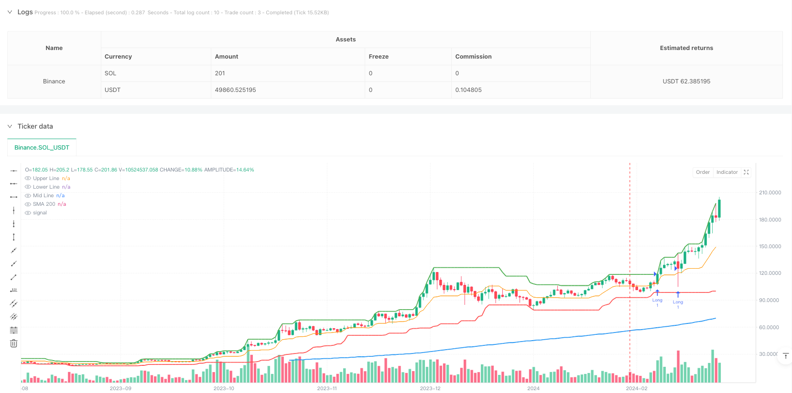
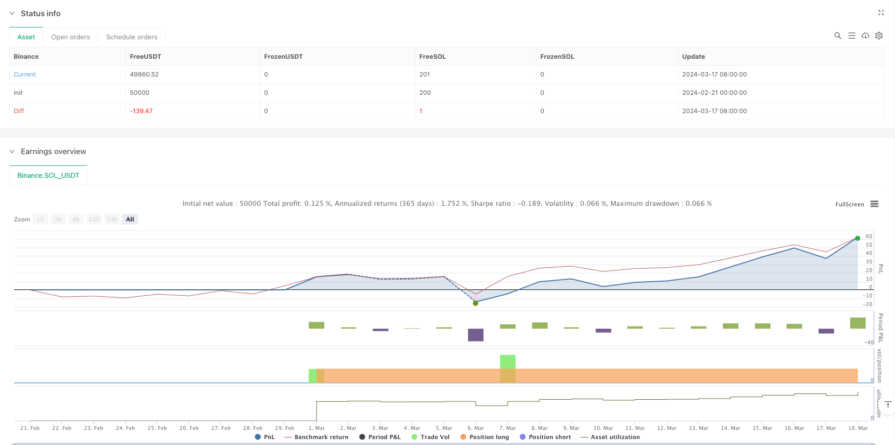

> Name

Trend-Breakout-Trading-Strategy-Based-on-Donchian-Channel-and-Moving-Average
> Author

ianzeng123

> Strategy Description





[trans]
#### Overview
This strategy is a trend following trading system that combines the Donchian Channel and the 200-period Simple Moving Average (SMA). The strategy identifies potential long and short opportunities by observing price breakouts above and below the Donchian Channel in conjunction with SMA trends. At the same time, the strategy also designs a dynamic stop-loss mechanism based on the center line of the channel to control risks.
#### Strategy Principle
The core logic of the strategy is based on the following key elements:
1. Calculate the upper track, lower track and middle track of Donchian Channel using 20 periods
2. Determine the overall trend direction based on the 200-period SMA trend
3. Entry signals:
   - When the price breaks through the upper track of Donchian Channel and is above SMA200, a long signal is triggered
   - A short signal is triggered when the price falls below the lower band of Donchian Channel and is below SMA200
4. Stop loss setting:
   - Long stop loss is set 45% below the center line of the channel
   - Short stop loss is set 45% above the channel midline
#### Strategic Advantages
1. The trend following effect is significant: by combining the Donchian channel breakthrough and SMA200 trend confirmation, the medium and long-term trend can be effectively captured.
2. Reasonable risk control: The dynamic stop-loss mechanism based on the channel centerline design can adaptively adjust the stop-loss position according to market fluctuations.
3. Simple parameter setting: only two main parameters, channel period and moving average period, need to be set, reducing the risk of over-optimization.
4. The strategy logic is clear: the entry and exit conditions are clear and easy to understand and execute.
5. Strong adaptability: can be applied to different trading varieties and time periods
#### Strategy Risk
1. Volatile market risk: Frequent false breakthrough signals may occur under sideways and volatile market conditions, resulting in continuous stop losses.
2. Slippage risk: Under rapid market conditions, the actual transaction price may deviate greatly from the signal price.
3. Trend reversal risk: There may be a large retracement when the general trend turns.
4. Parameter sensitivity: The choice of channel period and moving average period will significantly affect strategy performance
Risk control suggestions:
- It is recommended to conduct cross-validation in combination with other technical indicators
- Possibility to add trend strength filter
- Consider using dynamic position management solutions
- Regularly check and optimize strategy parameters
#### Strategy optimization direction
1. Signal optimization:
   - Added transaction volume confirmation mechanism
   - Introducing trend strength indicator
   - Consider price pattern analysis
2. Stop loss optimization:
   - Research optimal stop loss percentages
   - Add trailing stop loss mechanism
   - Consider volatility adaptive stop loss
3. Optimization of warehouse management:
   - Implement dynamic position control based on volatility
   - Added batch opening and reduction mechanism
4. Timing optimization:
   - Add market environment identification mechanism
   - Optimized trading time filter
#### Summary
This strategy combines the classic Donchian channel and moving average indicators to build a trend tracking system with clear logic and controllable risk. The main advantages of the strategy are clear signals and reasonable risk control, but its performance may not be good in volatile markets. By adding trading volume confirmation, optimizing the stop loss mechanism and introducing dynamic position management, the strategy still has a lot of room for optimization. It is recommended that traders do a good job in risk control when applying real offers, and carry out targeted optimization according to specific trading varieties and market environment. ||
#### Overview
This strategy is a trend following trading system that combines the Donchian Channel and 200-period Simple Moving Average (SMA). It identifies potential long and short opportunities by observing price breakouts of the Donchian Channel in conjunction with SMA trends. The strategy also incorporates a dynamic stop-loss mechanism based on the channel midline for risk control.

#### Strategy Principles
The core logic of the strategy is based on the following key elements:
1. Uses 20-period calculation for Donchian Channel's upper, lower, and middle bands
2. Incorporates 200-period SMA to determine overall trend direction
3. Entry signals:
   - Long signal triggers when price breaks above the Donchian Channel upper band and is above SMA200
   - Short signal triggers when price breaks below the Donchian Channel lower band and is below SMA200
4. Stop-loss settings:
   - Long position stop-loss is set at 45% below the channel midline
   - Short position stop-loss is set at 45% above the channel midline

#### Strategy Advantages
1. Effective trend following: Successfully captures medium to long-term trends by combining Donchian Channel breakouts with SMA200 confirmation
2. Reasonable risk control: Dynamic stop-loss mechanism based on channel midline adapts to market volatility
3. Simple parameter settings: Only requires two main parameters - channel period and moving average period, reducing over-optimization risk
4. Clear strategy logic: Entry and exit conditions are well-defined, easy to understand and execute
5. High adaptability: Applicable to different trading instruments and timeframes

#### Strategy Risks
1. Sideways market risk: May generate frequent false breakout signals in ranging markets, leading to consecutive stops
2. Slippage risk: Actual execution prices may significantly differ from signal prices in fast-moving markets
3. Trend reversal risk: Potential for large drawdowns during major trend shifts
4. Parameter sensitivity: Strategy performance significantly affected by channel and moving average period selection

Risk control suggestions:
- Recommend cross-validation with other technical indicators
- Consider adding trend strength filters
- Implement dynamic position sizing
- Regular parameter review and optimization

#### Strategy Optimization Directions
1. Signal optimization:
   - Add volume confirmation mechanism
   - Introduce trend strength indicators
   - Consider price pattern analysis

2. Stop-loss optimization:
   - Research optimal stop-loss percentage
   - Add trailing stop mechanism
   - Consider volatility-adaptive stops

3. Position management optimization:
   - Implement volatility-based dynamic position sizing
   - Add scaled entry and exit mechanisms

4. Timing optimization:
   - Add market environment recognition
   - Optimize trading time filters

#### Summary
This strategy combines the classic Donchian Channel and moving average indicators to create a trend following system with clear logic and controllable risk. Its main advantages lie in clear signals and reasonable risk control, though performance may be suboptimal in ranging markets. The strategy has significant optimization potential through adding volume confirmation, improving stop-loss mechanisms, and introducing dynamic position management. Traders are advised to maintain strict risk control in live trading and optimize the strategy based on specific trading instruments and market conditions.[/trans]


> Source (PineScript)

``` pinescript
/*backtest
start: 2024-02-21 00:00:00
end: 2024-03-18 00:00:00
period: 1d
basePeriod: 1d
exchanges: [{"eid":"Binance","currency":"SOL_USDT"}]
*/

// This Pine Script™ code is subject to the terms of the Mozilla Public License 2.0 at https://mozilla.org/MPL/2.0/
// © ardhankurniawan

//@version=5
strategy("Donchian Channel Strategy with SMA 200 and Custom SL", overlay=true)

// Parameters
length = 20
smaLength = 200  // Changed SMA to 200

// Calculate Donchian Channel
upper = ta.highest(high, length)
lower = ta.lowest(low, length)
mid = (upper + lower) / 2  // Mid Line

// Calculate SMA 200
sma200 = ta.sma(close, smaLength)

// Plot Donchian Channel, SMA 200, and Mid Line
plot(upper, color=color.green, linewidth=2, title="Upper Line")
plot(lower, color=color.red, linewidth=2, title="Lower Line")
plot(mid, color=color.orange, linewidth=1, title="Mid Line")
plot(sma200, color=color.blue, linewidth=2, title="SMA 200")

// Long and Short logic based on SMA 200
longCondition = upper > ta.highest(upper[1], length) and close > sma200
shortCondition = lower < ta.lowest(lower[1], length) and close < sma200

// Calculate Stop Loss for Long and Short based on new conditions
longSL = mid - 0.45 * (mid - lower)  // SL for Long when price crosses down mid line
shortSL = mid + 0.45 * (upper - mid) // SL for Short when price crosses up mid line

// Enter Long or Short position
if (longCondition)
    strategy.entry("Long", strategy.long)

if (shortCondition)
    strategy.entry("Short", strategy.short)

// Place Stop Loss
strategy.exit("Exit Long", from_entry="Long", stop=longSL)
strategy.exit("Exit Short", from_entry="Short", stop=shortSL)

```

> Detail

https://www.fmz.com/strategy/483061

> Last Modified

2025-02-27 17:07:14
