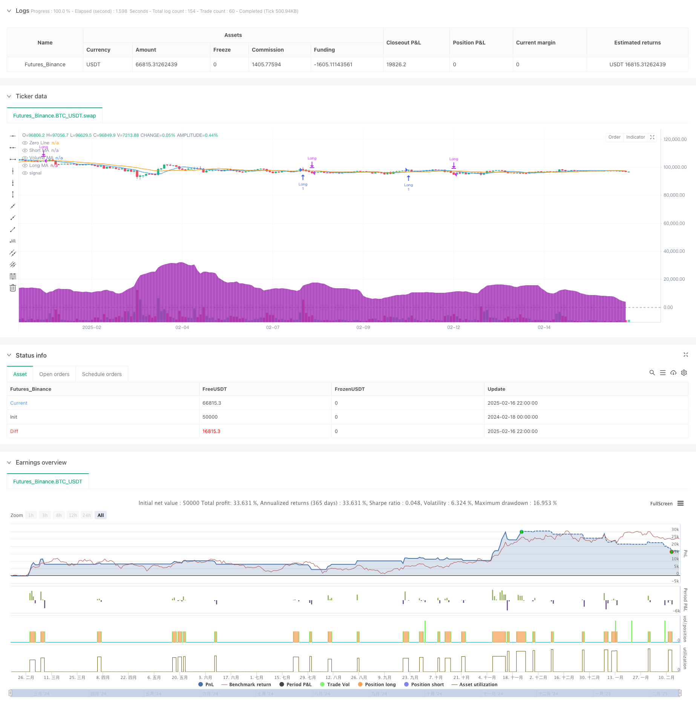

> Name

Trend-Breakout-Trading-Strategy-Based-on-Dual-Moving-Averages-and-Volume
> Author

ChaoZhang

> Strategy Description



[trans]
#### Overview
This is a long trend trading strategy that combines double moving average breakouts and volume analysis. The strategy compares the cross signals of short-term and long-term moving averages and combines them with volume indicators to make trading decisions. When the short-term moving average crosses the long-term moving average upward and the trading volume increases significantly, the system will send a long signal. At the same time, the strategy also sets a stop-loss mechanism to control risks.
#### Strategy Principle
The core logic of the strategy is based on the following key elements:
1. Dual Moving Average System: Uses the 9-day and 21-day simple moving averages (SMA) as signal indicators. The short-term moving average represents the recent price trend, and the long-term moving average represents the medium-term price trend.
2. Trading volume analysis: The normal trading volume level is measured by the 20-day trading volume moving average. It is required that the trading volume at the time of opening a position is at least 1.5 times the average level and has increased compared with the previous cycle.
3. Stop loss mechanism: Set a stop loss point of 2% based on the opening price to control the maximum loss of a single transaction.
4. Exit mechanism: When the short-term moving average falls below the long-term moving average, the system automatically closes the position and leaves the market.
#### Strategic Advantages
1. Multiple confirmation mechanism: Through double confirmation of price trends and trading volume, the reliability of trading signals is improved.
2. Improved risk control: A fixed percentage stop loss is set to effectively control the risk exposure of each transaction.
3. Trend following characteristics: Using moving average crossovers to capture trend changes, you can enter the market at the early stage of the trend.
4. Objective quantitative indicators: All trading signals are based on objective technical indicators, avoiding the interference caused by subjective judgment.
5. Strong adaptability: Parameters can be adjusted according to different market characteristics and have good adaptability.
#### Strategy Risk
1. Risk of volatile market: In a volatile market, frequent moving average crossovers may lead to multiple false breakthroughs.
Solution: You can add trend confirmation indicators such as ADX or trend strength indicators.
2. Slippage risk: When trading volume suddenly increases, you may face larger slippage losses.
Solution: It is recommended to set a reasonable slippage tolerance and use limit orders when opening positions.
3. Risk of stop loss triggering: Fixed percentage stop loss may be too sensitive when market volatility increases.
Solution: Consider using ATR dynamic stop loss or volatility adjusted stop loss.
#### Strategy optimization direction
1. Dynamic parameter optimization
- Dynamically adjust the moving average period based on market volatility
- Use adaptive volume thresholds
- Introduce volatility factor to adjust stop loss range
2. Signal optimization
- Added trend strength filtering
- Introducing price pattern confirmation
- Added volume pattern analysis
3. Risk management optimization
- Implement dynamic position management
- Add profit target management
- Optimize stop loss method
#### Summary
This strategy builds a relatively complete trading system by combining price trends and volume changes. The advantage of the strategy lies in the multiple confirmation mechanism and perfect risk control, but it may face the risk of false breakthroughs in volatile markets. Through dynamic parameter optimization and signal optimization, the strategy still has a lot of room for improvement. Overall, this is a trend following strategy with a solid foundation and clear logic, suitable for application in markets with obvious trends. ||
#### Overview
This is a long-only trend trading strategy that combines dual moving average crossover with volume analysis. The strategy makes trading decisions by comparing short-term and long-term moving average crossover signals while incorporating volume indicators. A long signal is generated when the short-term moving average crosses above the long-term moving average with significant volume expansion. The strategy also includes a stop-loss mechanism for risk control.

#### Strategy Principles
The core logic of the strategy is based on the following key elements:
1. Dual Moving Average System: Uses 9-day and 21-day Simple Moving Averages (SMA) as signal indicators. The short-term MA represents recent price trends, while the long-term MA represents medium-term price trends.
2. Volume Analysis: Uses a 20-day volume moving average to measure normal trading volume levels, requiring entry volume to be at least 1.5 times the average level and increasing compared to the previous period.
3. Stop-Loss Mechanism: Sets a 2% stop-loss level from the entry price to control maximum loss per trade.
4. Exit Mechanism: Automatically closes positions when the short-term MA crosses below the long-term MA.

#### Strategy Advantages
1. Multiple Confirmation Mechanism: Improves signal reliability through dual confirmation of price trends and volume.
2. Comprehensive Risk Control: Fixed percentage stop-loss effectively controls risk exposure per trade.
3. Trend-Following Characteristics: Captures trend changes using MA crossovers, enabling early trend entry.
4. Objective Quantitative Indicators: All trading signals are based on objective technical indicators, avoiding subjective judgment interference.
5. High Adaptability: Parameters can be adjusted according to different market characteristics.

#### Strategy Risks
1. Choppy Market Risk: Frequent MA crossovers in sideways markets may lead to multiple false breakouts.
Solution: Add trend confirmation indicators such as ADX or trend strength indicators.

2. Slippage Risk: May face significant slippage losses during volume surges.
Solution: Set reasonable slippage tolerance and use limit orders for entries.

3. Stop-Loss Trigger Risk: Fixed percentage stops may be too sensitive in high volatility markets.
Solution: Consider using ATR-based dynamic stops or volatility-adjusted stop-loss methods.

#### Strategy Optimization Directions
1. Dynamic Parameter Optimization
- Dynamically adjust MA periods based on market volatility
- Implement adaptive volume thresholds
- Introduce volatility factors for stop-loss adjustment

2. Signal Optimization
- Add trend strength filters
- Incorporate price pattern confirmation
- Include volume pattern analysis

3. Risk Management Optimization
- Implement dynamic position sizing
- Add profit target management
- Optimize stop-loss methods

#### Summary
This strategy builds a relatively complete trading system by combining price trends and volume changes. Its strengths lie in multiple confirmation mechanisms and comprehensive risk control, though it may face false breakout risks in choppy markets. There is significant room for improvement through dynamic parameter optimization and signal enhancement. Overall, it's a fundamentally sound trend-following strategy with clear logic, suitable for application in trending markets.[/trans]


> Source (PineScript)

``` pinescript
/*backtest
start: 2024-02-18 00:00:00
end: 2025-02-17 00:00:00
period: 2h
basePeriod: 2h
exchanges: [{"eid":"Futures_Binance","currency":"BTC_USDT"}]
*/

//@version=5
strategy("MA Crossover with Volume (Long Only) + Stop Loss", overlay=true)

// Input settings for Moving Averages
shortMaLength = input.int(9, title="Short MA Length", minval=1)
longMaLength = input.int(21, title="Long MA Length", minval=1)

// Input settings for Volume
volumeMaLength = input.int(20, title="Volume MA Length", minval=1)
volumeThresholdMultiplier = input.float(1.5, title="Volume Multiplier (x times the average)", step=0.1)

// Input settings for Stop Loss
stopLossPercent = input.float(2.0, title="Stop Loss (%)", minval=0.1, step=0.1) / 100  // Stop loss in percentage

// Calculating Moving Averages
shortMa = ta.sma(close, shortMaLength)
longMa = ta.sma(close, longMaLength)

// Calculating Volume Metrics
volumeMa = ta.sma(volume, volumeMaLength)  // Average volume
isVolumeAboveAverage = volume > (volumeMa * volumeThresholdMultiplier)  // Volume above threshold
isVolumeIncreasing = volume > volume[1]  // Volume increasing compared to the previous bar

// Plotting Moving Averages
plot(shortMa, color=color.blue, title="Short MA")
plot(longMa, color=color.orange, title="Long MA")

// Buy Condition with Volume
longCondition = ta.crossover(shortMa, longMa) and isVolumeAboveAverage and isVolumeIncreasing
exitCondition = ta.crossunder(shortMa, longMa)  // Exit when the MAs cross downward

// Calculate Stop Loss Level
var float entryPrice = na  // Variable to store entry price
if (strategy.position_size > 0 and na(entryPrice))  // Update entry price only when entering a new trade
    entryPrice := strategy.position_avg_price

stopLossLevel = entryPrice * (1 - stopLossPercent)  // Stop-loss level based on entry price

// Strategy Entry (Long Only)
if (longCondition)
    strategy.entry("Long", strategy.long)

// Close position on Stop Loss or Exit Condition
if (strategy.position_size > 0)
    if (low < stopLossLevel)  // If the price drops below the stop-loss level
        strategy.close("Long", comment="Stop Loss Hit")

if (exitCondition)
    strategy.close("Long", comment="Exit Signal Hit")

// Debugging Plots
plot(volumeMa, color=color.purple, title="Volume MA", style=plot.style_area, transp=80)
hline(0, "Zero Line", color=color.gray)

```

> Detail

https://www.fmz.com/strategy/482421

> Last Modified

2025-02-18 13:38:51
