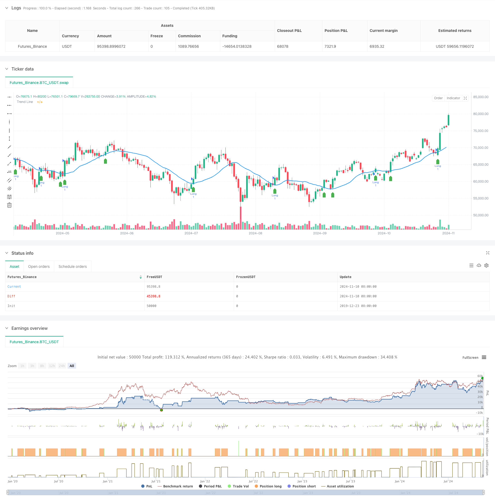

> Name

Trend-Breakout-Trading-System-with-Moving-Average-TBMA-Strategy
> Author

ChaoZhang

> Strategy Description



[trans]
#### Overview
This strategy is a trading system based on trendline breakouts that combines the concepts of moving averages and price breakouts. The core of the strategy is to generate trading signals by monitoring the closing price's breakthrough of the moving average, and set a stop loss based on the recent low and a take profit of 2:1 to manage risk. The strategy uses a simple moving average as a trend indicator, and determines changes in trend direction through the intersection of price and the moving average.
#### Strategy Principle
The strategy uses the 20-period Simple Moving Average (SMA) as the trend indicator. When the closing price breaks through from below the moving average to above, the system will generate a long signal. The stop loss position is set at the lowest point of the past 7 K lines to avoid being too close to the entry point. The take-profit position is set using the classic profit-loss ratio of 2:1, that is, the take-profit distance is twice the stop-loss distance. The strategy also includes a visual component, with trend lines, trading signals, and stop-loss and take-profit positions marked on the chart.
#### Strategic Advantages
1. Trend following characteristics: Market trends can be effectively captured through moving averages
2. Improved risk management: Adopt dynamic stop loss settings based on market fluctuations
3. Reasonable profit and loss ratio: Using a profit and loss ratio of 2:1 improves the expected return of the strategy
4. Clear visualization: Detailed chart annotations make it easier for traders to understand market conditions.
5. Adjustable parameters: trend line length and stop loss calculation period can be adjusted as needed
#### Strategy Risk
1. Volatile market risk: False breakthrough signals may frequently occur in sideways markets
2. Slippage risk: Breakout signals may encounter large slippage during execution
3. Risk of stop loss position: The stop loss at the lowest point may be too wide, resulting in excessive single loss.
4. Rapid reversal risk: A rapid reversal after a trend breakthrough may lead to stop-loss exits
5. Parameter sensitivity: Different market environments may require adjusting parameters to suit
#### Strategy optimization direction
1. Add trend confirmation indicators: It is recommended to add indicators such as RSI or MACD for trend confirmation.
2. Optimize the stop loss mechanism: Consider using ATR to dynamically adjust the stop loss distance.
3. Add volume confirmation: Add volume verification to breakout signals
4. Improve signal filtering: add volatility filter to reduce false breakthroughs
5. Improve the take-profit mechanism: Consider using trailing take-profit to improve profit protection capabilities
#### Summary
This is a trend following strategy with complete structure and clear logic. Generating signals through moving average breakthroughs, combined with a reasonable risk management mechanism, has good practicality. Although there are some inherent risks, the stability and profitability of the strategy can be further improved through the suggested optimization directions. The strategy is suitable for use in market environments with obvious trends, and traders can adjust parameter settings according to specific market characteristics.
|| 

#### Overview
This strategy is a trend breakout trading system that combines moving averages with price breakout concepts. The core mechanism is generating trading signals based on price closes breaking above the moving average, with stop-loss levels set at recent lows and a 2:1 profit-to-loss ratio for risk management. The strategy uses a Simple Moving Average as a trend indicator and identifies trend changes through price-line crossovers.

#### Strategy Principle
The strategy employs a 20-period Simple Moving Average (SMA) as a trend indicator. Long signals are generated when the closing price breaks above the moving average from below. Stop-loss levels are set at the lowest point of the past 7 candles to avoid placing them too close to entry points. Take-profit levels are set using a classic 2:1 reward-to-risk ratio, meaning the profit target is twice the distance of the stop-loss. The strategy includes visualization components that mark trend lines, trading signals, and stop-loss/take-profit levels on the chart.

#### Strategy Advantages
1. Trend Following Nature: Effectively captures market trends using moving averages
2. Robust Risk Management: Uses dynamic stop-loss based on market volatility
3. Reasonable Risk-Reward Ratio: Implements 2:1 profit-to-loss ratio for better expected returns
4. Clear Visualization: Detailed chart annotations for better market understanding
5. Adjustable Parameters: Trend line length and stop-loss calculation period can be customized

#### Strategy Risks
1. Choppy Market Risk: May generate frequent false signals in ranging markets
2. Slippage Risk: Breakout signals may face significant slippage during execution
3. Stop-Loss Positioning Risk: Lowest point stop-loss might be too wide, leading to large losses
4. Quick Reversal Risk: Fast reversals after breakouts may trigger stop-losses
5. Parameter Sensitivity: Different market conditions may require parameter adjustments

#### Strategy Optimization Directions
1. Add Trend Confirmation Indicators: Consider adding RSI or MACD for trend confirmation
2. Optimize Stop-Loss Mechanism: Consider using ATR for dynamic stop-loss adjustment
3. Incorporate Volume Confirmation: Add volume verification for breakout signals
4. Improve Signal Filtering: Add volatility filters to reduce false breakouts
5. Enhanced Profit-Taking: Consider implementing trailing stops for better profit protection

#### Summary
This is a well-structured trend-following strategy with clear logic. It generates signals through moving average breakouts, combined with reasonable risk management mechanisms, making it practically applicable. While inherent risks exist, the suggested optimization directions can further enhance strategy stability and profitability. The strategy is suitable for trending market conditions, and traders can adjust parameters according to specific market characteristics.[/trans]


> Source (PineScript)

``` pinescript
/*backtest
start: 2019-12-23 08:00:00
end: 2024-11-11 00:00:00
period: 1d
basePeriod: 1d
exchanges: [{"eid":"Futures_Binance","currency":"BTC_USDT"}]
*/

//@version=5
strategy("Trend Breakout with SL and TP", overlay=true)

// Parametrlar
length = input(25, title="Length for SL Calculation")
trendLength = input(20, title="Trend Line Length")

// Trend chizig'ini hisoblash
trendLine = ta.sma(close, trendLength)

// Yopilish narxi trend chizig'ini yorib o'tganda signal
longSignal = close > trendLine and close[1] <= trendLine

// Oxirgi 7 shamning minimumini hisoblash
lowestLow = ta.lowest(low, 7)

// Stop Loss darajasini belgilash
longSL = lowestLow  // SL oxirgi 7 shamning minimumiga teng

// Take Profit darajasini SL ga nisbatan 2 baravar ko'p qilib belgilash
longTP = longSL + (close - longSL) * 2  // TP 2:1 nisbatida

// Savdo bajarish
if longSignal
    strategy.entry("Long", strategy.long)
    strategy.exit("Take Profit", "Long", limit=longTP)
    strategy.exit("Stop Loss", "Long", stop=longSL)

// Grafikda trend chizig'ini chizish
plot(trendLine, title="Trend Line", color=color.blue, linewidth=2)

// Signal chizish
plotshape(longSignal, style=shape.labelup, location=location.belowbar, color=color.green, size=size.small, title="Buy Signal")

// SL va TP darajalarini ko'rsatish
// if longSignal
//     // SL chizig'i
//     line.new(bar_index, longSL, bar_index + 1, longSL, color=color.red, width=2, style=line.style_dashed)
//     // TP chizig'i
//     line.new(bar_index, longTP, bar_index + 1, longTP, color=color.green, width=2, style=line.style_dashed)
    
//     // SL va TP label'larini ko'rsatish
//     label.new(bar_index, longSL, "SL: " + str.tostring(longSL), color=color.red, style=label.style_label_down, textcolor=color.white, size=size.small)
//     label.new(bar_index, longTP, "TP: " + str.tostring(longTP), color=color.green, style=label.style_label_up, textcolor=color.white, size=size.small)

```

> Detail

https://www.fmz.com/strategy/471714

> Last Modified

2024-11-12 16:24:08
