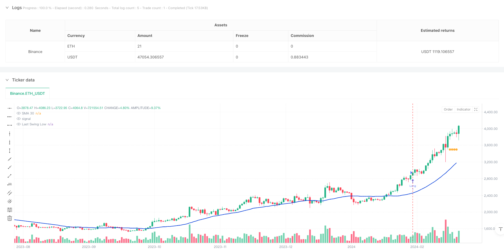
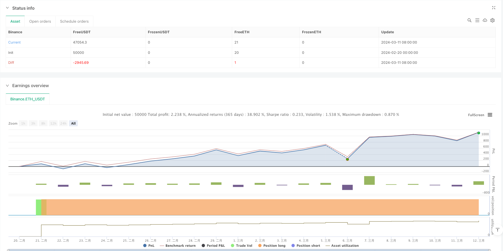

> Name

Multi-indicator dynamic stop-loss strategy based on trend confirmation-Trend-Confirmation-Multi-Indicator-Dynamic-Stop-Loss-Strategy
> Author

ianzeng123

> Strategy Description




[trans]
#### Overview
This is a trend following strategy that combines multiple technical indicators. It mainly trades at the weekly level through the synergy of three indicators: SMA (Simple Moving Average), MACD (Moving Average Convergence Divergence Index) and ADX (Average Trend Index). This strategy uses a dynamic stop-loss mechanism to optimize risk management and achieve more precise position control through the identification of swing lows.
#### Strategy Principle
The core logic of the strategy is based on the triple verification mechanism:
1. Determine the overall trend direction through SMA (30). Prices above the moving average represent an upward trend.
2. Use MACD(9,18,9) to capture price momentum, requiring the MACD line to be above the signal line and be positive.
3. Use ADX(14) to confirm the strength of the trend. ADX greater than 25 indicates that the trend is sufficient.
4. Open a long position when the above three conditions are met
5. Set a dynamic stop loss by identifying the second low point, and clear the position when the price falls below the SMA
#### Strategic Advantages
1. Multi-indicator cross-validation significantly reduces the impact of false signals
2. Use weekly level trading to avoid interference from intraday fluctuations
3. Dynamic stop loss mechanism, adaptively adjust the stop loss position through swing lows
4. ADX filters out weak trends and improves transaction quality
5. Comprehensive risk management, including dual protection of trend reversal and stop loss
#### Strategy Risk
1. Multiple indicators may cause signal lag and miss opportunities in fast market conditions.
2. Weekly level operations may face a larger retracement
3. Swing low identification can be unstable in severe swings
4. It takes a long time to accumulate enough price data
5. Frequent false signals may occur in volatile markets
#### Strategy optimization direction
1. Consider introducing adaptive indicator parameters and dynamically adjusting them according to market volatility
2. Increase trading volume indicator verification and improve signal reliability
3. Develop a more intelligent Swing Low recognition algorithm
4. Add market environment classification and adopt different parameters for different market conditions.
5. Optimize stop loss logic and consider introducing trailing stop loss
#### Summary
This strategy builds a robust trend following system through the synergy of multiple technical indicators. The dynamic stop loss mechanism provides good risk control and is suitable for tracking medium and long-term trends. The main advantages of the strategy are high signal reliability and perfect risk management, but it also faces challenges such as signal lag. By further optimizing parameter adaptability and market environment recognition, this strategy is expected to achieve better performance. ||
#### Overview
This is a trend-following strategy that combines multiple technical indicators, primarily utilizing SMA (Simple Moving Average), MACD (Moving Average Convergence Divergence), and ADX (Average Directional Index) for trading on weekly charts. The strategy employs a dynamic stop-loss mechanism through Swing Low identification to optimize risk management and achieve more precise position control.

#### Strategy Principles
The core logic is based on a triple verification mechanism:
1. Using SMA(30) to determine overall trend direction, with price above the moving average indicating an uptrend
2. Employing MACD(9,18,9) to capture price momentum, requiring MACD line above signal line and positive
3. Utilizing ADX(14) to confirm trend strength, with ADX above 25 indicating sufficient trend
4. Entering long positions when all three conditions are met
5. Setting dynamic stop-loss through second-lowest swing point identification, closing positions when price breaks below SMA

#### Strategy Advantages
1. Multiple indicator cross-validation significantly reduces false signals
2. Weekly timeframe trading avoids daily noise
3. Dynamic stop-loss mechanism adapts to market conditions through swing low points
4. ADX filtering removes weak trends, improving trade quality
5. Comprehensive risk management with both trend reversal and stop-loss protection

#### Strategy Risks
1. Multiple indicators may lead to delayed signals in fast-moving markets
2. Weekly timeframe operations may face larger drawdowns
3. Swing low identification may become unstable in volatile conditions
4. Requires substantial historical data for reliable operation
5. May generate frequent false signals in ranging markets

#### Strategy Optimization Directions
1. Consider implementing adaptive indicator parameters based on market volatility
2. Add volume indicator verification to improve signal reliability
3. Develop more sophisticated Swing Low identification algorithms
4. Incorporate market environment classification with different parameters for different market states
5. Optimize stop-loss logic by introducing trailing stops

#### Summary
This strategy builds a robust trend-following system through the synergy of multiple technical indicators. The dynamic stop-loss mechanism provides effective risk control, suitable for tracking medium to long-term trends. While the strategy's main strengths lie in high signal reliability and comprehensive risk management, it faces challenges such as signal lag. Further optimization in parameter adaptivity and market environment recognition could potentially enhance its performance.
[/trans]


> Source (PineScript)

``` pinescript
/*backtest
start: 2024-02-20 00:00:00
end: 2024-03-12 00:00:00
period: 1d
basePeriod: 1d
exchanges: [{"eid":"Binance","currency":"ETH_USDT"}]
*/

//@version=5
strategy("Invest SMA|MACD|ADX Long Weekly Strategy (BtTL)", overlay=true)

// SMA Inputs
smaLength = input.int(30, title="SMA Länge")
// MACD Inputs
macdFastLength = input.int(9, title="MACD schnelle Periode")
macdSlowLength = input.int(18, title="MACD langsame Perside")
macdSignalLength = input.int(9, title="MACD Signal Smoothing")
//ADX Inputs
adxlen = input(14, title="ADX Smoothing")
dilen = input(14, title="DI Länge")

// SMA-Berechnung
smaValue = ta.sma(close, smaLength)
isAboveSMA = close > smaValue
isBelowSMA = close < smaValue

// MACD-Berechnung
[macdLine, signalLine, _] = ta.macd(close, macdFastLength, macdSlowLength, macdSignalLength)
isMACDBuy = macdLine > signalLine and macdLine > 0

// Swing-Low Berechnung (5-Kerzen)
isSwingLow = low[2] > low[1] and low[3] > low[1] and low[1] < low and low[1] < low[4]
var float lastSwingLow = na
var float secondLastSwingLow = na

// Wenn ein neuer Swing-Low gefunden wird
if (isSwingLow[1])
    secondLastSwingLow := lastSwingLow
    lastSwingLow := low[1]

//ADX ermitteln
[pDI,mDI,ADX] = ta.dmi(dilen, adxlen)
IsInTrend = ADX > 25

// Einstiegskondition mit MACD und SMA
longCondition = isAboveSMA and isMACDBuy and IsInTrend
if (longCondition)
    strategy.entry("Long", strategy.long)

// Ausstiegskondition am vorletzten Swing-Low
if (isBelowSMA and na(secondLastSwingLow) == false)
    strategy.exit("Exit", from_entry="Long", stop=secondLastSwingLow)

// Reset bei Position schließen
if(strategy.position_size <= 0)
    secondLastSwingLow := na
    lastSwingLow := na

// Plots
plot(smaValue, title="SMA 30", color=#063eda, linewidth=2)
plot(na(lastSwingLow) ? na : lastSwingLow, title="Last Swing Low", color=#ffb13b, linewidth=1, style=plot.style_circles)
plot(na(secondLastSwingLow) ? na : secondLastSwingLow, title="Second Last Swing Low", color=color.red, linewidth=1, style=plot.style_circles)
```

> Detail

https://www.fmz.com/strategy/482793

> Last Modified

2025-02-20 11:19:58
