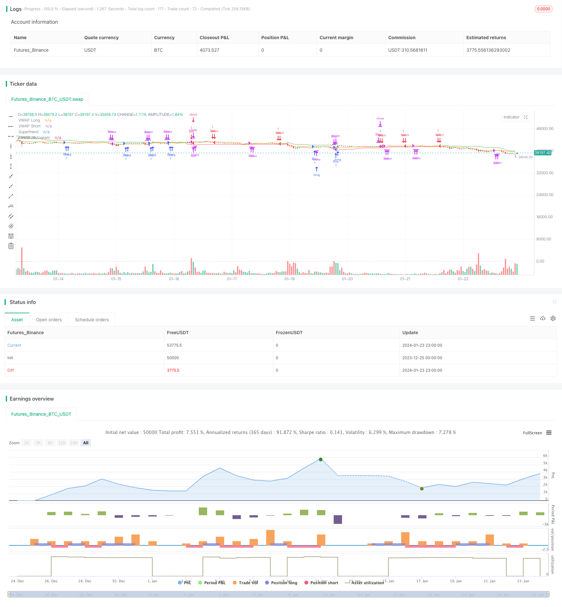

> Name

Momentum Double Confirmation Trend Tracking Strategy-Trend-Confirmation-Tracking-Strategy
> Author

ChaoZhang

> Strategy Description


 [trans]
### Overview
This strategy combines three technical indicators, the Super Trend Indicator, the Moving Average Convergence Indicator and the Volume Weighted Average Price, to identify potential entry and exit points by confirming the direction of the trend and considering the proximity of price to the Volume Weighted Average Price. The strategy also incorporates stop-loss and take-profit mechanisms as well as trailing stops to lock in profits.
### Strategy Principles
**Admission Conditions**
Trend Confirmation: The strategy uses the Super Trend indicator and MACD indicator to confirm the trend direction. Double confirmation increases the likelihood of accurately identifying trends and filtering out false signals.
VWAP Confirmation: The strategy considers how close the price is to the volume weighted average price. This dynamic level can serve as support or resistance, providing additional basis for entry decisions.
**Exit conditions**
MACD crossover: When the MACD indicator line and the signal line cross downward, close the long position; when the indicator line and the signal line cross upward, close the short position.
**Risk Management**
Adaptive Stop Loss: The strategy sets a stop loss range that can tolerate small price fluctuations. This adaptive approach takes market volatility into account and helps prevent stops from being triggered prematurely.
Trailing Stop: The strategy adds a trailing stop mechanism to lock in profits, which can potentially increase profitability when the trade moves in the expected direction.
### Advantage Analysis
Dual indicator confirmation: The combination of the Super Trend indicator and the MACD indicator confirms the trend, which is a unique feature of this strategy. It adds a layer of filtering to entry signals, improving accuracy.
Dynamic VWAP: Incorporating the volume weighted average price into the decision-making process increases the dynamics of the strategy. VWAP is often used by institutional traders, and its introduction can provide insights into market sentiment.
Adaptive stop loss and trailing stop loss: Strategies using adaptive stop loss ranges and trailing stop loss can more effectively manage risks and protect profits in changing market environments.
Partial take profit: It is recommended to consider partial take profit when the MACD indicator crosses in reverse. This is a practical method to ensure profits while maintaining positions.
### Risk Analysis
Backtesting: Before applying any strategy in actual trading, it is necessary to fully backtest on historical data to understand its performance under various market conditions.
Risk Management: While the strategy has built-in risk management mechanisms, it is still necessary to carefully manage position size and overall portfolio risk.
Market Conditions: No single strategy is suitable for all market conditions. It's important to be flexible and adjust your strategy or avoid trading during particularly volatile or unpredictable times.
Continuous monitoring: Even if a strategy includes an automated component, it is necessary to continuously monitor trading and market conditions.
Adaptability: Markets change over time. Traders need to be prepared to adjust their strategies based on changing market dynamics at any time.
### Optimization direction
Multiple Time Frames: This strategy can be applied on higher time frames to take advantage of longer-term trends.
Parameter optimization: You can test different parameter combinations, such as ATR cycle length, stop loss range, etc., to find the best parameters.
Partial take profit: You can set more specific partial take profit rules, such as taking profit at a specific percentage of profit.
Condition optimization: You can test adding or removing certain entry or exit conditions to find the best balance of combinations of conditions.
### Summarize
This strategy successfully combines trend, momentum, and volume indicators to provide a relatively unique way to confirm trends and identify potential entry points. Features such as double confirmation and dynamic stop loss give it certain advantages. But any strategy requires careful backtesting, optimization, and monitoring to be effective in the long term. This strategy provides a framework worth exploring and further refining.
||

### Overview

This strategy combines the Supertrend, Moving Average Convergence Divergence (MACD), and Volume Weighted Average Price (VWAP) technical indicators. It aims to identify potential entry and exit points by confirming the trend direction and considering the proximity to the VWAP level. The strategy also incorporates stop-loss, take-profit, and trailing stop mechanisms.  

### Strategy Logic

**Entry Conditions**

Trend Confirmation: The strategy uses both Supertrend and MACD to confirm the trend direction. This dual confirmation can increase the likelihood of accurately identifying the trend and filter out false signals.

VWAP Confirmation: The strategy considers the proximity of the price to the VWAP level. This dynamic level can act as support/resistance and provide additional context for entry decisions.

**Exit Conditions**

MACD Crossover: The strategy closes long positions when the MACD line crosses below the signal line and closes short positions when the MACD line crosses above. 

**Risk Management**  

Adaptive Stop Loss: The strategy sets a stop-loss range, which provides some tolerance for minor price fluctuations. This adaptive approach considers market volatility.

Trailing Stop: The strategy incorporates a trailing stop mechanism to lock in profits as the trade moves in the desired direction. This can potentially enhance profitability during strong trends.

### Advantage Analysis  

Dual Indicator Confirmation: The combination of Supertrend and MACD for trend confirmation is a unique aspect that adds a layer of filtering to enhance signal accuracy.

Dynamic VWAP: Incorporating the VWAP level provides insights into market sentiment as VWAP is often used by institutional traders. 

Adaptive Stop Loss and Trailing: The adaptive stop loss range and trailing stop can more effectively manage risk and protect profits.

Partial Profit Booking: The suggestion to consider partial profit booking upon MACD crossovers allows securing gains while staying in the trade.

### Risk Analysis

Backtesting: Thoroughly backtest any strategy before live deployment to understand performance across various market conditions.

Risk Management: Carefully manage position sizing and overall portfolio risk despite built-in mechanisms.  

Market Conditions: No strategy works perfectly across all market conditions. Be flexible and refrain from trading during particularly volatile periods.

Monitoring: Continuously monitor trades and market conditions despite automated components.  

Adaptability: Markets evolve over time. Be prepared to adapt the strategy as necessary to align with changing dynamics.

### Optimization Directions

Multiple Timeframes: Consider applying on higher timeframes to capitalize on longer-term trends.  

Parameter Optimization: Test different parameter combinations like ATR period length, stop loss range etc. to find optimal parameters.  

Partial Profit Taking: Incorporate more definitive partial profit taking rules like taking profits at certain percentage levels.

Condition Optimization: Test adding or removing certain entry or exit rules to find the right balance.

### Conclusion
This strategy offers a relatively unique approach of combining trend, momentum and volume indicators to confirm trends and identify potential entry points. Features like dual confirmation and adaptive stops provide certain advantages. However, thorough backtesting, optimization, and monitoring are essential for any strategy's long-term viability. The strategy provides a framework worth exploring and refining further.

[/trans]

> Strategy Arguments


|Argument|Default|Description|
|----|----|----|
|v_input_1|10|ATR Length|
|v_input_float_1|3|Factor|
|v_input_2|12|Fast Length|
|v_input_3|26|Slow Length|
|v_input_4_close|0|Source: close|high|low|open|hl2|hlc3|hlcc4|ohlc4|
|v_input_int_1|9|Signal Smoothing|
|v_input_string_1|0|Oscillator MA Type: EMA|SMA|
|v_input_string_2|0|Signal Line MA Type: EMA|SMA|
|v_input_5|false|Hide VWAP on 1D or Above|
|v_input_6_hlc3|0|VWAP Source: hlc3|high|low|open|hl2|close|hlcc4|ohlc4|
|v_input_7|2|Stop Loss Range|
|v_input_8|0.5|Trailing Stop Offset|


> Source (PineScript)

``` pinescript
/*backtest
start: 2023-12-25 00:00:00
end: 2024-01-24 00:00:00
period: 1h
basePeriod: 15m
exchanges: [{"eid":"Futures_Binance","currency":"BTC_USDT"}]
*/

//@version=5
strategy("Trend Confirmation Strategy", overlay=true)

// Supertrend Indicator
atrPeriod = input(10, "ATR Length")
factor = input.float(3.0, "Factor", step = 0.01)
[supertrend, direction] = ta.supertrend(factor, atrPeriod)

// MACD Indicator
fast_length = input(title="Fast Length", defval=12)
slow_length = input(title="Slow Length", defval=26)
macd_src = input(title="Source", defval=close)
signal_length = input.int(title="Signal Smoothing",  minval = 1, maxval = 50, defval = 9)
macd_sma_source = input.string(title="Oscillator MA Type",  defval="EMA", options=["SMA", "EMA"])
macd_sma_signal = input.string(title="Signal Line MA Type", defval="EMA", options=["SMA", "EMA"])

fast_ma = macd_sma_source == "SMA" ? ta.sma(macd_src, fast_length) : ta.ema(macd_src, fast_length)
slow_ma = macd_sma_source == "SMA" ? ta.sma(macd_src, slow_length) : ta.ema(macd_src, slow_length)
macd = fast_ma - slow_ma
signal = macd_sma_signal == "SMA" ? ta.sma(macd, signal_length) : ta.ema(macd, signal_length)

// VWAP Indicator
vwap_hideonDWM = input(false, title="Hide VWAP on 1D or Above")
vwap_src = input(title="VWAP Source", defval=hlc3)

vwap_value = ta.vwap(vwap_src)
vwap_value_long = vwap_value
vwap_value_short = vwap_value

// Entry Criteria
confirm_up_trend = direction > 0 and macd > signal
confirm_down_trend = direction < 0 and macd < signal

// VWAP Confirmation
price_above_vwap = close > vwap_value_long
price_below_vwap = close < vwap_value_short

// Stop Loss and Take Profit
stop_loss_range = input(2, title="Stop Loss Range")
trail_offset = input(0.5, title="Trailing Stop Offset")

stop_loss_long = close - stop_loss_range
stop_loss_short = close + stop_loss_range

// Strategy Entry
if not (vwap_hideonDWM and timeframe.isdwm)
    if confirm_up_trend and price_above_vwap
        strategy.entry("Buy", strategy.long)
    if confirm_down_trend and price_below_vwap
        strategy.entry("Sell", strategy.short)

// Strategy Exit
if macd < signal and macd[1] >= signal[1]
    strategy.close("Buy", comment="MACD Crossover")

if macd > signal and macd[1] <= signal[1]
    strategy.close("Sell", comment="MACD Crossover")

// Plot Supertrend and VWAP
plot(supertrend, color=direction > 0 ? color.green : color.red, title="Supertrend")
plot(vwap_value_long, color=color.blue, title="VWAP Long")
plot(vwap_value_short, color=color.orange, title="VWAP Short")

// Plot MACD Histogram
hist = macd - signal
hist_color = hist >= 0 ? color.green : color.red
plot(hist, style=plot.style_histogram, color=hist_color, title="MACD Histogram")

```

> Detail

https://www.fmz.com/strategy/439956

> Last Modified

2024-01-25 11:57:56
