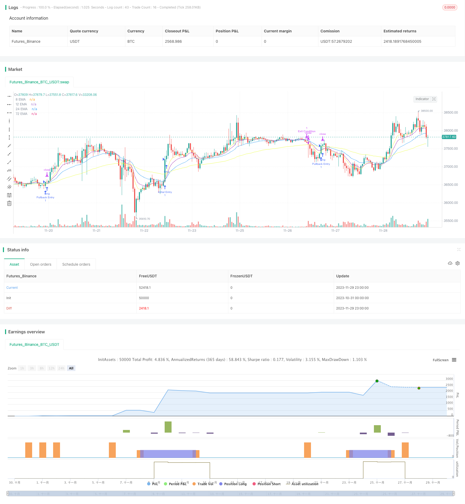

> Name

Trend-Following-Exponential-Moving-Average-Strategy
> Author

ChaoZhang

> Strategy Description



[trans]

### Overview
The Tracking Exponential Moving Average strategy is a trend-based quantitative trading strategy that uses exponential moving averages (EMA) of different periods to identify potential entry and exit signals in the cryptocurrency market. By tracking the crosses between different EMAs, you can discover pullback entry opportunities and trend entry opportunities to maximize potential returns while controlling risks.
### Strategy Principles
This strategy uses 4 EMAs with different periods, namely 8-period, 12-period, 24-period and 72-period EMA. They function on the chart to indicate the direction of the trend. When the closing price breaks above the slow line, it indicates a buying opportunity. When the fast line breaks through the slow line, it indicates a selling opportunity.
**Market entry signals** There are two types:
1. Callback to enter the market: When the closing price breaks through the 12-day line, 24-day line and 72-day line, it constitutes a callback to enter the market.  
2. Trend entry: When the closing price breaks through the 72-day line, and at the same time the 8-day line breaks through the 12-day and 24-day lines, it forms a trend entry signal.
**Exit signals** There are three types:
1. Fixed profit: Set a fixed value as the profit exit point, such as 100 points.  
2. Slippage stop loss: Set a fixed slippage value, such as 50 points, as the stop loss line.  
3. Exit at a turning point: When the 24-day line crosses the 12-day line, you think the trend has turned and choose to exit.
### Advantage Analysis
The biggest advantage of this strategy is that it can seize both pullback and trend opportunities to enter the market. Use a combination of fast and slow lines to avoid being misled by short-term fluctuations in judgment. EMA can also effectively filter out the noise of abnormal price fluctuations and capture long-term trends. Overall, this strategy has the following advantages:
1. Strong tracking ability and able to quickly grasp market changes
2. High accuracy and can effectively identify the trend direction
3. Good flexibility, can choose to enter the market during trends and callbacks
4. Good risk control and complete stop loss strategy
### Risk Analysis
This strategy also has some risks that need to be guarded against:
1. Risks in setting key parameters. Improper key parameters such as EMA period will affect strategy performance.  
2. Determine risks in long and short transitions. EMA crossover is not enough to completely judge the turning point of the trend, and misjudgment may occur.  
3. Stop loss that is too aggressive may result in excessive exit.
In response to the above risks, the following measures can be taken to control them:
1. Select the appropriate period EMA combination and optimize the parameters.   
2. Combine with other indicators to confirm long and short transitions.   
3. Appropriately relax the stop loss range and optimize the stop loss strategy.
### Optimization direction
There is still some room for optimization in this strategy, which can mainly start from the following aspects:
1. Add other indicators to filter signals and improve the accuracy of the strategy. Such as MACD, Bollinger Bands, etc.  
2. Dynamically adjust the stop loss range in response to increased market volatility.  
3. Test data on different currency pairs and periods to find the best strategy configuration.  
4. Adjust the profit target and stop loss range according to the specific trader's risk preference.
### Summarize
This trajectory tracking EMA strategy is overall a trend following strategy. It takes into account both chasing up and pulling back, and determines the timing of market entry through the EMA cross. It is highly configurable, simple to use, and effectively controls risks. With parameter optimization and gradual improvement, its performance still has a lot of room for improvement, and it is worth recommending.
|| 

### Overview  

The Trend Following Exponential Moving Average Strategy is a quantitative trading strategy based on trends. It uses Exponential Moving Averages (EMAs) with different periods to identify potential entry and exit signals in the crypto market. By tracking crossovers between different EMAs, both pullback and trend entry opportunities can be discovered to maximize potential gains while mitigating risks.   

### Strategy Logic

The strategy employs four EMAs with periods of 8, 12, 24 and 72 respectively. They serve as visual guides on the chart for the trend direction. When the closing price breaks through slower EMAs, it signals buying opportunities. When faster EMAs break through slower ones, it signals selling opportunities.   

**There are two entry signals:**
1. Pullback Entry: The closing price crossing over the 12-, 24- and 72-period EMAs forms a pullback entry signal.   
2. Trend Entry: The closing price crossing over the 72-period EMA along with the 8-period EMA simultaneously crossing over both the 12- and 24-period EMAs forms a trend entry signal.  

**There are three exit signals:**  
1. Fixed Profit Taking: A fixed value like 100 pips set as profit target.
2. Trailing Stop Loss: A fixed trailing stop like 50 pips.  
3. Reversal Exit: The 24-period EMA crossing below the 12-period EMA indicates a trend reversal for exit.

### Advantage Analysis   

The biggest advantage of this strategy is the ability to capitalize on both pullback and trend opportunities. Using faster and slower EMA combos prevents being misguided by short-term fluctuations. EMAs also filter out price noise effectively to capture long-term trends. Overall strengths include:  

1. Strong trend tracking ability to quickly capture market changes.   
2. High accuracy in identifying trend direction. 
3. Good flexibility to enter on both trends and pullbacks.  
4. Solid risk control with stop loss mechanics.

### Risk Analysis

Some risks need to be prevented:   

1. Risk from improper key parameter settings like EMA periods impacting strategy performance.  
2. Risk of misjudging trend reversal signals from EMA crossovers.
3. Overly aggressive stop loss causing over-exiting.

The following measures can help control the above risks:

1. Optimize parameters by selecting suitable EMA period combinations.  
2. Add other indicators to confirm reversals.
3. Fine tune stop loss mechanism by relaxing stop levels.  

### Optimization Directions

There is room for further optimization:

1. Add other filters like MACD and Bollinger Bands to improve accuracy. 
2. Dynamically adjust stop loss levels for high volatility conditions.
3. Test across different symbols and timeframes to find best configurations.  
4. Customize profit targets and stop loss based on risk appetite.  

### Conclusion  

Overall this EMA Tracking strategy capitalizes on both trend and pullback opportunities through EMA crossovers for entries. With high configurability, simplicity, and effective risk control, it has great potential for higher performance with parameter tuning and incremental refinements. Its strengths make it a recommended trend following system.

[/trans]

> Strategy Arguments


|Argument|Default|Description|
|----|----|----|
|v_input_1|8|Length of 8 EMA|
|v_input_2|12|Length of 12 EMA|
|v_input_3|24|Length of 24 EMA|
|v_input_4|72|Length of 72 EMA|


> Source (PineScript)

``` pinescript
/*backtest
start: 2023-10-31 00:00:00
end: 2023-11-30 00:00:00
period: 1h
basePeriod: 15m
exchanges: [{"eid":"Futures_Binance","currency":"BTC_USDT"}]
*/

// This source code is subject to the terms of the Mozilla Public License 2.0 at https://mozilla.org/MPL/2.0/
// © moondevonyt

//@version=5
strategy("Cornoflower Trend Following Crypto", overlay=true)

// Input Settings
lenEma8 = input(8, title="Length of 8 EMA")
lenEma12 = input(12, title="Length of 12 EMA")
lenEma24 = input(24, title="Length of 24 EMA")
lenEma72 = input(72, title="Length of 72 EMA")

// Calculate the EMAs
ema8 = ta.ema(close, lenEma8)
ema12 = ta.ema(close, lenEma12)
ema24 = ta.ema(close, lenEma24)
ema72 = ta.ema(close, lenEma72)

// Entry Conditions
pullbackEntry = ta.crossover(close, ema12) and ta.crossover(close, ema24) and ta.crossover(close, ema72)
initialEntry = ta.crossover(close, ema72) and ta.crossover(ema8, ema12) and ta.crossover(ema8, ema24)

// Exit Conditions
profitTarget = 100 // Example target in pips, adjust according to your preference
trailingStop = 50 // Example trailing stop value in pips, adjust according to your preference
exitCondition = ta.crossunder(ema12, ema24)

// Execute Strategy
if pullbackEntry
    strategy.entry("Pullback Entry", strategy.long)
if initialEntry
    strategy.entry("Initial Entry", strategy.long)

if strategy.position_size > 0
    strategy.exit("Profit Target", "Pullback Entry", limit=close + (profitTarget * syminfo.mintick))
    strategy.exit("Trailing Stop", "Pullback Entry", stop=close - (trailingStop * syminfo.mintick), trail_points=trailingStop)
    strategy.exit("Exit Condition", "Initial Entry", stop=close, when=exitCondition)
    
// Plot EMAs
plot(ema8, color=color.yellow, title="8 EMA", linewidth=1, style=plot.style_line)
plot(ema12, color=color.purple, title="12 EMA", linewidth=1, style=plot.style_line)
plot(ema24, color=color.blue, title="24 EMA", linewidth=1, style=plot.style_line)
plot(ema72, color=color.rgb(235, 255, 59), title="72 EMA", linewidth=1, style=plot.style_line)
```

> Detail

https://www.fmz.com/strategy/433904

> Last Modified

2023-12-01 13:46:46
