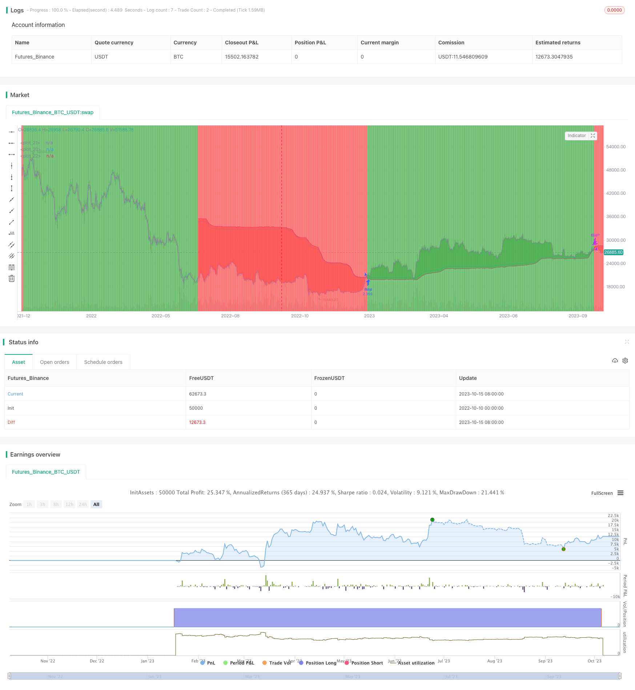

> Name

Long and short dynamic tracking strategy Trend-Following-Long-Only-Strategy
> Author

ChaoZhang

> Strategy Description



[trans]

## Overview
The long-short dynamic tracking strategy is a strategy that uses dynamic averages to track price trends. It determines the current trend by calculating the moving average of the highest price and lowest price within a certain period, and combines it with ATR to achieve dynamic stop loss and take profit. This strategy is mainly suitable for markets with obvious trends, and holds long-term positions by capturing trend reversals in a timely manner.
## Strategy Principle
This strategy first calculates the moving average of the highest price and lowest price within a certain period (default 200 days), and finds the midpoint of the two as the baseline. Then calculate the degree of deviation of the price from the baseline. When the price is one ATR higher than the baseline (default 0.5 times the 10-day ATR), it is considered to be in an upward trend. When the price is one ATR below the baseline, it is considered to be in a downward trend. Enter a long or short position depending on the trend status.
An Exit signal is generated when the price returns to the baseline. In addition, the dynamic changes of ATR can gradually stretch the stop loss and take profit along with the general trend, thereby reducing over-frequent trading caused by non-trend fluctuations.
## Strategic Advantages
1. The dynamic average can effectively smooth price data and identify the long-term trend direction.
2. ATR stop loss enables the stop loss line to dynamically track the general trend and avoid being too sensitive.
3. Capture trend reversals in a timely manner to reduce wastage of funds
4. Simple and easy-to-understand principles, easy to implement
## Risk and Hedging
1. Wrong transactions are prone to occur in volatile markets
2. Improper parameter settings may miss trend reversal opportunities.
3. There may be divergence between the market and individual stocks, and the long and short situation of the stock market needs to be considered.
You can reduce stop loss sensitivity by appropriately adjusting the ATR parameter, or add other indicators to screen for deterministic trading opportunities. You can also evaluate your risk appetite based on the market trend and choose whether to only go long in the bull market.
## Optimization ideas
1. You can consider using other indicators for secondary confirmation after the Entry signal, such as KDJ indicators, etc.
2. Parameters can be optimized based on stock fundamentals, such as appropriately relaxing the ATR range for high-volatility stocks.
3. The ATR multiple can be optimized based on the backtest results to balance the profit factor and turnover rate.
4. Consider introducing dynamic adjustment of volatility into the stop-loss and take-profit mechanism.
5. Parameters can be automatically optimized through machine learning technology
## Summarize
The long-short dynamic tracking strategy is generally a simple and practical trend tracking strategy. It determines the trend direction through dynamic averages and uses ATR to achieve dynamic stop loss and profit, which can effectively control risks. This strategy is suitable for market environments with obvious trends. By catching the trend reversal in time, you can obtain excess returns from long-term holdings. However, care needs to be taken to prevent being trapped in volatile market conditions. Strategy stability can be further improved through parameter optimization and assisted decision-making.
||


## Overview

The Trend Following Long Only Strategy is a strategy that tracks price trends using dynamic moving averages. It determines the current trend by calculating the moving averages of highest and lowest prices over a period and combines it with ATR for dynamic stop loss and take profit. This strategy works well in trending markets by catching trend reversals in a timely manner for long-term holding. 

## Strategy Logic

The strategy first calculates the moving averages of highest and lowest prices over a period (default 200 days) and takes their midpoint as the baseline. Then it measures the deviation of price from the baseline. If price is above baseline by 1 ATR (0.5 times 10-day ATR by default), it is considered an uptrend. If price is below baseline by 1 ATR, it is considered a downtrend. Long or short positions are entered based on the trend state. 

When price reverts to the baseline, exit signals are triggered. Also, the dynamic ATR allows stop loss and take profit to trail the major trend, avoiding over-trading on minor fluctuations.

## Advantages

1. Dynamic averages smooth price actions effectively to identify long-term trend direction
2. ATR-based stops trail the major trend dynamically avoiding excessive sensitivity
3. Timely catches of trend reversals reduce untimely capital waste
4. Simple logic easy to implement

## Risks and Mitigation

1. May generate false signals in ranging markets
2. Improper parameter tuning may miss trend reversals  
3. Divergence between market and individual stocks should be considered

Risks can be reduced by tweaking ATR parameters, adding filters for high probability setups, and evaluating market conditions and risk appetite.

## Improvement Ideas

1. Add secondary confirmation after initial entry signals using indicators like KDJ
2. Optimize parameters based on volatility, fundamentals of individual stocks
3. Fine tune ATR multiplier based on backtests to balance profit factor and turnover rate  
4. Introduce dynamic volatility adjustment in stop loss and take profit
5. Utilize machine learning techniques for automated parameter optimization

## Summary

The Trend Following Long Only Strategy is an easy-to-use trend trading system overall. It identifies trend direction using dynamic averages and sets risk controls with ATR-based stops. It can effectively catch profitable swings in trending markets. Ranging markets should be avoided to prevent whipsaws. Further improvements can be made through parameter tuning, adding filters and integrating machine learning techniques.

[/trans]

> Strategy Arguments


|Argument|Default|Description|
|----|----|----|
|v_input_1|200|Lookback Length|
|v_input_2|5|Smoother Length|
|v_input_3|10|ATR Length|
|v_input_4|0.5|ATR Multiplier|


> Source (PineScript)

``` pinescript
/*backtest
start: 2022-10-10 00:00:00
end: 2023-10-16 00:00:00
period: 1d
basePeriod: 1h
exchanges: [{"eid":"Futures_Binance","currency":"BTC_USDT"}]
*/

//@version=4
strategy("Trend Following Long Only Strategy", overlay=true, default_qty_type=strategy.percent_of_equity, default_qty_value=100)

lookback_length = input(200, type=input.integer, minval=1, title="Lookback Length")
smoother_length = input(5, type=input.integer, minval=1, title="Smoother Length")
atr_length = input(10, type=input.integer, minval=1, title="ATR Length")
atr_multiplier = input(0.5, type=input.float, minval=0.5, title="ATR Multiplier")

vola = atr(atr_length) * atr_multiplier
price = sma(close, 3)

l = ema(lowest(low, lookback_length), smoother_length)
h = ema(highest(high, lookback_length), smoother_length)
center = (h + l) * 0.5
upper = center + vola
lower = center - vola
trend = ema(price > upper ? 1 : (price < lower ? -1 : 0), 3)
c = trend < 0 ? upper : lower

pcenter = plot(center, transp=100)
pclose = plot(close, transp=100)
pc = plot(c, transp=100)

buy_signal = crossover(trend, 0.0) 
sell_signal = crossunder(trend, 0.0)

strategy.entry("Buy", strategy.long, when=buy_signal)
strategy.close("Buy", when=sell_signal)

bgcolor(trend >= 0 ? color.green : color.red, transp=95)
fill(pc, pclose, color=trend >= 0 ? color.green : color.red)
```

> Detail

https://www.fmz.com/strategy/429491

> Last Modified

2023-10-17 15:55:41
