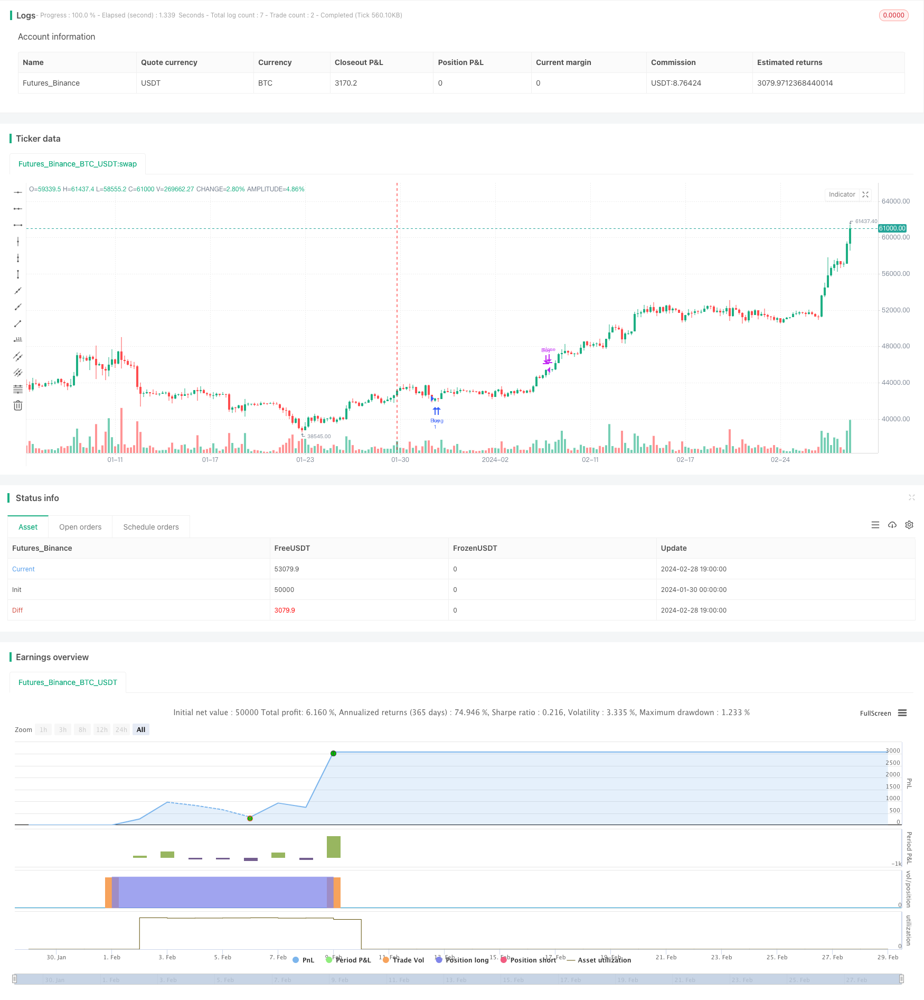

> Name

Trend-Following-Moving-Average-Strategy Trend-Following-Moving-Average-Strategy
> Author

ChaoZhang

> Strategy Description


[trans]

### Overview
This strategy uses a combination of the Exponential Moving Average (EMA), Simple Moving Average (SMA) and Relative Strength Index (RSI) indicators to implement an automated trading system that can profit from trending markets. When the fast moving average crosses the slow moving average from below, a buy signal is formed; when the fast moving average crosses below the slow moving average from above, a sell signal is formed. The RSI indicator is used to determine overbought and oversold conditions in order to stop losses in time.
### Strategy Principles
1. EMA (50): 50-period exponential moving average, representing a short-term trend indicator.
2. SMA (100): a 100-period simple moving average, representing the medium and long-term trend indicator.  
3. RSI(14): 14-period relative strength index to determine whether it is overbought or oversold.
When the short-term trend indicator EMA (50) crosses the medium- and long-term trend indicator SMA (100), a buy signal is generated, indicating that the short-term trend is getting stronger and can be followed to buy.
When the EMA (50) crosses the SMA (100), a sell signal is generated, indicating that the power has been exhausted in the short term and the sell should be tracked.
If the RSI is greater than 70 (overbought zone), a take profit signal is generated, and if the RSI is less than 30 (oversold zone), a stop loss signal is generated.
### Advantage Analysis
This is a very classic trend-following moving average strategy. It combines trend tracking and overbought and oversold judgment, which can not only grasp the main trend of the market, but also avoid chasing high purchases and cutting short-term indiscriminately. This strategy works better in some markets with obvious style rotations. For example, in the early stages of a bull market, the index as a whole shows a strong upward trend, but there are also mid-term adjustments in the process. The moving average strategy can capture the main rising market. When the mid- to long-term trend reverses, a stop-loss signal will be generated, which can avoid the zero return of early profits caused by a market crash. Therefore, this strategy is suitable for long-term tracking. Compared with traditional trailing stop loss, the moving average strategy is more stable and reduces the trouble of mountain retracement. In addition, the strategy is very simple and clear, easy to understand, and parameter adjustment is also very convenient, making it a very easy method for beginners to get started.
### Risk Analysis
The biggest problem with the moving average strategy is that it does not solve the fundamental problem of "deviation between price and value". When the market rise is about to end, the price has often seriously exceeded the reasonable fundamental value valuation range. If you still only focus on the trend of the price itself, it will inevitably lead to excessive exposure in the final stage. At this time, the short-term indicator EMA (50) and the medium- and long-term indicator SMA (100) both showed a strong upward trend, generating a "buy signal", but in fact the price has been seriously overvalued. If you continue to buy higher at this time, you will face the risk of a huge retracement. Therefore, this strategy is more suitable for the growth stage of the market and requires a rational judgment on the direction of the general trend.
In addition, the standard for this strategy to determine overbought and oversold zones is relatively simple, using only one RSI indicator. This can easily lead to misjudgment. For example, if the market breaks through in the short term and the RSI indicator shows overbought, in fact there is still momentum to continue rising in the market outlook. If a take profit signal is generated at this time, the opportunity may be missed. Therefore, risk control needs further optimization.
### Optimization direction
1. Combine more indicators to determine overbought and oversold to avoid misjudgments. You can consider adding KD indicators, etc.
2. Add more medium and long-term trend judgment indicators, such as MACD, etc. Avoid the risk of price and value divergence. 
3. Different market conditions have different parameter settings. For example, when the trend is more obvious, the SMA cycle can be appropriately increased.
4. You can consider taking profits only partially near the overbought and oversold areas and continue to hold core positions.
### Summarize
In general, the simple moving average strategy is a very practical quantitative strategy. It is stable, simple, easy to understand and optimize, and is one of the best choices for getting started with quantification. The biggest advantage of this strategy is to grasp the general trend and avoid repeated mistakes of chasing highs and selling lows. In addition, it also has a certain stop loss protection function. But we also need to be clearly aware of its shortcomings, and it cannot give advance warning before the turning point of the general trend. Therefore, investors need to track patiently and take profits in a timely manner.
|| 

### Overview  

This strategy combines the Exponential Moving Average (EMA), Simple Moving Average (SMA) and Relative Strength Index (RSI) to implement an automated trading system that can profit from trending markets. It generates buy signals when the fast EMA crosses over the slow SMA from below, and sell signals when the fast EMA crosses below the slow SMA. The RSI indicator is used to detect overbought and oversold situations for stop loss purposes.

### Strategy Logic

1. EMA(50): 50-period Exponential Moving Average, representing short-term trend. 
2. SMA(100): 100-period Simple Moving Average, representing medium to long-term trend.
3. RSI(14): 14-period Relative Strength Index for identifying overbought/oversold levels.

When the short-term EMA(50) crosses over the medium-long term SMA(100), a buy signal is generated, indicating strengthening short-term trend, and we can follow the trend to buy.

When the EMA(50) crosses below the SMA(100), a sell signal is generated. It means that the short-term momentum has been exhausted, and we should follow the trend to sell out.  

If RSI is greater than 70 (overbought zone), it generates a profit-taking signal. If RSI is less than 30 (oversold zone), it generates a stop-loss signal.


### Advantage Analysis   

This is a very classic trend following strategy using moving averages. It incorporates both trend tracking and overbought/oversold detection, which allows us to capture the major trend while avoiding buying at the peak on short-term spikes. The strategy works well in markets with significant sector rotations. For example, at the early stage of a bull market, the overall index shows a strong upward trend, but occasional medium-term corrections are common. The moving average strategy can capture the major uptrend while getting out timely during trend reversal. Compared to traditional tracking and stop loss methods, the moving averages strategy is more stable, with less violent drawdowns. In addition, this strategy is very simple and easy to understand. The parameters are convenient to adjust. Therefore it is a very friendly method for beginners.  

### Risk Analysis

The biggest problem of moving average strategy is that it does not address the disconnect between "price" and "value". Near the end of an uptrend, price often overshoots way above the reasonable valuation range. If we focus only on the price action itself regardless of valuation, it inevitably leads to over-exposure during the final stage. At that time the short-term EMA(50) and medium-term SMA(100) may still show a strong upward trend, generating "buy signals", while the actual price has been severely overvalued. Continuing to buy at the peak in this case means facing huge drawdown risk later. Therefore, this strategy fits better for the growing stage of the markets, and we need rational judgement on the major trend direction.

Also, the overbought/oversold criteria relies solely on a single RSI indicator here, which can easily cause false signals. For instance, there could be short-term price spikes with RSI above 70, while substantial upside momentum still exists in the market afterwards. Premature profit-taking signals in this case may miss opportunities. So further optimization is needed regarding risk control. 


### Improvement Directions   

1. Incorporate more indicators for overbought/oversold judgment to avoid false signals, e.g. adding KD indicator etc.

2. Add more metrics to judge the medium-long term trend, e.g MACD etc, to detect the divergence between price and value .

3. Use different parameter sets for varying market conditions. For example, increase the SMA period if the trend is clearer.  

4. Consider taking profits partially instead of a full exit around overbought/oversold zones, keeping core positions.


### Conclusion   

In general, the simple moving average strategy is a very practical quantitative approach. It is stable, easy to understand and optimize, one of the best choices for quant beginners. Its biggest advantage is to ride the major trends and avoid repeatedly buying tops and selling bottoms. Also it provides some degree of risk protection.  However we must recognize its limitations in failing to send early warning signals around major turning points. So investors need to track trends patiently and take profits in time.

[/trans]

> Strategy Arguments


|Argument|Default|Description|
|----|----|----|
|v_input_1|14|RSI Length|
|v_input_2|70|Overbought Level|
|v_input_3|30|Oversold Level|


> Source (PineScript)

``` pinescript
/*backtest
start: 2024-01-30 00:00:00
end: 2024-02-29 00:00:00
period: 5h
basePeriod: 15m
exchanges: [{"eid":"Futures_Binance","currency":"BTC_USDT"}]
*/

// This Pine Script™ code is subject to the terms of the Mozilla Public License 2.0 at https://mozilla.org/MPL/2.0/
// © Wallstwizard10

//@version=4
strategy("Estrategia de Trading", overlay=true)

// Definir las EMA y SMA
ema50 = ema(close, 50)
sma100 = sma(close, 100)

// Definir el RSI
rsiLength = input(14, title="RSI Length")
overbought = input(70, title="Overbought Level")
oversold = input(30, title="Oversold Level")
rsi = rsi(close, rsiLength)

// Condiciones de Compra
buyCondition = crossover(ema50, sma100) // EMA de 50 cruza SMA de 100 hacia arriba

// Condiciones de Venta
sellCondition = crossunder(ema50, sma100) // EMA de 50 cruza SMA de 100 hacia abajo

// Salida de Operaciones
exitBuyCondition = rsi >= overbought // RSI en niveles de sobrecompra
exitSellCondition = rsi <= oversold // RSI en niveles de sobreventa

// Lógica de Trading
if (buyCondition)
    strategy.entry("Buy", strategy.long)
    
if (sellCondition)
    strategy.entry("Sell", strategy.short)
    
if (exitBuyCondition)
    strategy.close("Buy")
    
if (exitSellCondition)
    strategy.close("Sell")
```

> Detail

https://www.fmz.com/strategy/443244

> Last Modified

2024-03-01 12:21:13
