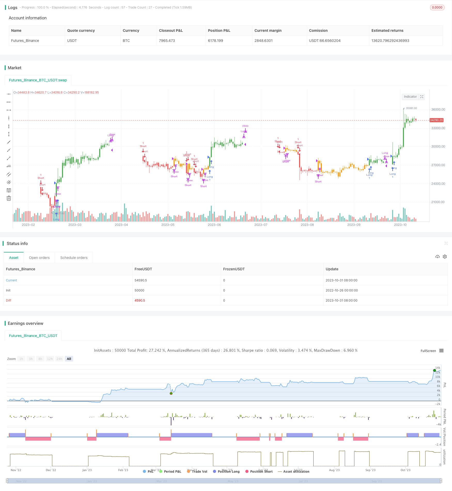

> Name

Moving Average Trend Following Strategy Trend-Following-SMA-Strategy
> Author

ChaoZhang

> Strategy Description


[trans]

## Overview
The moving average trend following strategy uses a combination of simple moving averages and fast moving averages to determine the direction of market trends and then generate trading signals. Go long when the price crosses above the simple moving average and fast moving average, and go short when the price crosses below the simple moving average and fast moving average. This strategy dynamically optimizes without backtracking and uses real-time trading signals to capture changes in trends.
## Strategy Principle
This strategy uses the sma function to calculate the simple moving average sma with a length of 50 periods, as well as the fast moving average fsma. The calculation of fsma is based on sma plus 6 times the n-period standard deviation of price.
The strategy uses two boolean variables long and short to record the long and short status. When the price crosses sma and fsma above, long is set to 1, and the position is long; when the price crosses below, long is set to -1, and the position is closed. The short variable also uses similar logic to handle the short status.
The strategy uses the trend variable to record trend judgments. When the price is higher than fsma and sma, trend is 1, indicating an upward trend; when the price is lower than fsma and sma, trend is -1, indicating a downward trend.
Based on the real-time judgment of trend, long and short trading signals are generated. When the trend turns from falling to rising, if the price is higher than fsma, go long; when the trend turns from rising to falling, if the price is lower than sma, go short.
This strategy comprehensively considers trend judgment and breakthrough trading methods, and can effectively capture trading opportunities brought about by trend changes.
## Strategic Advantages
1. Use the double confirmation model to detect two moving averages at the same time, which can effectively filter out false breakthroughs.
2. Combining trend judgment and breakthrough trading, you can capture opportunities at trend turning points.
3. No backtesting and optimization, all trading signals are generated in real time, and there is no curve fitting.
4. The strategy logic is simple and clear, easy to understand and modify.
5. Visual configuration parameters, length cycle, multiples, etc. can be adjusted according to the market.

## Strategy Risk
1. The double moving average strategy is prone to frequent trading and reversal losses.
2. The lagging effect of the moving average itself may miss the trend change.
3. Lack of stop-loss mechanism and inability to control single losses.
4. Improper parameters may lead to too frequent or too lagging transactions.
5. For risks 1 and 2, the moving average period can be appropriately extended and a retracement stop loss added.
6. For risk 3, you can set a percentage stop loss or a pending order stop loss.
7. For risk 4, parameters should be adjusted for different markets and avoid a single fixed parameter.

## Strategy optimization direction
1. Add trend filter conditions and use indicators such as MACD and DMI to confirm trends.
2. Use KD, RSI and other indicators to enter the market based on overbought and oversold conditions.
3. Add an overall stop loss mechanism, such as trailing stop loss, percentage stop loss, etc.
4. Add a position management module, such as dynamically adjusting the position size.
5. Optimize parameter settings to make it more effective in adapting to different market cycles.
6. Add a machine learning module and use AI technology to automatically optimize parameters.
7. Construct a composite strategy and use other indicators to prevent false breakthroughs.
8. Use deep learning techniques to identify more complex trend patterns.
## Summarize
The moving average trend following strategy is generally a relatively simple trend following strategy. It uses a combination of fast and slow moving averages to help determine the direction of the trend, and changes hands at the trend turning point, which can effectively capture the transformation of the price trend. However, this strategy also has some problems, such as frequent transactions, lag and other risks. Future optimization directions include adding trend filtering, stop loss modules, dynamically adjusting parameters, etc. Overall, this strategy is quite suitable as an introductory strategy for trend tracking, but in real applications it needs to be optimized and adjusted for the application market in order to be truly effective.
||


## Overview

The Trend Following SMA strategy uses a combination of simple moving average (SMA) and fast SMA to determine market trend direction and generate trading signals. It goes long when price crosses above SMA and FSMA and exits long when price crosses below. It goes short when price crosses below SMA and FSMA and exits short when price crosses above. The strategy provides dynamic no-curve-fitting trading signals to capture trend changes.

## Strategy Logic

The strategy uses sma function to calculate 50-period SMA and fast SMA fsma. fsma is calculated based on SMA plus 6 times standard deviation of price over n periods.

Two boolean variables long and short are used to record long and short positions. long is set to 1 when price crosses above sma and fsma for long entry, and -1 when price crosses below for exit. short follows the similar logic for short position.

The trend variable is used for trend determination. It is set to 1 when price is above fsma and sma for uptrend, and -1 when price is below fsma and sma for downtrend.

Trading signals of long and short are generated based on realtime trend direction. When trend changes from down to up, if price is above fsma, go long. When trend changes from up to down, if price is below sma, go short.

The strategy combines both trend following and breakout methods to capture opportunities when trend changes.

## Advantages

1. Using double confirmation of two MAs filters fake breakouts. 

2. Combining trend following and breakout catches turning points.

3. No curve fitting or optimization for dynamic trading signals. 

4. Simple and clear logic, easy to understand and modify.

5. Customizable parameters for length, multiplier for different markets.

## Risks

1. Double MA crosses may cause excessive whipsaw trades and reversals.

2. MA lag may miss early trend reversal. 

3. No stop loss mechanism to control single trade loss.

4. Improper parameter tuning leads to overtrading or lagging.

5. For Risk 1 and 2, lengthen MA periods, add drawdown stop loss.

6. For Risk 3, add percentage or order stop loss.  

7. For Risk 4, adjust parameters dynamically for different markets.

## Enhancement

1. Add trend filter using MACD, DMI to confirm trend.

2. Use KD, RSI to trade mean-reversion overbought/oversold.

3. Add overall stop loss such as trailing stop, percentage stop.

4. Add position sizing module for dynamic adjustment.

5. Optimize parameters to adapt across timeframes.

6. Introduce machine learning for auto parameter tuning.

7. Build composite strategy with additional filters. 

8. Utilize deep learning to detect complex trend patterns.

## Conclusion

The SMA trend following strategy is a simple trend trading system. It uses fast and slow MAs to assist trend direction and capture trend reversal. However, risks like whipsaw and lag exist. Future enhancements include adding filters, stops, dynamic parameters etc. Overall it serves as a good starter trend following strategy, but optimizations are needed for real-world applications to maximize its performance.

[/trans]

> Strategy Arguments


|Argument|Default|Description|
|----|----|----|
|v_input_1|50|Length|
|v_input_2_close|0|Source: close|high|low|open|hl2|hlc3|hlcc4|ohlc4|
|v_input_3|6|Mult|
|v_input_4|true|Use barcolor?|
|v_input_5|false|Show plots?|
|v_input_6|false|Use triangles?|


> Source (PineScript)

``` pinescript
/*backtest
start: 2022-10-26 00:00:00
end: 2023-11-01 00:00:00
period: 1d
basePeriod: 1h
exchanges: [{"eid":"Futures_Binance","currency":"BTC_USDT"}]
*/

//@version=4
strategy("SMA STRATEGY", shorttitle="SMA TREND", overlay=true, calc_on_order_fills=true)
length = input(title="Length", type=input.integer, defval=50)
src_=input(close, title="Source", type=input.source)
mult=input(6.0, title="Mult")
barc=input(true, title="Use barcolor?")
plots=input(false, title="Show plots?")
tri=input(false, title="Use triangles?")


r(src, n)=>
    s = 0.0
    for i = 0 to n-1
        s := s + ((n-(i*2+1))/2)*src[i]
    x=s/(n*(n+1))
    x

l=sma(low, length)
h=sma(high, length)
lr= l+mult*r(low, length)
hr= h+mult*r(high, length)

trend=0
trend:=src_ > lr and src_ > hr ? 1 : src_ < lr and src_ < hr ? -1 : trend[1]

strategy.close("Long", when=trend==-1)
strategy.close("Short", when=trend==1)
strategy.entry("Long", strategy.long, when=trend==1 and src_>h)
strategy.entry("Short", strategy.short, when=trend==-1 and src_<l)

long=0
short=0
long:= trend==1 and src_>h ? 1 : trend==-1 ? -1 : long[1]
short:= trend==-1 and src_<l ? 1 : trend==1 ? -1 : short[1]

barcolor(barc? (long>0? color.green : short>0? color.red : trend>0? color.orange: trend<0 ? color.white : color.blue) : na)
plotshape(tri? close : na, style= shape.diamond, color= long>0? color.green : short>0? color.red : trend>0? color.orange: trend<0 ? color.white : color.blue, location=location.top)

//shortenter=
a1=plot(plots? l : na, color=color.blue, linewidth=1)
//longenter=
a2=plot(plots? h : na, color=color.blue, linewidth=1)
fill(a1, a2, color=color.blue)
//stopshort=
b1=plot(plots? hr : na, color=color.navy, linewidth=1)
//stoplong=
b2=plot(plots? lr : na, color=color.navy, linewidth=1)
fill(b1, b2, color=color.navy)
```

> Detail

https://www.fmz.com/strategy/430895

> Last Modified

2023-11-02 16:58:23
