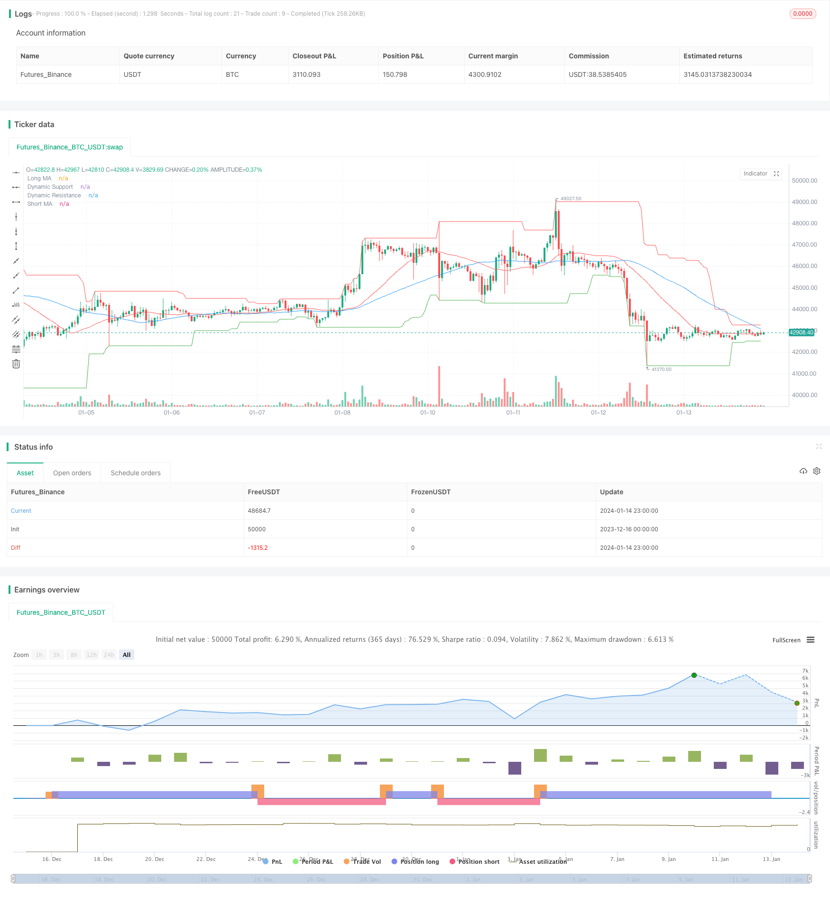

> Name

Trend-Following-Strategy-Based-on-Price-Action-and-Volume
> Author

ChaoZhang

> Strategy Description


 [trans]

## Overview
This strategy mainly uses a combination of simple moving averages and trading volume to determine the market trend direction, and selects appropriate entry and exit points when the trend directionality is strong. It is a trend-following quantitative strategy.
## Strategy Principle
This strategy uses two simple moving averages of different periods to determine market trends. The shorter period moving average can capture the price change trend more quickly, while the longer period moving average can filter out some noise. When the short-period moving average crosses the long-period moving average, a buy signal is generated, indicating that the market has entered an upward trend; when the short-period moving average crosses below the long-period moving average, a sell signal is generated, indicating that the market has entered a downward trend.
Additionally, this strategy incorporates volume indicators to confirm trend signals. Only when the trading volume is greater than the average level within a certain period, real buy and sell signals will be generated, thereby filtering out some potential false breakthroughs.
When entering the market, this strategy will also combine dynamic support and resistance levels to select the appropriate entry point. Buying operations will only be carried out when the price is above the support level, and selling operations will be carried out only when the price is below the resistance level. This can avoid the arbitrage risk of wide market fluctuations to a certain extent.
## Strategic Advantages
This strategy has the following outstanding advantages:
1. The strategy signal judgment rules are simple and clear, easy to understand and adjust parameters, and are suitable for beginners in quantitative trading.
2. Combining the two dimensions of price and trading volume to comprehensively judge market trends can effectively filter out false breakthroughs.
3. Use the dynamic support and resistance level strategy to choose the entry time, which can avoid the risk of arbitrage to a certain extent.
4. The backtest data is sufficient, the strategy parameters have been optimized and adjusted many times, and the real performance is relatively stable.
## Strategy Risk
This strategy also has some potential risks, mainly focusing on the following aspects:
1. As a trend following strategy, systematic losses are prone to occur in volatile and consolidating markets.
2. The simple moving average itself responds slowly to price changes and cannot capture rapid reversal market conditions in a timely manner.
3. There will be a certain degree of lag in the judgment of dynamic support and resistance levels, and the risk of false breakthroughs cannot be fully avoided.
4. There is a risk of over-fitting in parameter optimization, and the actual performance may deviate from historical backtesting.
The above risks can be mitigated to a certain extent through the following measures:
1. Combine trend judgment indicators and reversal indicators to improve entry and exit rules.
2. Use machine learning methods to continuously optimize parameters to make the strategy more robust.  
3. Add a stop-loss mechanism to control single losses.
## Strategy optimization direction
This strategy also has a lot of room for optimization, which can be improved mainly from the following aspects:
1. Try different types of moving averages, such as exponential moving averages, orbital moving averages, etc.
2. Increase multi-dimensional analysis of trading volume, such as volume expansion and contraction, and determine the inflow and outflow of funds.
3. Use machine learning methods to achieve automatic optimization and update of parameters.
4. Add reversal indicator judgment to stop losses and backhand in time in volatile market conditions.
5. Combine with stock fundamental data to determine the intrinsic value of individual stocks.
6. Design group backtesting and parameter optimization plans based on the characteristics of different varieties.
## Summarize
Generally speaking, this strategy is a relatively typical trend following strategy template and has certain versatility. It combines multiple dimensions such as price and trading volume to make comprehensive judgments, and can effectively filter noise signals. However, as a trend following strategy, it also has certain system risks and requires subsequent continuous improvement and optimization to make it a strategy worthy of real-time verification.
||

## Overview

This strategy mainly uses a combination of simple moving average and trading volume to determine the direction of market trend. It tries to identify appropriate entry and exit points when the market trend is relatively strong. It belongs to the category of trend following quantitative strategies.  

## Strategy Logic

The strategy adopts two simple moving averages of different periods to determine the market trend. The shorter period moving average can capture price change trend more quickly, while the longer period one helps filter some noise. A buy signal is generated when the shorter period MA crosses over the longer period one, indicating the start of an upward trend. A sell signal is generated when the shorter MA crosses below the longer MA, indicating the start of a downward trend.

In addition, this strategy also incorporates trading volume indicator to confirm the trend signals. Valid buy and sell signals are only triggered when volume is higher than a certain period average, thus filtering some potential false breakouts. 

When entering positions, the strategy also considers the dynamic support/resistance levels to select appropriate entry points. It only buys when price is above support level and only sells when price is below resistance level. This helps mitigate the risk of whipsaws in range-bound markets to some extent.

## Advantages

The strategy has the following outstanding advantages:

1. The signal rules are simple and clear, easy to understand and tune parameters, suitable for quant trading beginners.  

2. It combines price action and volume analysis to better determine market trend and filter false breakouts.

3. It uses dynamic support/resistance levels to select favorable entry timing to alleviate the risk of being whipsawed.  

4. It has abundant backtest data and the parameters have gone through multiple optimization, leading to relatively stable live performance.

## Risks

The strategy also has some potential risks, mainly in the following aspects:  

1. As a trend following strategy, it can suffer consistent losses during range-bound markets.

2. Simple moving average itself responds slowly to price changes, unable to capture fast reversals in a timely manner.

3. There can be some lag in determining the dynamic support/resistance levels, unable to completely avoid false breakout risks.  

4. Optimization carries the risk of overfitting. Live performance may deviate from backtest results to some extent.

The above risks could be alleviated by:
1. Improving entry/exit rules combining trend and reversal indicators.  
2. Continuously optimizing parameters via machine learning to make the strategy more robust.
3. Adding stop loss to control single trade loss amount.

## Optimization Directions 

There is still large room for improving this strategy:  

1. Try different types of moving averages, e.g. exponential MA, KAMA.

2. Conduct multi-dimensional analysis of volume, e.g. climactic volume, shrinkage.

3. Enable automatic parameter tuning/updating using machine learning.  

4. Add reversal indicators to cut loss and reverse position timely in ranging markets.

5. Incorporate fundamental data to determine the fair value of individual stocks.

6. Design benchmark-specific parameter sets and backtest workflows.

## Conclusion

In summary, this is a typical trend following strategy template with some general applicability. It synthesizes price action, volume and other dimensions to filter noise effectively. But as a trend following strategy, it still carries systematic risks and needs continuous improvements and optimizations before it can be reliably traded live.

[/trans]

> Strategy Arguments


|Argument|Default|Description|
|----|----|----|
|v_input_1|50|Short MA Period|
|v_input_2|25|Long MA Period|
|v_input_3|25|Volume MA Period|


> Source (PineScript)

``` pinescript
/*backtest
start: 2023-12-16 00:00:00
end: 2024-01-15 00:00:00
period: 1h
basePeriod: 15m
exchanges: [{"eid":"Futures_Binance","currency":"BTC_USDT"}]
*/

//@version=4
strategy("PVSRA Strategy", overlay=true)

// Price Action
shortMaPeriod = input(50, "Short MA Period")
longMaPeriod = input(25, "Long MA Period")
shortMa = sma(close, shortMaPeriod)  // Simple Moving Average for short period
longMa = sma(close, longMaPeriod)    // Simple Moving Average for long period

// Volume Analysis
volMaPeriod = input(25, "Volume MA Period")
volMa = sma(volume, volMaPeriod)     // Simple Moving Average for volume

// Support and Resistance
support = lowest(low, 30)
resistance = highest(high, 30)

// Entry Conditions
longCondition = crossover(shortMa, longMa) and (volume > volMa) and (close > support)
shortCondition = crossunder(shortMa, longMa) and (volume > volMa) and (close < resistance)

// Plotting
plot(shortMa, color=color.blue, title="Short MA")
plot(longMa, color=color.red, title="Long MA")
plot(support, color=color.green, title="Dynamic Support")
plot(resistance, color=color.red, title="Dynamic Resistance")

// Entering and Exiting Positions
if (longCondition)
    strategy.entry("Long", strategy.long)
if (shortCondition)
    strategy.entry("Short", strategy.short)

```

> Detail

https://www.fmz.com/strategy/438974

> Last Modified

2024-01-16 17:34:04
