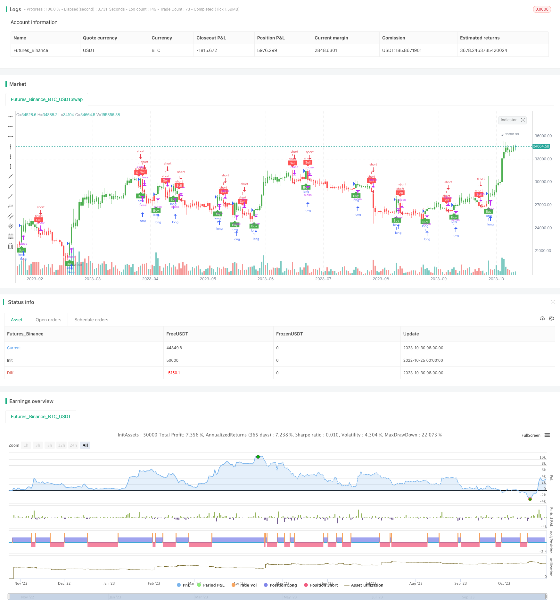

> Name

Trend-Following-Strategy-with-Dynamic-Stops
> Author

ChaoZhang

> Strategy Description



[trans]


## Overview
This strategy calculates the ATR indicator as a stop loss line, generates a buy signal when the price crosses above the EMA, and generates a sell signal when the price crosses below the EMA, and uses dynamic stop loss to manage risk.
## Strategy Principle
The core logic of this strategy is:
1. Calculate the ATR indicator as the stop loss line, and the ATR value is used to calculate the stop loss distance nLoss
2. Determine the price source based on the Heikin Ashi candle option h. The closing price close is used by default. If Heikin Ashi is selected, the closing price of the candle is used.
3. Define xATRTrailingStop as a dynamic tracking stop loss line, and determine the stop loss line of the current K line based on comparing the price with the stop loss line of the previous K line.
4. Define the position pos. When the price crosses the stop loss line, it is set to 1 (long). When the price crosses the stop loss line, it is set to -1 (short). Otherwise, it is 0 (short position).
5. Calculate the EMA moving average value of a K line and define the indicator's upward crossing (buy signal) and downward crossing (sell signal)
6. Set trade entries and exits when buy and sell signals occur
7. Use the barcolor function to mark the color of the K line according to the position.
8. Use plotshape to mark signals when buying and selling
This strategy uses ATR dynamic stop loss to manage risk, allowing timely entry when the trend occurs and timely stop loss when the stop loss line is triggered.
## Strategic Advantages
This strategy has the following advantages:
1. Using ATR dynamic stop loss, you can adjust the stop loss distance according to the degree of market volatility. While ensuring stop loss, you can also avoid overly aggressive stop loss being triggered by short-term price fluctuations.
2. Using EMA to generate trading signals can filter out unnecessary transactions caused by some false breakthroughs.
3. Allows selection of Heikin Ashi candles as price source and can filter noise to identify trends
4. Clear position management, clear long and short positions, and avoid frequent transactions caused by trailing stop loss
5. Visually display trading signals and stop losses through line drawing, marking and coloring
6. The strategy logic is simple and clear, easy to understand and modify
7. ATR cycle and ATR stop loss multiple can be customized to adapt to different market environments
In summary, this strategy integrates trend tracking and dynamic stop loss technology, which can effectively identify trends and manage risks, and is suitable for transactions that track medium and long-term trends.
## Strategy Risk
This strategy also has certain risks:
1. The trading signals generated by the EMA moving average may lag behind and miss short-term opportunities.
2. The stop loss distance is determined by ATR, and it is easy to stop losses frequently when the market fluctuates.
3. Cost factors are not taken into account. In actual transactions, bilateral handling fees will affect profits.
4. Failure to set up appropriate position control, and fund management needs to be improved.
5. The effect depends on parameter optimization. Different markets need to adjust parameters.
6. It’s easy to get caught in sharp market fluctuations
7. Timely monitoring is required, and strategies must be promptly intervened or stopped.
Risks can be reduced by appropriately optimizing parameters, setting position controls, and filtering signals in combination with other indicators. In real trading, it is necessary to control the position size, continuously monitor the effect of the strategy, and manually intervene or close when necessary.
## Optimization direction
This strategy can be optimized from the following aspects:
1. Adjust ATR parameters to make the stop loss distance more reasonable in different markets
2. Test different moving average indicators to further filter out false signals
3. Add trend judgment indicators to identify the trend direction before entering the market.
4. Set position control and limit the number of one-way positions
5. Increase opening conditions, such as trading volume, closing price far away from the moving average, etc.
6. Consider cost factors and set stop loss distance based on handling fees
7. Optimize buying and selling timing and combine multiple signals and indicators
8. Set partial take profit or trailing take profit
9. Add parameter optimization function to automatically optimize test parameters
By comprehensively using a variety of technical indicators and optimization methods, the strategy can be further improved and more stable results can be obtained in more markets.
## Summarize
This strategy integrates dynamic stop loss and trend tracking technology. It has the advantages of effective stop loss, smooth tracking, easy to understand and optimize, and is suitable for tracking medium and long-term trend patterns. But we should also pay attention to controlling risks and optimizing parameters. If you use this strategy well, you can achieve good results in markets with obvious trends. Overall, this strategy provides a concise and practical trend tracking and risk management trading idea.
|| 

## Overview

This strategy generates trading signals when price crosses EMA and uses ATR as a dynamic stop loss to manage risks. 

## How It Works

The key logic is:

1. Calculate ATR as the stop loss line, ATR value determines stop distance nLoss

2. Price source is close price by default, use Heikin Ashi close if Heikin Ashi option h is enabled  

3. xATRTrailingStop tracks dynamic stop loss line based on price comparison with previous stop 

4. Position pos is 1 for long when price crosses above stop loss line, -1 for short when crosses below, else 0

5. EMA crossover signals, above EMA is buy signal, below is sell signal

6. Enter trades on buy/sell signals, exit on opposite signals

7. Color bars based on position, mark signals and stop loss lines

This strategy follows trends with dynamic stops based on ATR. It can identify trends and manage risks effectively.

## Advantages

The advantages are:

1. ATR-based dynamic stop adapts to market volatility  

2. EMA filter reduces false signals from noise  

3. Optional Heikin Ashi filters noise and identifies trend   

4. Clear long/short position avoids whipsaws from trailing stop Translation results of the order:
5. Visual aids like lines, labels and coloring  

6. Simple and easy to understand logic for modifying

7. Customizable ATR period and multiplier for different markets

In summary, by combining trend following and dynamic stops, this strategy can catch trends and manage risks well for swing trading.

## Risks

There are some risks to consider:

1. EMA signals may lag missing short-term moves

2. Frequent stop loss triggers possible in choppy markets

3. No consideration of costs like commissions 

4. Lack of position sizing control 

5. Performance depends on parameter tuning

6. Risk of whipsaws in ranging markets

7. Requires monitoring and intervention

Risks can be reduced by optimizing parameters, adding filters, sizing positions properly, monitoring performance, and intervening when necessary.

## Optimization

Some ways to improve the strategy:

1. Adjust ATR parameters for different markets

2. Test other moving averages to filter signals

3. Add trend filter indicators for higher probability

4. Implement position sizing limits 

5. Add entry conditions like volume, distance from MA

6. Incorporate costs like commissions into stops

7. Optimize entry and exit timing with more signals

8. Introduce profit taking or trailing stops

9. Automated parameter optimization

By combining more techniques for entries, exits, filters, and parameter tuning, the strategy can be further robustified.

## Conclusion

This strategy combines dynamic stops and trend following nicely. With effective stops, smooth trend tracking, ease of use, and customizability, it is suitable for swing trading trends. But proper risk management, monitoring, and parameter tuning is required. When applied well on trending markets, good results can be achieved. Overall it provides a simple and practical approach to combining trend trading and risk management.

[/trans]

> Strategy Arguments


|Argument|Default|Description|
|----|----|----|
|v_input_1|true|Key Vaule. 'This changes the sensitivity'|
|v_input_2|10|ATR Period|
|v_input_3|false|Signals from Heikin Ashi Candles|


> Source (PineScript)

``` pinescript
/*backtest
start: 2022-10-25 00:00:00
end: 2023-10-31 00:00:00
period: 1d
basePeriod: 1h
exchanges: [{"eid":"Futures_Binance","currency":"BTC_USDT"}]
*/

//@version=4
strategy(title="UT Bot Strategy", overlay = true)
//CREDITS to HPotter for the orginal code. The guy trying to sell this as his own is a scammer lol. 

// Inputs
a = input(1,     title = "Key Vaule. 'This changes the sensitivity'")
c = input(10,    title = "ATR Period")
h = input(false, title = "Signals from Heikin Ashi Candles")

xATR  = atr(c)
nLoss = a * xATR

src = h ? security(heikinashi(syminfo.tickerid), timeframe.period, close, lookahead = false) : close

xATRTrailingStop = 0.0
xATRTrailingStop := iff(src > nz(xATRTrailingStop[1], 0) and src[1] > nz(xATRTrailingStop[1], 0), max(nz(xATRTrailingStop[1]), src - nLoss),
   iff(src < nz(xATRTrailingStop[1], 0) and src[1] < nz(xATRTrailingStop[1], 0), min(nz(xATRTrailingStop[1]), src + nLoss), 
   iff(src > nz(xATRTrailingStop[1], 0), src - nLoss, src + nLoss)))
 
pos = 0   
pos :=	iff(src[1] < nz(xATRTrailingStop[1], 0) and src > nz(xATRTrailingStop[1], 0), 1,
   iff(src[1] > nz(xATRTrailingStop[1], 0) and src < nz(xATRTrailingStop[1], 0), -1, nz(pos[1], 0))) 
   
xcolor = pos == -1 ? color.red: pos == 1 ? color.green : color.blue 

ema   = ema(src,1)
above = crossover(ema, xATRTrailingStop)
below = crossover(xATRTrailingStop, ema)

buy  = src > xATRTrailingStop and above 
sell = src < xATRTrailingStop and below

barbuy  = src > xATRTrailingStop 
barsell = src < xATRTrailingStop 

plotshape(buy,  title = "Buy",  text = 'Buy',  style = shape.labelup,   location = location.belowbar, color= color.green, textcolor = color.white, transp = 0, size = size.tiny)
plotshape(sell, title = "Sell", text = 'Sell', style = shape.labeldown, location = location.abovebar, color= color.red,   textcolor = color.white, transp = 0, size = size.tiny)

barcolor(barbuy  ? color.green : na)
barcolor(barsell ? color.red   : na)

strategy.entry("long",   true, when = buy)
strategy.entry("short", false, when = sell)
```

> Detail

https://www.fmz.com/strategy/430748

> Last Modified

2023-11-01 13:46:28
