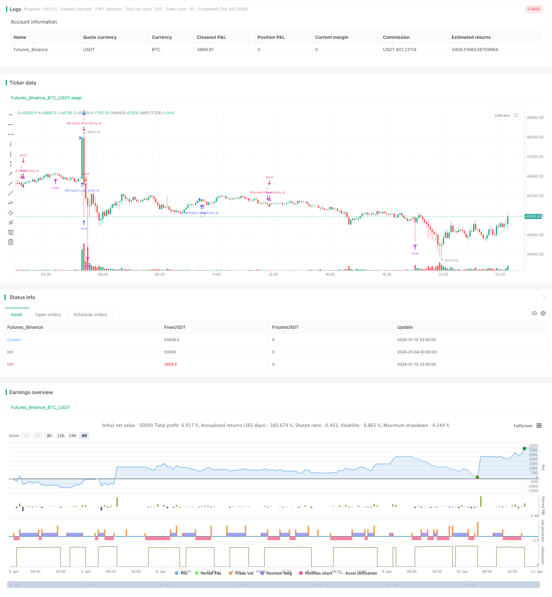

> Name

Super Trend-Following-Strategy-with-Stop-Loss
> Author

ChaoZhang

> Strategy Description


[trans]

### Overview
This strategy determines the price trend by calculating super trend indicators and establishes long or short positions when the trend changes. Set stop loss and take profit levels at the same time to control risks.
### Strategy Principles
This strategy uses the ta.supertrend() function to calculate the supertrend indicator. The Super Trend indicator combines average true volatility and average price to determine whether prices are in an uptrend or downtrend. When the price changes from a downward trend to an upward trend, use ta.change() to determine the direction change and establish a long position. A short position is established when the price changes from an uptrend to a downtrend.
Set stop_loss and profit, and set stop-loss and take-profit orders after opening a position to control risks.
Specifically, the strategy is implemented through the following steps:
1. Calculate Super Trend Indicator Direction
2. Determine whether the price has changed from a downward trend to an upward trend. If so, establish a long order.
3. Determine whether the price has changed from an upward trend to a downward trend, and if so, establish a short order
4. After opening a position, set the stop loss price and take profit price for the long order.
5. After opening a position, set the stop loss price and take profit price for the short order.
The above steps can effectively capture changes in price trends, establish positions at the right time, and set stop loss and take profit to control risks. It is a relatively stable trend following strategy.
### Analysis of strategic advantages
The biggest advantage of this strategy is that it can automatically track changes in price trends without manual judgment. The super trend indicator has a certain filtering effect on price fluctuations and can effectively identify price trends and avoid frequent opening of positions in volatile market conditions.
At the same time, the strategy sets stop loss and take profit levels, which can automatically stop loss and take profit, effectively control single losses and lock in profits. This is very important for quantitative trading.
Compared with the simple moving average strategy, this strategy is more effective in judging price trends and is more suitable for tracking trending markets.
### Risk Analysis
The biggest risk of this strategy lies in the parameter settings of the super trend indicator. If the parameters are set improperly, it will lead to poor strategy operation and poor identification of trend changes. If the ATR period parameter is set too large or the factor parameter is set too small, it will cause the super trend indicator to respond slowly to price fluctuations and miss the best opportunity to open a position.
In addition, the setting of take-profit and stop-loss levels will also have a great impact on strategy returns. If the stop loss distance is too small, it is easy to be breached; if the take profit distance is too large, the ideal exit point may be missed. The optimal settings of these parameters need to be optimized according to different market conditions and trading varieties.
Finally, like all trend following strategies, this strategy will suffer losses when prices suddenly reverse or enter a volatile range. This needs to be controlled through strict money management.
### Optimization direction
This strategy can be optimized from the following aspects:
1. Optimize the parameters of the super trend indicator, including ATR period and factor parameters. The optimal parameter combination can be obtained through traversal backtesting.
2. Add a position management mechanism. Positions can be dynamically adjusted based on yield and retracement indicators.
3. Add a machine learning model to determine trends. Models can be trained to assist in judging price trends and improve the accuracy of opening positions.
4. Combine with other indicators to filter trading signals. For example, combine moving averages, volatility indicators, etc. to avoid incorrect opening of positions.
5. Dynamically optimize the distance between take profit and stop loss. The stop-profit and stop-loss parameters can be adjusted according to the degree of market volatility, position size, etc.
The above directions can further improve the return rate and stability of the strategy.
### Summarize
Overall, this strategy is a very practical trend following strategy. It can automatically track changes in price trends and reasonably set stop loss and profit to control risks. Compared with the simple moving average strategy, it is more effective in judging price trends and is more suitable for trending markets. Through a certain degree of parameter optimization and machine learning model assistance, this strategy can further enhance stability and income performance. It is worthy of further research and application.
||

### Overview

This strategy identifies price trends by calculating the Supertrend indicator and establishes long or short positions when trends change. It also sets stop loss and take profit levels to control risks.

### Strategy Principles  

This strategy uses the ta.supertrend() function to compute the Supertrend indicator. The Supertrend combines average true range and average price to determine if prices are in an uptrend or a downtrend. When prices change from a downtrend to an uptrend, the strategy detects the change in direction using ta.change() and establishes a long position. When prices flip from an uptrend to a downtrend, a short position is taken.

The stop loss level stop_loss and take profit level profit are set to place stop loss orders and take profit orders after entering positions to control risks.

Specifically, the strategy is implemented through the following steps:

1. Calculate the direction of the Supertrend indicator  
2. Check if prices have changed from a downtrend to an uptrend and establish a long position if yes
3. Check if prices have switched from an uptrend to a downtrend and take a short position if yes
4. Set stop loss price and take profit price for the long position after it is established
5. Set stop loss price and take profit price for the short position after it is established

The above steps can effectively capture trend changes and take positions at appropriate moments. The stop loss and take profit settings help control risks. Overall it is a relatively stable trend following strategy.

### Advantage Analysis 

The biggest advantage of this strategy is the ability to automatically track trend changes without the need for manual judgement. The Supertrend indicator has a filtering effect on price fluctuations and can effectively identify trends, avoiding excessive position taking in ranging markets.

In addition, the predefined stop loss and take profit levels allow automatic stop loss and profit taking, effectively capping single trade losses and locking gains. This is very important for quantitative trading strategies.

Compared to simple moving average strategies, this strategy has superior capabilities in trend identification and is more suitable for trending markets.

### Risk Analysis

The biggest risk of this strategy comes from improper parameter tuning of the Supertrend indicator. If the parameters are not set appropriately, the effectiveness of the indicator in detecting trend changes will suffer. An ATR period that is too long or a factor that is too small can both retard the reaction of the Supertrend to price moves, causing missed entry opportunities.

Also, the stop loss and take profit levels significantly impact strategy performance. A stop loss that is too tight would easily get stopped out prematurely. A take profit that is too wide may miss ideal exit points. Extensive optimization is needed to find the optimal parameter values for different market conditions and trading instruments.

Finally, like all trend following strategies, sudden trend reversals and whipsaws can still cause losses that need to be controlled through proper money management.

### Enhancement Opportunities

The following aspects of the strategy can be enhanced:

1. Optimize the parameters of the Supertrend indicator, including the ATR period and factor through backtesting.  

2. Incorporate position sizing rules based on performance metrics like return and drawdowns.  

3. Augment with machine learning models to assist in trend identification.

4. Add filters based on other indicators like moving averages and volatility measures to avoid false signals.

5. Dynamically optimize stop loss and take profit levels based on market volatility and position sizes.

The above enhancements can improve profitability, stability and risk management of the strategy. 

### Conclusion

Overall, this is a very practical trend following strategy. It automatically tracks trend changes and uses stop loss and take profit to control risks. Compared to simple moving average strategies, it has superior trend identification capability and is more suitable for trending markets. With some parameter optimization and machine learning augmentation, this strategy can achieve even better stability and profits. It deserves further research and application.

[/trans]

> Strategy Arguments


|Argument|Default|Description|
|----|----|----|
|v_input_1|300|Stop Loss Amount|
|v_input_2|800|Profit Amount|
|v_input_3|10|ATR Length|
|v_input_float_1|3|Factor|


> Source (PineScript)

``` pinescript
/*backtest
start: 2024-01-04 00:00:00
end: 2024-01-11 00:00:00
period: 5m
basePeriod: 1m
exchanges: [{"eid":"Futures_Binance","currency":"BTC_USDT"}]
*/

//@version=5
strategy("Supertrend Strategy", overlay=true, default_qty_type=strategy.percent_of_equity)

// Stop loss and profit amount
stop_loss = input(300, title="Stop Loss Amount")
profit = input (800, title="Profit Amount")

atrPeriod = input(10, "ATR Length")
factor = input.float(3.0, "Factor", step = 0.01)

[_, direction] = ta.supertrend(factor, atrPeriod)

long_condition = ta.change(direction) <0
short_condition = ta.change(direction) >0
long_condition_1= (long_condition)?1:0
short_condition_2 = (short_condition)?1:0

stop_price_long = ta.valuewhen(long_condition, low[0]-stop_loss,0)
profit_price_long = ta.valuewhen(long_condition, high[0]+profit,0)
stop_price_short = ta.valuewhen(short_condition, high[0]+stop_loss,0)
profit_price_short = ta.valuewhen(short_condition, low[0]-profit,0)

if (long_condition)
    strategy.entry("Michael3 Long Entry Id", strategy.long)

if (short_condition)
    strategy.entry("Michael3 Short Entry Id", strategy.short)


if (strategy.position_size>0)
    strategy.exit("exit_long",from_entry="Michael3 Long Entry Id",limit=profit_price_long,stop=stop_price_long)

if (strategy.position_size<0)
    strategy.exit("exit_short",from_entry="Michael3 Short Entry Id",limit=profit_price_short,stop=stop_price_short)    
    


//plot(strategy.equity, title="equity", color=color.red, linewidth=2, style=plot.style_areabr)
```

> Detail

https://www.fmz.com/strategy/438506

> Last Modified

2024-01-12 14:55:40
